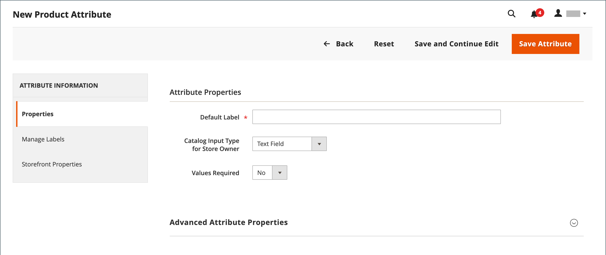
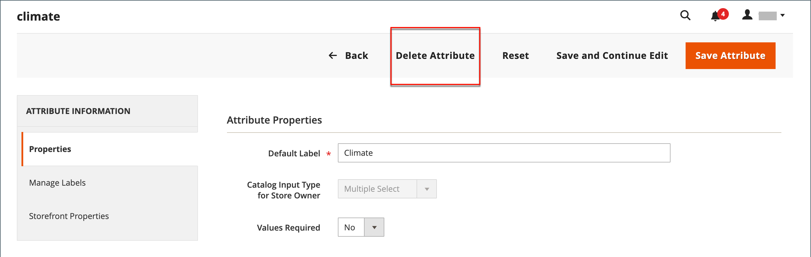

# 製品属性の作成と削除

属性は、製品の作業中や&#x200B;_[!UICONTROL Product Attributes]_&#x200B;ページから作成できます。 次の手順では、_[!UICONTROL Stores]_ メニューから属性を作成する方法を示します。

## 手順1：基本属性プロパティの説明

1. _管理者_ サイドバーで、**[!UICONTROL Stores]** > _[!UICONTROL Attributes]_>**[!UICONTROL Product]**&#x200B;に移動します。

1. **[!UICONTROL Add New Attribute]**&#x200B;をクリックします。

   {width="600" zoomable="yes"}

1. **[!UICONTROL Default Label]**&#x200B;に、属性を識別するラベルを入力します。

1. データ入力に使用する入力制御の種類を判断するには、**[!UICONTROL Catalog Input Type for Store Owner]**&#x200B;を次のいずれかに設定します。

   | プロパティ | 説明 |
   |--- |--- |
   | `Text Field` | テキストの1行入力フィールド。 |
   | `Text Area` | 製品説明などのテキストの段落を入力するための複数行入力フィールド。 WYSIWYG エディターを使用して、HTML タグを使用してテキストを書式設定したり、タグをテキストに直接入力したりできます。 |
   | `Text Editor` | 属性の場所に完全に機能するテキストエディター。 |
   | 日付 | [優先形式](attributes-input-types.md#date-and-time-options)および[&#x200B; タイムゾーン &#x200B;](../getting-started/store-details.md#locale-options)に日付値を表示します。 日付値は、リストまたはカレンダー（）から選択できます。   **_Note:_**&#x200B;システム構成に応じて、_&#x200B;管理者_ ユーザーは日付をフィールドに直接入力するか、カレンダーまたはリストから日付を選択できます。 日付と時刻の値の指定について詳しくは、[日付と時刻のオプション &#x200B;](attributes-input-types.md#date-and-time-options)を参照してください。 |
   | `Yes/No` | `Yes`と`No`の事前定義済みオプションを含むドロップダウンリストを表示します。 |
   | `Dropdown` | 1つの選択のみを受け入れる値のドロップダウンリストを表示します。 ドロップダウン入力タイプは、[設定可能な製品](product-create-configurable.md)の主要コンポーネントです。 |
   | `Multiple Select` | 複数の選択を受け入れる値のドロップダウンリストを表示します。 |
   | `Price` | この入力タイプは、事前定義された属性に加えて、価格、特別価格、階層価格、およびコストの価格フィールドを作成するために使用されます。 使用される通貨は、システム設定によって決まります。 |
   | `Media Image` | 商品ロゴ、ケア手順、食品ラベルの材料など、商品に追加の画像を関連付けます。 製品の属性セットにメディア画像属性を追加すると、追加の画像タイプとなり、ベース、スモール、サムネールが追加されます。 メディア画像の属性は、[&#x200B; ストアフロントメディアブラウザー](catalog-images-video.md#storefront-media-browser)から除外できます。 |
   | `Fixed Product Tax` | ロケールの要件に基づいて[FPT レート &#x200B;](../stores-purchase/fixed-product-tax.md)を定義できます。 |
   | `Visual Swatch` | 設定可能な製品のカラー、テクスチャ、パターンを示すスウォッチを表示します。 [&#x200B; ビジュアルスウォッチ &#x200B;](swatches.md)には、16進数のカラー値を入力するか、オプションのカラー、マテリアル、テクスチャ、パターンを表すアップロードされた画像を表示できます。 |
   | `Text Swatch` | サイズに頻繁に使用される、設定可能な製品オプションのテキストベースの表現。 [&#x200B; テキストスウォッチ &#x200B;](swatches.md#text-based-swatches)には、16進数のカラー値も含めることができます。 |
   | `Page Builder` | 属性の場所にある完全に機能する[&#x200B; ページビルダー](../page-builder/introduction.md) ワークスペースは、製品ページに魅力的なコンテンツを簡単に追加できます。 |

   {style="table-layout:auto"}

1. お客様が製品を購入する前にオプションの選択を必要とする場合は、**[!UICONTROL Values Required]**&#x200B;を`Yes`に設定します。

1. [!UICONTROL Dropdown]と[!UICONTROL Multiple Select]の入力タイプの場合は、次の操作を行います。

   - _[!UICONTROL Manage Options]_&#x200B;で、**[!UICONTROL Add Option]**&#x200B;をクリックします。

   - リストに表示する最初の値を入力します。

     管理者には1つの値、および各ストアビューの値の翻訳を入力できます。 ストアビューが1つしかない場合は、Admin値のみを入力でき、ストアフロントにも使用されます。

   - **[!UICONTROL Add Option]**&#x200B;をクリックし、リストに含める各オプションについて、前の手順を繰り返します。

   - オプションをデフォルト値として使用するには、**[!UICONTROL Is Default]**&#x200B;を選択します。

   {width="600" zoomable="yes"}

## 手順2：詳細なプロパティの説明（必要な場合）

1. 小文字でスペースなしで一意の&#x200B;**[!UICONTROL Attribute Code]**&#x200B;を入力してください。

   >[!NOTE]
   >
   >[!UICONTROL Attribute Code] フィールドで`type`値を使用することはお勧めしません。 `type`値はシステム使用のために予約されているため、エラーが発生する可能性があります。

   {width="600" zoomable="yes"}

   使用可能なオプションは、_[!UICONTROL Catalog Input Type for Store Owner]_&#x200B;設定によって異なります。

1. **[!UICONTROL Scope]**&#x200B;を設定して、[&#x200B; ストア階層](../getting-started/websites-stores-views.md)のどこで属性を使用できるかを示します。

1. 値エントリの重複を防ぐ場合は、**[!UICONTROL Unique Value]**&#x200B;を`Yes`に設定します。

1. 入力された値の入力タイプの場合、**[!UICONTROL Input Validation for Store Owner]**&#x200B;をフィールドに含める必要があるデータのタイプに設定して、テキストフィールドに入力されたデータの有効性テストを実行します。

   このフィールドは、選択された値を持つ入力タイプには使用できません。 テストでは、次のいずれかを検証できます。

   - `Decimal Number`
   - `Integer Number`
   - `Email`
   - `URL`
   - `Letters`
   - `Letters (a-z, A-Z) or Numbers (0-9)`

   {width="400"}

1. この属性を[製品リスト &#x200B;](products-list.md)に追加するには、次のオプションを`Yes`に設定します。

   - **列オプションに追加** – 属性を列として&#x200B;_[!UICONTROL Products]_&#x200B;リストに含めます。
   - **フィルターオプションで使用** - _[!UICONTROL Products]_&#x200B;リストの列ヘッダーにフィルターコントロールを追加します。

## 手順3：フィールドラベルを入力する

1. 左側のナビゲーションで、**[!UICONTROL Manage Labels]**&#x200B;を選択します。

1. フィールドのラベルとして使用する&#x200B;**[!UICONTROL Title]**&#x200B;を入力します。

   ストアが異なる言語で利用可能な場合は、各ビューに翻訳されたタイトルを入力できます。

   {width="600" zoomable="yes"}

   >[!NOTE]
   >
   > この属性をライブサーチでファセットとして使用する場合は、ストア固有のラベルを指定する必要があります。 これを指定しないと、属性名がファセット設定ページに正しく表示されないことがあります。 設定を更新するには、_ライブ検索ガイド_&#x200B;のライブ検索ファセットリスト [&#128279;](https://experienceleague.adobe.com/ja/docs/commerce/live-search/live-search-admin/facets/facets-add#step-2-edit-facet-properties-optional)の編集オプションを使用して、手動でラベルを編集します。

## ステップ 4：ストアフロントプロパティの記述

1. 左側のナビゲーションで、**[!UICONTROL Storefront Properties]**&#x200B;を選択します。

   {width="600" zoomable="yes"}

   使用可能なオプションは、_[!UICONTROL Catalog Input Type for Store Owner]_&#x200B;設定によって異なります。

1. 属性を検索に使用できる場合は、**[!UICONTROL Use in Search]**&#x200B;を`Yes`に設定します。

   - **[!UICONTROL Search Weight]**&#x200B;値を設定して、検索結果でアイテムが表示される場所を制御します：1 （最小の重み） ～ 10 （最大の重み）。

   - 必要に応じて&#x200B;**[!UICONTROL Visible in Advanced Search]**&#x200B;を設定します。 詳細については、[高度な検索](search.md#advanced-search)を参照してください。

1. 製品比較に属性を含めるには、**[!UICONTROL Comparable on Storefront]**&#x200B;を`Yes`に設定します。

1. ドロップダウン、複数選択、価格フィールドの場合は、次の操作を行います。

   - レイヤー化されたナビゲーションで属性をフィルターとして使用するには、**[!UICONTROL Use in Layered Navigation]**&#x200B;を`Yes`に設定します。

   - 検索結果ページの階層化されたナビゲーションで属性を使用するには、**[!UICONTROL Use in Search Results Layered Navigation]**&#x200B;を`Yes`に設定します。

   - **[!UICONTROL Position]**&#x200B;に、レイヤー化されたナビゲーションブロック内の属性の相対的な位置を示す数値を入力します。

1. 価格ルールで属性を使用するには、**[!UICONTROL Use for Promo Rule Conditions]**&#x200B;を`Yes`に設定します。

1. HTMLを使用してテキストの書式設定を許可するには、**[!UICONTROL Allow HTML Tags on Frontend]**&#x200B;を`Yes`に設定します。

   この設定を行うと、フィールドでWYSIWYG エディターを使用できるようになります。

1. 商品ページに属性を含めるには、**[!UICONTROL Visible on Catalog Pages on Storefront]**&#x200B;を`Yes`に設定します。

1. お使いのテーマでサポートされている場合は、次の設定を行ってください。

   - 商品リストに属性を含めるには、**[!UICONTROL Used in Product Listing]**&#x200B;を`Yes`に設定します。

   - 属性を製品リストの並べ替えパラメーターとして使用するには、**[!UICONTROL Used for Sorting in Product Listing]**&#x200B;を`Yes`に設定します。

1. 完了したら、**[!UICONTROL Save Attribute]**&#x200B;をクリックします。

## 手順5：作成した属性を属性セットに割り当てる

製品作成ページに属性を表示するには、その属性を特定の属性セットに追加します。

1. 前の手順を完了したら、**[!UICONTROL Stores]** > _[!UICONTROL Attributes]_>**[!UICONTROL Attribute Set]**&#x200B;に移動します。

1. リストで必要な属性セットを選択し、編集モードで開きます。

1. 作成した属性を&#x200B;**[!UICONTROL Unassigned Attributes]** リストから&#x200B;**グループ**&#x200B;列の適切なフォルダーにドラッグします。

1. 完了したら、**[!UICONTROL Save]**&#x200B;をクリックします。

## コンフィグ可能な製品の属性

[設定可能な製品](product-create-configurable.md)のオプションのドロップダウンリストとして使用される属性には、次のプロパティが必要です。

| プロパティ | 値 |
|----------|------ |
| ストア所有者のカタログ入力タイプ | ドロップダウン |
| 範囲 | グローバル |

{style="table-layout:auto"}

## 属性の削除

属性が削除されると、関連する製品および属性セットから属性が削除されます。 システム属性はストアのコア機能の一部であり、削除できません。

属性を削除する前に、カタログ内のどの商品でも現在使用されていないことを確認してください。 属性が使用中かどうかを簡単に判断するには、[書き出し](../systems/data-export.md) ツールを使用して、製品エンティティ属性のリストを確認します。 属性がリストに含まれていない場合は、カタログ内のどの製品でも使用されません。

**_属性を削除するには:_**

1. _管理者_ サイドバーで、**[!UICONTROL Stores]** > _[!UICONTROL Attributes]_>**[!UICONTROL Product]**&#x200B;に移動します。

1. リストで属性を検索し、編集モードで開きます。

1. **[!UICONTROL Delete Attribute]**&#x200B;をクリックします。

   {width="600" zoomable="yes"}

1. 確認を求められたら、**[!UICONTROL OK]**&#x200B;をクリックします。
