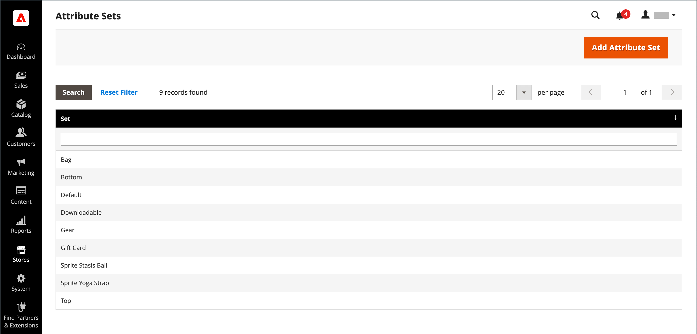

# 属性セット

製品を作成する際の最初の手順の 1 つは、製品レコードのテンプレートとして使用する属性セットを選択することです。 属性セットによって、データ入力時に使用できるフィールドと、顧客に表示される値が決まります。

属性は、製品レコード内での表示場所を決定するグループに編成されます。 ストアには、初期属性セット ( _デフォルト_) には、一般的に使用される一連の属性が含まれます。 属性を少しだけ追加する場合は、このデフォルトの属性セットに追加できます。 特定のタイプの情報を必要とする製品を販売する場合は、製品に必要な特定の属性を含む専用の属性セットを作成する方が良い可能性があります。

{width="700" zoomable="yes"}

## 属性セットの作成

1. 次の日： _管理者_ サイドバー、移動 **[!UICONTROL Stores]** > _[!UICONTROL Attributes]_>**[!UICONTROL Attribute Set]**.

1. クリック **[!UICONTROL Add New Set]**.

   {width="600" zoomable="yes"}

1. を入力します。 **[!UICONTROL Name]** 属性セットの。

1. 設定 **[!UICONTROL Based On]** を既存の属性セットに追加し、テンプレートとして使用します。

1. click **[!UICONTROL Save]**.

   次のページには、次の情報が表示されます。

   - 左の列には、属性セットの名前が表示されます。 名前は内部参照用で、必要に応じて変更できます。
   - ページの中央には、属性グループの現在の選択がリストされます。
   - 右側の列には、属性セットに現在割り当てられていない属性の選択が表示されます。

1. 属性をセットに追加するには、 **[!UICONTROL Unassigned Attributes]** リストを **[!UICONTROL Groups]** 列。

   >[!NOTE]
   >
   >システム属性はドットでマークされており、 _[!UICONTROL Groups]_リスト。 ただし、属性セット内の別のグループにドラッグすることはできます。

1. 完了したら、「 **[!UICONTROL Save]**.

{width="600" zoomable="yes"}

## 属性グループの作成

1. Adobe Analytics の _[!UICONTROL Groups]_列に属性セットを追加し、**[!UICONTROL Add New]**.

1. を入力します。 **[!UICONTROL Name]** 新しいグループの場合は、 **[!UICONTROL OK]**.

1. 次のいずれかの操作を行います。

   - ドラッグ **[!UICONTROL Unassigned Attributes]** を新しいグループに追加します。
   - 他のグループから新しいグループに属性をドラッグします。

   新しいグループは、属性セットに基づくすべてのプロダクトの属性のセクションになります。

## 属性セットの削除

1. 次の日： _管理者_ サイドバー、移動 **[!UICONTROL Stores]** > _[!UICONTROL Attributes]_>**[!UICONTROL Attribute Set]**.

1. リストで属性セットを選択し、編集モードで開きます。

1. クリック **[!UICONTROL Delete]**.

1. 確認するメッセージが表示されたら、「 **[!UICONTROL OK]**.
