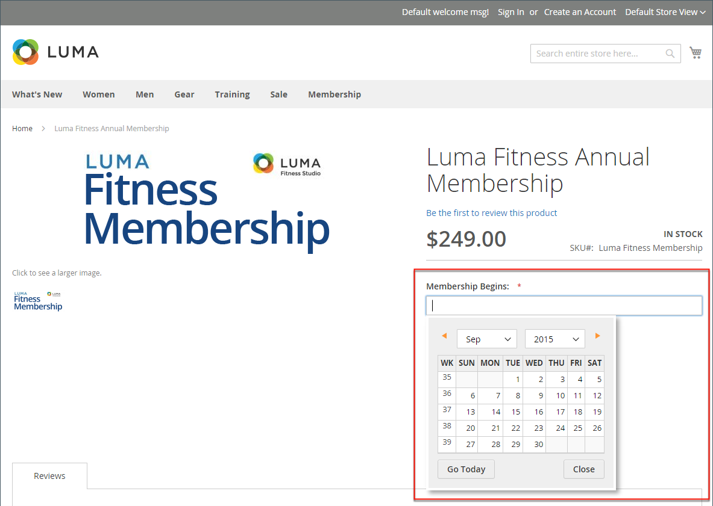

# 属性入力タイプ

管理者から表示する場合、属性は製品の作成時に入力するフィールドです。 属性に割り当てられる入力タイプによって、入力できるデータのタイプと、フィールドまたは入力コントロールの形式が決まります。 属性は、顧客の観点から見ると、製品に関する情報を提供します。また、製品を購入するために入力する必要があるオプションとデータ入力フィールドです。

## 入力タイプ

| プロパティ | 説明 |
|--- |--- |
| [!UICONTROL Text Field] | テキストの 1 行入力フィールド。 |
| [!UICONTROL Text Area] | 製品の説明など、テキストの段落を入力するための複数行の入力フィールド。 WYSIWYG エディターを使用して、HTMLタグでテキストの書式を設定したり、テキストにタグを直接入力したりできます。 |
| [!UICONTROL Text Editor] | 属性の場所に完全に機能するテキストエディター。 |
| [!UICONTROL Date] | に日付値を表示します [優先フォーマット](#date-and-time-options) および [タイムゾーン](../getting-started/store-details.md#locale-options). 日付値は、リストまたはカレンダー（  ）に設定します。   **_注意：_**システム設定に応じて、_Admin _ユーザーは、フィールドに日付を直接入力したり、カレンダーやリストから日付を選択したりできます。 日付と時刻の値の指定については、を参照してください。 [日付と時刻のオプション](#date-and-time-options). |
| [!UICONTROL Date and Time] | 日付と時刻の値を [優先フォーマット](#date-and-time-options) および [タイムゾーン](../getting-started/store-details.md#locale-options). 日時は、手動で入力することも、カレンダーから選択することもできます。 形式の例：MM/DD/YYYY HH:MM |
| [!UICONTROL Yes/No] | 次のオプションがあらかじめ定義されたドロップダウン リストを表示 `Yes` および `No`. |
| ドロップダウン | 1 つの選択のみを受け入れる値のドロップダウン リストを表示します。 ドロップダウン入力タイプは、の主要コンポーネントです [設定可能な製品](../catalog/product-create-configurable.md). |
| [!UICONTROL Multiple Select] | 複数の値を選択できるドロップダウン リストを表示します。 |
| [!UICONTROL Price] | この入力タイプは、事前定義済みの属性に加えて価格フィールドを作成するために使用されます。 `Price`, `Special Price`, `Tier Price`、および `Cost`. 使用する通貨は、システム設定によって決まります。 |
| [!UICONTROL Media Image] | 製品ロゴ、ケアの説明、食品ラベルの材料など、製品に追加の画像を関連付けます。 メディア画像属性を製品の属性セットに追加すると、ベース、小、サムネールと共に、追加の画像タイプになります。 メディア画像属性は、次から除外できます [ストアフロントメディアブラウザー](catalog-images-video.md#storefront-media-browser). |
| [!UICONTROL Fixed Product Tax] | を定義できます [FPT 率](../stores-purchase/fixed-product-tax.md) ロケールの要件に基づいています。 |
| [!UICONTROL Visual Swatch] | 設定可能な商品のカラー、テクスチャ、パターンを示すスウォッチが表示されます。 A [ビジュアルスウォッチ](swatches.md) 16 進数のカラー値で塗りつぶしたり、オプションのカラー、マテリアル、テクスチャ、またはパターンを表すアップロード済み画像を表示したりできます。 |
| [!UICONTROL Text Swatch] | サイズ調整によく使用される、設定可能な商品オプションのテキストベースの表現です。 [テキストスウォッチ](swatches.md) また、16 進数のカラー値を含めることもできます。 |
| [!UICONTROL Page Builder] | A [[!DNL Page Builder]](../page-builder/workspace.md) 製品ページに魅力的なコンテンツを簡単に追加できる、属性の場所のワークスペース。 |

{style="table-layout:auto"}

## 日付と時刻のオプション

日付と時刻のフィールドの形式をカスタマイズし、データ入力に使用する入力コントロールを選択できます。 日付の値は、ドロップダウンリストまたはポップアップカレンダーから選択できます。

{width="700" zoomable="yes"}

**_日付/時間フィールドをフォーマットするには：_**

1. 日 _Admin_ サイドバー、に移動 **[!UICONTROL Stores]** > _[!UICONTROL Settings]_>**[!UICONTROL Configuration]**.

1. 左側のパネルでを展開します。 **[!UICONTROL Catalog]** をクリックし、 **[!UICONTROL Catalog]** サブ項目。

1. を展開します。 **[!UICONTROL Date & Time Custom Options]** セクション。

   {width="600" zoomable="yes"}

   これらのオプションの詳細なリストについては、を参照してください [_日付と時刻のカスタムオプション_](../configuration-reference/catalog/catalog.md) が含まれる _設定リファレンス_.

1. 日付フィールドの入力コントロールとしてポップアップ カレンダーを使用するには、次のように設定します **[!UICONTROL Use JavaScript Calendar]** 対象： `Yes`.

1. を確立するには **[!UICONTROL Date Fields Order]**&#x200B;必要に応じて、日付フィールドの各部分の順序を設定します。

   - 月
   - 日
   - 年

1. 希望する時間形式を設定するには、を設定します **時刻の形式** を次のいずれかに変更します。

   - `12h AM/PM`
   - `24h`

1. を確立するには **[!UICONTROL Year Range]** ドロップダウン値には、年（YYYY）を入力して、 **[!UICONTROL from]** および **[!UICONTROL to]** 日付。

   空白の場合、フィールドのデフォルト値は現在の年になります。

1. 完了したら、 **[!UICONTROL Save Config]**.
