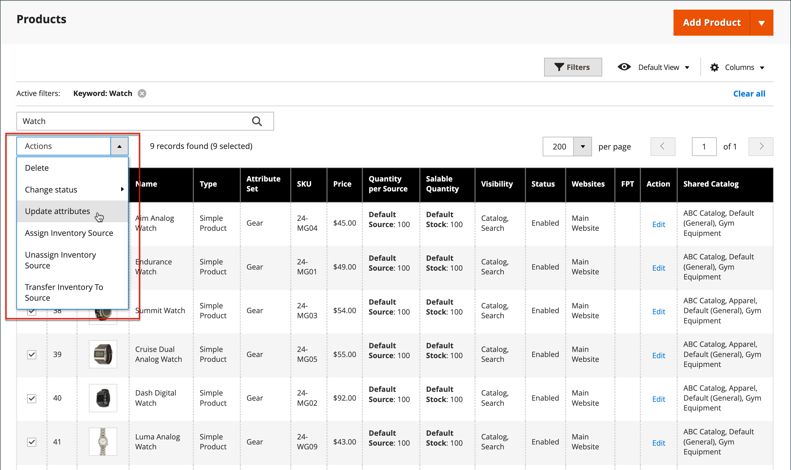

# 製品属性の一括更新

_[!UICONTROL Update Attributes]_ツールを使用して、製品内の1つ以上の属性を変更します。 このツールでは、多数の製品グループに大きな変更を適用することができます。

1. _管理者_ サイドバーで、**[!UICONTROL Catalog]** > **[!UICONTROL Products]**&#x200B;に移動します。

1. ソースを変更する製品を選択します。

   参照または検索して商品を見つけ、それらのチェックボックスを選択します。

1. 上部の&#x200B;**[!UICONTROL Actions]** メニューをクリックし、**[!UICONTROL Update Attributes]**&#x200B;を選択します。

   {width="600" zoomable="yes"}

1. ニーズに応じて、選択した製品の属性、高度な在庫、web サイトのデータを更新します。

   {width="600" zoomable="yes"}

1. 完了したら、**[!UICONTROL Save]**&#x200B;をクリックします。

