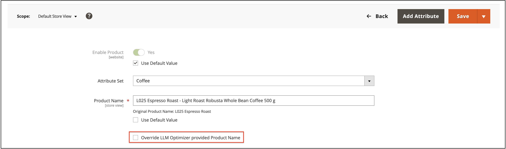

# カタログの強化

カタログのエンリッチメントは[!DNL Adobe Commerce]機能で、商品名と長い説明を改善することで、買い物客が商品調査や発見にLLMやAI アシスタントを使用する際に、カタログをより正確に表現できるようになります。

>[!NOTE]
>
>カタログの強化は、舞台裏の[!DNL Commerce Catalog Agent]と[!DNL Adobe LLM Optimizer]によって強化されています。 Commerce カタログワークフローの一部としてエンリッチメントを使用します。 承認済みの名前と説明の更新を適用するために、個別のLLM Optimizer統合を管理することはありません。 Commerce以外の幅広いLLMの監視と最適化については、[LLM Optimizer製品ドキュメント &#x200B;](https://experienceleague.adobe.com/en/docs/llm-optimizer/using/home)を参照してください。

## 仕組み {#how-it-works}

[!DNL Adobe Commerce]製品カタログは、製品データ（名前、説明、属性、価格設定、在庫）の記録システムです。[!DNL Adobe Commerce] Storefront MCP （Model Context Protocol）は、ライブカタログデータをAdobe AIエクスペリエンスに接続します。 さらに、カタログエージェントは、製品名と長い説明のギャップを特定して改善を提案し、承認済みの変更をCommerceに書き戻して、Commerce管理者でレビューできるようにします。

カタログを強化することで、次のことが可能になります。

- LLMによる製品解釈に影響を与える、製品名と長い説明文のギャップや不整合を特定します。
- ジャスティフィケーションや前後の比較など、提案された改善をサポートコンテキストと共に確認できます。
- 承認済みの更新をCommerceカタログに直接適用することで、管理者やストアフロントなど、フィールドを読み取るチャネルの連携を維持できます。

Commerceには商品名と長い説明が保存されているため、一度編集したコピーを改善することは、商品データを利用するあらゆるチャネルにメリットをもたらします。 このメリットは、システムの更新方法と更新時期によって異なります。

| 方向 | 目的 |
| --- | --- |
| Commerce カタログ ->解析 | カタログとURL シグナルが、エンリッチメントの提案に反映。 |
| エンリッチメント -> Commerce カタログ | 更新を承認すると、製品名と説明の変更がCommerce カタログに保存され、管理者とストアフロントに最適化された値が反映されます。 |

## 対象 {#who-this-is-for}

- デジタルマーケターやマーチャンダイジングを利用しているマーチャンダイザーは、LLMにもとづいて顧客データを正確かつ一貫性のある方法で提供する必要があります。
- デジタルマーケターやマーチャンダイジング担当者で、カタログのコピーを大規模に改善するための管理された方法を必要としている人。
- カタログの整合性、管理プロセス、および製品属性をフィードする統合（API、CSV、PIM）を所有するCommerce管理者。

## 前提条件 {#prerequisites}

カタログのエンリッチメントにアクセスできる場合は、次の前提条件が適用されます。

- ストアフロントはLLM向けおよびエージェント型のボットでクロールできます。カタログに応じた提案を行うにはクロールで対応する必要があります。
- 必要なCommerce サービスとカタログ接続が有効になり、正常に動作します。 詳細については、[&#x200B; カタログの強化を有効にする](#enable-catalog-enrichment)を参照してください。
- [IMSが設定されています](https://experienceleague.adobe.com/en/docs/core-services/interface/administration/organizations)。
- [Adobe Admin Console](https://helpx.adobe.com/business/enterprise/plan-your-deployment/basic-concepts/admin-console.html)にアクセスできます。
- 組織が基礎となるAI サービスに対して、生成AIに乗り換えたり、明示的にオプトアウトしたりしました。

>[!NOTE]
>
>Commerceでは、設定の一環として、カタログ強化の背後にあるAI サービスをカバーするGenAI ライダーに署名したかどうかを確認します。 ライダーにまだ署名していない場合やオプトアウトしていない場合は、カタログの強化を使用する前に、ライダーに署名するか更新するかを求めるメッセージが表示されます。

## カタログの強化を有効にする {#enable-catalog-enrichment}

推奨事項を確認または適用する前に、Commerceの管理者または実装パートナーと協力して、次のことを確認してください。

### カタログエンリッチメントとカタログサービス拡張機能のインストール

1. 次のコマンドを実行して、カタログエンリッチメント拡張機能をCommerce インスタンスにインストールします。

   ```bash
   composer require magento/module-catalog-enrichment --no-update
   composer update magento/module-catalog-enrichment
   ```

1. カタログサービスをまだインストールしていない場合は、[実行してください](https://experienceleague.adobe.com/en/docs/commerce/catalog-service/installation#install-the-catalog-service-extension)。

   **[!UICONTROL Catalog enrichment]**&#x200B;は、お使いのCommerce インスタンスで利用できるようになりました。

### カタログの強化にアクセス

カタログ エンリッチメントおよびカタログ サービス拡張機能をインストールすると、カタログ エンリッチメント機能が管理者の&#x200B;**[!UICONTROL Catalog]** > **[!UICONTROL Catalog Enrichment]**&#x200B;で利用できるようになります。


### カタログエンリッチメントの設定

**[!UICONTROL Settings]** タブでカタログのエンリッチメントを設定して、[!DNL Commerce Catalog Agent]がお客様の[!DNL Adobe Commerce]環境に接続し、Commerce Adminで提案を表示できるようにします。

1. 管理画面で、**[!UICONTROL Catalog]** > **[!UICONTROL Catalog Enrichment]**&#x200B;に移動します。
1. ページの上部にある&#x200B;**[!UICONTROL Scope]** リストで、設定するストアビューを選択するか、**[!UICONTROL All Store Views]**&#x200B;のままにして、ストアビュー全体の設定を管理します。
1. 「**[!UICONTROL Settings]**」タブを開きます。
1. **[!UICONTROL Commerce Configuration]**&#x200B;で、URLがラベル付きのストアビューパネルを展開します。

   カタログ LLM Optimizer サービスと監査ワークフローを有効にするには、[!DNL Adobe Commerce]環境の詳細を指定します。

   

1. ストアビューに必要な接続の詳細を入力します。

   - **[!UICONTROL Store View URL]**: ストアビューに対応するURL （例：`https://brand.example.com/fr/`）。
   - **[!UICONTROL Environment ID]**：接続がアクセスする[!DNL Adobe Commerce]環境の一意の識別子。
   - **[!UICONTROL Website Code]**、**[!UICONTROL Store Code]**&#x200B;および&#x200B;**[!UICONTROL Store View Code]**: Commerce web サイトのWeb サイト、ストア、およびストアの表示コード。 これらの値は、Commerce管理者のコードと一致する必要があります。
   - **[!UICONTROL Host Name]**: [!DNL Adobe Commerce] インスタンスのホスト名。

1. **[!UICONTROL Save]**&#x200B;をクリックします。

保存した後、最初の同期ジョブまたは検証ジョブが完了するのを待ってから、そのストアビューのカタログまたは監査結果に頼ります。 商品の提案が&#x200B;**[!UICONTROL Catalog Enrichment]** ページに表示されるまでに、最大で24時間かかる場合があります。

ストアビュー設定を削除するには、そのエントリを展開し、**[!UICONTROL Delete]**&#x200B;をクリックします。

#### フィールドの説明 {#commerce-connection-fields}

必須フィールドには、**[!UICONTROL Commerce Configuration]** フォームにアスタリスク （*）が付いています。

| フィールド | 必須 | 説明 |
| --- | --- | --- |
| ストアビューURL | はい | ストアビューに対応するURL （例：`https://brand.example.com/fr/`）。 |
| 環境ID | はい | 接続がアクセスする[!DNL Adobe Commerce]環境の一意の識別子。 |
| Web サイトコード | はい | CommerceのWeb サイトのWeb サイトのコード。 |
| ストアコード | はい | Commerce Web サイトのストアコード。 |
| ストアビューコード | はい | Commerce web サイトのストアビュー。 |
| ホスト名 | はい | [!DNL Adobe Commerce] インスタンスのホスト名。 |

### カタログ強化のレビューと適用 {#review-and-apply}

カタログの強化を有効にして設定すると、製品の提案が&#x200B;**[!UICONTROL Agentic Opportunities]** タブに表示されます。 ここから、Commerce カタログ内の製品名と長い説明に対して、提案を確認し、承認済みの更新を適用できます。

カタログのエンリッチメントでは、次のワークフロービューを使用します。

- **[!UICONTROL Current Suggestions]**：レビューする新しい項目またはアクティブな項目。
- **[!UICONTROL Fixed Suggestions]**：既に適用または解決済みの項目。
- **[!UICONTROL Ignored Suggestions]**: アクションから意図的に除外した項目。


### 承認済み提案をデプロイ {#review-deploy-catalog}

承認済み提案をデプロイするには：

1. **[!UICONTROL Current Suggestions]**&#x200B;を選択します。
1. URLまたはSKU行の展開コントロールをクリックして、提案された製品名と製品説明の更新を表示します。
1. 候補を確認し、それがマーチャンダイジングとSEO戦略に一致することを確認します。

デプロイする前に提案を編集するか、戦略と一致しない場合は&#x200B;**[!UICONTROL Ignored Suggestions]**&#x200B;に移動できます。

1. 更新するURLまたはSKUの行を選択します。
1. 「**[!UICONTROL Deploy optimizations]**」をクリックして確認します。

承認された名前と説明の変更は、他の製品の更新と同様に、[!DNL Adobe Commerce] カタログに保存されます。

>[!IMPORTANT]
>
>適用された各更新を実稼動カタログの変更として扱います。 通常の変更管理、ステージング、QAのプラクティスを使用します。 マーチャンダイジングとSEOの関係者が最終コピーについて合意した後にのみ、更新を適用します。

更新プログラムを適用すると、修正済み&#x200B;**として** マークが付いた&#x200B;**[!UICONTROL Fixed Suggestions]**&#x200B;に候補が移動します。

## 管理者でのエンリッチメントの確認 {#verify-in-admin}

**適用されたカタログの強化を確認するには：**

1. Commerce Adminで&#x200B;**[!UICONTROL Catalog]** > **[!UICONTROL Products]**&#x200B;に移動します。
1. 必要に応じて、フィルターと&#x200B;**[!UICONTROL Store View]** セレクターを使用します（例：**[!UICONTROL Default Store View]**）。
1. SKUを検索します。
1. 製品を編集モードで開きます。

   製品フォームには、強化された製品名や説明が表示されます。

   を強化しました

1. オプション：代わりに手動で入力した名前を保持する場合は、**[!UICONTROL Override Catalog Agent provided Product Name]**&#x200B;を選択します。

   手動での上書きは、提案がカタログとの同期を維持する方法に影響します。 詳しくは、[管理者](#manual-override-in-the-admin)での手動による上書きを参照してください。

1. 「**[!UICONTROL Content]**」セクションを展開し、説明フィールドを見つけます。

   説明の変更を適用すると、強化された説明が表示されます。

   を拡充

1. オプション：代わりに手動で入力した説明を保持する場合は、**[!UICONTROL Override Catalog Agent provided Description]**&#x200B;を選択します。

手動での上書きは、提案がカタログとの同期を維持する方法に影響します。 詳しくは、[管理者](#manual-override-in-the-admin)での手動による上書きを参照してください。

## ストアフロントでエンリッチメントを確認する {#verify-storefront}

**ストアフロントでエンリッチメントを検証するには：**

1. ストアフロントでSKUを検索します。
1. 製品ページを開きます。
1. 製品名と説明が承認済みと一致することを確認します。

   ストアフロントにエンリッチメントが表示されるまでに時間がかかる場合があります。

1. 長い説明を表示する地域が、承認済みの地域と一致することを確認します。
1. オプション：ロールアウトに関連する場合は、同じカタログ属性を使用するダウンストリームチャネルを確認します。

## 上書き、取り込み、古い提案 {#overrides-ingestion}

カタログのエンリッチメントにより、製品の名前や説明が更新されると、他の取り込みシステムが同じフィールドを変更する場合があります。 REST API呼び出し、CSV読み込み、PIM フィードなどの例があります。

### オリジナルの値を再取得 {#original-value-reingested}

外部プロセスが元の名前または説明（エンリッチメントが適用される前に存在していた値）を書き込んだ場合、Commerceは、カタログ エンリッチメントルールに従って、そのフィールドのエンリッチメント値を引き続き尊重します。 提案は、その取り込みだけでは自動的に元に戻らない場合があります。

### 新しい値が再び取り込まれました {#new-value-reingested}

外部プロセスがプリエンリッチメントテキストの繰り返しではない新しい値を送信する場合、Commerceは新しいカタログ値を尊重します。 例えば、「赤い靴」から「象徴的な赤い靴」に名前を変更すると、エンリッチメントされた値に置き換わります。 ライブカタログが提案コンテキストと一致しなくなったため、関連するエンリッチメントの提案は、通常、*古い*&#x200B;とマークされます。

### 管理者の手動オーバーライド {#manual-override-in-the-admin}

[!DNL Adobe Commerce]管理者で製品名または説明を手動で編集する場合：

- Adminの値は、その手動変更の記録システムとして勝ちます。
- エンリッチメントの提案は、*古い*&#x200B;とマークされています。
- 提案ワークフローは、その項目の元の状態に戻るので、分析が再度実行された場合は、ベースラインを変更したり、新しい提案を受け入れたりできます。

これらのルールは、複数のチャネルが同じSKUに接触した場合に、カタログのエンリッチメント、取り込みフィード、管理者編集のいずれが権限を持つかを判断するのに役立ちます。

## 制限と考慮事項 {#limits}

- エンリッチメントは、商品名と長い説明文にのみ適用されます。 PDP レイアウト、ウィジェット、その他のページレベルのストアフロントコンテンツは変更されません。
- 大きなカタログとURL数が多い場合、分析の完了速度と一度に表示される候補の数に影響を与える可能性があります。
- 有意義な提案は、LLM関連ボットが気になる製品URLにアクセスできることを前提としています。 ロボットルール、認証、ジオブロッキング、高度なパーソナライゼーションにより、カバー範囲を縮小することができます。

## ベストプラクティス {#best-practices}

- PIMまたはフィードのジョブが意図せずカタログのエンリッチメントと競合しないように、製品名と説明のシステム所有権を文書化します。
- タイトルや説明を一括適用する前に、SEO チームやブランドチームと調整しましょう。
- 主要なカタログのインポート後に再同期または再分析して、現在のカタログの状態を提案に反映します。

<!--## Examples This section will provide examples of what enrichment before/after looks like:-->
