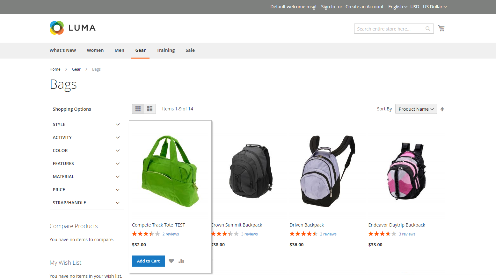

# フラットカタログ

>[!IMPORTANT]
>
>フラットカタログの使用は、ベストプラクティスとして推奨されなくなりました。 この機能を引き続き使用すると、パフォーマンスの低下やその他のインデックス作成の問題が発生することが知られています。 詳細な説明と解決策は、[&#x200B; ヘルプセンター](https://experienceleague.adobe.com/docs/commerce-knowledge-base/kb/troubleshooting/miscellaneous/slow-performance-slow-and-long-running-crons.html)で入手できます。  影響を受けるバージョンには、 - Adobe Commerce on cloud infrastructure, 2.3.x and above - Adobe Commerce （オンプレミス）, 2.3.x and above - Magento Open Source, 2.3.x and above   任意のリリース版では、一部の拡張機能はフラットテーブルでのみ動作するため、フラットテーブルを無効にするとリスクが生じます。 フラットカタログインデクサーを使用する一部の拡張機能があることがわかっている場合は、これらの値を`No`に設定する際にこのリスクに注意する必要があります。

Commerceでは通常、Entity-Attribute-Value （EAV）モデルに基づいて、カタログデータを複数のテーブルに格納します。 製品属性は多くのテーブルに保存されるため、SQL クエリは長くて複雑な場合があります。

一方、フラットカタログでは、その場でテーブルが作成され、各行には製品またはカテゴリに関するすべての必要なデータが含まれます。 フラットカタログは、毎分、またはcronのジョブに応じて、自動的に更新されます。 フラットカタログインデックスは、カタログとカートの価格ルールの処理を高速化することもできます。 500,000個ものSKUを持つカタログは、フラットカタログとして迅速にインデックスを作成できます。

>[!NOTE]
>
>ライブストアのフラットカタログを有効にする前に、開発環境で設定をテストしてください。

## 手順1：フラットカタログを有効にする

1. _管理者_ サイドバーで、**[!UICONTROL Stores]** > _[!UICONTROL Settings]_>**[!UICONTROL Configuration]**&#x200B;に移動します。

1. 左側のパネルで「**[!UICONTROL Catalog]**」を展開し、下の「**[!UICONTROL Catalog]**」を選択します。

1. _Storefront_ セクションを展開し、次の操作を行います。

   - **[!UICONTROL Use Flat Catalog Category]**&#x200B;を`Yes`に設定します。 （必要に応じて、**[!UICONTROL Use system value]** チェックボックスの選択を解除します）。

   - **[!UICONTROL Use Flat Catalog Product]**&#x200B;を`Yes`に設定します。

   {width="700" zoomable="yes"}

1. 完了したら、**[!UICONTROL Save Config]**&#x200B;をクリックします。

1. キャッシュの更新を求めるメッセージが表示されたら、システムメッセージの「**[!UICONTROL Cache Management]**」をクリックし、指示に従ってキャッシュを更新します。

## 手順2：結果の検証

結果を検証する方法は2つあります。

### 方法1:1つの製品の結果を検証する

1. _管理者_ サイドバーで、**[!UICONTROL Catalog]** > **[!UICONTROL Products]**&#x200B;に移動します。

1. 商品を編集モードで開きます。

1. **[!UICONTROL Name]**&#x200B;の場合、製品名の末尾にテキスト `_TEST`を追加します。

1. **[!UICONTROL Save]**&#x200B;をクリックします。

1. 新しいブラウザータブで、ストアのホームページに移動し、次の操作を行います。

   - 編集した商品を検索します。

   - ナビゲーションを使用して、割り当てられたカテゴリの下にある製品を参照します。

     必要に応じて、ページを更新して結果を確認します。 変更内容は、分以内、または[Cron](../systems/cron.md) スケジュールに従って表示されます。

   {width="700" zoomable="yes"}

### 方法2：カテゴリの結果を確認する

1. _管理者_ サイドバーで、**[!UICONTROL Catalog]** > **[!UICONTROL Categories]**&#x200B;に移動します。

1. 左上隅で、**[!UICONTROL Store View]**&#x200B;が`All Store Views`に設定されていることを確認します。

   プロンプトが表示されたら、**[!UICONTROL OK]**&#x200B;をクリックして確認します。

1. カテゴリーツリーで、既存のカテゴリを選択し、**[!UICONTROL Add Subcategory]**&#x200B;をクリックして、次の操作を行います。

   - **[!UICONTROL Category Name]**&#x200B;に対して、`Test Category`と入力します。

   - 完了したら、**[!UICONTROL Save]**&#x200B;をクリックします。

     {width="600" zoomable="yes"}

   - **[!UICONTROL Products in Category]** セクションのを展開し、**[!UICONTROL Reset Filter]**&#x200B;をクリックしてすべての製品を表示します。

   - 新しいカテゴリに追加する複数の製品のチェックボックスをオンにします。

   - **[!UICONTROL Save]**&#x200B;をクリックします。

   {width="600" zoomable="yes"}

1. 新しいブラウザータブで、ストアのホームページに移動し、ストアナビゲーションを使用して作成したカテゴリを参照します。

   必要に応じて、ページを更新して結果を確認します。 変更内容は、分単位またはcron スケジュールに従って表示されます。

## 手順3：テストデータの削除

次の手順を実行して、テストデータを削除し、元の製品名とカタログ設定を復元します。

### テストカテゴリの削除

1. _管理者_ サイドバーで、**[!UICONTROL Catalog]** > **[!UICONTROL Categories]**&#x200B;に移動します。

1. カテゴリーツリーで、作成したテストサブカテゴリを選択します。

1. 右上隅の「**[!UICONTROL Delete]**」をクリックします。

1. 確認を求められたら、**[!UICONTROL OK]**&#x200B;をクリックします。

   このカテゴリの削除では、カテゴリに割り当てられている製品は削除されません。

### 元の製品名を復元

1. _管理者_ サイドバーで、**[!UICONTROL Catalog]** > **[!UICONTROL Categories]**&#x200B;に移動します。

1. テスト製品を編集モードで開きます。

1. **[!UICONTROL Product Name]**&#x200B;に追加した`_TEST` テキストを削除します。

1. 右上隅の「**[!UICONTROL Save]**」をクリックします。

### 元のカタログ設定の復元

1. _管理者_ サイドバーで、**[!UICONTROL Stores]** > _[!UICONTROL Settings]_>**[!UICONTROL Configuration]**&#x200B;に移動します。

1. 左側のパネルで「**[!UICONTROL Catalog]**」を展開し、下の「**[!UICONTROL Catalog]**」を選択します。

1. _Storefront_ セクションを展開し、次の操作を行います。

   - **[!UICONTROL Use Flat Catalog Category]**&#x200B;を`No`に設定します。

   - **[!UICONTROL Use Flat Catalog Product]**&#x200B;を`No`に設定します。

1. 完了したら、**[!UICONTROL Save Config]**&#x200B;をクリックします。

1. プロンプトが表示されたら、キャッシュを更新します。
