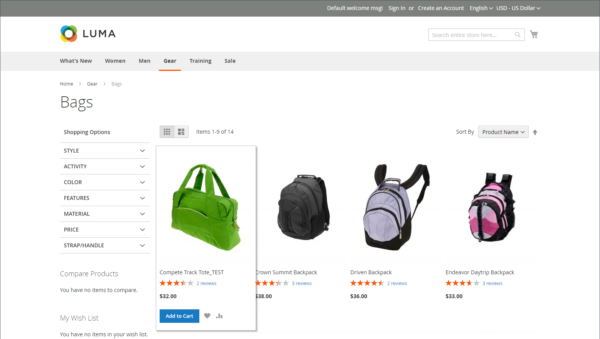

# フラット カタログ

>[!IMPORTANT]
>
>フラット カタログを使用することは、現在ではベスト プラクティスとして推奨されていません。 この機能を継続的に使用すると、パフォーマンスの低下やその他のインデックス作成の問題が発生することが知られています。 詳細な説明と解決策については、[&#x200B; ヘルプセンター &#x200B;](https://experienceleague.adobe.com/docs/commerce-knowledge-base/kb/troubleshooting/miscellaneous/slow-performance-slow-and-long-running-crons.html?lang=ja) を参照してください。   影響を受けるバージョンは次のとおりです。 - クラウドインフラストラクチャー上のAdobe Commerce、2.3.x 以降  - Adobe Commerce（オンプレミス）、2.3.x 以降  - Magento Open Source、2.3.x 以降    どのリリースバージョンでも、一部の拡張機能はフラットテーブルでのみ機能するので、フラットテーブルを無効にした場合にリスクが生じます。 フラットカタログインデクサーを使用する拡張機能があることがわかっている場合は、それらの値を `No` に設定する際に、このリスクに注意する必要があります。

Commerceは通常、Entity-Attribute-Value （EAV）モデルに基づいて、カタログデータを複数のテーブルに格納します。 製品属性は多くのテーブルに格納されるので、SQL クエリは長くて複雑な場合があります。

これに対し、フラットなカタログはその場でテーブルを作成し、各行には、製品またはカテゴリに関する必要なデータがすべて含まれています。 フラットなカタログは、毎分、または cron ジョブに従って自動的に更新されます。 フラットなカタログインデックス作成により、カタログと買い物かごの価格ルールの処理も迅速化できます。 50 万個もの SKU を持つカタログは、フラットカタログとしてすばやくインデックスを作成できます。

>[!NOTE]
>
>ライブストアに対してフラットカタログを有効にする前に、必ず開発環境で設定をテストしてください。

## 手順 1：フラットカタログを有効にする

1. _管理者_ サイドバーで、**[!UICONTROL Stores]**/_[!UICONTROL Settings]_/**[!UICONTROL Configuration]**&#x200B;に移動します。

1. 左側のパネルで「**[!UICONTROL Catalog]**」を展開し、その下の「**[!UICONTROL Catalog]**」を選択します。

1. 「_ストアフロント_」セクションを展開し、次の操作を行います。

   - **[!UICONTROL Use Flat Catalog Category]** を `Yes` に設定します。 （必要に応じて、「**[!UICONTROL Use system value]**」チェックボックスを選択解除します。）

   - **[!UICONTROL Use Flat Catalog Product]** を `Yes` に設定します。

   {width="700" zoomable="yes"}

1. 完了したら、「**[!UICONTROL Save Config]**」をクリックします。

1. キャッシュを更新するように求められたら、システムメッセージの **[!UICONTROL Cache Management]** をクリックし、指示に従ってキャッシュを更新します。

## 手順 2：結果の確認

結果を検証する方法は 2 つあります。

### 方法 1：単一の製品の結果の確認

1. _管理者_ サイドバーで、**[!UICONTROL Catalog]**/**[!UICONTROL Products]** に移動します。

1. 製品を編集モードで開きます。

1. **[!UICONTROL Name]** しくは、製品名の末尾に `_TEST` というテキストを追加します。

1. 「**[!UICONTROL Save]**」をクリックします。

1. 新しいブラウザータブで、ストアのホームページに移動し、次の操作を行います。

   - 編集した製品を検索します。

   - ナビゲーションを使用して、割り当てられたカテゴリの下の製品を参照します。

     必要に応じて、ページを更新して結果を確認します。 変更は 1 分以内に、または [Cron](../systems/cron.md) スケジュールに従って表示されます。

   {width="700" zoomable="yes"}

### 方法 2：カテゴリの結果の確認

1. _管理者_ サイドバーで、**[!UICONTROL Catalog]**/**[!UICONTROL Categories]** に移動します。

1. 左上隅で、「**[!UICONTROL Store View]**」が「`All Store Views`」に設定されていることを確認します。

   プロンプトが表示されたら、「**[!UICONTROL OK]**」をクリックして確認します。

1. カテゴリ ツリーで既存のカテゴリを選択し、[**[!UICONTROL Add Subcategory]**] をクリックして、次の操作を実行します。

   - **[!UICONTROL Category Name]** には、`Test Category` と入力します。

   - 完了したら、「**[!UICONTROL Save]**」をクリックします。

     {width="600" zoomable="yes"}

   - 「展開セレクター  を展開し、**[!UICONTROL Products in Category]** をクリックして、すべての商品 **[!UICONTROL Reset Filter]** 表示します。

   - 新しいカテゴリに追加する複数の製品のチェックボックスをオンにします。

   - 「**[!UICONTROL Save]**」をクリックします。

   {width="600" zoomable="yes"}

1. 新しいブラウザータブでストアのホームページに移動し、ストアナビゲーションを使用して、作成したカテゴリを参照します。

   必要に応じて、ページを更新して結果を確認します。 変更は 1 分以内か、cron スケジュールに従って表示されます。

## 手順 3：テストデータを削除

テストデータを削除して元の製品名とカタログ設定を復元するには、次の手順を実行します。

### テストカテゴリを削除

1. _管理者_ サイドバーで、**[!UICONTROL Catalog]**/**[!UICONTROL Categories]** に移動します。

1. カテゴリツリーで、作成したテストサブカテゴリを選択します。

1. 右上隅の「**[!UICONTROL Delete]**」をクリックします。

1. 確認を求めるメッセージが表示されたら、「**[!UICONTROL OK]**」をクリックします。

   このカテゴリ削除によって、カテゴリに割り当てられている製品が削除されるわけではありません。

### 元の製品名を復元

1. _管理者_ サイドバーで、**[!UICONTROL Catalog]**/**[!UICONTROL Categories]** に移動します。

1. テスト製品を編集モードで開きます。

1. **[!UICONTROL Product Name]** に追加した `_TEST` テキストを削除します。

1. 右上隅の「**[!UICONTROL Save]**」をクリックします。

### 元のカタログ設定を復元

1. _管理者_ サイドバーで、**[!UICONTROL Stores]**/_[!UICONTROL Settings]_/**[!UICONTROL Configuration]**&#x200B;に移動します。

1. 左側のパネルで「**[!UICONTROL Catalog]**」を展開し、その下の「**[!UICONTROL Catalog]**」を選択します。

1. 「_ストアフロント_」セクションを展開し、次の操作を行います。

   - **[!UICONTROL Use Flat Catalog Category]** を `No` に設定します。

   - **[!UICONTROL Use Flat Catalog Product]** を `No` に設定します。

1. 完了したら、「**[!UICONTROL Save Config]**」をクリックします。

1. プロンプトが表示されたら、キャッシュを更新します。
