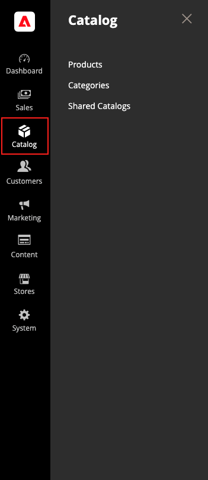

# [!UICONTROL Catalog] メニュー

[!UICONTROL Catalog] メニューを使用すると、商品作成、カテゴリ、在庫管理ツール、[B2B ストア ](https://experienceleague.adobe.com/docs/commerce-admin/b2b/introduction.html) のカスタム価格用の共有カタログに簡単にアクセスできます。

>[!BEGINTABS]

>[!TAB Adobe Commerce]

[!BADGE PaaS のみ ]{type=Informative url="https://experienceleague.adobe.com/en/docs/commerce/user-guides/product-solutions" tooltip="Adobe Commerce on Cloud プロジェクト（Adobeが管理する PaaS インフラストラクチャ）およびオンプレミスプロジェクトにのみ適用されます。"}

{width="300" zoomable="yes"}

>[!TAB Adobe Commerceas a Cloud Service]

[!BADGE SaaS のみ ]{type=Positive url="https://experienceleague.adobe.com/en/docs/commerce/user-guides/product-solutions" tooltip="Adobe Commerce as a Cloud ServiceおよびAdobe Commerce Optimizer プロジェクトにのみ適用されます（Adobeで管理される SaaS インフラストラクチャ）。"}

{width="300" zoomable="yes"}

>[!ENDTABS]

_管理者_ サイドバーで、「**[!UICONTROL Catalog]**」をクリックします。

## [!UICONTROL Products]

すべてのタイプの [ 製品 ](products-list.md) を作成し、在庫を管理します。

{width="700" zoomable="yes"}

## [!UICONTROL Categories]

ストアのナビゲーションの基礎となる [ カテゴリ ](categories.md) 構造を作成します。

{width="700" zoomable="yes"}

## [!UICONTROL Shared Catalogs]

Adobe Commerce B2B がインストールされて有効になっているストアの場合は、[ 共有カタログ ](https://experienceleague.adobe.com/docs/commerce-admin/b2b/shared-catalogs/catalog-shared.html) を使用すると、様々な会社でカスタムの価格を利用できます。

{width="700" zoomable="yes"}
