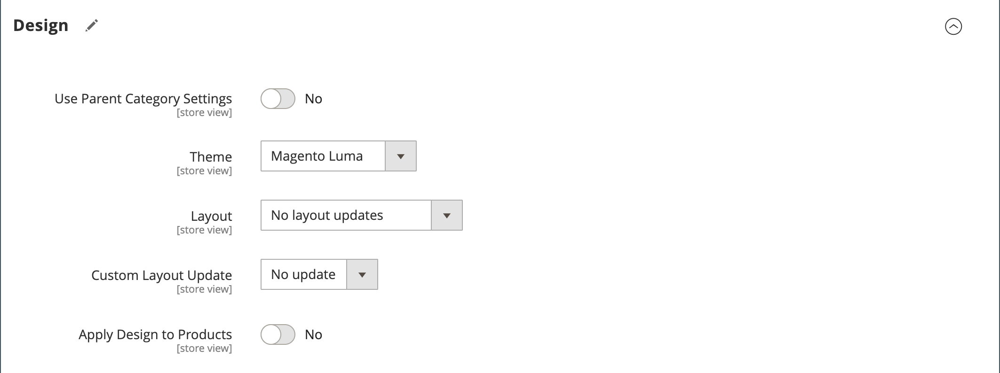
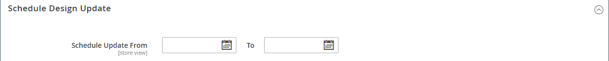

# カテゴリ — デザイン設定

The _[!UICONTROL Design]_「 」セクションでは、カテゴリ、関連するすべての製品ページ、ページレイアウトのルックアンドフィールを制御できます。 プロモーション用にカテゴリページとその関連製品をカスタマイズしたり、カテゴリを区別したりできます。 例えば、ブランドや特別な製品ラインに合わせて独特なデザインを作成したり、特定の期間にアップデートを適用したりできます。

{width="600" zoomable="yes"}

>[!NOTE]
>
>同じ製品が複数のカテゴリに割り当てられ、各カテゴリに異なるデザイン設定が設定されている場合は、 **製品 URL にカテゴリパスを使用** = `Yes` （内） [検索エンジン最適化設定オプション](../configuration-reference/catalog/catalog.md#search-engine-optimization). この設定にアクセスするには、に移動します。  **[!UICONTROL Stores]** > _[!UICONTROL Settings]_>**[!UICONTROL Configuration]**、展開&#x200B;**[!UICONTROL Catalog]**を選択します。**カタログ**左側のパネルの下で、を展開します。**検索エンジンの最適化**」セクションに表示されます。

| フィールド | 説明 |
|--- |--- |
| [!UICONTROL Use Parent Category Settings] | 現在のカテゴリが親カテゴリからデザイン設定を継承できるようにします。 使用すると、「デザイン」セクションのその他のフィールドはすべて使用できなくなります。 オプション： `Yes` / ` No` |
| [!UICONTROL Theme] | カスタムテーマをカテゴリに適用します。 |
| [!UICONTROL Layout] | カテゴリページに別のレイアウトを適用します。 オプション：  **[!UICONTROL No layout updates]**— デフォルトでは、レイアウトの更新はカテゴリページでは使用できません。 **[!UICONTROL Empty]**  — を使用して、独自のページレイアウトを定義します。 （XML に関する理解が必要です）。  **[!UICONTROL 1 column]**— カテゴリページに 1 列のレイアウトを適用します。 **[!UICONTROL 2 columns with left bar]**  — カテゴリページに左にサイドバーがある 2 列のレイアウトを適用します。  **[!UICONTROL 2 columns with right bar]**— カテゴリページに右側のサイドバーを持つ 2 列のレイアウトを適用します。 **[!UICONTROL 3 columns]**  — カテゴリページに 3 列のレイアウトを適用します。 **[!UICONTROL Page -- Full Width]**- （必須） [Page Builder](../page-builder/introduction.md)) カテゴリページに CMS ページの全幅レイアウトを適用します。 **[!UICONTROL Category -- Full Width]** - （Page Builder が必要）カテゴリページにカテゴリページの全幅レイアウトを適用します。  **[!UICONTROL Product -- Full Width]**- （Page Builder が必要）製品ページの全幅レイアウトをカテゴリページに適用します。 |
| [!UICONTROL Custom Layout Update] | サーバー上の使用可能なカスタムレイアウト更新ファイルを一覧表示します。 カテゴリに適用するカスタムレイアウトの更新を選択します。 |
| [!UICONTROL Apply Design to Products] | 選択すると、カテゴリ内のすべての製品にカスタム設定が適用されます。 |

{style="table-layout:auto"}

## [!UICONTROL Scheduled Design Update]

{{ce-feature}}

The _[!UICONTROL Scheduled Design Update]_「 」セクションでは、カスタムデザインをカテゴリページに適用する際の日付範囲を指定します。

| フィールド | 説明 |
|--- |--- |
| [!UICONTROL Schedule Update From/To] | カスタムレイアウトをカテゴリに適用する際の日付範囲を決定します。 |

{width="600" zoomable="yes"}
