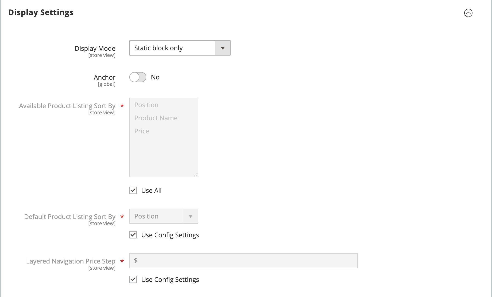

# カテゴリ – 表示設定

表示設定は、カテゴリページに表示するコンテンツ要素と、製品の表示順を決定します。 「_[!UICONTROL Display Settings]_」タブでは、CMS ブロックの有効化、カテゴリのアンカーステータスの設定、並べ替えオプションの管理を行うことができます。 カテゴリがストアフロントにどのように反映されるかについては、[ カタログナビゲーション ](navigation.md) を参照してください。

{width="600" zoomable="yes"}

| フィールド | 説明 |
|--- |--- |
| [!UICONTROL Display Mode] | カテゴリページに表示されるコンテンツ要素を決定します。 オプション：`Products Only`/`Static Block Only`/`Static Block and Products` |
| [!UICONTROL Anchor] | `Yes` に設定すると、サブカテゴリの商品がカテゴリに明示的に追加されていない場合でも、その商品がカテゴリに表示され、_[!UICONTROL filter by attribute]_のセクションは階層化ナビゲーションで表示できるようになります。 オプション：`Yes` / `No` |
| [!UICONTROL Available Product Listing Sort By] | （必須） デフォルト値は、`Position`、`Name`、`Price` です。 並べ替えオプションをカスタマイズするには、「**[!UICONTROL Use All Available Attributes]**」チェックボックスの選択を解除し、使用する属性を選択します。 必要に応じて、属性を定義および追加できます。 この設定は [!DNL Live Search] 製品一覧ページウィジェット [ には適用され ](https://experienceleague.adobe.com/en/docs/commerce-merchant-services/live-search/live-search-storefront/plp-styling) せん。 |
| [!UICONTROL Default Product Listing Sort By] | （必須）デフォルトの _[!UICONTROL Sort By]_オプションを定義するには、「**[!UICONTROL Use Config Settings]**」チェックボックスの選択を解除して、属性を選択します。 この設定は [!DNL Live Search] 製品一覧ページウィジェット [ には適用され ](https://experienceleague.adobe.com/en/docs/commerce-merchant-services/live-search/live-search-storefront/plp-styling) せん。 |
| [!UICONTROL Layered Navigation Price Step] | デフォルトでは、Commerceは、リスト内の商品に応じて、10、100、1000 の増分で価格範囲を表示します。 価格ステップ範囲を変更するには、「**[!UICONTROL Use Config Settings]**」チェックボックスの選択を解除します。 |

{style="table-layout:auto"}
