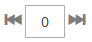

# カテゴリ製品割り当て

カテゴリの場合は、「_[!UICONTROL Products in Category]_」セクションを使用して、現在カテゴリに割り当てられている製品を確認します。 各列の上部にある検索フィルターは、商品の追加とカテゴリからの削除に使用されます。 [&#x200B; カテゴリルール &#x200B;](../merchandising-promotions/category-product-rules.md) （Adobe Commerceのみ）を使用して、一連の条件が満たされたときに商品の選択範囲を動的に変更することもできます。 詳しくは、[&#x200B; ビジュアルマーチャンダイザー &#x200B;](../merchandising-promotions/visual-merchandiser.md)）を参照してください。

>[!TIP]
>
>カテゴリルールの設定時、このカテゴリの保存時に、_並べ替え_、_一致_、_割り当て済み_、_未割り当て_ ルールに従って **_のみ_** 商品が保存されます。 カタログに新しい製品を追加したときにルールに従って新しい製品が確実に割り当てられるようにするには、ルールで製品と一致するように設定されている **各カテゴリを再保存する必要があります**。 また、商品の在庫ステータスが `In Stock` または `Out of Stock` に変更され、「自動並べ替え __ ルールに従ってカテゴリ内の商品が **並べ替え** れる場合は、「**[!UICONTROL Save Category]**」をクリックする必要があります。

{width="600" zoomable="yes"}

>[!NOTE]
>
>カテゴリページ `Out of stock` は、製品リストには、すべての並べ替えタイプで `In Stock` 常に **_後_** 製品が表示されます。

>[!NOTE]
>
>_在庫_ 列には、_&#x200B;**選択したカテゴリ範囲**&#x200B;_ のみの販売可能な製品数量が表示されます。 製品に対して複数の在庫を管理する場合、対応する範囲を切り替えて、他の _在庫_ 列の値を _カテゴリ製品_ グリッドに表示する必要があります。

## カテゴリルールの適用

{{ee-feature}}

1. **[!UICONTROL Match products by rule]** を `Yes` に設定します。

   自動並べ替えと条件のオプションが表示されます。

   {width="600" zoomable="yes"}

1. **[!UICONTROL Automatic Sorting]** の順序を設定します。

   この自動並べ替えは、現在の条件に基づいて行われます。

   - `Stock level` – 上または下に移動します。
   - `Special price` – 上または下に移動します。
   - `New Products` – 新しい製品から順にリストします。
   - `Color` – 色順に並べ替えます。
   - `Name` – 名前で昇順または降順に並べ替えます。
   - `SKU` - SKU で昇順または降順に並べ替えます
   - `Price` – 価格で昇順または降順に並べ替えます。

1. 「**[!UICONTROL Add Condition]**」をクリックして、次の操作を実行します。

   - 条件の基礎となる **[!UICONTROL Attribute]** を選択します。
   - 式の作成に必要な **[!UICONTROL Operator]** を選択します。
   - 照合する **[!UICONTROL Value]** を入力します。

   {width="600" zoomable="yes"}

   満たす条件を記述するために使用する属性ごとに、このプロセスを繰り返します。 例えば、7～30 日前に作成された製品を照合するには、次の手順を実行します。

   - **[!UICONTROL Date Created]** を `Less than 30` に設定します。
   - **[!UICONTROL Logic]** を `AND` に設定します。
   - **[!UICONTROL Date Modified]** を `Greater than 7` に設定します。

1. 完了したら、「**[!UICONTROL Save Category]**」をクリックします。

### ページオプション

| オプション | 説明 |
|--- |--- |
| [!UICONTROL Match products by rule] | カテゴリ内の製品のリストがカテゴリルールによって動的に生成されるかどうかを決定します。 オプション：`Yes` / `No` |
| [!UICONTROL Automatic Sorting] | カテゴリ製品のリストに並べ替え順を自動的に適用します。 オプション： `None` `Move low stock to top` `Move low stock to bottom` `Special price to top` `Special price to bottom` `Newest products first` `Sort by color` `Name: A - Z` `Name: Z - A` `SKU: Ascending` `SKU: Descending` `Price: High to Low` `Price: Low to High` |
| [!UICONTROL Add Condition] | ルールに別の条件を追加します。 |

{style="table-layout:auto"}

### ページ条件

| オプション | 説明 |
|--- |--- |
| [!UICONTROL Attribute] | 条件の基礎として使用する属性を指定します。 オプション： **[!UICONTROL Clone Category ID(s)]**- カテゴリ ID に基づいて、複数のカテゴリから、並べ替えや順序なしで動的に製品のクローンを作成します。 **[!UICONTROL Color]** – 色に基づいて製品を含めます。  **[!UICONTROL Date Created (days ago)]**– 製品がカタログに追加されてからの経過日数に基づいて、製品を含めます。 **[!UICONTROL Date Modified (days ago)]** – 製品が最後に変更されてからの経過日数に基づいて、製品を含めます。  **[!UICONTROL Name]**– 製品名に基づいて製品を含めます。 **[!UICONTROL Price]** – 価格に基づいて製品を含めます。  **[!UICONTROL Quantity]**– 在庫数に基づいて製品を含めます。 **&#x200B; SKU &#x200B;**- SKU に基づいた製品を含みます。 |
| [!UICONTROL Operator] | 条件を満たすために属性値に適用する演算子を指定します。 演算子を指定しない限り、`Equal` がデフォルトとして使用されます。 オプション：`Equal` / `Not equal` / `Greater than` / `Greater than or equal to` / `Less than` / `Less than or equal to` / `Contains` |
| [!UICONTROL Value] | 属性が条件を満たす必要がある値を指定します。 |
| [!UICONTROL Logic] | 複数の条件の定義に使用し、別の条件が追加された場合にのみ表示されます。 オプション：`OR` / `AND` |

{style="table-layout:auto"}

>[!NOTE]
>
>子オプションを持つ設定可能な製品の数量は、すべての販売可能な子製品の数量を組み合わせて計算されます。 紫色、赤色、黄色のカラーオプションとそれぞれの異なる量を使用した、設定可能な製品 _耐久性フィットネスタンク_ の例について考えてみます。 このシナリオでは、親商品の数量は、紫色、赤色、黄色の子商品の合計販売可能数量です。

## コントロール

## ページコントロール

{{ee-feature}}

| 制御 | 説明 |
|----------|--------------|
|  | リストとして表示 |
|  | タイルとして表示 |
|  | ルールによる一致 – いいえ |
|  | ルールによる一致 – はい |
|  | ドラッグ&amp;ドロップコントロールを使用すると、製品を選択して、グリッドの現在のページ内の別の位置に移動できます。 詳しくは、[&#x200B; ビジュアルマーチャンダイザー &#x200B;](../merchandising-promotions/visual-merchandiser.md) を参照してください。 |
|  | リスト内の商品の位置を決定します。 |

{style="table-layout:auto"}

## ページコントロール

{{ce-feature}}

| 制御 | 説明 |
|----------|--------------|
|  | 最初の列のヘッダーにあるチェックボックスを使用して、すべての製品を選択するか、すべての選択をクリアします。 最初の行のコントロールは検索の種類を決定し、任意のレコードを含むように設定することも、カテゴリに割り当てられているか割り当てられていないレコードのみを含むように設定することもできます。 各行の最初の列にあるチェックボックスで、カテゴリに追加する製品を指定します。 オプション：`Yes`/`No`/`Any` |
| [!UICONTROL Search Filters] | 各列の上部にあるフィルターコントロールを使用して、「すべてを選択」の設定に応じて、リストに含める値またはリストから除外する値を入力することができます。 |
| [!UICONTROL Reset Filter] | すべての検索フィルターをクリアします。 |
| [!UICONTROL Search] | フィルタ条件に基づいてカタログを検索し、結果を表示します。 |

{style="table-layout:auto"}
