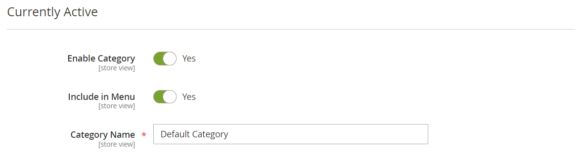
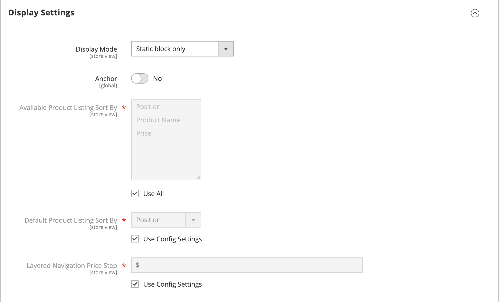
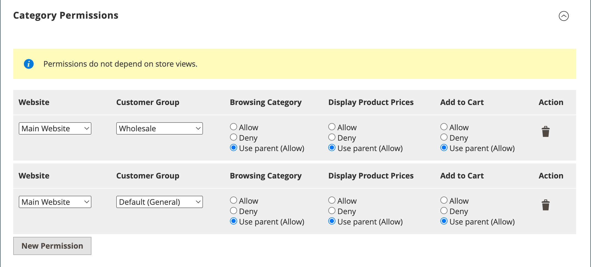
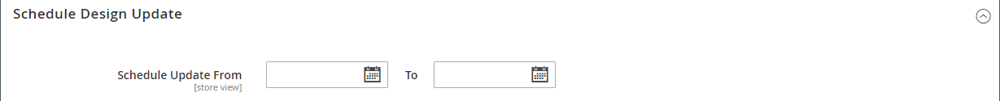

# カテゴリを作成

カタログのカテゴリ構造は、ルートが上部にある上下逆さまのツリーのようなものです。 ツリーの各セクションを展開したり折りたたんだりできます。 無効なカテゴリまたは非表示のカテゴリはグレー表示されます。 最初のレベル（[root](category-root.md)の下）のカテゴリは、通常、[&#x200B; メインメニュー](navigation-top.md)にオプションとして表示されます。 設定で設定されているメニューの最大深度に応じて、必要な数の追加サブカテゴリを作成できます。 カテゴリは、ツリー内の他の場所にドラッグ&amp;ドロップできます。 カテゴリ ID番号は、ページの上部にあるカテゴリ名の後ろに括弧で囲まれて表示されます。

複数の[&#x200B; ストア &#x200B;](../stores-purchase/stores.md#add-stores)を持つweb サイトの場合、各ストアに対して異なるルートカテゴリを作成し、[&#x200B; トップナビゲーション &#x200B;](navigation-top.md)に使用されるカテゴリのセットを定義できます。

{width="700" zoomable="yes"}

## ベストプラクティス

カテゴリを計画および作成する場合は、次のベストプラクティスを使用します。

### カテゴリ構造

メインメニューのカテゴリの構造は、顧客体験とパフォーマンスに影響を与える可能性があります。 ベストプラクティスとして、大まかなトップレベルのカテゴリを1つ特定し、同じ名前の他のカテゴリを使用しないようにする必要があります。 例えば、`Clothing/Kids`、`Shoes/Kids`、`Accessories/Kids`など、「子供」の複数のカテゴリを異なる部門で整理する代わりに、 最上位の親カテゴリ `Kids`を作成し、次の必要に応じてサブカテゴリを作成すると、より効率的になります。 カテゴリ構造に一貫性を持たせ、カタログ内のすべての製品タイプに同じアプローチを使用します。

### ビジネスルールと自動化

ビジネスロジックを使用してカタログページに類似のアイテムを表示する場合、またはパーソナライズされたプロモーション、自動プロセス、検索条件を設定する場合は、カテゴリ構造と使用可能な属性値を考慮します。 例えば、親カテゴリとして「polo」を指定すると、性別と年齢に関係のない商品が混在した結果が得られます。 ただし、ポロシャツの特定のサブカテゴリーと一致する場合、検索結果は絞り込まれ、特定の顧客にアピールする可能性が高まります。 特定の顧客をターゲットとする他の属性値と組み合わせることで、より具体的な結果を得ることができます。 特定のカテゴリーパスを参照する際に、フィルタリングして取得する必要がある製品の数を考慮します。 結果の違いは劇的なものになる可能性があります。 次のカテゴリパスから返される様々な結果を考えてみましょう。

- `[Category:  All Products/Shirts/Father's Day/Polos/Sale]`
- `[Category Path: Men/Shirts/Polos]`
- `[Child Category: Polos]`

次のようなカテゴリ分けの関係を明確に定義することが重要です。

- 親カテゴリ
- サブカテゴリ
- カテゴリーパス

関連するキーワードと属性も定義します。

- 可用性
- 販売価格
- ブランド
- サイズ
- カラー

## 手順1：カテゴリの作成

1. _管理者_ サイドバーで、**[!UICONTROL Catalog]** > **[!UICONTROL Categories]**&#x200B;に移動します。

1. **[!UICONTROL Store View]**&#x200B;を設定して、新しいカテゴリをどこで利用できるかを決定します。

1. カテゴリーツリーで、新しいカテゴリの親カテゴリを選択します。

   親は、新しいカテゴリの1 レベル上にあります。

   データを含まない最初から開始する場合、リストにルートである&#x200B;_デフォルト カテゴリ_&#x200B;と&#x200B;_サンプル カテゴリ_&#x200B;の2つのカテゴリしか含まれていない可能性があります

1. **[!UICONTROL Add Subcategory]**&#x200B;をクリックします。

## 手順2：基本情報を完了する

1. カテゴリをストアですぐに利用できるようにするには、**[!UICONTROL Enable Category]**&#x200B;を`Yes`に設定します。

1. [&#x200B; トップナビゲーション &#x200B;](navigation-top.md)にカテゴリを含めるには、**[!UICONTROL Include in Menu]**&#x200B;を`Yes`に設定します。

1. **[!UICONTROL Category Name]**&#x200B;を入力します。

   {width="500" zoomable="yes"}

1. **[!UICONTROL Save]**&#x200B;をクリックして続行します。

## 手順3：カテゴリのコンテンツを完了する

1. **[!UICONTROL Content]** セクションのを展開します。

   {width="600" zoomable="yes"}

1. ページの上部に&#x200B;**[!UICONTROL Category Image]**&#x200B;を表示するには、独自の画像をアップロードするか、[&#x200B; メディアストレージ &#x200B;](../content-design/media-storage.md)に存在する画像を使用します。

   - 独自の画像をアップロードするには、**[!UICONTROL Upload]**&#x200B;をクリックし、カテゴリを表す画像を選択します。

   - メディアストレージの画像を使用するには、**[!UICONTROL Select from Gallery]**&#x200B;をクリックし、カテゴリを表す画像を選択します。

   Media Gallery内で、[Adobe Stock Integration](../content-design/adobe-stock.md)を使用して、**[!UICONTROL Search Adobe Stock]**&#x200B;をクリックして適切な画像を検索することもできます。

   >[!NOTE]
   >
   > AEM Assetsを有効にしている場合は、[&#x200B; カテゴリの管理](../content-design/aem-assets-manage.md)を参照してください。

1. **[!UICONTROL Description]**&#x200B;の場合、カテゴリのランディングページに表示するテキストまたはその他のコンテンツを入力します。

   詳しくは、[&#x200B; カテゴリーコンテンツ &#x200B;](categories-content-settings.md)を参照してください。

1. カテゴリのランディングページにコンテンツブロックを含めるには、表示する&#x200B;**[!UICONTROL CMS Block]**&#x200B;を選択します。

1. **[!UICONTROL Save]**&#x200B;をクリックして続行します。

## 手順4：表示設定の完了

1. **[!UICONTROL Display Setting]** セクションのを展開します。

   {width="600" zoomable="yes"}

   これらのオプションについて詳しくは、これらのオプションについて詳しくは、[表示設定](categories-display-settings.md)を参照してください。

1. **[!UICONTROL Display Mode]**&#x200B;を次のいずれかに設定します：

   - `Products Only`
   - `Static Block Only`
   - `Static Block and Products`

1. カテゴリーページに&#x200B;_`Filter by Attribute`_セクションを含める場合は、**[!UICONTROL Anchor]**&#x200B;を`Yes`に設定します。

1. **[!UICONTROL Available Product Listing Sort By]** オプションで、顧客がリストを並べ替えるために使用できる1つ以上の使用可能な値を選択します。 この設定は、[!DNL Live Search] [製品リストページ ウィジェット &#x200B;](https://experienceleague.adobe.com/ja/docs/commerce/live-search/live-search-storefront/plp-styling)には適用されません。

   デフォルトでは、使用可能なすべての値が含まれます。 選択範囲を変更するには、**[!UICONTROL Use All]** チェックボックスの選択を解除します。 例えば、次の値を含めることができます。

   - `Position`
   - `Product Name`
   - `Price`

1. カテゴリのデフォルトの並べ替え順序を設定するには、**[!UICONTROL Default Product Listing Sort By]**&#x200B;値を選択します。 この設定は、[!DNL Live Search] [製品リストページ ウィジェット &#x200B;](https://experienceleague.adobe.com/ja/docs/commerce/live-search/live-search-storefront/plp-styling)には適用されません。

1. 既定の階層化ナビゲーション [価格ステップ &#x200B;](navigation-layered.md#configure-price-navigation)設定を変更するには、次の操作を行います。

   - 「**[!UICONTROL Use Config Settings]**」チェックボックスの選択を解除します。

   - 階層化されたナビゲーションの増分価格ステップとして使用する値を入力します。

1. **[!UICONTROL Save]**&#x200B;をクリックして続行します。

## 手順5：検索エンジン最適化の設定を完了する

1. **[!UICONTROL Search Engine Optimization Settings]** セクションのを展開します。

   {width="600" zoomable="yes"}

   これらのオプションについて詳しくは、[検索エンジン最適化](categories-search-engine-optimization.md)を参照してください。

1. カテゴリの次の[&#x200B; メタデータ &#x200B;](../merchandising-promotions/meta-data.md)を完了します。

   - [!UICONTROL Meta Title]
   - [!UICONTROL Meta Keywords]
   - [!UICONTROL Meta Description]

1. **[!UICONTROL Save]**&#x200B;をクリックして続行します。

## 手順6：カテゴリ内の製品の選択

1. **[!UICONTROL Products in Category]** セクションのを展開します。

   {width="600" zoomable="yes"}

   これらのオプションについて詳しくは、[&#x200B; カテゴリ内の製品](categories-product-assignments.md)を参照してください。

1. 必要に応じて、[&#x200B; フィルター](../getting-started/admin-grid-controls.md)を使用して製品を検索します。

   カテゴリに含まれていないすべてのレコードを表示するには、最初の列のレコード選択を`No`に設定し、**[!UICONTROL Search]**&#x200B;をクリックします。

1. 最初の列で、カテゴリに含める各製品のチェックボックスを選択します。

1. **[!UICONTROL Save]**&#x200B;をクリックして続行します。

## 手順7：カテゴリの権限の設定

{{ee-feature}}

1. **[!UICONTROL Category Permissions]** セクションのを展開します。

1. マルチサイト インストールの場合は、カテゴリ権限が適用される&#x200B;**[!UICONTROL Website]**&#x200B;を選択します。

1. カテゴリの権限が適用される&#x200B;**[!UICONTROL Customer Group]**&#x200B;を選択します。

    （[Adobe Commerce B2B](../b2b/introduction.md)のみ）必要に応じて、代わりに&#x200B;**[!UICONTROL Shared Catalog]**&#x200B;を選択できます。

1. 必要に応じて、次の権限を設定します。

   - [!UICONTROL Browsing Category]
   - [!UICONTROL Display Product Prices]
   - [!UICONTROL Add to Cart]

1. 別の権限ルールを追加するには、**[!UICONTROL New Permission]**&#x200B;をクリックして、プロセスを繰り返します。

   {width="600" zoomable="yes"}

## 手順8：デザイン設定を完了する

1. **[!UICONTROL Design]** セクションのを展開します。

1. 必要に応じてデザイン設定を行います。

   - （[Adobe Commerce B2B](../b2b/introduction.md)のみ）このカテゴリに親カテゴリのデザイン設定を適用するには、**[!UICONTROL Use Parent Category Settings]**&#x200B;を`Yes`に設定します。

   - カテゴリーページのデザインを変更するには、適用する&#x200B;**[!UICONTROL Theme]**&#x200B;を選択します。

   - カテゴリーページの列レイアウトを変更するには、適用する&#x200B;**[!UICONTROL Layout]**&#x200B;を選択します。

   - カスタムコードを入力するには、**[!UICONTROL Layout Update XML]** ボックスに有効なXML コードを入力します。

   - 商品ページに同じデザインを使用するには、**[!UICONTROL Apply Design to Products]**&#x200B;を`Yes`に設定します。

   {width="600" zoomable="yes"}

1.  （Magento Open Sourceのみ）特定の期間のデザインアップデートをスケジュールするには、次の操作を行います。

   - _[!UICONTROL Schedule Design Update]_&#x200B;セクションを展開します。

   - カレンダー（）を使用して、スケジュール更新&#x200B;**[!UICONTROL from]**&#x200B;および&#x200B;**[!UICONTROL to]**&#x200B;の日付を選択します。

   {width="600" zoomable="yes"}

1. 完了したら、**[!UICONTROL Save]**&#x200B;をクリックします。
