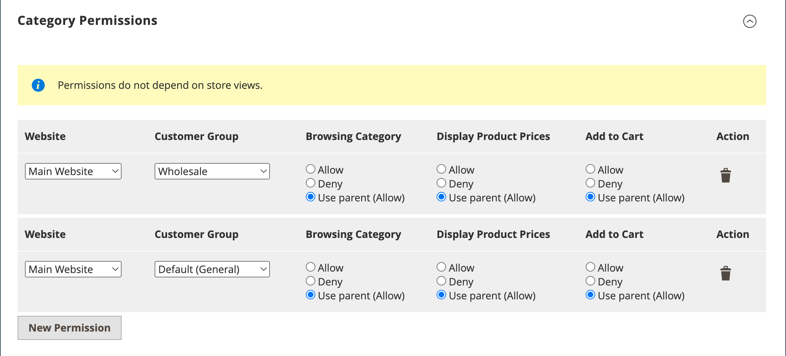

# カテゴリの作成

カタログのカテゴリ構造は逆さのツリーのようで、ルートが一番上に表示されます。 ツリーの各セクションは、展開および折りたたむことができます。 無効または非表示のカテゴリは灰色表示になります。 第 1 レベル ( [root](category-root.md)) は通常、 [メインメニュー](navigation-top.md). 設定で設定した最大メニュー深度に応じて、必要な数の追加のサブカテゴリを作成できます。 カテゴリは、ツリー内の他の場所にドラッグ&amp;ドロップできます。 カテゴリ ID 番号は、ページ上部のカテゴリ名の後の括弧内に表示されます。

複数の [ストア](../stores-purchase/stores.md#add-stores)を使用する場合は、 [上部ナビゲーション](navigation-top.md).

{width="700" zoomable="yes"}

## ベストプラクティス

カテゴリを計画および作成する際は、次のベストプラクティスを利用します。

### カテゴリ構造

メインメニューのカテゴリの構造は、顧客体験とパフォーマンスに影響を与える可能性があります。 ベストプラクティスとしては、1 つのオーバーカーチの最上位カテゴリを識別し、他のカテゴリに同じ名前を付けないようにする必要があります。 例えば、「子供」の複数のカテゴリを異なる部門で整理する代わりに、次のようにします。 `Clothing/Kids`, `Shoes/Kids`, `Accessories/Kids`. 最上位の親カテゴリを作成する方が効率的です。 `Kids`を作成し、必要に応じて下のサブカテゴリを作成します。 カテゴリ構造と一致し、カタログ内のすべてのプロダクトタイプで同じ方法を使用します。

### ビジネスルールと自動化

ビジネスロジックを使用してカタログページに類似した品目を表示したり、パーソナライズされたプロモーション、自動プロセスまたは検索条件を設定したりする際は、カテゴリ構造と使用可能な属性値を考慮します。 例えば、「polo」を親カテゴリとして指定した場合、結果に性別が混在し、年齢が不適切な製品が含まれる場合があります。 ただし、ポロシャツの特定のサブカテゴリに一致する場合は、結果がより狭くなり、特定の顧客にアピールする可能性が高くなります。 特定の顧客をターゲットにする他の属性値と組み合わせると、結果はさらに具体的になる場合があります。 特定のカテゴリパスを参照する際に、フィルタリングして取得する必要がある製品の数を考慮します。 結果の違いは劇的に起こり得る。 次のカテゴリパスで返される異なる結果を考慮します。

- `[Category:  All Products/Shirts/Father's Day/Polos/Sale]`
- `[Category Path: Men/Shirts/Polos]`
- `[Child Category: Polos]`

次のような分類の関係を明確に定義することが重要です。

- 親カテゴリ
- サブカテゴリ
- カテゴリパス

関連するキーワードおよび属性（例： ）も定義します。

- 可用性
- 販売価格
- ブランド
- サイズ
- カラー

## 手順 1：カテゴリの作成

1. 次の日： _管理者_ サイドバー、移動 **[!UICONTROL Catalog]** > **[!UICONTROL Categories]**.

1. 設定 **[!UICONTROL Store View]** をクリックして、新しいカテゴリを使用できる場所を決定します。

1. カテゴリツリーで、新しいカテゴリの親カテゴリを選択します。

   親は、新しいカテゴリの 1 レベル上です。

   データがない状態で最初から始める場合、リストには次の 2 つのカテゴリしか含まれていない可能性があります。 _デフォルトのカテゴリ_( ルートであり、 _カテゴリの例_

1. クリック **[!UICONTROL Add Subcategory]**.

## 手順 2：基本情報の入力

1. カテゴリをすぐにストアで使用できるようにする場合は、 **[!UICONTROL Enable Category]** から `Yes`.

1. カテゴリを [上部ナビゲーション](navigation-top.md)，設定 **[!UICONTROL Include in Menu]** から `Yes`.

1. 次を入力します。 **[!UICONTROL Category Name]**.

   {width="500" zoomable="yes"}

1. click **[!UICONTROL Save]** 続行します。

## 手順 3：カテゴリコンテンツの完了

1. 展開  の **[!UICONTROL Content]** 」セクションに入力します。

   {width="600" zoomable="yes"}

1. 次の手順で **[!UICONTROL Category Image]** ページの上部で、独自の画像をアップロードするか、 [メディアストレージ](../content-design/media-storage.md).

   - 独自の画像をアップロードするには、 **[!UICONTROL Upload]** カテゴリを表す画像を選択します。

   - メディアストレージの画像を使用するには、 **[!UICONTROL Select from Gallery]** カテゴリを表す画像を選択します。

   >[!NOTE]
   >
   >メディアギャラリー内では、 [Adobe Stock統合](../content-design/adobe-stock.md) をクリックして適切な画像を見つけるには、 **[!UICONTROL Search Adobe Stock]**.

1. の場合 **[!UICONTROL Description]**」をクリックし、カテゴリのランディングページに表示するテキストまたはその他のコンテンツを入力します。

   詳しくは、 [カテゴリコンテンツ](categories-content-settings.md).

1. コンテンツブロックをカテゴリのランディングページに含めるには、 **[!UICONTROL CMS Block]** 表示する

1. click **[!UICONTROL Save]** 続行します。

## 手順 4：表示設定を完了する

1. 展開  の **[!UICONTROL Display Setting]** 」セクションに入力します。

   {width="600" zoomable="yes"}

   これらのオプションの詳細については、「  [表示設定](categories-display-settings.md).

1. 設定 **[!UICONTROL Display Mode]** を次のいずれかに変更します。

   - `Products Only`
   - `Static Block Only`
   - `Static Block and Products`

1. カテゴリページに _`Filter by Attribute`_レイヤーナビゲーションのセクション、設定&#x200B;**[!UICONTROL Anchor]**から `Yes`.

1. の **[!UICONTROL Available Product Listing Sort By]** オプションを選択し、リストを並べ替えるために使用できる値を 1 つ以上選択します。

   デフォルトでは、使用可能なすべての値が含まれます。 選択を解除すると、 **[!UICONTROL Use All]** チェックボックスを使用して選択を変更します。 例えば、次の値が含まれます。

   - `Position`
   - `Product Name`
   - `Price`

1. カテゴリのデフォルトの並べ替え順を設定するには、 **[!UICONTROL Default Product Listing Sort By]** の値です。

1. 既定のレイヤーナビゲーションを変更するには [価格のステップ](navigation-layered.md#configure-price-navigation) を設定するには、次の操作を行います。

   - 選択を解除すると、 **[!UICONTROL Use Config Settings]** チェックボックス。

   - 階層化されたナビゲーションの増分価格ステップとして使用する値を入力します。

1. クリック **[!UICONTROL Save]** 続行します。

## 手順 5：検索エンジン最適化設定の入力

1. 展開  の **[!UICONTROL Search Engine Optimization Settings]** 」セクションに入力します。

   {width="600" zoomable="yes"}

   これらのオプションについて詳しくは、 [検索エンジンの最適化](categories-search-engine-optimization.md).

1. 次の手順を実行します。 [メタデータ](../merchandising-promotions/meta-data.md) カテゴリの場合：

   - [!UICONTROL Meta Title]
   - [!UICONTROL Meta Keywords]
   - [!UICONTROL Meta Description]

1. クリック **[!UICONTROL Save]** 続行します。

## 手順 6：カテゴリ内の製品の選択

1. 展開  の **[!UICONTROL Products in Category]** 」セクションに入力します。

   {width="600" zoomable="yes"}

   これらのオプションについて詳しくは、 [カテゴリ内の製品](categories-product-assignments.md).

1. 必要に応じて、 [フィルター](../getting-started/admin-grid-controls.md) をクリックして製品を検索します。

   まだカテゴリに含まれていないすべてのレコードを表示するには、最初の列のレコード選択をに設定します。 `No` をクリックします。 **[!UICONTROL Search]**.

1. 最初の列で、カテゴリに含める各製品のチェックボックスを選択します。

1. クリック **[!UICONTROL Save]** 続行します。

## 手順 7：カテゴリ権限の設定

{{ee-feature}}

1. 展開  の **[!UICONTROL Category Permissions]** 」セクションに入力します。

1. マルチサイトインストールの場合は、 **[!UICONTROL Website]** カテゴリ権限が適用される場所です。

1. を選択します。 **[!UICONTROL Customer Group]** カテゴリ権限が適用される場所です。

    ([Adobe Commerce用 B2B](../b2b/introduction.md) （必要に応じて）必要に応じて、 **[!UICONTROL Shared Catalog]** 代わりに、

1. 必要に応じて、次の権限を設定します。

   - [!UICONTROL Browsing Category]
   - [!UICONTROL Display Product Prices]
   - [!UICONTROL Add to Cart]

1. 別の権限ルールを追加するには、 **[!UICONTROL New Permission]** プロセスを繰り返します。

   {width="600" zoomable="yes"}

## 手順 8：デザイン設定の完了

1. 展開  の **[!UICONTROL Design]** 」セクションに入力します。

1. 必要に応じてデザイン設定を指定します。

   - ([Adobe Commerce用 B2B](../b2b/introduction.md) （ただし）親カテゴリのデザイン設定をこのカテゴリに適用するには、 **[!UICONTROL Use Parent Category Settings]** から `Yes`.

   - カテゴリページのデザインを変更するには、 **[!UICONTROL Theme]** 適用する

   - カテゴリページの列レイアウトを変更するには、 **[!UICONTROL Layout]** 適用する

   - カスタムコードを入力するには、 **[!UICONTROL Layout Update XML]** ボックス。

   - 製品ページで同じデザインを使用するには、 **[!UICONTROL Apply Design to Products]** から `Yes`.

   {width="600" zoomable="yes"}

1.  (Magento Open Sourceのみ ) 特定の期間にデザインの更新をスケジュールするには、次の手順を実行します。

   - を展開します。 _[!UICONTROL Schedule Design Update]_」セクションに入力します。

   - カレンダー () をクリックして、「更新をスケジュール」を選択します。 **[!UICONTROL from]** および **[!UICONTROL to]** 日付。

   {width="600" zoomable="yes"}

1. 完了したら、「 **[!UICONTROL Save]**.
