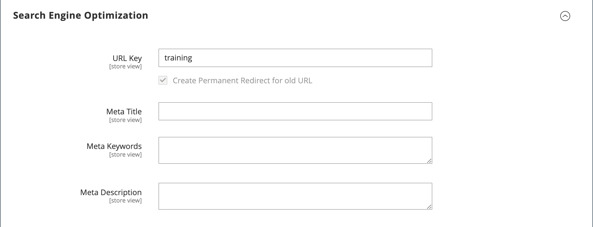

# カテゴリの作成

カタログのカテゴリ構造は、ルートが上に来た、逆さまになったツリーのようなものです。 ツリーの各セクションは、展開したり折りたたんだりできます。 無効なカテゴリや非表示のカテゴリはグレー表示されます。 第 1 レベル（「ルート [ の下 ](category-root.md)）のカテゴリは、通常、[ メインメニュー ](navigation-top.md) にオプションとして表示されます。 設定で設定されたメニューの最大深度に応じて、必要な数のサブカテゴリを追加できます。 カテゴリは、ツリー内の他の場所にドラッグ アンド ドロップできます。 カテゴリ ID 番号は、ページ上部のカテゴリ名の後の括弧内に表示されます。

複数の [ ストア ](../stores-purchase/stores.md#add-stores) を持つ web サイトの場合、ストアごとに異なるルートカテゴリを作成できます。このルートカテゴリは、[ トップナビゲーション ](navigation-top.md) に使用するカテゴリのセットを定義します。

{width="700" zoomable="yes"}

## ベストプラクティス

カテゴリを計画および作成する際は、次のベストプラクティスを使用します。

### カテゴリ構造

メインメニューのカテゴリの構造は、顧客体験とパフォーマンスに影響を与える可能性があります。 ベストプラクティスとして、1 つの包括的な最上位カテゴリを識別し、同じ名前の他のカテゴリを含めないようにする必要があります。 例えば、「子供」の複数のカテゴリを、`Clothing/Kids`、`Shoes/Kids`、`Accessories/Kids` など異なる部門の下で整理するのではなく、 最上位の親カテゴリを `Kids` にして、必要に応じて以下のサブカテゴリを作成すると、より効率的です。 カテゴリ構造に一貫性を持ち、カタログ内のすべての製品タイプに同じアプローチを使用します。

### ビジネスルールと自動処理

ビジネスロジックを使用してカタログページに類似の項目を表示したり、パーソナライズされたプロモーション、自動プロセスまたは検索条件を設定する場合は、カテゴリ構造と使用可能な属性値を考慮します。 例えば、親カテゴリとして「polo」を指定した場合、性別が混在した商品や年齢に適していない商品が結果に含まれる可能性があります。 ただし、ポロシャツの特定のサブカテゴリに一致する場合、結果はより狭く、特定の顧客にアピールする可能性が高くなります。 特定の顧客をターゲットとする他の属性値と組み合わせると、結果をさらに具体的にすることができます。 特定のカテゴリパスを参照する際に、フィルタリングして取得する必要がある製品の数を考慮します。 結果の違いは劇的になる場合があります。 次のカテゴリパスから返される様々な結果を考えてみましょう。

- `[Category:  All Products/Shirts/Father's Day/Polos/Sale]`
- `[Category Path: Men/Shirts/Polos]`
- `[Child Category: Polos]`

次のようなカテゴリ関係を明確に定義することが重要です。

- 親カテゴリ
- サブカテゴリ
- カテゴリパス

また、次のような関連するキーワードおよび属性も定義します。

- 使用可否
- 販売価格
- ブランド
- サイズ
- 色

## 手順 1：カテゴリの作成

1. _管理者_ サイドバーで、**[!UICONTROL Catalog]**/**[!UICONTROL Categories]** に移動します。

1. **[!UICONTROL Store View]** を設定して、新しいカテゴリを使用できる場所を決定します。

1. カテゴリ ツリーで、新しいカテゴリの親カテゴリを選択します。

   親は、新しいカテゴリの 1 レベル上にあります。

   データを使用せずに最初から開始する場合は、リストには、ルートである _デフォルトのカテゴリ_ と _例カテゴリ_ の 2 つのカテゴリしかない可能性があります

1. 「**[!UICONTROL Add Subcategory]**」をクリックします。

## 手順 2：基本情報を入力する

1. カテゴリをストアですぐに使用できるようにする場合は、**[!UICONTROL Enable Category]** を `Yes` に設定します。

1. カテゴリを [ 上部ナビゲーション ](navigation-top.md) に含めるには、「**[!UICONTROL Include in Menu]**」を「`Yes`」に設定します。

1. **[!UICONTROL Category Name]** を入力します。

   {width="500" zoomable="yes"}

1. 「**[!UICONTROL Save]**」をクリックして続行します。

## 手順 3：カテゴリコンテンツの完了

1. 「」を展開し、「**[!UICONTROL Content]**」セクションを展開します。

   {width="600" zoomable="yes"}

1. ページの上部に **[!UICONTROL Category Image]** を表示するには、独自の画像をアップロードするか、[ メディアストレージ ](../content-design/media-storage.md) 内の画像を使用します。

   - 独自の画像をアップロードするには、「**[!UICONTROL Upload]**」をクリックし、カテゴリを表す画像を選択します。

   - メディア ストレージの画像を使用するには、[**[!UICONTROL Select from Gallery]**] をクリックし、カテゴリを表す画像を選択します。

   >[!NOTE]
   >
   >Media Gallery 内では、[Adobe Stock Integration](../content-design/adobe-stock.md) を使用して、**[!UICONTROL Search Adobe Stock]** をクリックして適切な画像を見つけることもできます。

1. **[!UICONTROL Description]**：カテゴリランディングページに表示するテキストまたはその他のコンテンツを入力します。

   詳しくは、[ カテゴリコンテンツ ](categories-content-settings.md) を参照してください。

1. カテゴリランディングページにコンテンツブロックを含めるには、表示する **[!UICONTROL CMS Block]** を選択します。

1. 「**[!UICONTROL Save]**」をクリックして続行します。

## 手順 4：表示設定の完了

1. 「」を展開し、「**[!UICONTROL Display Setting]**」セクションを展開します。

   {width="600" zoomable="yes"}

   これらのオプションの詳細については、「[ 表示設定 ](categories-display-settings.md)」を参照してください。

1. **[!UICONTROL Display Mode]** を次のいずれかに設定します。

   - `Products Only`
   - `Static Block Only`
   - `Static Block and Products`

1. カテゴリページにレイヤー化されたナビゲーションの _`Filter by Attribute`_セクションを含める場合は、「**[!UICONTROL Anchor]**」を「`Yes`」に設定します。

1. **[!UICONTROL Available Product Listing Sort By]** のオプションでは、顧客がリストを並べ替えるために使用できる値を 1 つ以上選択します。 この設定は [!DNL Live Search] 製品一覧ページウィジェット [ には適用され ](https://experienceleague.adobe.com/en/docs/commerce-merchant-services/live-search/live-search-storefront/plp-styling) せん。

   デフォルトでは、使用可能なすべての値が含まれます。 「**[!UICONTROL Use All]**」チェックボックスの選択を解除して、選択内容を変更します。 例えば、次のような値が含まれます。

   - `Position`
   - `Product Name`
   - `Price`

1. カテゴリの既定の並べ替え順を設定するには、**[!UICONTROL Default Product Listing Sort By]** の値を選択します。 この設定は [!DNL Live Search] 製品一覧ページウィジェット [ には適用され ](https://experienceleague.adobe.com/en/docs/commerce-merchant-services/live-search/live-search-storefront/plp-styling) せん。

1. デフォルトのレイヤー化されたナビゲーション [ 価格ステップ ](navigation-layered.md#configure-price-navigation) 設定を変更するには、次の手順を実行します。

   - 「**[!UICONTROL Use Config Settings]**」チェックボックスの選択を解除します。

   - レイヤーナビゲーションの増分価格ステップとして使用する値を入力します。

1. 「**[!UICONTROL Save]**」をクリックして続行します。

## 手順 5：検索エンジンの最適化設定を完了する

1. 「」を展開し、「**[!UICONTROL Search Engine Optimization Settings]**」セクションを展開します。

   {width="600" zoomable="yes"}

   これらのオプションについて詳しくは、[ 検索エンジンの最適化 ](categories-search-engine-optimization.md) を参照してください。

1. カテゴリに次の [ メタデータ ](../merchandising-promotions/meta-data.md) を入力します。

   - [!UICONTROL Meta Title]
   - [!UICONTROL Meta Keywords]
   - [!UICONTROL Meta Description]

1. 「**[!UICONTROL Save]**」をクリックして続行します。

## 手順 6：カテゴリ内の製品の選択

1. 「」を展開し、「**[!UICONTROL Products in Category]**」セクションを展開します。

   {width="600" zoomable="yes"}

   これらのオプションについて詳しくは、[ カテゴリの製品 ](categories-product-assignments.md) を参照してください。

1. 必要に応じて、[ フィルター ](../getting-started/admin-grid-controls.md) を使用して製品を検索します。

   カテゴリにまだ含まれていないすべてのレコードを表示するには、最初の列のレコード選択を `No` に設定し、「**[!UICONTROL Search]**」をクリックします。

1. 最初の列で、カテゴリに含める各製品のチェックボックスを選択します。

1. 「**[!UICONTROL Save]**」をクリックして続行します。

## 手順 7：カテゴリ権限の設定

{{ee-feature}}

1. 「」を展開し、「**[!UICONTROL Category Permissions]**」セクションを展開します。

1. マルチサイトインストールの場合は、カテゴリ権限が適用される **[!UICONTROL Website]** を選択します。

1. カテゴリの権限が適用される **[!UICONTROL Customer Group]** を選択します。

    （[Adobe Commerce B2B](../b2b/introduction.md) のみ）必要に応じて、代わりに **[!UICONTROL Shared Catalog]** を選択できます。

1. 必要に応じて、次の権限を設定します。

   - [!UICONTROL Browsing Category]
   - [!UICONTROL Display Product Prices]
   - [!UICONTROL Add to Cart]

1. 別の権限ルールを追加するには、「**[!UICONTROL New Permission]**」をクリックしてプロセスを繰り返します。

   {width="600" zoomable="yes"}

## 手順 8：デザイン設定を完了する

1. 「」を展開し、「**[!UICONTROL Design]**」セクションを展開します。

1. 必要に応じてデザイン設定を指定します。

   - （[Adobe Commerce B2B](../b2b/introduction.md) のみ）このカテゴリに親カテゴリのデザイン設定を適用するには、**[!UICONTROL Use Parent Category Settings]** を `Yes` に設定します。

   - カテゴリページのデザインを変更するには、適用する **[!UICONTROL Theme]** を選択します。

   - カテゴリページの列のレイアウトを変更するには、適用する **[!UICONTROL Layout]** を選択します。

   - カスタムコードを入力するには、有効な XML コードを **[!UICONTROL Layout Update XML]** ボックスに入力します。

   - 製品ページに同じデザインを使用するには、**[!UICONTROL Apply Design to Products]** を `Yes` に設定します。

   {width="600" zoomable="yes"}

1.  （Magento Open Sourceのみ）特定の期間に対してデザインの更新をスケジュールするには、次の操作を行います。

   - 「_[!UICONTROL Schedule Design Update]_」セクションを展開します。

   - カレンダー（）を使用して、スケジュールの更新の **[!UICONTROL from]** と **[!UICONTROL to]** の日付を選択します。

   {width="600" zoomable="yes"}

1. 完了したら、「**[!UICONTROL Save]**」をクリックします。
