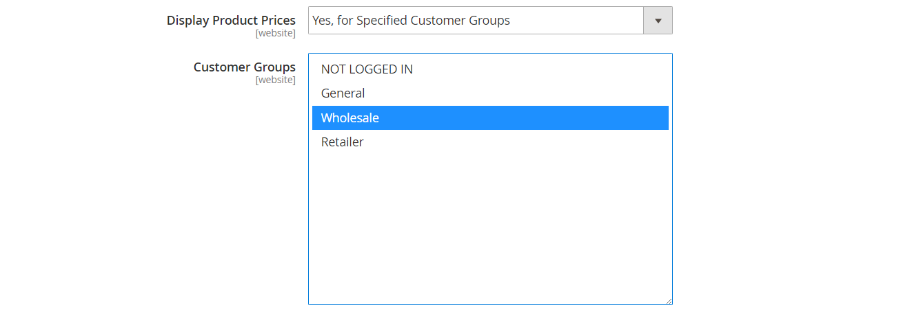
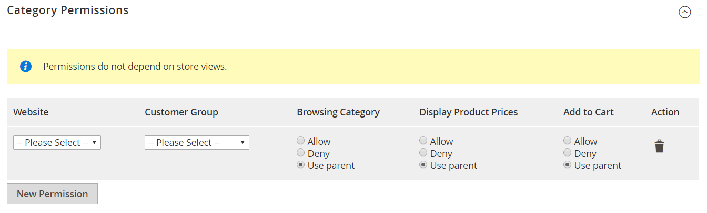

# カテゴリ権限

{{ee-feature}}

カテゴリへのアクセスは、特定の顧客グループに限定することも、完全に制限することもできます。 製品価格の表示を制御し、買い物かごに製品を追加できる顧客グループを決定して、ランディングページを指定できます。

>[!NOTE]
>
>カテゴリ権限にはグローバルな範囲があり、有効にすると、個々の権限に従って各カテゴリへのアクセスが制限されます。 デフォルトでは、カテゴリ権限は有効になっていません。

例えば、卸売顧客にのみ販売する場合は、誰でもカタログを参照できるように設定し、内の買い物客にのみ価格を表示して購入を許可することができます _卸売_ 顧客グループ。 次の例では、ログインユーザーのみが「コレクション」カテゴリにアクセスできます。 ゲストの場合、「コレクション」オプションはメインメニューに表示されません。

{width="600" zoomable="yes"}

有効になっている場合、新しい _[!UICONTROL Category Permissions]_「カテゴリ」ページにセクションが表示され、各カテゴリに必要なアクセスを適用できます。 様々な web サイトや顧客グループのカテゴリごとに、複数の権限ルールを追加できます。

## 手順 1：カテゴリ権限の設定

>[!IMPORTANT]
>
>既存のすべて [グループ権限設定](../configuration-reference/catalog/catalog.md#category-permissions) は無視されます **_all_** 次の場合にカタログのカテゴリ **_[!UICONTROL Shared Catalog]_** この機能は有効です。 [!UICONTROL Shared Catalog] カタログが有効な場合、カタログのすべてのカテゴリ権限を完全に制御します。

1. 日 _Admin_ サイドバー、に移動 **[!UICONTROL Stores]** > _[!UICONTROL Settings]_>**[!UICONTROL Configuration]**.

1. 左側のパネルで、を展開します **[!UICONTROL Catalog]** を選択します **[!UICONTROL Catalog]** その下に。

1. を展開  この **[!UICONTROL Category Permissions]** セクション。

   {width="600" zoomable="yes"}

   これらのオプションの詳細なリストについては、を参照してください [カテゴリ権限](../configuration-reference/catalog/catalog.md#category-permissions) が含まれる _設定リファレンス_.

1. を設定 **[!UICONTROL Enable]** 対象： `Yes`.

1. ストアで許可または制限する内容に応じて、他のオプションを入力します（次の節を参照）。

1. 完了したら、 **[!UICONTROL Save Config]**.

1. キャッシュを更新するように求められたら、 **[!UICONTROL Cache Management]** システムメッセージのリンクをクリックし、指示に従ってキャッシュを更新します。

### [!UICONTROL Allow Browsing Category]

このオプションは、 [web サイト](../getting-started/websites-stores-views.md).

のメンバーを許可するには **_特定の顧客グループ_** カテゴリ製品を参照するには、次の手順を実行します。

1. を設定 **[!UICONTROL Allow Browsing Category]** 対象： `Specified Customer Groups`.

1. が含まれる **[!UICONTROL Customer Groups]** ボックスで、カテゴリ内の製品を参照できる各グループを選択します。

   複数のグループを選択するには、Ctrl キー（PC）または Command キー（Mac）を押しながら各グループをクリックします。

   {width="600" zoomable="yes"}

終了 **_アクセスの制限とランディングページへのリダイレクト_**、次の手順を実行します。

1. を設定 **[!UICONTROL Allow Browsing Category]** 対象： `No, Redirect to Landing Page`.

1. を選択します。 **[!UICONTROL Landing Page]** 訪問者のリダイレクト先。

   {width="600" zoomable="yes"}

   >[!NOTE]
   >
   >ただし、 _[!UICONTROL Allow Browsing Category]_設定は、web サイト内のすべてのカテゴリに適用され、ストア表示ごとに異なるランディングページを設定できます。

### [!UICONTROL Display Product Prices]

このオプションは、 [web サイト](../getting-started/websites-stores-views.md).

次のメンバーのみを許可するには： **_特定の顧客グループ_** カテゴリの製品の価格を確認するには、次の操作を行います。

1. を設定 **[!UICONTROL Display Product Prices]** 対象： `Yes, for Specified Customer Groups`.

1. が含まれる **[!UICONTROL Customer Groups]** ボックスで、カテゴリ内の製品の価格を表示できる各グループを選択します。

   複数のグループを選択するには、Ctrl キー（PC）または Command キー（Mac）を押しながら各グループをクリックします）。

   {width="600" zoomable="yes"}

### [!UICONTROL Allow Adding to Cart]

このオプションは、 [web サイト](../getting-started/websites-stores-views.md).

次のメンバーのみを許可するには： **_特定の顧客グループ_** カテゴリ製品を買い物かごに入れるには、次の手順を実行します。

1. を設定 **[!UICONTROL Allow Adding to Cart]** 対象： `Yes, for Specified Customer Groups`.

1. が含まれる **[!UICONTROL Customer Groups]** ボックスで、カテゴリから買い物かごに製品を追加できる各グループを選択します。

   複数のグループを選択するには、Ctrl キー（PC）または Command キー（Mac）を押しながら各グループをクリックします。

   {width="600" zoomable="yes"}

### [!UICONTROL Disallow Catalog Search]

特定の顧客グループのメンバーがカタログ検索を使用できないようにするには、このオプションを設定します。 以下のすべてのカテゴリに適用されます [web サイト](../getting-started/websites-stores-views.md).

- 許可する **_ログインした顧客のみ_** カタログ検索を使用するには、次を選択します `NOT LOGGED IN`.

- 許可する **_特定顧客グループのみ_** カタログ検索を使用するには、カテゴリ検索から除外する各グループを選択します。

  複数のグループを選択するには、Ctrl キー（PC）または Command キー（Mac）を押しながら各グループをクリックします。

  {width="600" zoomable="yes"}

## 手順 2：カテゴリ権限の適用

1. 日 _Admin_ サイドバー、に移動 **[!UICONTROL Catalog]** > **[!UICONTROL Categories]**.

1. カテゴリ ツリーで、ターゲット カテゴリを選択します。

1. を展開  **[!UICONTROL Category Permissions]** ページで以下を行います。

   - 権限ルールを作成するには、 **[!UICONTROL New Permission]**.

     {width="600" zoomable="yes"}

   - 該当するを選択 **[!UICONTROL Website]** および **[!UICONTROL Customer Group]**.

   - 必要に応じて、個々の権限を設定します。

   >[!NOTE]
   >
   >条件 `Browsing Category` = `Deny` 権限はどの親カテゴリにも設定されているので、には表示されません [パンくずリスト](navigation-breadcrumb-trail.md) 子カテゴリページ

1. 完了したら、 **[!UICONTROL Save]**.

>[!NOTE]
>
>存在する場合 **_許可_** 権限は `Root Category`を選択すると、これらの権限は内のすべてのサブカテゴリとすべての製品に自動的に適用されます `Catalog`. 複数のカテゴリに割り当てられている製品に、 **_許可_** 少なくとも 1 つのカテゴリに対する権限。自動的に同じ権限が設定されます **_許可_** 割り当てられたすべてのカテゴリに対する権限。
