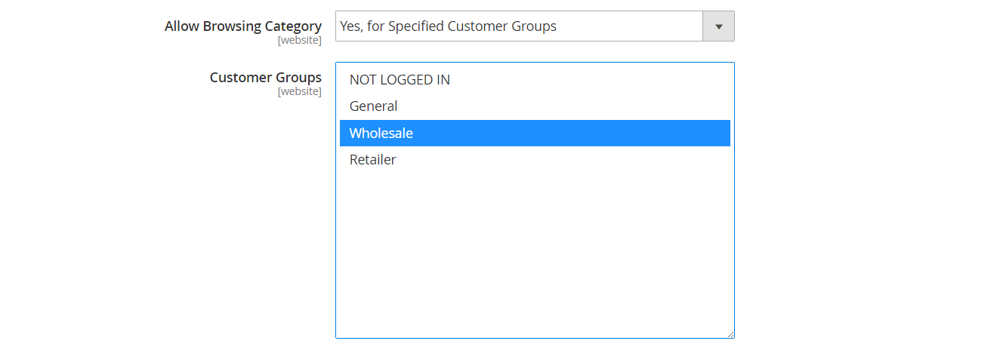
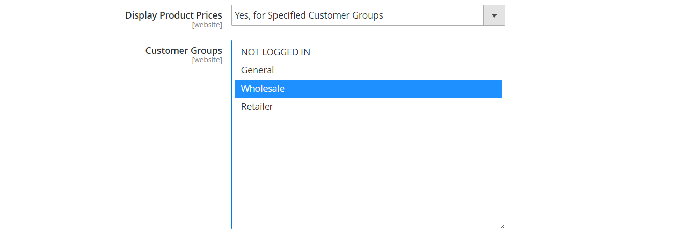
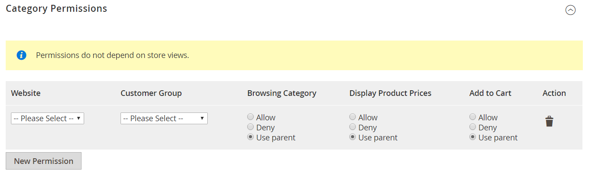

# カテゴリの権限

{{ee-feature}}

カテゴリへのアクセスは、特定の顧客グループに制限するか、完全に制限することができます。 商品価格の表示を制御し、カートに商品を追加できる顧客グループを決定し、ランディングページを指定できます。

>[!NOTE]
>
>カテゴリ権限にはグローバルな範囲があり、有効にすると、個々の権限に応じて各カテゴリへのアクセスが制限されます。 デフォルトでは、カテゴリ権限は有効になっていません。

例えば、卸売顧客のみに販売する場合は、誰でもカタログを閲覧できますが、価格を表示し、_卸売_&#x200B;顧客グループの買い物客に対してのみ購入を許可できます。 次の例では、ログインしたユーザーのみが「コレクション」カテゴリにアクセスできます。 ゲストの場合、「コレクション」オプションはメインメニューに表示されません。

{width="600" zoomable="yes"}

有効にすると、各カテゴリに必要なアクセス権を適用できる新しい&#x200B;_[!UICONTROL Category Permissions]_&#x200B;セクションがカテゴリーページに表示されます。 異なるweb サイトや顧客グループの各カテゴリに複数の権限ルールを追加できます。

## 手順1：カテゴリ権限の設定

>[!IMPORTANT]
>
>**_[!UICONTROL Shared Catalog]_**&#x200B;機能が有効になっている場合、既存の[&#x200B; グループ権限設定](../configuration-reference/catalog/catalog.md#category-permissions)はすべて、カタログ内の&#x200B;**_すべての_** カテゴリーで無視されます。 [!UICONTROL Shared Catalog]は、カタログが有効になっている場合に、カタログ内のすべてのカテゴリ権限を完全に制御します。

1. _管理者_ サイドバーで、**[!UICONTROL Stores]** > _[!UICONTROL Settings]_>**[!UICONTROL Configuration]**&#x200B;に移動します。

1. 左側のパネルで「**[!UICONTROL Catalog]**」を展開し、下の「**[!UICONTROL Catalog]**」を選択します。

1. **[!UICONTROL Category Permissions]** セクションのを展開します。

   {width="600" zoomable="yes"}

   これらのオプションの詳細なリストについては、_設定リファレンス_&#x200B;の[&#x200B; カテゴリ権限](../configuration-reference/catalog/catalog.md#category-permissions)を参照してください。

1. **[!UICONTROL Enable]**&#x200B;を`Yes`に設定します。

1. ストアで許可または制限する内容に応じて、その他のオプションを完了します（次のセクションを参照）。

1. 完了したら、**[!UICONTROL Save Config]**&#x200B;をクリックします。

1. キャッシュの更新を求めるメッセージが表示されたら、システムメッセージの&#x200B;**[!UICONTROL Cache Management]** リンクをクリックし、指示に従ってキャッシュを更新します。

### [!UICONTROL Allow Browsing Category]

このオプションは、[web サイト &#x200B;](../getting-started/websites-stores-views.md)のすべてのカテゴリに適用されます。

**_特定の顧客グループ_**&#x200B;のメンバーがカテゴリ製品を参照できるようにするには、次の操作を行います。

1. **[!UICONTROL Allow Browsing Category]**&#x200B;を`Specified Customer Groups`に設定します。

1. **[!UICONTROL Customer Groups]** ボックスで、カテゴリ内の製品を参照できる各グループを選択します。

   複数のグループを選択するには、Ctrl キー（PC）またはCommand キー（Mac）を押しながら各グループをクリックします。

   {width="600" zoomable="yes"}

**_アクセスを制限し、ランディングページ_**&#x200B;にリダイレクトするには、次の操作を行います。

1. **[!UICONTROL Allow Browsing Category]**&#x200B;を`No, Redirect to Landing Page`に設定します。

1. 訪問者がリダイレクトされる&#x200B;**[!UICONTROL Landing Page]**&#x200B;を選択します。

   {width="600" zoomable="yes"}

   >[!NOTE]
   >
   >_[!UICONTROL Allow Browsing Category]_&#x200B;設定は、web サイト内のすべてのカテゴリに適用されますが、ストアビューごとに異なるランディングページを設定できます。

### [!UICONTROL Display Product Prices]

このオプションは、[web サイト &#x200B;](../getting-started/websites-stores-views.md)のすべてのカテゴリに適用されます。

**_特定の顧客グループ_**&#x200B;のメンバーのみがカテゴリ内の製品の価格を表示できるようにするには、次の操作を行います。

1. **[!UICONTROL Display Product Prices]**&#x200B;を`Yes, for Specified Customer Groups`に設定します。

1. **[!UICONTROL Customer Groups]** ボックスで、カテゴリ内の製品の価格を表示できる各グループを選択します。

   複数のグループを選択するには、Ctrl キー（PC）またはCommand キー（Mac）を押しながら各グループをクリックします。

   {width="600" zoomable="yes"}

### [!UICONTROL Allow Adding to Cart]

このオプションは、[web サイト &#x200B;](../getting-started/websites-stores-views.md)のすべてのカテゴリに適用されます。

**_特定の顧客グループ_**&#x200B;のメンバーのみがカテゴリ製品をショッピングカートに入れることを許可するには、次の操作を行います。

1. **[!UICONTROL Allow Adding to Cart]**&#x200B;を`Yes, for Specified Customer Groups`に設定します。

1. **[!UICONTROL Customer Groups]** ボックスで、カテゴリから商品をカートに追加できる各グループを選択します。

   複数のグループを選択するには、Ctrl キー（PC）またはCommand キー（Mac）を押しながら各グループをクリックします。

   {width="600" zoomable="yes"}

### [!UICONTROL Disallow Catalog Search]

このオプションを設定すると、特定の顧客グループのメンバーがカタログ検索を使用できなくなります。 これは、[web サイト &#x200B;](../getting-started/websites-stores-views.md)のすべてのカテゴリに適用されます。

- **_ログインしたお客様_**&#x200B;のみがカタログ検索を使用できるようにするには、`NOT LOGGED IN`を選択します。

- **_特定の顧客グループ_**&#x200B;のみがカタログ検索を使用できるようにするには、カテゴリ検索を使用して除外する各グループを選択します。

  複数のグループを選択するには、Ctrl キー（PC）またはCommand キー（Mac）を押しながら各グループをクリックします。

  {width="600" zoomable="yes"}

## 手順2：カテゴリ権限の適用

1. _管理者_ サイドバーで、**[!UICONTROL Catalog]** > **[!UICONTROL Categories]**&#x200B;に移動します。

1. カテゴリーツリーで、ターゲットカテゴリを選択します。

1. ページ上の **[!UICONTROL Category Permissions]**&#x200B;を展開し、次の操作を行います。

   - 権限ルールを作成するには、**[!UICONTROL New Permission]**&#x200B;をクリックします。

     {width="600" zoomable="yes"}

   - 該当する&#x200B;**[!UICONTROL Website]**&#x200B;と&#x200B;**[!UICONTROL Customer Group]**&#x200B;を選択します。

   - 必要に応じて個別の権限を設定します。

   >[!NOTE]
   >
   >`Browsing Category` = `Deny`権限が任意の親カテゴリに設定されている場合、子カテゴリーページの[&#x200B; パンくずリスト &#x200B;](navigation-breadcrumb-trail.md)には表示されません。

1. 完了したら、**[!UICONTROL Save]**&#x200B;をクリックします。

>[!NOTE]
>
>**_許可_**&#x200B;権限が`Root Category`に設定されている場合、これらの権限は、`Catalog`内のすべてのサブカテゴリとすべての製品に自動的に適用されます。 いずれかの製品が複数のカテゴリに割り当てられ、少なくとも1つのカテゴリに&#x200B;**_Allow_**&#x200B;権限がある場合、割り当てられたすべてのカテゴリに対して同じ&#x200B;**_Allow_**&#x200B;権限が自動的に付与されます。
