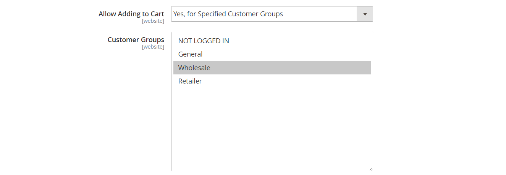

# カテゴリ権限

{{ee-feature}}

カテゴリへのアクセスは、特定の顧客グループに限定することも、完全に制限することもできます。 製品価格の表示を制御し、買い物かごに製品を追加できる顧客グループを決定して、ランディングページを指定できます。

>[!NOTE]
>
>カテゴリ権限にはグローバルな範囲があり、有効にすると、個々の権限に従って各カテゴリへのアクセスが制限されます。 デフォルトでは、カテゴリ権限は有効になっていません。

例えば、卸売の顧客にのみ販売する場合、誰でもカタログを参照できるように設定し、_卸売_ 顧客グループの買い物客にのみ価格を表示して購入を許可することができます。 次の例では、ログインユーザーのみが「コレクション」カテゴリにアクセスできます。 ゲストの場合、「コレクション」オプションはメインメニューに表示されません。

{width="600" zoomable="yes"}

有効にすると、新しい「_[!UICONTROL Category Permissions]_」セクションがカテゴリ ページに表示され、各カテゴリに必要なアクセスを適用できます。 様々な web サイトや顧客グループのカテゴリごとに、複数の権限ルールを追加できます。

## 手順 1：カテゴリ権限の設定

>[!IMPORTANT]
>
>**_[!UICONTROL Shared Catalog]_** 機能が有効な場合、既存のすべての [ グループ権限設定 ](../configuration-reference/catalog/catalog.md#category-permissions) は、カタログ内の **_すべて_** カテゴリで無視されます。 カタログ [!UICONTROL Shared Catalog] 有効にすると、カタログのすべてのカテゴリ権限が完全に制御されます。

1. _管理者_ サイドバーで、**[!UICONTROL Stores]**/_[!UICONTROL Settings]_/**[!UICONTROL Configuration]**&#x200B;に移動します。

1. 左側のパネルで「**[!UICONTROL Catalog]**」を展開し、その下の「**[!UICONTROL Catalog]**」を選択します。

1. 「」を展開し、「**[!UICONTROL Category Permissions]**」セクションを展開します。

   {width="600" zoomable="yes"}

   これらのオプションの詳細なリストについては、[ 設定リファレンス ](../configuration-reference/catalog/catalog.md#category-permissions) の _カテゴリ権限_ を参照してください。

1. **[!UICONTROL Enable]** を `Yes` に設定します。

1. ストアで許可または制限する内容に応じて、他のオプションを入力します（次の節を参照）。

1. 完了したら、「**[!UICONTROL Save Config]**」をクリックします。

1. キャッシュを更新するように求めるプロンプトが表示されたら、システムメッセージの **[!UICONTROL Cache Management]** リンクをクリックし、指示に従ってキャッシュを更新します。

### [!UICONTROL Allow Browsing Category]

このオプションは、[web サイト ](../getting-started/websites-stores-views.md) のすべてのカテゴリに適用されます。

**_特定の顧客グループ_** のメンバーがカテゴリ製品を参照できるようにするには、次の手順を実行します。

1. **[!UICONTROL Allow Browsing Category]** を `Specified Customer Groups` に設定します。

1. **[!UICONTROL Customer Groups]** ボックスで、カテゴリ内の製品を参照できる各グループを選択します。

   複数のグループを選択するには、Ctrl キー（PC）または Command キー（Mac）を押しながら各グループをクリックします。

   {width="600" zoomable="yes"}

**_ランディングページへのアクセスを制限してリダイレクトする_** には、次の手順を実行します。

1. **[!UICONTROL Allow Browsing Category]** を `No, Redirect to Landing Page` に設定します。

1. 訪問者のリダイレクト先 **[!UICONTROL Landing Page]** を選択する。

   {width="600" zoomable="yes"}

   >[!NOTE]
   >
   >_[!UICONTROL Allow Browsing Category]_&#x200B;の設定は web サイトのすべてのカテゴリに適用されますが、ストア表示ごとに異なるランディングページを設定することもできます。

### [!UICONTROL Display Product Prices]

このオプションは、[web サイト ](../getting-started/websites-stores-views.md) のすべてのカテゴリに適用されます。

**_特定の顧客グループ_** のメンバーのみがカテゴリ内の製品の価格を閲覧できるようにするには、次の操作を行います。

1. **[!UICONTROL Display Product Prices]** を `Yes, for Specified Customer Groups` に設定します。

1. **[!UICONTROL Customer Groups]** のボックスで、カテゴリ内の製品の価格を表示できる各グループを選択します。

   複数のグループを選択するには、Ctrl キー（PC）または Command キー（Mac）を押しながら各グループをクリックします）。

   {width="600" zoomable="yes"}

### [!UICONTROL Allow Adding to Cart]

このオプションは、[web サイト ](../getting-started/websites-stores-views.md) のすべてのカテゴリに適用されます。

**_特定の顧客グループ_** のメンバーのみがカテゴリ製品を買い物かごに入れるようにするには、次の操作を行います。

1. **[!UICONTROL Allow Adding to Cart]** を `Yes, for Specified Customer Groups` に設定します。

1. **[!UICONTROL Customer Groups]** ボックスで、カテゴリから買い物かごに製品を追加できる各グループを選択します。

   複数のグループを選択するには、Ctrl キー（PC）または Command キー（Mac）を押しながら各グループをクリックします。

   {width="600" zoomable="yes"}

### [!UICONTROL Disallow Catalog Search]

特定の顧客グループのメンバーがカタログ検索を使用できないようにするには、このオプションを設定します。 これは [web サイト ](../getting-started/websites-stores-views.md) のすべてのカテゴリに適用されます。

- **_ログインした顧客のみ_** カタログ検索の使用を許可するには、「`NOT LOGGED IN`」を選択します。

- **_特定の顧客グループのみ_** によるカタログ検索の使用を許可するには、カテゴリ検索の使用から除外する各グループを選択します。

  複数のグループを選択するには、Ctrl キー（PC）または Command キー（Mac）を押しながら各グループをクリックします。

  {width="600" zoomable="yes"}

## 手順 2：カテゴリ権限の適用

1. _管理者_ サイドバーで、**[!UICONTROL Catalog]**/**[!UICONTROL Categories]** に移動します。

1. カテゴリ ツリーで、ターゲット カテゴリを選択します。

1. ページの **[!UICONTROL Category Permissions]** を展開して、次の操作を行います。

   - 権限ルールを作成するには、「**[!UICONTROL New Permission]**」をクリックします。

     {width="600" zoomable="yes"}

   - 該当する **[!UICONTROL Website]** と **[!UICONTROL Customer Group]** を選択します。

   - 必要に応じて、個々の権限を設定します。

   >[!NOTE]
   >
   >`Browsing Category` = `Deny` 権限が親カテゴリに設定されている場合、子カテゴリページの [ パンくずリスト ](navigation-breadcrumb-trail.md) に表示されません。

1. 完了したら、「**[!UICONTROL Save]**」をクリックします。

>[!NOTE]
>
>ア `Root Category` ットに対して **_許可_** 権限が設定されている場合、これらの権限は `Catalog` 内のすべてのサブカテゴリとすべての製品に自動的に適用されます。 製品が複数のカテゴリに割り当てられ、少なくとも 1 つのカテゴリに対して **_許可_** 権限を持っている場合、割り当てられたすべてのカテゴリに対して自動的に同じ **_許可_** 権限を持ちます。
