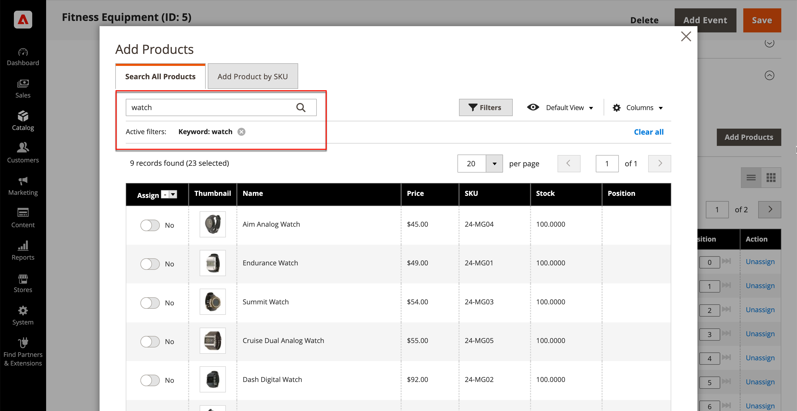

# カテゴリ製品の追加と削除

ストア管理者は、「[ カテゴリ内の製品](categories-product-assignments.md)」セクションから、カテゴリに製品を追加できます。 このセクションには、カテゴリに割り当てられているすべての製品が一覧表示され、**[!UICONTROL Match products by rule]**&#x200B;が`No`に設定されている場合は&#x200B;**[!UICONTROL Add Product]**&#x200B;と表示されます。

{width="600" zoomable="yes"}の製品

## 追加する商品を検索

1. _管理者_ サイドバーで、**[!UICONTROL Catalog]** > **[!UICONTROL Categories]**&#x200B;に移動します。

1. 左側のカテゴリーツリーで、製品を追加するカテゴリを選択します。

1. カテゴリー&#x200B;_セクションの_&#x200B;製品のを展開します。

1. **[!UICONTROL Add Products]**&#x200B;をクリックします。

1. _キーワードで検索_&#x200B;またはフィルターを使用して、追加する商品を見つけます。

   {width="700" zoomable="yes"}

1. _[!UICONTROL Assign]_列で、追加する製品ごとにオプションを`Yes`に切り替えます。

   表示されているすべての商品を含める場合は、列ヘッダーのメニュー矢印をクリックして、**[!UICONTROL Select All]**&#x200B;を選択します。

1. 変更を適用するには、**[!UICONTROL Save and Close]**&#x200B;をクリックします。

### アクション

| アクション | 説明 |
|--- |--- |
| [!UICONTROL Select All] | リスト内のすべてのレコードのチェックボックスをオンにします。 |
| [!UICONTROL Unselect All] | リスト内のすべてのレコードのチェックボックスをオフにします。 |
| [!UICONTROL Select All on This Page] | 現在のページのレコードのチェックボックスを選択します。 |
| [!UICONTROL Deselect All on This Page] | 現在のページのレコードのチェックボックスをオフにします。 |

{style="table-layout:auto"}

## SKU別の製品の追加

1. **[!UICONTROL Add Products]**&#x200B;をクリック

1. 「**[!UICONTROL Add Products by SKU]**」タブを選択します。

1. SKU （行ごとに1つ）を入力し、**[!UICONTROL Assign]**&#x200B;をクリックします。

   変更を破棄するには、**[!UICONTROL Remove]**&#x200B;をクリックします。

   {width="700" zoomable="yes"}

1. 変更を適用するには、**[!UICONTROL Save and Close]**&#x200B;をクリックします。

## カテゴリからの製品の削除

1. _管理者_ サイドバーで、**[!UICONTROL Catalog]** > **[!UICONTROL Categories]**&#x200B;に移動します。

1. 左側のカテゴリーツリーで、編集するカテゴリを選択します。

1. _[!UICONTROL Products in Category]_セクションのを展開します。

1. 取り除く製品を探します。

1. _[!UICONTROL Actions]_列で、**[!UICONTROL Unassign]**をクリックします。

1. 変更を適用するには、**[!UICONTROL Save]**&#x200B;をクリックします。
