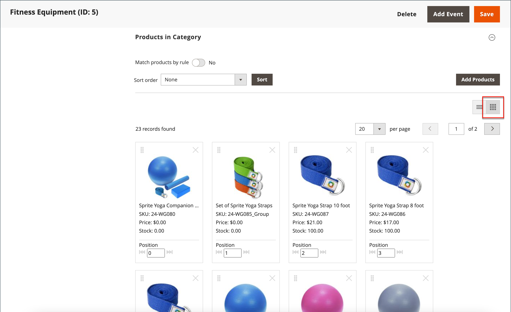
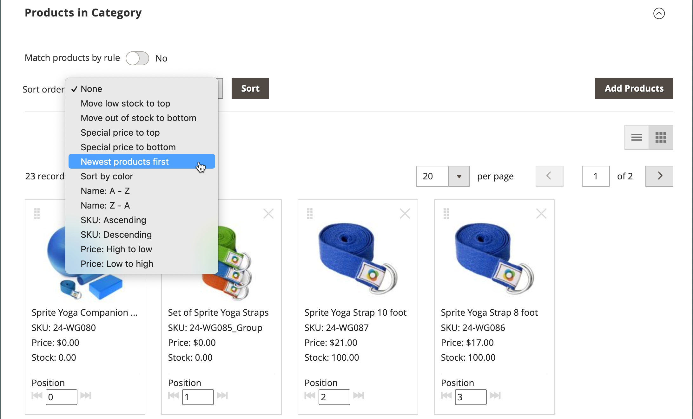

# カテゴリ製品の並べ替え

{{ee-feature}}

カテゴリ内の製品の位置は、製品を位置にドラッグ&amp;ドロップするか、定義済みの並べ替え順序を適用することで、手動で指定できます。 デフォルトでは、在庫レベル、年齢、色、名前、SKU、価格で商品を並べ替えることができます。 自動ソートは、現在のソート順序を上書きし、手動で設定したドラッグ&amp;ドロップの位置をリセットします。 商品をリストに含めるために必要な色の並べ替え順序と最低在庫量は、[Visual Merchandiser](../configuration-reference/catalog/visual-merchandiser.md)設定で設定されます。

[ ストアビュー](../stores-purchase/stores.md#add-stores)ごとにカテゴリーオプションを個別に設定して、商品の選択、リスト内での相対的な位置、カテゴリールールで使用できる属性を決定できます。 ただし、カタログ内に単一の&#x200B;**_グローバル_**&#x200B;並べ替え順序と商品の位置があり、それらはすべて[ ストアビュー](../stores-purchase/store-views.md)、ストア、およびweb サイトで共有されます。

## 手順1：設定の範囲の設定

1. _管理者_ サイドバーで、**[!UICONTROL Catalog]** > **[!UICONTROL Categories]**&#x200B;に移動します。

1. 必要に応じて、設定が適用される&#x200B;**[!UICONTROL Store View]**&#x200B;を選択します。

   マルチストア インストールの場合、_[!UICONTROL Store View]_設定は、ストア内で使用可能なすべてのビューに並べ替え順序を適用します。

1. 左側のカテゴリーツリーで、編集するカテゴリを選択します。

   {width="700" zoomable="yes"}

## 手順2：商品の並べ替え

>[!NOTE]
>
>カテゴリをproduct属性で並べ替える場合、同じ属性値を持つ製品も昇順で&#x200B;_[!UICONTROL Product ID]_で並べ替えられます。

_[!UICONTROL Products in Category]_セクションで、タイル （）アイコンをクリックして、商品タイルをグリッドに表示します。 製品をソートするには、手動または自動のいずれかの方法を使用します。

{width="600" zoomable="yes"}

### 方法1：手動ソート

1. **[!UICONTROL Sort Order]**&#x200B;を好みに合わせて設定します。

   {width="600" zoomable="yes"}

1. 新しい並べ替え順序を適用するには、**[!UICONTROL Sort]**&#x200B;をクリックします。

1. 並べ替え順序を保存するには、**[!UICONTROL Save Category]**&#x200B;をクリックします。

1. プロンプトが表示されたら、無効なインデクサーを更新します。

### 方法2：自動ソート

1. **[!UICONTROL Match products by rule]** （）を`Yes`に設定します。

1. **[!UICONTROL Automatic Sorting]**&#x200B;を好みに合わせて設定します。

1. カテゴリルールを作成するには、次の手順の手順に従います。

## 手順3：カテゴリルールの作成

1. **[!UICONTROL Match products by rule]** （）を`Yes`に設定します。

1. **[!UICONTROL Add Condition]**&#x200B;をクリックします。

1. 条件の基となる&#x200B;**[!UICONTROL Attribute]**&#x200B;を選択します。

1. **[!UICONTROL Operator]**&#x200B;を次のいずれかに設定します：

   - `Equal`
   - `Not equal`
   - `Greater than`
   - `Greater than or equal to`
   - `Less than`
   - `Less than or equal to`
   - `Contains`

1. 適切な&#x200B;**[!UICONTROL Value]**&#x200B;を入力します。

   {width="600" zoomable="yes"}

1. 別の条件を追加するには、**[!UICONTROL Add Condition]**&#x200B;をクリックして、プロセスを繰り返します。

## 手順4：保存、更新、検証

1. 完了したら、**[!UICONTROL Save Category]**&#x200B;をクリックします。

1. キャッシュの更新を求めるメッセージが表示されたら、**[!UICONTROL Cache Management]**&#x200B;をクリックし、無効なキャッシュごとに更新します。

1. ストアフロントで、商品の選択、並べ替え、カテゴリのルールが正しく機能することを確認します。

   調整が必要な場合は、設定を変更して、もう一度試してください。
