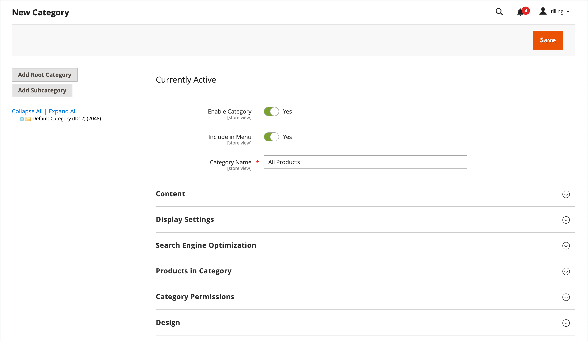

# ルートカテゴリと階層

メインメニュー内の製品は、 [保存する](../stores-purchase/stores.md#add-stores). ルートカテゴリは、基本的に、カテゴリツリーのメインメニューのコンテナです。 全く新しい製品セットを使用してルートカテゴリを作成したり、既存のルートカテゴリから製品をコピーしたりできます。 ルートカテゴリは、現在のストアまたは同じ Web サイト内の他のストアに割り当てることができます。

{width="550"}

管理者から見ると、カテゴリ構造は逆さのツリーのようで、ルートが上にあります。 ルートには名前がありますが、URL キーはなく、には表示されません。 [上部ナビゲーション](navigation-top.md) ストアの。 メニュー内のその他のカテゴリはすべて、ルートの下にネストされます。 ルートカテゴリはカタログの最上位レベルなので、ストアでは一度に 1 つのルートカテゴリのみアクティブにすることができます。 ただし、代替カタログ構造と異なるストアに対して、追加のルートカテゴリを作成することはできます。

次の例は、ルートカテゴリを作成し、別のストアに割り当てる方法を示しています。

## 手順 1：ルートカテゴリの作成

1. 次の日： _管理者_ サイドバー、移動 **[!UICONTROL Catalog]** > **[!UICONTROL Categories]**.

1. 左側で、 **[!UICONTROL Add Root Category]**.

   {width="600" zoomable="yes"}

1. を入力します。 **[!UICONTROL Category Name]**.

   選択した名前は、最初はすべてのストアビューに割り当てられます。

1. 現在のカタログからカタログに商品を追加する場合は、次の操作を行います。

   - 展開  の _カテゴリ内の製品_ 」セクションに入力します。

   - 以下を使用します。 [検索フィルター](../getting-started/admin-grid-controls.md) 目的の商品を検索し、新しいカタログにコピーする各商品のチェックボックスを選択します。

1. 完了したら、「 **[!UICONTROL Save]**.

## 手順 2：メインメニューの構築

1. 左側で、前の手順で作成した新しいルートカテゴリを選択します。

1. 次の手順で [カテゴリ構造](category-create.md) メインメニューの場合は、 **[!UICONTROL Add Subcategory]** そして指示に従う

## 手順 3：ストアにルートカテゴリを割り当てる

1. 次の日： _管理者_ サイドバー、移動 **[!UICONTROL Stores]** > _[!UICONTROL Settings]_>**[!UICONTROL All Stores]**.

1. Adobe Analytics の _ストア_ グリッドの列で、新しいカタログを割り当てるストアをクリックします。

1. 設定 **[!UICONTROL Root Category]** を、作成した新しいルートカテゴリに追加します。

1. ストアに **[!UICONTROL Default Store View]** 割り当て済み。

   ストアには少なくとも 1 つのが必要です [ストア表示](../stores-purchase/store-views.md).

1. 完了したら、「 **[!UICONTROL Save Store]**.

1. ストアに新しいカタログが含まれていることを確認するには、次の手順を実行します。

   - 次の日： _管理者_ サイドバー、移動 **[!UICONTROL Catalog]** > **[!UICONTROL Products]**.

     新しいカタログにコピーされた商品がグリッドに表示されます。

   - 新しいカタログとメインメニューが正しく機能していることを確認するには、ストアフロントにアクセスします。
