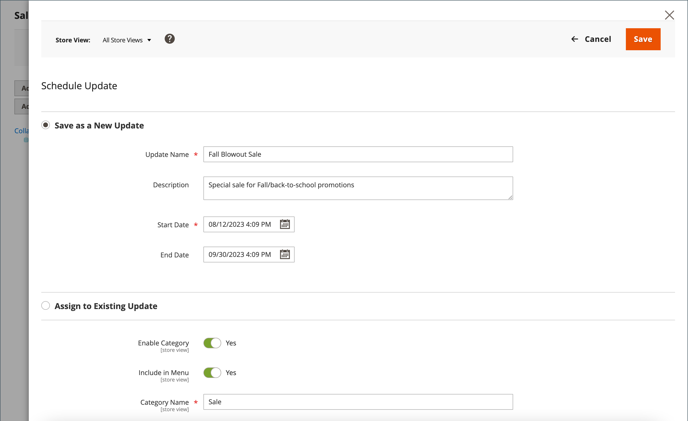

# カテゴリの予定された変更

{{ee-feature}}

カテゴリーの更新はスケジュールどおりに適用でき、他のコンテンツの変更とグループ化することも可能です。 カテゴリに予定された変更に基づいてキャンペーンを作成したり、既存のキャンペーンに変更を適用したりできます。 詳しくは、[ コンテンツのステージング ](../content-design/content-staging.md)を参照してください。

カテゴリの変更をスケジュールする場合は、次の点に注意してください。

- スケジュールされた更新はすべて連続して適用されます。つまり、どのエンティティも一度に1つのスケジュールされた更新のみを持つことができます。 スケジュールされた更新は、その時間枠内のすべてのストアビューに適用されます。 その結果、エンティティは、異なるストアビューに対して同時に複数のスケジュールされた更新を行うことはできません。 現在のスケジュールされた更新の影響を受けない、すべてのストアビュー内のすべてのエンティティ属性値は、以前のスケジュールされた更新の値ではなく、デフォルト値から取得されます。

- キャンペーンが複数のカテゴリにリンクされている場合、キャンペーンは[ コンテンツステージングダッシュボード ](../content-design/content-staging-dashboard.md)からのみ編集できます。

- キャンペーンが複数のカテゴリにリンクされている場合、キャンペーンは[ コンテンツステージングダッシュボード ](../content-design/content-staging-dashboard.md)からのみ編集できます。

>[!NOTE]
>
>[!UICONTROL Schedule Design Update] タブは Adobe Commerceで削除されました。カテゴリで直接変更することはできません。 これらのアクティベーションのスケジュールされた更新を作成する必要があります。

## カテゴリの更新をスケジュール

1. _管理者_ サイドバーで、**[!UICONTROL Catalog]** > **[!UICONTROL Categories]**&#x200B;に移動します。

1. 左側のカテゴリーツリーで、変更するカテゴリを選択します。

1. ページ上部の「_変更予定_」ボックスで、「**[!UICONTROL Schedule New Update]**」をクリックします。

   {width="600" zoomable="yes"}

1. **[!UICONTROL Save as a New Update]** オプションを選択した状態で、更新の基本パラメーターを設定します。

   - **[!UICONTROL Update Name]**&#x200B;に、新しいコンテンツステージングキャンペーンの名前を入力します。

   - 更新プログラムの概要&#x200B;**[!UICONTROL Description]**&#x200B;とその使用方法を入力します。

   - カレンダー（）ツールを使用して、キャンペーンの&#x200B;**[!UICONTROL Start Date]**&#x200B;と&#x200B;**[!UICONTROL End Date]**&#x200B;を選択します。

   >[!IMPORTANT]
   >
   >キャンペーン **[!UICONTROL Start Date]**&#x200B;と&#x200B;**[!UICONTROL End Date]**&#x200B;は、各web サイトのローカルタイムゾーンから変換される&#x200B;**_default_**&#x200B;管理者タイムゾーンを使用して定義する必要があります。 たとえば、米国のタイムゾーンにもとづいて施策を開始する複数のタイムゾーンのweb サイトがある場合、ローカルタイムゾーンごとに個別の更新をスケジュールする必要があります。 **[!UICONTROL Start Date]**&#x200B;と&#x200B;**[!UICONTROL End Date]**&#x200B;をそれぞれ設定し、ローカル web サイトのタイムゾーンからデフォルトの管理者タイムゾーンに変換します。

   {width="600" zoomable="yes"}

1. スケジュールされた更新に必要な変更を加えます。

1. 変更をプレビューするには、右上のボタンバーで「**[!UICONTROL Preview]**」をクリックします。

1. 完了したら、**[!UICONTROL Save]**&#x200B;をクリックします。

## 既存の更新プログラムに割り当てる

1. _管理者_ サイドバーで、**[!UICONTROL Catalog]** > **[!UICONTROL Categories]**&#x200B;に移動します。

1. 左側のカテゴリーツリーで、変更するカテゴリを選択します。

1. ページ上部の「_変更予定_」ボックスで、「**[!UICONTROL Schedule New Update]**」をクリックします。

1. **[!UICONTROL Assign to Existing Campaign]**&#x200B;を選択します。

1. リストで、必要なキャンペーンを見つけて「**[!UICONTROL Select]**」をクリックします。

1. スケジュールされた更新に必要な変更を加えます。

1. 完了したら、**[!UICONTROL Save]**&#x200B;をクリックします。
