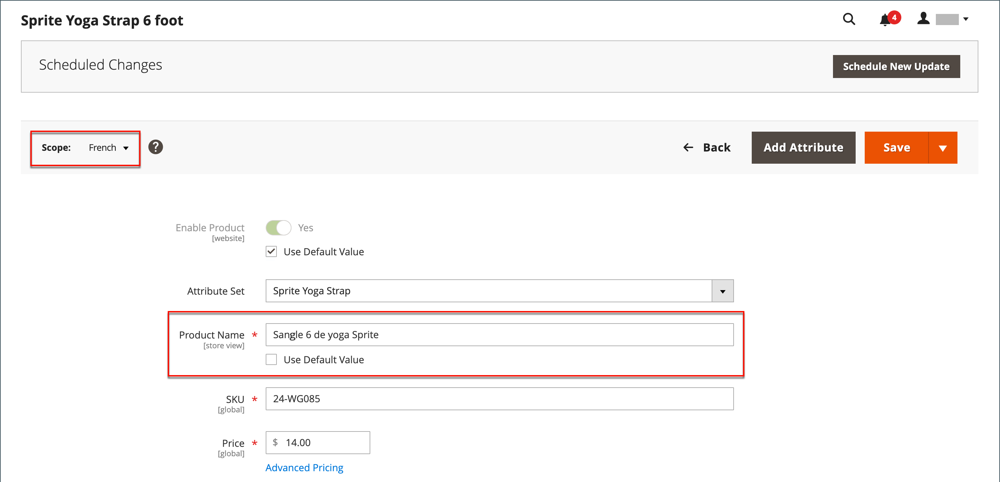
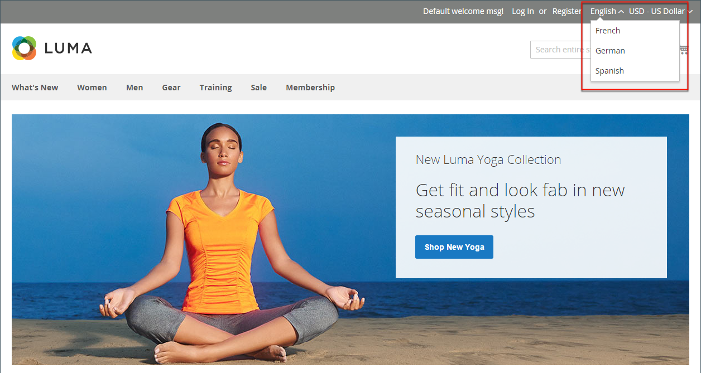

# カタログ管理の概要

Adobe CommerceとMagento Open Sourceでは、_カタログ_&#x200B;という用語を使用して、商品データベース全体を参照します。

ストアの作成と管理で最も重要な領域のひとつは、商品の制作とカテゴリーです。 管理者は、ストアの初期設定、ストアのメンテナンス、ビジネスの最適化に使用するツールをいくつか提供します。

>[!TIP]
>
>Adobe CommerceおよびMagento Open SourceのInventory managementなら、商品の在庫を管理できます。 単一の店舗を複数の倉庫、店舗、受け取り場所、ドロップシッパーなどに持つマーチャントは、これらの機能を利用して販売の数量を維持し、出荷を処理して注文を完了することができます。 これらの機能と、複数の場所で在庫を管理する方法について詳しくは、[Inventory management ユーザーガイド ](../inventory-management/introduction.md)を参照してください。

## カタログの範囲

カタログデータへのアクセスは、[ スコープ ](../getting-started/websites-stores-views.md#scope-settings)設定、カタログ設定、ストアに割り当てられている[ ルートカテゴリ ](category-root.md)など、いくつかの要因によって決まります。 このカタログには、有効で販売可能な商品と、現在販売されていない商品が含まれています。

営業部門では、通常、_カタログ_&#x200B;という用語は、販売可能な商品の厳選された選択肢を指します。 例えば、店舗には「春季カタログ」と「秋季カタログ」があります。

印刷されたカタログの目次と同様に、ストアのメインメニュー（または&#x200B;_トップナビゲーション_）は、顧客が欲しいものを簡単に見つけられるように、商品をカテゴリ別に整理します。 メインメニューは、ストアに割り当てられたメニューのコンテナである&#x200B;_ルートカテゴリ_&#x200B;に基づいています。 特定のメニューオプションはストアビューレベルで定義されるので、各ビューには同じルートカテゴリに基づいて異なるメインメニューを設定できます。 各メニューでは、店舗に適した商品を厳選して提供することができます。

{width="550"}

## 製品範囲

複数のweb サイト、ストア、ビューを持つインストールの場合、[ スコープ ](../getting-started/websites-stores-views.md#scope-settings)設定によって、販売可能な製品の場所と、各ストアビューで使用可能な製品情報が決まります。 最初に、作成したすべての製品は、デフォルトのweb サイト、ストア、ストアビューに公開されます。

{width="550"}

デフォルトのビューを持つ単一のストアしかない場合、[単一ストアモード ](../getting-started/websites-stores-views.md#single-store-mode)でストアを実行して、スコープ設定を非表示にすることができます。 ただし、ストアに複数のビューがある場合は、各フィールドの名前の下にスコープインジケーターが表示されます。

- 特定のビューの製品情報を編集するには、左上隅の&#x200B;_ストアビュー_ コントロールを使用してビューを選択します。 ストアビューレベルで編集できる任意のフィールドに対して、追加のコントロールを使用できるようになります。

- マルチサイトインストールでの製品の範囲を定義するには、製品情報の「[製品web サイト ](settings-basic-websites.md)」セクションを参照してください。

ストアビューの製品を編集するプロセスは、ビューに固有の製品情報のレイヤーを追加するようなものです。

製品を編集または割り当てることができるのは、製品が割り当てられているすべてのサイトではなく、権限を持つサイトに対してのみです。

次の例では、_スペイン語_&#x200B;のストアビューが選択されていますが、製品情報はデフォルトのストアビューの元の言語で表示されます。 製品情報を翻訳するには、_スペイン語_ ストアビューに切り替え、製品タイトル、説明、メタデータなどのテキストフィールドを翻訳する必要があります。 詳しくは、[製品のローカライズ ](../stores-purchase/store-localize.md#localize-products)を参照してください。

## 別のビュー用に製品を編集

>[!NOTE]
>
>製品が許可されたスコープ外でも公開されている場合、特定のスコープに制限されている管理者ユーザーに対して、_すべてのストアビュー_&#x200B;のスコープは無効になります。 制限付きユーザーは、アクセス権のないスコープに影響を与える&#x200B;_グローバル_ アクションまたはアクションを実行できないため、編集に使用できる最初のスコープはデフォルトで選択されています。

1. 左上隅で、編集する特定のビューに&#x200B;**[!UICONTROL Store View]**&#x200B;を設定します。

1. 範囲の変更を確認するには、**[!UICONTROL OK]**&#x200B;をクリックします。

1. ストアビューの新しい値でフィールドを更新します。

   ストアビューで編集できるフィールドの下にチェックボックスが表示されます。 デフォルト値を上書きするには、「**デフォルト値を使用**」チェックボックスの選択を解除します。

   {width="600" zoomable="yes"}

1. 完了したら、**[!UICONTROL Save]**&#x200B;をクリックします。

1. 左上隅で、**[!UICONTROL Store View]** セレクターをデフォルトに戻します。

1. ストアの変更を確認するには、次の操作を行います。

   - 右上隅の&#x200B;_管理者_ メニュー矢印をクリックし、**[!UICONTROL Customer View]**&#x200B;を選択します。

     {width="600" zoomable="yes"}

   - ストアの右上隅にある&#x200B;**[!UICONTROL Language Chooser]**&#x200B;を、編集した製品のストアビューに設定し、ビュー用に編集した製品を見つけます。

     {width="700" zoomable="yes"}
