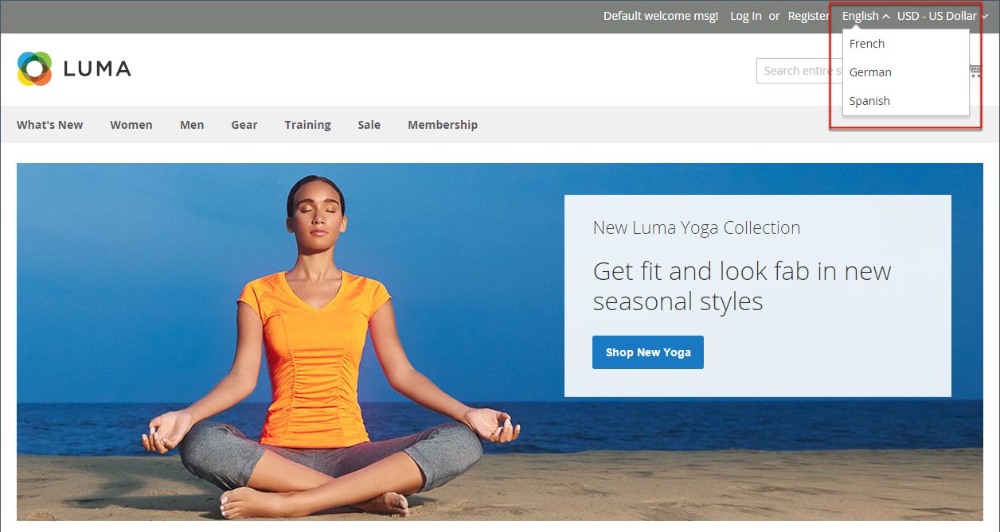

# カタログ管理の概要

Adobe CommerceとMagento Open Sourceでは、製品データベース全体を指す場合に _カタログ_ という用語を使用します。

ストアを作成および管理する際に最も重要な領域の 1 つは、製品の作成とカテゴリです。 管理者には、ストアの初期設定、ストアの保守、ビジネスの最適化に使用するツールがいくつか用意されています。

>[!TIP]
>
>Adobe CommerceおよびMagento Open Source版Inventory managementには、商品インベントリを管理するツールが用意されています。 複数の倉庫、店舗、集荷場所、直荷主などに 1 つの店舗を持つマーチャントは、これらの機能を使用して販売の数量を管理し、注文を完了するための出荷を処理できます。 これらの機能の詳細と、それらを使用して複数の場所で在庫を管理する方法については、[Inventory management ユーザーガイド &#x200B;](../inventory-management/introduction.md) を参照してください。

## カタログ範囲

カタログデータへのアクセスは、[&#x200B; 範囲 &#x200B;](../getting-started/websites-stores-views.md#scope-settings) 設定、カタログ設定、ストアに割り当てられている [&#x200B; ルートカテゴリ &#x200B;](category-root.md) を含む、いくつかの要因によって決定されます。 カタログには、有効化されて販売可能な製品と、現在販売されていない製品が含まれています。

販売において _カタログ_ という用語は通常、販売が可能な厳選された製品を指します。 例えば、ある店舗には「春のカタログ」と「秋のカタログ」があるとします。

印刷されたカタログの目次と同様に、ストアのメインメニュー（または _トップナビゲーション_ は、顧客が欲しいものを簡単に見つけられるように、商品をカテゴリ別に整理します。 メインメニューは、ストアに割り当てられたメニューのコンテナである _ルートカテゴリ_ に基づいています。 特定のメニューオプションはストア表示レベルで定義されるため、各ビューは同じルートカテゴリに基づいて異なるメインメニューを持つことができます。 各メニュー内で、店舗に適した厳選された製品を提供できます。

{width="550"}

## 製品の範囲

複数の web サイト、ストア、表示を含むインストールの場合、[&#x200B; 範囲 &#x200B;](../getting-started/websites-stores-views.md#scope-settings) 設定によって、製品を販売できる場所と、各ストア表示で使用できる製品情報が決まります。 最初は、作成したすべての製品がデフォルトの web サイト、ストア、ストア表示に公開されます。

{width="550"}

デフォルト表示のストアが 1 つしかない場合は、ストアを [&#x200B; 単一ストアモード &#x200B;](../getting-started/websites-stores-views.md#single-store-mode) で実行して、範囲設定を非表示にできます。 ただし、ストアに複数のビューがある場合は、各フィールドの名前の下に範囲インジケーターが表示されます。

- 特定の表示の商品情報を編集するには、左上隅の _ストア表示_ コントロールを使用して表示を選択します。 追加のコントロールは、ストアビューレベルで編集できるすべてのフィールドで使用できるようになります。

- マルチサイトインストールの製品の範囲を定義するには、製品情報の [Web サイトの製品 &#x200B;](settings-basic-websites.md) の節を参照してください。

ストア表示の商品を編集するプロセスは、表示固有の商品情報のレイヤーを追加するようなものです。

製品の編集または割り当ては、権限を持つサイトに対してのみ行え、製品が割り当てられているすべてのサイトに対しては行えません。

次の例では _スペイン語_ ストア表示が選択されていますが、製品情報はデフォルトのストア表示の元の言語で引き続き表示されます。 商品情報を翻訳するには、_スペイン語_ ストア表示に切り替えて、製品タイトル、説明、メタデータなどのテキストフィールドを翻訳する必要があります。 詳しくは、「[&#x200B; 製品のローカライズ &#x200B;](../stores-purchase/store-localize.md#localize-products)」を参照してください。

## 異なるビュー用の製品の編集

>[!NOTE]
>
>製品が許可されている範囲外でも公開される場合、特定の範囲に制限されている管理者ユーザーに対しては、_すべてのストア表示_ 範囲は無効になります。 制限付きユーザーは、アクセス権のない範囲に影響を与える _グローバル_ アクションまたはアクションを実行できないため、編集できる最初の範囲は既定で選択されています。

1. 左上隅で、編集する特定のビューに **[!UICONTROL Store View]** を設定します。

1. 範囲の変更を確定するには、「**[!UICONTROL OK]**」をクリックします。

1. ストア表示の新しい値でフィールドを更新します。

   ストア表示に編集可能なフィールドの下に、チェックボックスが表示されます。 デフォルト値を上書きするには、「**デフォルト値を使用** チェックボックスの選択を解除します。

   {width="600" zoomable="yes"}

1. 完了したら、「**[!UICONTROL Save]**」をクリックします。

1. 左上隅の **[!UICONTROL Store View]** 選択をデフォルトに戻します。

1. ストアの変更を確認するには、次の手順を実行します。

   - 右上隅の「_管理者_」メニュー矢印をクリックし、「**[!UICONTROL Customer View]**」を選択します。

     {width="600" zoomable="yes"}

   - ストアの右上隅で、編集した商品のストア表示に **[!UICONTROL Language Chooser]** を設定し、ビュー用に編集した商品を見つけます。

     {width="700" zoomable="yes"}
