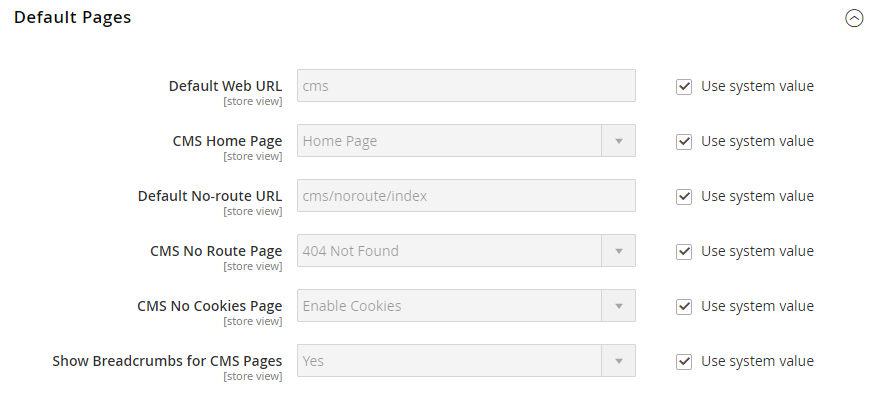

# パンくずリスト

A _パンくずリスト_ は、ストア内の他のページとの関連を顧客に示すリンクのセットです。 パンくずリスト内の任意のリンクをクリックすると、前のページに戻ることができます。

パンくずリストは、コンテンツページとカタログページに表示するように設定できます。 パンくずリストの形式と位置はテーマによって異なりますが、通常はヘッダーのすぐ下にあります。 デフォルトでは、パンくずリストは CMS ページに表示されます。

{width="700" zoomable="yes"}

## パン粉の一般的な種類

パンくずリストは、目的が異なる 3 つの主なタイプに分けることができます。 各タイプのパン粉の実装の本質と主な原則は以下のとおりです。

### 階層ベースの階層リンク

このタイプのパンくずリストは、サイト上に設定されたカテゴリ階層に基づいています。 表示されるチェーンは、構造内の場所をユーザーに示します。 この場合、各テキストリンクは、前のページよりも 1 レベル高いページを対象としています。

例： `Men > Tops > Hoodies & Sweatshirts`

このタイプの利点は、ユーザーがどのカテゴリレベルにいるかを簡単に確認でき、カタログページ間を簡単に移動できることです。

### 履歴ベースの階層リンク

履歴（またはパス）ベースのナビゲーションは、ブラウザーの「戻る」ボタンに似ています。 このタイプのナビゲーションを使用すると、ユーザーは、前に訪問したページに変更なしですばやく戻ることができます。

このタイプの利点は、カテゴリページで複数のフィルターを選択した後に前のページに戻りたいときに最も役立ちます。

例： `Home > What's New > Gear > Bags`

### 属性ベースの階層リンク

このタイプのパンくずリストには、カテゴリページで選択された属性が表示されます。 他のタイプとの主な違いは、属性ベースのパンくずリストが、特定の製品（価格、品質、色など）のナビゲーションレイヤーで顧客が選択したフィルターおよびオプションを表すことです。

例： `Home > Suits > All Suits > Refined by > Slim Fit`

## CMS ページからのパンくずリストの追加/削除

1. 日 _Admin_ サイドバー、に移動 **[!UICONTROL Stores]** > _[!UICONTROL Settings]_>**[!UICONTROL Configuration]**.

1. の下の左パネルで _[!UICONTROL General]_、を選択&#x200B;**[!UICONTROL Web]**.

   {width="600" zoomable="yes"}

1. を展開します。 _[!UICONTROL Default Pages]_セクション。

1. の選択を解除 **[!UICONTROL Use system value]** チェックボックス。

1. を設定 **[!UICONTROL Show Breadcrumbs for CMS Pages]** 対象： `No` または `Yes`.

1. 完了したら、 **[!UICONTROL Save Config]**.

>[!NOTE]
>
>親カテゴリが次の場合、子カテゴリページのパンくずリストに表示されません `Browsing Category`= `Deny` [カテゴリ権限](category-permissions.md) 設定。
