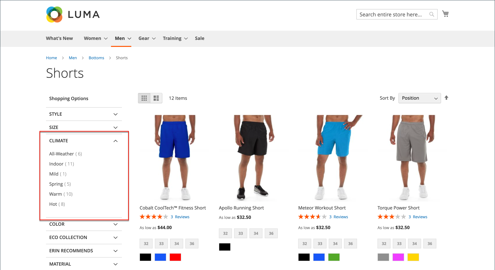
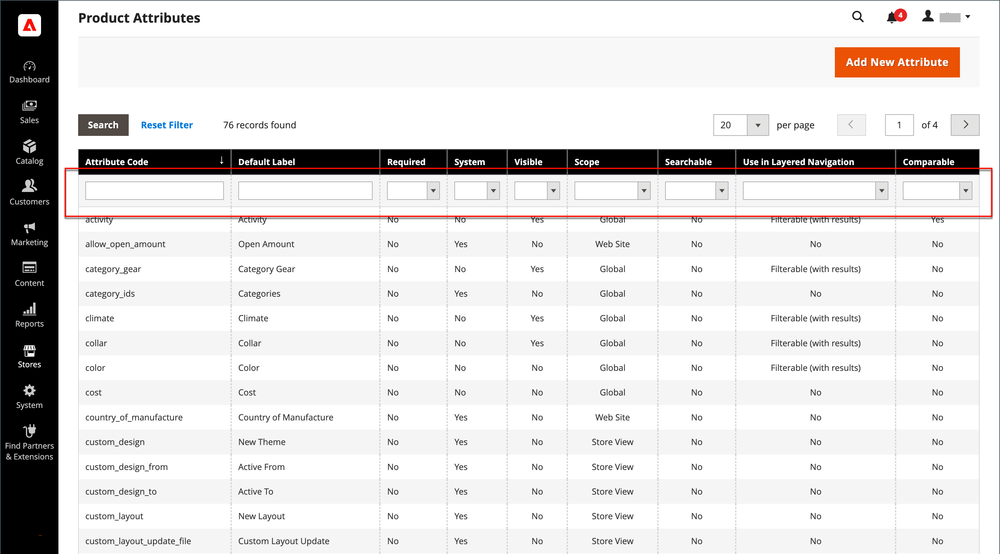
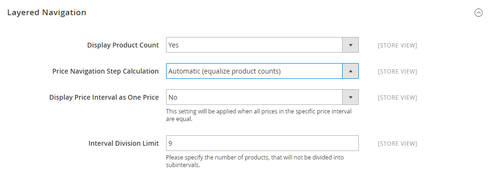

# 階層型ナビゲーション

>[!NOTE]
>
>この節で説明する標準のレイヤー化されたナビゲーションは、[ ファセット ](https://experienceleague.adobe.com/docs/commerce-merchant-services/live-search/live-search-admin/facets/facets.html) を使用したライブサーチのフィルター済みナビゲーションとは異なります。

階層化されたナビゲーションにより、カテゴリ、価格範囲、その他の利用可能な属性に基づいて製品を簡単に見つけることができます。 通常、階層型ナビゲーションは検索結果ページとカテゴリページの左側の列に表示され、場合によってはホームページに表示されます。 標準ナビゲーションには、カテゴリと価格範囲の _ショップ_ リストが含まれています。 製品数や価格範囲など、レイヤナビゲーションの表示を設定できます。

{width="700" zoomable="yes"}

## フィルタリング可能な属性

>[!NOTE]
>
>このトピックで説明するフィルタリング可能な属性の要件は、[Live Search](https://experienceleague.adobe.com/docs/commerce-merchant-services/live-search/overview.html) とは異なります。 詳しくは、[ ファセット ](https://experienceleague.adobe.com/docs/commerce-merchant-services/live-search/live-search-admin/facets/facets.html) を参照してください。

レイヤナビゲーションを使用して、カテゴリ別または属性別に製品を検索できます。 例えば、買い物客が上部のナビゲーションから Mens/Shorts カテゴリを選択すると、最初の結果にはカテゴリ内のすべての製品が含まれます。 リストは、特定のスタイル、気候、色、素材、パターン、価格を選択するか、値の組み合わせを選択して、さらにフィルタリングできます。 フィルタリング可能な属性は、各属性値を一覧表示する展開セクションに表示されます。 オプションとして、一致する結果を持つ製品のリストは、一致の有無を問わず製品を含めるように設定できます。

属性プロパティと製品入力タイプを組み合わせることで、レイヤーナビゲーションに使用できる属性が決定します。 レイヤー化されたナビゲーションは、[_アンカー_](categories-display-settings.md) カテゴリでのみ使用できますが、検索結果ページに追加することもできます。 各属性の **ストア所有者のカタログ入力タイプ** プロパティは、`Yes/No`、`Dropdown`、`Multiple Select`、`Price` のいずれかに設定する必要があります。 属性をフィルタリング可能にするには、それぞれの **レイヤーナビゲーションで使用** プロパティを `Filterable (with results)` または `Filterable (no results)` に設定する必要があります。

_例：結果を使用してフィルタリング可能な属性_

{width="700" zoomable="yes"}

_例：結果を持たないフィルタリング可能なスウォッチ値_

{width="700" zoomable="yes"}

次の手順は、フィルタリング可能な属性を使用した基本的なレイヤーナビゲーションの設定方法を示しています。 価格手順を使用した高度な階層型ナビゲーションについては、「[ 価格ナビゲーション ](navigation-layered.md#configure-price-navigation)」を参照してください。

## 手順 1：属性プロパティの設定

1. _管理者_ サイドバーで、**[!UICONTROL Stores]**/_[!UICONTROL Attributes]_/**[!UICONTROL Product]**に移動します。

1. 参照するか、フィルター適用済み検索を使用してリスト内の属性を検索し、編集モードで開きます。

   {width="700" zoomable="yes"}

1. 左側のパネルで「**[!UICONTROL Storefront Properties]**」を選択し、**[!UICONTROL Use In Layered Navigation]** を次のいずれかに設定します。

   - `Filterable (with results)` – 階層ナビゲーションには、一致する製品が見つかるフィルターのみが含まれます。 リストに表示されるすべての製品に既に適用されている属性値は、使用可能なフィルターとして表示されます。 カウントがゼロ（0）の製品一致を持つ属性値は、使用可能なフィルターのリストから省略されます。 フィルター済みリストには、フィルターに一致する製品のみが含まれます。 製品リストは、選択したフィルターによって表示内容が変更される場合にのみ更新されます。

   - `Filterable (no results)` – 階層ナビゲーションには、すべての使用可能な属性値とその製品数（製品の一致がゼロ（0）の製品を含む）のフィルターが含まれます。 属性値がスウォッチの場合、その値はフィルタとして表示されますが、交差しています。 価格レイヤーのフィルタリングは、このオプションではサポートされておらず、価格フィルターには影響しません。

1. **[!UICONTROL Use In Search Results Layered Navigation]** を `Yes` に設定します。

   {width="600" zoomable="yes"}

1. レイヤーナビゲーションに含める属性ごとに、これらの手順を繰り返します。

>[!NOTE]
>
>_[!UICONTROL Use in Search]_設定が `No` に設定されている場合、_[!UICONTROL Use in Search Results Layered Navigation]_ 設定は表示されず、製品属性は [!UICONTROL Use in Layered Navigation] の設定値を持つ検索で使用されません。

>[!NOTE]
>
>[!UICONTROL Position] フィールドは既定では淡色表示になっているので、この設定を変更する前に属性を保存する必要があります。

## 手順 2：カテゴリをアンカーにする

1. _管理者_ サイドバーで、**[!UICONTROL Catalog]**/**[!UICONTROL Categories]** に移動します。

1. カテゴリツリーで、階層化ナビゲーションを使用するカテゴリを選択します。

1. 「 「**[!UICONTROL Display Settings]**」セクションを展開し、「**[!UICONTROL Anchor]**」を「`Yes`」に設定します。

   {width="600" zoomable="yes"}

1. 「**[!UICONTROL Save]**」をクリックします。

## 手順 3：結果のテスト

設定をテストするには、ストアにアクセスし、メインメニューからカテゴリに移動します。 フィルタリング可能な属性の選択は、カテゴリページのレイヤー化されたナビゲーションに表示されます。

表示された製品を検索、フィルタリングおよびレビューします。

## レイヤーナビゲーションからフィルタリング可能な属性値を削除

レイヤーナビゲーションには、使用可能なすべての属性値とその製品数のフィルターが含まれます。製品一致がゼロ（0）の製品も含まれます（下図を参照）。

{width="700" zoomable="yes"}

この結果、顧客が優先製品を選択するのが難しくなり、フロントエンドに製品が 0 の属性値を表示す&#x200B;る必要が&#x200B;ありません。

次の手順を使用して、レイヤー化されたナビゲーションから「製品」が 0 のフィルタリング可能な属性値を削除できます。

1. _管理者_ サイドバーで、**[!UICONTROL Stores]**/_[!UICONTROL Attributes]_/**[!UICONTROL Product]**に移動します。

1. 参照するか、フィルター適用済み検索を使用してリスト内の属性を検索し、編集モードで開きます。

1. 「_[!UICONTROL Attribute Information]_」で、「**[!UICONTROL Storefront Properties]**」をクリックします。

1. **[!UICONTROL Layered Navigation]** の場合は、「`Filterable (with results)`」を選択します。

   {width="600" zoomable="yes"}

1. 「**[!UICONTROL Save Attribute]**」をクリックします。

## 価格ナビゲーション

>[!NOTE]
>
>このトピックで説明する価格ナビゲーション設定は、[ ライブサーチ ](https://experienceleague.adobe.com/docs/commerce-merchant-services/live-search/overview.html) とは異なります。

価格ナビゲーションを使用すると、レイヤードナビゲーションで価格範囲別に製品を配布できます。 また、各範囲を間隔で分割することもできます。 価格ナビゲーションを計算する方法はいくつかあります。

- 自動（価格範囲の均等化）
- 自動（製品数を平均化）
- 手動

最初の 2 つの方法では、ナビゲーションステップが自動的に計算されます。 手動による方法では、価格間隔の分割限度を指定できます。 次の例は、10 と 100 の価格移動ステップの違いを示しています。

反復分割は、価格範囲間で製品の最適な配分を提供します。 反復分割を使用すると、$0.00～$99 の範囲を選択した後、顧客は価格のいくつかのサブレンジをドリルダウンできます。 価格範囲分割は、製品数が間隔分割限度で設定されたしきい値に達すると停止します。

## 例：価格ナビゲーションステップ

| 価格ステップ バイ 10 | 価格ステップ x 100 |
|----------|--------|
| 2000 万ドル～2999 万ドル（1） | 0.00～99.99 ドル（4） |
| 3000 万ドル～3999 万ドル（2） | $100～199.99 ドル（5） |
| 7000 万ドル～7999 万ドル（1） | 400.00～499.99 ドル（2） |
| 100.00～109.99 ドル（1） | 700.00 ドル以上（1） |
| 120.00～129.99 ドル（2） |   |
| 150.00～159.99 ドル（1） |   |
| 180.00～189.99 ドル（1） |   |
| 420.00～429.99 ドル（1） |   |
| 440.00～449.99 ドル（1） |   |
| 710.00 ドル以上（1） |   |

{style="table-layout:auto"}

## 価格ナビゲーションの設定

>[!IMPORTANT]
>
>製品とその価格を、階層化されたナビゲーションで _価格フィルター_ に従って正しく表示するには、[ 消費税の構成 ](../configuration-reference/sales/tax.md) に表示される価格の設定が、同じ値（`Excluding Tax` **または** `Including Tax`）であることを確認します。 _[!UICONTROL Calculation Settings]_の場合は、**[!UICONTROL Catalog Prices]**の値を確認します。 また、_[!UICONTROL Price Display Settings]_ の場合は、**[!UICONTROL Display Product Prices in Catalog]** の値を確認します。 これらの値が異なる場合、レイヤーナビゲーションの価格フィルターでは、製品を価格別に適切にフィルタリングして並べ替えることができない場合があります。

1. _管理者_ サイドバーで、**[!UICONTROL Stores]**/_[!UICONTROL Settings]_/**[!UICONTROL Configuration]**に移動します。

1. 左側のパネルで「**[!UICONTROL Catalog]**」を展開し、その下の「**[!UICONTROL Catalog]**」を選択します。

1.  「_レイヤーナビゲーション_」セクションを展開します。

   デフォルトでは、**[!UICONTROL Display Product Count]** は `Yes` に設定されています。 必要に応じて、「**[!UICONTROL Use system value]**」チェックボックスの選択を解除し、この設定を変更します。

   {width="600" zoomable="yes"}

   これらの設定オプションの詳細なリストについては、[ 設定リファレンス ](../configuration-reference/catalog/catalog.md#layered-navigation) の _レイヤーナビゲーション_ を参照してください。

1. 以下の節で説明する方法の 1 つに **[!UICONTROL Price Navigation Steps Calculation]** を設定します。

1. 完了したら、「**[!UICONTROL Save Config]**」をクリックします。

### 方法 1：自動（価格範囲の均等化）

**[!UICONTROL Price Navigation Steps Calculation]** の設定は `Automatic (Equalize Price Ranges)` （デフォルト）のままにします。 この設定では、価格移動に標準アルゴリズムを使用します。

### 方法 2：自動（製品カウントを均等化）

>[!TIP]
>
>必要に応じて、まず「**[!UICONTROL Use system value]**」チェックボックスの選択を解除して、これらの設定を変更します。

1. **[!UICONTROL Price Navigation Steps Calculation]** を `Automatic (equalize product counts)` に設定します。

1. 同じ価格の製品が複数存在する場合に単一価格を表示するには、**[!UICONTROL Display Price Interval as One Price]** を `Yes` に設定します。

1. **[!UICONTROL Interval Division Limit]**：価格範囲内の製品数のしきい値を入力します。

   範囲をこの制限を超えて分割することはできません。 デフォルト値は `9` です。

   {width="600" zoomable="yes"}

### 方法 3：手動

>[!NOTE]
>
>必要に応じて、まず「**[!UICONTROL Use system value]**」チェックボックスの選択を解除して、これらの設定を変更します。

1. **[!UICONTROL Price Navigation Steps Calculation]** を `Manual` に設定します。

1. **[!UICONTROL Default Price Navigation Step]** を決定する値を入力します。

1. `100` まで、許可される **[!UICONTROL Maximum Number of Price Intervals]** を入力します。

   {width="600" zoomable="yes"}

## 階層型ナビゲーションの設定

>[!NOTE]
>
>このページで説明する標準設定は、[Live Search](https://experienceleague.adobe.com/docs/commerce-merchant-services/live-search/overview.html) とは異なります。

レイヤナビゲーション構成は、各属性の後の括弧内に製品数が表示されるかどうかを決定し、価格ナビゲーションで使用されるステップ計算のサイズを決定する。

1. _管理者_ サイドバーで、**[!UICONTROL Stores]**/_[!UICONTROL Settings]_/**[!UICONTROL Configuration]**に移動します。

1. 左側のパネルで「_[!UICONTROL Catalog]_」セクションを展開し、その下&#x200B;**[!UICONTROL Catalog]**選択します。

1. 「_[!UICONTROL Layered Navigation]_」セクションを展開します。

   >[!NOTE]
   >
   >必要に応じて、まず「**[!UICONTROL Use system value]**」チェックボックスの選択を解除して、これらの設定を変更します。

1. 各属性で見つかった製品数を表示するには、**[!UICONTROL Display Product Count]** を `Yes` に設定します。

1. **[!UICONTROL Price Navigation Step Calculation]** を `Automatic (equalize price ranges)` に設定します。

1. 完了したら、「**[!UICONTROL Save Config]**」をクリックします。
