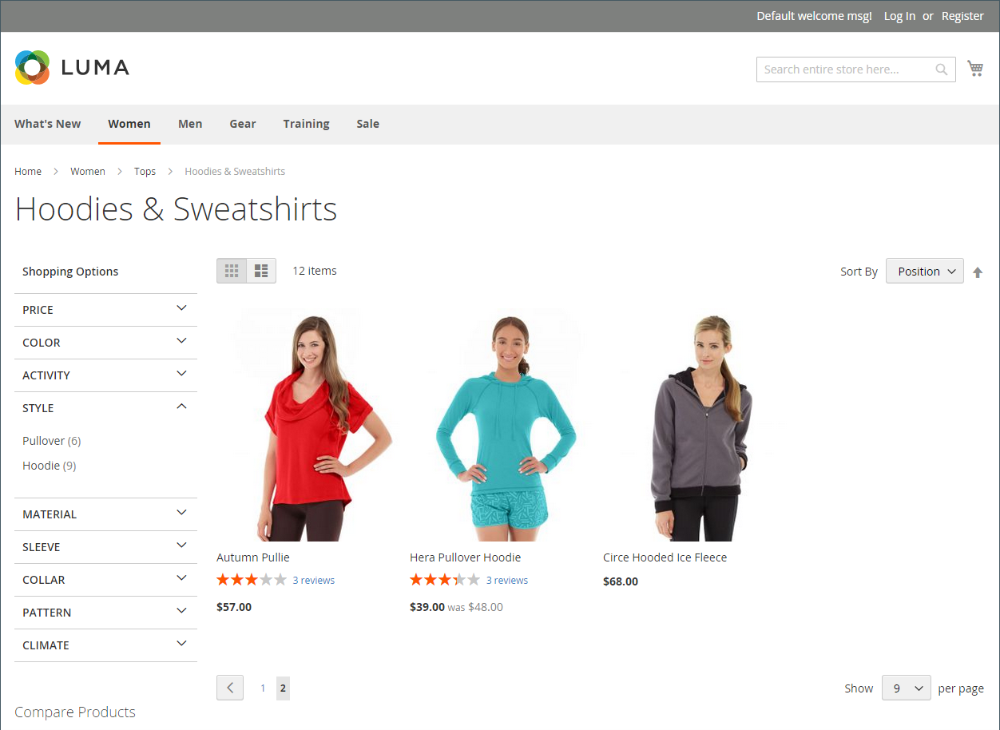
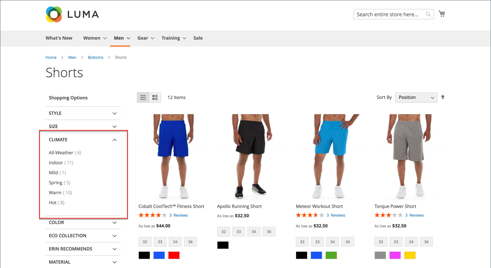
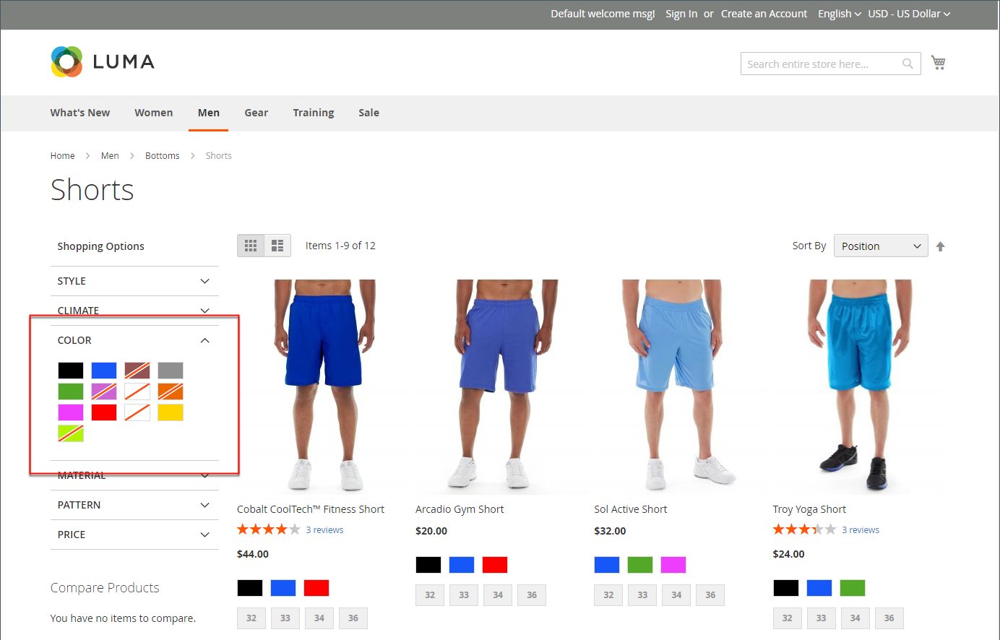
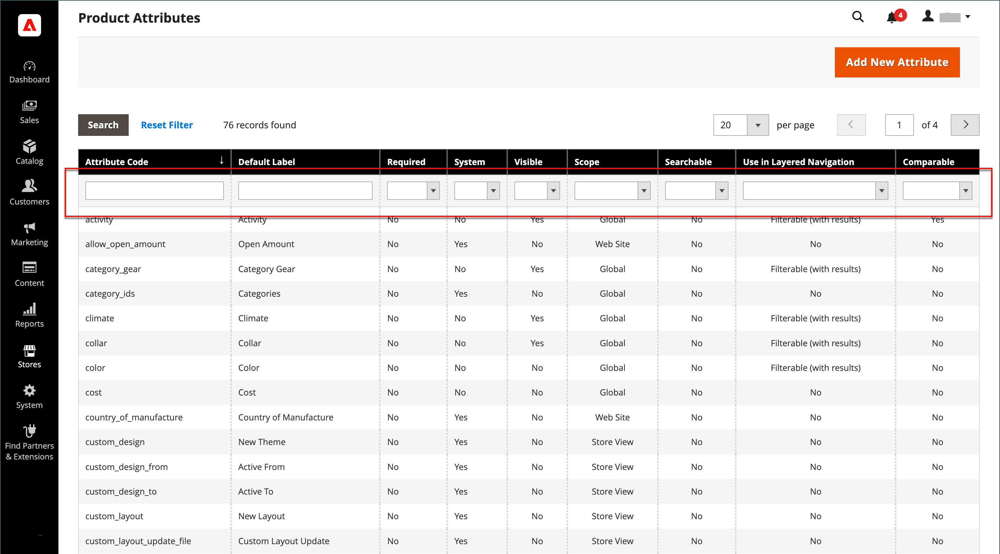
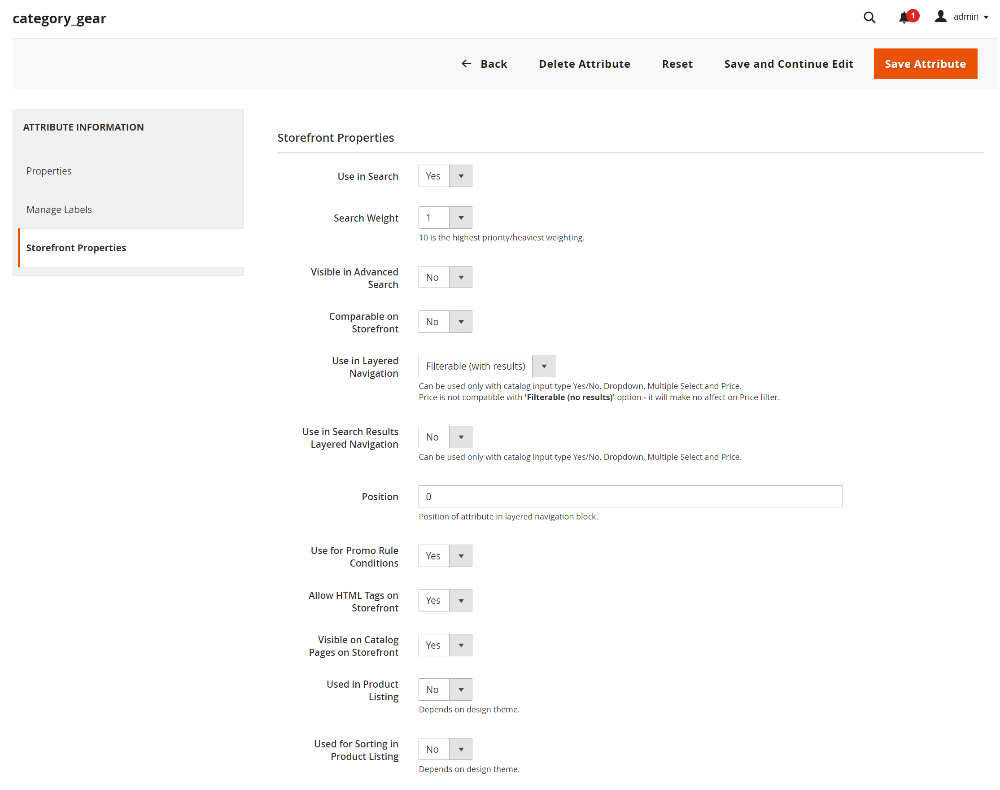
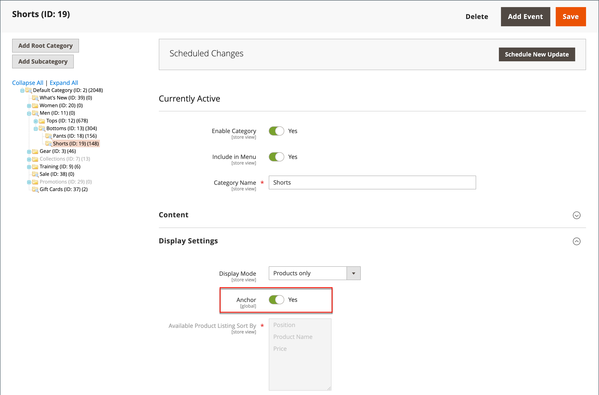
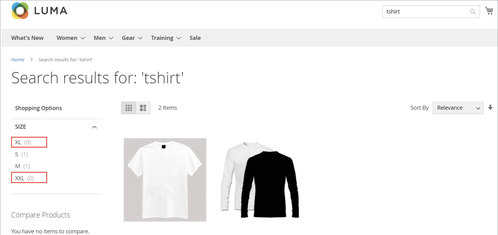
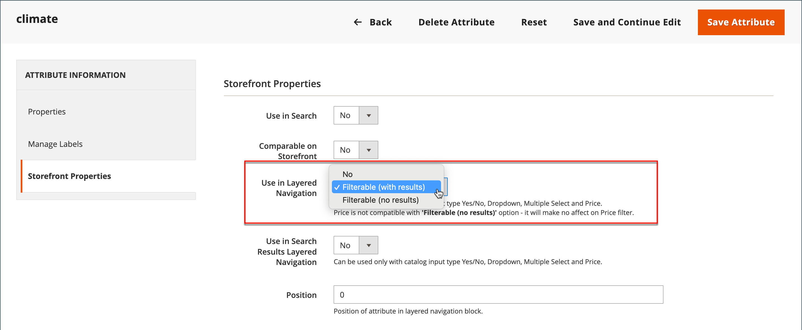
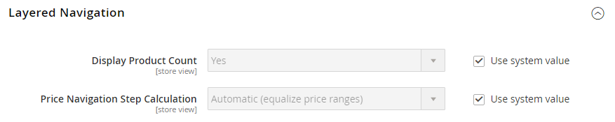

# 階層化されたナビゲーション

>[!NOTE]
>
>この節で説明する標準的な階層化されたナビゲーションは、[&#x200B; ファセット &#x200B;](https://experienceleague.adobe.com/en/docs/commerce/live-search/live-search-admin/facets/facets)を持つライブサーチのフィルターナビゲーションとは異なります。

階層化されたナビゲーションにより、カテゴリー、価格帯、その他の利用可能な属性にもとづいて、商品を簡単に見つけることができます。 階層化されたナビゲーションは、通常、検索結果ページとカテゴリーページの左側の列、場合によってはホームページに表示されます。 標準ナビゲーションには、カテゴリと価格帯の&#x200B;_買い物_ リストが含まれています。 商品の数や価格帯など、階層化されたナビゲーションの表示を設定できます。

{width="700" zoomable="yes"}

## フィルター可能な属性

>[!NOTE]
>
>このトピックで説明するフィルター可能な属性要件は、[&#x200B; ライブサーチ &#x200B;](https://experienceleague.adobe.com/en/docs/commerce/live-search/overview)で異なります。 詳しくは、[&#x200B; ファセット &#x200B;](https://experienceleague.adobe.com/en/docs/commerce/live-search/live-search-admin/facets/facets)を参照してください。

階層化されたナビゲーションを使用して、カテゴリ別または属性別に商品を検索できます。 例えば、買い物客が上部ナビゲーションから「メンズ/ショートパンツ」カテゴリを選択すると、最初の結果にはカテゴリ内のすべての商品が含まれます。 特定のスタイル、気候、色、素材、パターン、価格（または値の組み合わせ）を選択して、リストをさらにフィルタリングできます。 フィルター可能な属性は、各属性値を一覧表示する拡張セクションに表示されます。 オプションとして、一致する結果を持つ製品のリストを、一致する製品を含めるか、一致しない製品を含めるように設定できます。

属性プロパティと製品入力タイプを組み合わせることで、階層化されたナビゲーションに使用できる属性を決定します。 階層化されたナビゲーションは、[_アンカー_](categories-display-settings.md) カテゴリでのみ使用できますが、検索結果ページにも追加できます。 各属性のストア所有者&#x200B;**プロパティの** カタログ入力タイプは、`Yes/No`、`Dropdown`、`Multiple Select`または`Price`に設定する必要があります。 属性をフィルター可能にするには、それぞれの「**レイヤーナビゲーションで使用**」プロパティを`Filterable (with results)`または`Filterable (no results)`のいずれかに設定する必要があります。

_例：結果を持つフィルター可能な属性_

{width="700" zoomable="yes"}

_例：フィルター可能なスウォッチ値が結果なしで表示される_

{width="700" zoomable="yes"}

次の手順では、フィルター可能な属性を使用して基本的なレイヤーナビゲーションを設定する方法を示します。 価格ステップを使用した高度な階層化ナビゲーションについては、[価格ナビゲーション &#x200B;](navigation-layered.md#configure-price-navigation)を参照してください。

## 手順1：属性プロパティの設定

1. _管理者_ サイドバーで、**[!UICONTROL Stores]** > _[!UICONTROL Attributes]_>**[!UICONTROL Product]**&#x200B;に移動します。

1. フィルター検索を参照または使用してリスト内の属性を検索し、編集モードで開きます。

   {width="700" zoomable="yes"}

1. 左側のパネルで、**[!UICONTROL Storefront Properties]**&#x200B;を選択し、**[!UICONTROL Use In Layered Navigation]**&#x200B;を次のいずれかに設定します。

   - `Filterable (with results)` – 階層化されたナビゲーションには、一致する製品が見つかるフィルターのみが含まれます。 リストに表示されているすべての製品に既に適用されている属性値は、引き続き使用可能なフィルターとして表示されます。 0個の製品の一致のカウントを持つ属性値は、使用可能なフィルターのリストから省略されます。 フィルターリストには、フィルターに一致する商品のみが含まれます。 製品リストは、選択したフィルターが表示される内容を変更した場合にのみ更新されます。

   - `Filterable (no results)` – 使用できるすべての属性値とその製品数に対するフィルターが、0の一致を持つ製品が存在する場合でも、階層化されたナビゲーションに表示されます。 属性値がスウォッチの場合、フィルターは表示されますが、除外されます。 このオプションは、価格別フィルタリングをサポートしておらず、価格フィルターには影響しません。

1. **[!UICONTROL Use In Search Results Layered Navigation]**&#x200B;を`Yes`に設定します。

   {width="600" zoomable="yes"}

1. 階層化されたナビゲーションに含める属性ごとに、これらの手順を繰り返します。

>[!NOTE]
>
>- _[!UICONTROL Use in Search]_&#x200B;設定が`No`に設定されている場合、_[!UICONTROL Use in Search Results Layered Navigation]_&#x200B;設定は表示されません。この場合、[!UICONTROL Use in Layered Navigation]設定に関係なく、product属性は検索に使用されません。
>
>- デフォルトでは、[!UICONTROL Position] フィールドはグレー表示になっています。 この設定を変更するには、属性を保存する必要があります。

## 手順2：カテゴリをアンカーにする

1. _管理者_ サイドバーで、**[!UICONTROL Catalog]** > **[!UICONTROL Categories]**&#x200B;に移動します。

1. カテゴリーツリーで、階層化されたナビゲーションを使用するカテゴリを選択します。

1. **[!UICONTROL Display Settings]** セクションのを展開し、**[!UICONTROL Anchor]**&#x200B;を`Yes`に設定します。

   {width="600" zoomable="yes"}

1. **[!UICONTROL Save]**&#x200B;をクリックします。

## 手順3：結果のテスト

設定をテストするには、ストアにアクセスし、メインメニューからカテゴリに移動します。 フィルター可能な属性の選択は、カテゴリーページのレイヤーナビゲーションに表示されます。

表示された商品を検索、フィルタリング、レビューします。

## レイヤー化されたナビゲーションからのフィルター可能な属性値の削除

階層化されたナビゲーションには、使用可能なすべての属性値とその製品数に関するフィルターが含まれ、製品の一致がゼロ（0）の製品も含まれます（次の画像を参照）。

{width="700" zoomable="yes"}

この結果、顧客は好みの商品を選択するのが難しく、フロントエンドに商品が0個の&#x200B;属性値を表示する必要&#x200B;ありません。

次の手順を使用して、0製品のフィルター可能な属性値を階層化ナビゲーションから削除できます。

1. _管理者_ サイドバーで、**[!UICONTROL Stores]** > _[!UICONTROL Attributes]_>**[!UICONTROL Product]**&#x200B;に移動します。

1. フィルター検索を参照または使用してリスト内の属性を検索し、編集モードで開きます。

1. _[!UICONTROL Attribute Information]_&#x200B;で、**[!UICONTROL Storefront Properties]**&#x200B;をクリックします。

1. **[!UICONTROL Layered Navigation]**&#x200B;に対して、`Filterable (with results)`を選択します。

   {width="600" zoomable="yes"}

1. **[!UICONTROL Save Attribute]**&#x200B;をクリックします。

## 価格ナビゲーション

>[!NOTE]
>
>この節で説明する価格ナビゲーションの設定は、[&#x200B; ファセット &#x200B;](https://experienceleague.adobe.com/en/docs/commerce/live-search/live-search-admin/facets/facets)を持つライブサーチのフィルターナビゲーションとは異なります。

価格ナビゲーションを使用すると、階層化されたナビゲーションで価格帯ごとに商品を配布できます。 また、各範囲を間隔で分割することもできます。 価格ナビゲーションを計算するには、いくつかの方法があります。

- 自動（価格範囲を等しくする）
- 自動（製品数を等しくする）
- 手動

>[!BEGINSHADEBOX]

階層化されたナビゲーションで価格でフィルタリングする場合、Adobe Commerceでは、設定可能な製品の子商品の最低価格を使用します。 そのため、設定可能な商品は、一部の子商品の価格が高い場合でも、子商品の最低価格帯にしか表示されません。

>[!ENDSHADEBOX]

最初のふたつの方法では、ナビゲーションステップが自動的に計算されます。 手動メソッドでは、価格間隔の除算制限を指定できます。 次の例は、価格ナビゲーションステップ 10と100の違いを示しています。

反復的な分割は、価格帯の間で製品の最高の分布を提供します。 0.00～99 ドルの範囲を選択した後、いくつかのサブレンジの価格をドリルダウンできます。 価格範囲分割は、製品の数が区間分割制限で設定されたしきい値に達すると停止します。

## 例：価格ナビゲーションステップ

| 価格ステップ 10 | 価格ステップ 100 |
|----------|--------|
| $20.00 - $29.99 (1) | $0.00 - $99.99 (4) |
| $30.00 - $39.99 (2) | $100 - $199.99 (5) |
| $70.00 - $79.99 (1) | $400.00 - $499.99 (2) |
| $100.00 - $109.99 (1) | 700 ドル以上（1） |
| $120.00 - $129.99 (2) |   |
| $150.00 - $159.99 (1) |   |
| $180.00 - $189.99 (1) |   |
| $420.00 - $429.99 (1) |   |
| $440.00 - $449.99 (1) |   |
| 710.00 ドル以上（1） |   |

{style="table-layout:auto"}

## 価格ナビゲーションの設定

>[!IMPORTANT]
>
>階層化されたナビゲーションの&#x200B;_価格フィルター_&#x200B;に従って商品とその価格を正しく表示するには、[消費税設定](../configuration-reference/sales/tax.md)の価格表示の設定が同じ値（`Excluding Tax` **または** `Including Tax`）であることを確認してください。 _[!UICONTROL Calculation Settings]_&#x200B;について、**[!UICONTROL Catalog Prices]**&#x200B;値を確認してください。_[!UICONTROL Price Display Settings]_&#x200B;の場合、**[!UICONTROL Display Product Prices in Catalog]**&#x200B;値を確認します。 これらの値が異なる場合、階層化されたナビゲーションの価格フィルターは、商品を適切にフィルタリングして価格で並べ替えないことがあります。

1. _管理者_ サイドバーで、**[!UICONTROL Stores]** > _[!UICONTROL Settings]_>**[!UICONTROL Configuration]**&#x200B;に移動します。

1. 左側のパネルで「**[!UICONTROL Catalog]**」を展開し、下の「**[!UICONTROL Catalog]**」を選択します。

1. _階層化ナビゲーション_ セクションのを展開します。

   デフォルトでは、**[!UICONTROL Display Product Count]**&#x200B;は`Yes`に設定されています。 必要に応じて、**[!UICONTROL Use system value]** チェックボックスの選択を解除して、この設定を変更します。

   {width="600" zoomable="yes"}

   これらの設定オプションの詳細なリストについては、_設定リファレンス_&#x200B;の[階層化ナビゲーション &#x200B;](../configuration-reference/catalog/catalog.md#layered-navigation)を参照してください。

1. 次のセクションのいずれかのメソッドに&#x200B;**[!UICONTROL Price Navigation Steps Calculation]**&#x200B;を設定します。

1. 完了したら、**[!UICONTROL Save Config]**&#x200B;をクリックします。

### 方法1：自動（価格範囲を等しくする）

**[!UICONTROL Price Navigation Steps Calculation]**&#x200B;を`Automatic (Equalize Price Ranges)`に設定します（デフォルト）。 この設定では、価格ナビゲーションに標準アルゴリズムを使用します。

### 方法2：自動（製品数を等しくする）

>[!TIP]
>
>必要に応じて、まず&#x200B;**[!UICONTROL Use system value]** チェックボックスの選択を解除して、これらの設定を変更します。

1. **[!UICONTROL Price Navigation Steps Calculation]**&#x200B;を`Automatic (equalize product counts)`に設定します。

1. 同じ価格の複数の製品がある場合に単一の価格を表示するには、**[!UICONTROL Display Price Interval as One Price]**&#x200B;を`Yes`に設定します。

1. **[!UICONTROL Interval Division Limit]**&#x200B;に、価格範囲内の製品数のしきい値を入力します。

   範囲をこの制限を超えて分割することはできません。 デフォルト値は`9`です。

   {width="600" zoomable="yes"}

### 方法3：手動

>[!NOTE]
>
>必要に応じて、まず&#x200B;**[!UICONTROL Use system value]** チェックボックスの選択を解除して、これらの設定を変更します。

1. **[!UICONTROL Price Navigation Steps Calculation]**&#x200B;を`Manual`に設定します。

1. **[!UICONTROL Default Price Navigation Step]**&#x200B;を決定する値を入力します。

1. 許可されている&#x200B;**[!UICONTROL Maximum Number of Price Intervals]**&#x200B;を入力してください（最大`100`）。

   {width="600" zoomable="yes"}

## レイヤー化されたナビゲーションの設定

>[!NOTE]
>
>この節で説明する標準的な階層化されたナビゲーションは、[&#x200B; ファセット &#x200B;](https://experienceleague.adobe.com/en/docs/commerce/live-search/live-search-admin/facets/facets)を持つライブサーチのフィルターナビゲーションとは異なります。

階層型ナビゲーション設定は、各属性の後に商品数が括弧内に表示されるかどうか、および価格ナビゲーションに使用されるステップ計算のサイズを決定します。

1. _管理者_ サイドバーで、**[!UICONTROL Stores]** > _[!UICONTROL Settings]_>**[!UICONTROL Configuration]**&#x200B;に移動します。

1. 左側のパネルで「_[!UICONTROL Catalog]_」セクションを展開し、下の「**[!UICONTROL Catalog]**」を選択します。

1. _[!UICONTROL Layered Navigation]_&#x200B;セクションを展開します。

   >[!NOTE]
   >
   >必要に応じて、まず&#x200B;**[!UICONTROL Use system value]** チェックボックスの選択を解除して、これらの設定を変更します。

1. 各属性に見つかった製品数を表示するには、**[!UICONTROL Display Product Count]**&#x200B;を`Yes`に設定します。

1. **[!UICONTROL Price Navigation Step Calculation]**&#x200B;を`Automatic (equalize price ranges)`に設定します。

1. 完了したら、**[!UICONTROL Save Config]**&#x200B;をクリックします。
