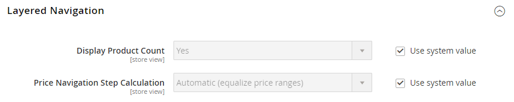

# レイヤーナビゲーション

>[!NOTE]
>
>この節で説明する標準レイヤーナビゲーションは、 [ファセット](https://experienceleague.adobe.com/docs/commerce-merchant-services/live-search/live-search-admin/facets/facets.html).

階層型ナビゲーションにより、カテゴリ、価格帯、その他の使用可能な属性に基づいて、製品を簡単に見つけることができます。 レイヤーナビゲーションは、通常、検索結果ページとカテゴリページの左列に表示され、ホームページにも表示されます。 標準ナビゲーションには、 _購入者_ カテゴリと価格範囲のリスト。 製品数や価格帯など、レイヤーナビゲーションの表示を設定できます。

{width="700" zoomable="yes"}

## フィルター可能な属性

>[!NOTE]
>
>このトピックで説明するフィルター可能な属性の要件は、 [ライブ検索](https://experienceleague.adobe.com/docs/commerce-merchant-services/live-search/overview.html). 詳しくは、 [ファセット](https://experienceleague.adobe.com/docs/commerce-merchant-services/live-search/live-search-admin/facets/facets.html).

レイヤーナビゲーションを使用して、カテゴリ別または属性別に製品を検索できます。 例えば、買い物客が上部のナビゲーションから Mens/Shorts カテゴリを選択した場合、最初の結果にはカテゴリ内のすべての製品が含まれます。 特定のスタイル、気候、色、素材、パターン、価格を選択するか、値の組み合わせを選択することで、リストをさらにフィルタリングできます。 フィルタリング可能な属性は、各属性値をリストする展開セクションに表示されます。 オプションとして、一致する結果を持つ製品のリストを、一致する製品を含めるか、一致しない製品を含めるように設定できます。

属性プロパティと製品入力タイプを組み合わせて、レイヤーナビゲーションに使用できる属性を決定します。 レイヤーナビゲーションは、次の場合にのみ使用できます。 [_アンカー_](categories-display-settings.md) カテゴリに追加できますが、検索結果ページに追加することもできます。 The **ストア所有者のカタログ入力タイプ** 各属性のプロパティは、 `Yes/No`, `Dropdown`, `Multiple Select`または `Price`. 属性をフィルタリング可能にするには、 **レイヤーナビゲーションで使用** プロパティを次のいずれかに設定する必要があります： `Filterable (with results)` または `Filterable (no results)`.

_例：結果を含むフィルタリング可能な属性_

{width="700" zoomable="yes"}

_例：フィルタリング可能なスウォッチ値が結果なしで表示される_

{width="700" zoomable="yes"}

次の手順は、フィルタ可能な属性を持つ基本的なレイヤーナビゲーションを設定する方法を示しています。 価格ステップを含む高度な階層ナビゲーションについては、 [価格ナビゲーション](navigation-layered.md#configure-price-navigation).

## 手順 1：属性プロパティを設定する

1. 次の日： _管理者_ サイドバー、移動 **[!UICONTROL Stores]** > _[!UICONTROL Attributes]_>**[!UICONTROL Product]**.

1. フィルターされた検索を参照または使用してリスト内の属性を検索し、編集モードで開きます。

   {width="700" zoomable="yes"}

1. 左側のパネルで、を選択します。 **[!UICONTROL Storefront Properties]** と設定します。 **[!UICONTROL Use In Layered Navigation]** を次のいずれかに変更します。

   - `Filterable (with results)`  — レイヤーナビゲーションには、一致する製品が見つかるフィルターのみが含まれます。 リストに表示されるすべての製品に既に適用されている属性値は、引き続き使用可能なフィルターとして表示されます。 製品の一致数が 0（ゼロ）の属性値は、使用可能なフィルターのリストから除外されます。 フィルターされたリストには、フィルターに一致する製品のみが含まれます。 製品リストは、選択したフィルターで表示内容が変更された場合にのみ更新されます。

   - `Filterable (no results)`  — レイヤーナビゲーションには、0（ゼロ）個の製品が一致する製品を含め、使用可能なすべての属性値とその製品数に対するフィルターが含まれます。 アトリビュート値がスウォッチの場合、値はフィルタとして表示されますが、x 印で消されます。 価格レイヤーフィルターは、このオプションではサポートされず、価格フィルターには影響しません。

1. 設定 **[!UICONTROL Use In Search Results Layered Navigation]** から `Yes`.

   {width="600" zoomable="yes"}

1. レイヤーナビゲーションに含める各属性に対して、これらの手順を繰り返します。

>[!NOTE]
>
>The [!UICONTROL Position] フィールドはデフォルトでグレー表示になっているので、この設定を変更する前に属性を保存する必要があります。

## 手順 2：カテゴリをアンカーにする

1. 次の日： _管理者_ サイドバー、移動 **[!UICONTROL Catalog]** > **[!UICONTROL Categories]**.

1. カテゴリツリーで、レイヤーナビゲーションを使用するカテゴリを選択します。

1. 展開  の **[!UICONTROL Display Settings]** セクションとセット **[!UICONTROL Anchor]** から `Yes`.

   {width="600" zoomable="yes"}

1. クリック **[!UICONTROL Save]**.

## 手順 3：結果のテスト

設定をテストするには、ストアにアクセスして、メインメニューからカテゴリに移動します。 フィルタリング可能な属性の選択が、カテゴリページのレイヤーナビゲーションに表示されます。

表示された製品を検索、フィルタリング、確認します。

## レイヤーナビゲーションからフィルタリング可能な属性値を削除

レイヤーナビゲーションには、0（ゼロ）個の製品が一致する製品を含む、使用可能なすべての属性値とその製品数に対するフィルタが含まれます（次の図を参照）。

{width="700" zoomable="yes"}

この結果、顧客が優先商品を選択するのが困難になる可能性があり、フロントエンドに 0 個の商品を含む属性値を表示する必要がなくなりま&#x200B;す。

次の手順を使用して、レイヤー化されたナビゲーションから 0 プロダクトのフィルタリング可能な属性値を削除できます。

1. 次の日： _管理者_ サイドバー、移動 **[!UICONTROL Stores]** > _[!UICONTROL Attributes]_>**[!UICONTROL Product]**.

1. フィルターされた検索を参照または使用してリスト内の属性を検索し、編集モードで開きます。

1. の下 _[!UICONTROL Attribute Information]_をクリックし、**[!UICONTROL Storefront Properties]**.

1. の場合 **[!UICONTROL Layered Navigation]**&#x200B;を選択します。 `Filterable (with results)`.

   {width="600" zoomable="yes"}

1. クリック **[!UICONTROL Save Attribute]**.

## 価格ナビゲーション

>[!NOTE]
>
>このトピックで説明する価格ナビゲーション設定は、次の項目で異なります。 [ライブ検索](https://experienceleague.adobe.com/docs/commerce-merchant-services/live-search/overview.html).

価格ナビゲーションを使用して、階層化されたナビゲーションで価格帯別に製品を配布できます。 また、各範囲を間隔で分割することもできます。 価格ナビゲーションを計算する方法はいくつかあります。

- 自動（価格範囲の等化）
- 自動（製品数を均等化）
- 手動

最初の 2 つの方法では、ナビゲーション手順が自動的に計算されます。 手動メソッドを使用すると、価格間隔の除算の制限を指定できます。 次の例は、価格ナビゲーション手順の 10 と 100 の違いを示しています。

繰り返し分割は、価格範囲間で最適な製品の分布を提供します。 繰り返し分割を使用して、$0.00～$99 の範囲を選択した後、顧客は複数の下位範囲の価格を掘り下げることができます。 価格範囲分割は、製品数が「区分限度」で設定されたしきい値に達すると停止します。

## 例：価格ナビゲーションの手順

| 価格ステップ — 10 別 | 100 単位の価格ステップ |
|----------|--------|
| $20.00 - $29.99 (1) | $0.00 - $99.99 (4) |
| $30.00 - $39.99 (2) | $100 - $199.99 (5) |
| $70.00 - $79.99 (1) | $400.00 - $499.99 (2) |
| $100.00 - $109.99 (1) | 700.00 ドル以上 (1) |
| $120.00 - $129.99 (2) |   |
| $150.00 - $159.99 (1) |   |
| $180.00 - $189.99 (1) |   |
| $420.00 - $429.99 (1) |   |
| $440.00 - $449.99 (1) |   |
| $710.00 以上 (1) |   |

{style="table-layout:auto"}

## 価格ナビゲーションの設定

>[!IMPORTANT]
>
>商品とその価格を、 _価格フィルター_ レイヤー化されたナビゲーションで、価格の設定が [消費税構成](../configuration-reference/sales/tax.md) 同じ値 (`Excluding Tax` **または** `Including Tax`) をクリックします。 の _[!UICONTROL Calculation Settings]_、**[!UICONTROL Catalog Prices]**の値です。 および_[!UICONTROL Price Display Settings]_、 **[!UICONTROL Display Product Prices in Catalog]** の値です。 値が異なる場合は、階層化されたナビゲーションの価格フィルターで、製品を正しくフィルタリングして価格で並べ替えることができない場合があります。

1. 次の日： _管理者_ サイドバー、移動 **[!UICONTROL Stores]** > _[!UICONTROL Settings]_>**[!UICONTROL Configuration]**.

1. 左側のパネルで、を展開します。 **[!UICONTROL Catalog]** を選択します。 **[!UICONTROL Catalog]** の下に

1. 展開  の _レイヤーナビゲーション_ 」セクションに入力します。

   デフォルトでは、 **[!UICONTROL Display Product Count]** が `Yes`. 必要に応じて、「 **[!UICONTROL Use system value]** この設定を変更するには、チェックボックスを使用します。

   {width="600" zoomable="yes"}

   これらの設定オプションの詳細なリストについては、 [レイヤーナビゲーション](../configuration-reference/catalog/catalog.md#layered-navigation) （内） _設定リファレンス_.

1. 設定 **[!UICONTROL Price Navigation Steps Calculation]** を参照してください。

1. 完了したら、「 **[!UICONTROL Save Config]**.

### 方法 1：自動（価格範囲のイコライズ）

終了 **[!UICONTROL Price Navigation Steps Calculation]** に設定 `Automatic (Equalize Price Ranges)` （デフォルト）。 この設定では、価格ナビゲーションに標準アルゴリズムを使用します。

### 方法 2：自動（製品数をイコライズ）

>[!TIP]
>
>必要に応じて、まず **[!UICONTROL Use system value]** チェックボックスを使用して、これらの設定を変更できます。

1. 設定 **[!UICONTROL Price Navigation Steps Calculation]** から `Automatic (equalize product counts)`.

1. 同じ価格の複数の製品を表示する場合に単一の価格を表示するには、 **[!UICONTROL Display Price Interval as One Price]** から `Yes`.

1. の場合 **[!UICONTROL Interval Division Limit]**」には、価格範囲内の製品数のしきい値を入力します。

   範囲は、この制限を超えて分割することはできません。 デフォルト値は `9`.

   {width="600" zoomable="yes"}

### 方法 3：手動

>[!NOTE]
>
>必要に応じて、まず **[!UICONTROL Use system value]** チェックボックスを使用して、これらの設定を変更できます。

1. 設定 **[!UICONTROL Price Navigation Steps Calculation]** から `Manual`.

1. を決定する値を入力します。 **[!UICONTROL Default Price Navigation Step]**.

1. 次を入力します。 **[!UICONTROL Maximum Number of Price Intervals]** 許可、最大 `100`.

   {width="600" zoomable="yes"}

## レイヤーナビゲーションの設定

>[!NOTE]
>
>このページで説明する標準設定は、次の点で異なります。 [ライブ検索](https://experienceleague.adobe.com/docs/commerce-merchant-services/live-search/overview.html).

レイヤーナビゲーション設定では、各属性の後の括弧内に製品数が表示されるかどうか、および価格ナビゲーションで使用されるステップ計算のサイズが決定されます。

1. 次の日： _管理者_ サイドバー、移動 **[!UICONTROL Stores]** > _[!UICONTROL Settings]_>**[!UICONTROL Configuration]**.

1. 左側のパネルで、を展開します。 _[!UICONTROL Catalog]_「 」セクションで「 」を選択します。**[!UICONTROL Catalog]**の下に

1. を展開します。 _[!UICONTROL Layered Navigation]_」セクションに入力します。

   >[!NOTE]
   >
   >必要に応じて、まず **[!UICONTROL Use system value]** チェックボックスを使用して、これらの設定を変更できます。

1. 各属性で見つかった製品数を表示するには、 **[!UICONTROL Display Product Count]** から `Yes`.

1. 設定 **[!UICONTROL Price Navigation Step Calculation]** から `Automatic (equalize price ranges)`.

1. 完了したら、「 **[!UICONTROL Save Config]**.
