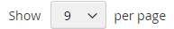

# 製品リスト

製品リストは、デフォルトでリストまたはグリッドとして表示されるように設定できます。 また、1 ページに表示する製品数や、リストの並べ替えに使用する属性を指定することもできます。 製品リストには、製品の並べ替え、リストの形式の変更、属性別の並べ替え、ページ間の移動に使用できる一連のコントロールが含まれています。

>[!NOTE]
>
>カテゴリを製品属性で並べ替える場合、同じ属性値を持つ製品も _[!UICONTROL Product ID]_の昇順で並べ替えられます。

{width="700" zoomable="yes"}

## 製品リストの設定

1. _管理者_ サイドバーで、**[!UICONTROL Stores]**/_[!UICONTROL Settings]_/**[!UICONTROL Configuration]**に移動します。

1. 左側のパネルで「**[!UICONTROL Catalog]**」を展開し、その下の「**[!UICONTROL Catalog]**」を選択します。

1. 「」を展開し、「**[!UICONTROL Storefront]**」セクションを展開します。

   {width="600" zoomable="yes"}

   これらのオプションの詳細なリストについては、「設定リファレンス ](../configuration-reference/catalog/catalog.md#storefront) の [ ストアフロント _を参照してください_。

   >[!NOTE]
   >
   >_製品を価格で並べ替える_ に従って製品とその価格を正しく表示するには、[ 消費税の構成 ](../configuration-reference/sales/tax.md) に表示される価格の設定が同じ値であることを確認してください（`Excluding Tax` **または** `Including Tax`）。 _[!UICONTROL Calculation Settings]_の場合は、**[!UICONTROL Catalog Prices]**の値を確認します。 また、_[!UICONTROL Price Display Settings]_ の場合は、**[!UICONTROL Display Product Prices in Catalog]** の値を確認します。 これらの値が異なる場合、レイヤーナビゲーションの価格フィルターでは、製品を価格別に適切にフィルタリングして並べ替えることができない場合があります。

1. デフォルトの **[!UICONTROL List Mode]** を次のいずれかに設定します。

   - `Grid Only`
   - `List Only`
   - `Grid (default) / List`
   - `List (default / Grid`

1. **[!UICONTROL Products per Page on Grid Allowed Values]**：グリッド形式で表示されたときに 1 ページに表示する製品の数を入力します。

   選択した値を入力するには、各数値をコンマで区切ります。

1. **[!UICONTROL Products per Page on Grid Default Value]**:1 ページにつきグリッドに表示されるデフォルトの製品数を入力します。

1. **[!UICONTROL Products per Page on List Allowed Values]**：リスト形式で表示される場合に、1 ページに表示する製品数を入力します。

   選択した値を入力するには、各数値をコンマで区切ります。

1. **[!UICONTROL Products per page on List Default Value]**：ページごとにリストに表示されるデフォルトの製品数を入力します。

1. リストの並べ替えに最初に使用されるデフォルトの属性に **[!UICONTROL Product Listing Sorted by]** を設定します。

1. 顧客にすべての製品を一覧表示するオプションを与えるには、**[!UICONTROL Allow All Products on Page]** を `Yes` に設定します。

1. 顧客がカタログリストを参照しても、すべてのページネーション設定を保持する場合は、「**[!UICONTROL Remember Category Pagination]**」を「`Yes`」に設定します。

   この設定を有効にすると、買い物客がカテゴリ間を参照しても、リストまたはグリッドに表示される製品数が保持されます。 デフォルトでは、このフィールドは `No` に設定されています。これは、より多くのキャッシュストレージを使用し、検索エンジンによるページのインデックス作成方法に影響を与える可能性があるためです。

1. [ フラットカタログ ](catalog-flat.md) を使用する場合（**推奨しません**）、次の操作を行います。

   - 製品のフラット・カテゴリ・リストを表示するには、**[!UICONTROL Use Flat Catalog Category]** を `Yes` に設定します。

   - フラットな製品リストを表示するには、**[!UICONTROL Use Flat Catalog Product]** を `Yes` に設定します。

1. カテゴリ URL と製品 URL のメディアアセットに対して動的参照を許可する場合は、**[!UICONTROL Allow Dynamic Media URLs in Products and Categories]** を `Yes` に設定します。

1. 完了したら、「**[!UICONTROL Save Config]**」をクリックします。

## ページコントロール

| 制御 | 説明 |
|--- |--- |
| [!UICONTROL View As] | 商品をグリッド形式またはリスト形式で表示します。 |
| [!UICONTROL Sort By] | リストの並べ替え順を変更します。 |
| [!UICONTROL Show Per Page] | 1 ページに表示する製品の数を決定します。 |
| ページネーションリンク | ナビゲーションは、他のページにリンクしています。 |

{style="table-layout:auto"}

## ページネーションコントロール

ページネーション設定は、リストの上部および下部に表示され、製品リストのページネーションリンクの形式を制御します。 コントロールに表示されるリンクの数を設定し、[ 次へ ] リンクと [ 前へ ] リンクを構成できます。 ページネーションリンクを表示するには、製品リスト設定で 1 ページに許可されている数よりも多くの製品がリストに含まれている必要があります。

{width="700" zoomable="yes"}

### ストアフロントのページネーションコントロール

| 制御 | 説明 |
|--- |--- |
|  | [!UICONTROL View As] - リストをグリッド形式またはリスト形式で表示します。 |
|  | [!UICONTROL Sort By] - リストの並べ替え順を変更します。 _[!UICONTROL Used for Sorting in Product Listing]_storefront プロパティは、リストの並べ替えに使用できる [ 製品属性 ](../catalog/product-attributes.md) を決定します。 |
|  | [!UICONTROL Show Per Page] - ページごとに表示される製品の数を決定します。 |
|  | ページネーションリンク – 他のページへのナビゲーションリンク。 |

{style="table-layout:auto"}

### ページネーションコントロールの設定

1. _管理者_ サイドバーで、**[!UICONTROL Content]**/_[!UICONTROL Design]_/**[!UICONTROL Configuration]**に移動します。

1. 設定するストア表示を見つけ、「**[!UICONTROL Action]**」列の「**[!UICONTROL Edit]**」をクリックします。

1. 「**[!UICONTROL Other Settings]**」の下の「展開セレクター ![ 「**[!UICONTROL Pagination]**」セクション ](../assets/icon-display-expand.png) を展開します。

   {width="600" zoomable="yes"}

   これらの設定について詳しくは、「[ デザイン設定 ](../content-design/configuration.md)」を参照してください。

1. **[!UICONTROL Pagination Frame]**：ページネーションコントロールに表示するリンク数を入力します。

1. **[!UICONTROL Pagination Frame Skip]**: ページ番号コントロールに次のリンクのセットを表示する前にスキップするリンクの数を入力します。

   例えば、ページネーションフレームに 5 つのリンクがあり、次の 5 つのリンクにジャンプしたい場合、先にスキップするリンクの数はいくつですか？ 値を 4 （`4`）に設定した場合、前のセットからの最後のリンクが次のセットの最初のリンクになります。

1. **[!UICONTROL Anchor Text for Previous]**：前のリンクに表示するテキストを入力します。

   デフォルトの矢印を使用する場合は、空白のままにします。

1. **[!UICONTROL Anchor Text for Next]**：次のリンクに表示するテキストを入力します。 デフォルトの矢印を使用する場合は、空白のままにします。

1. 完了したら、「**[!UICONTROL Save Configuration]**」をクリックします。
