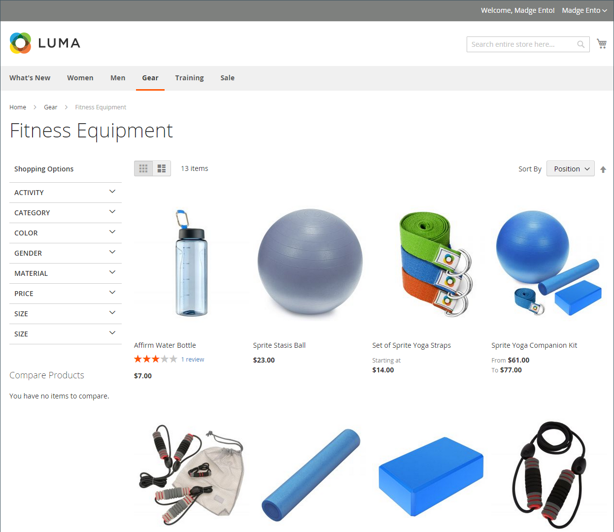
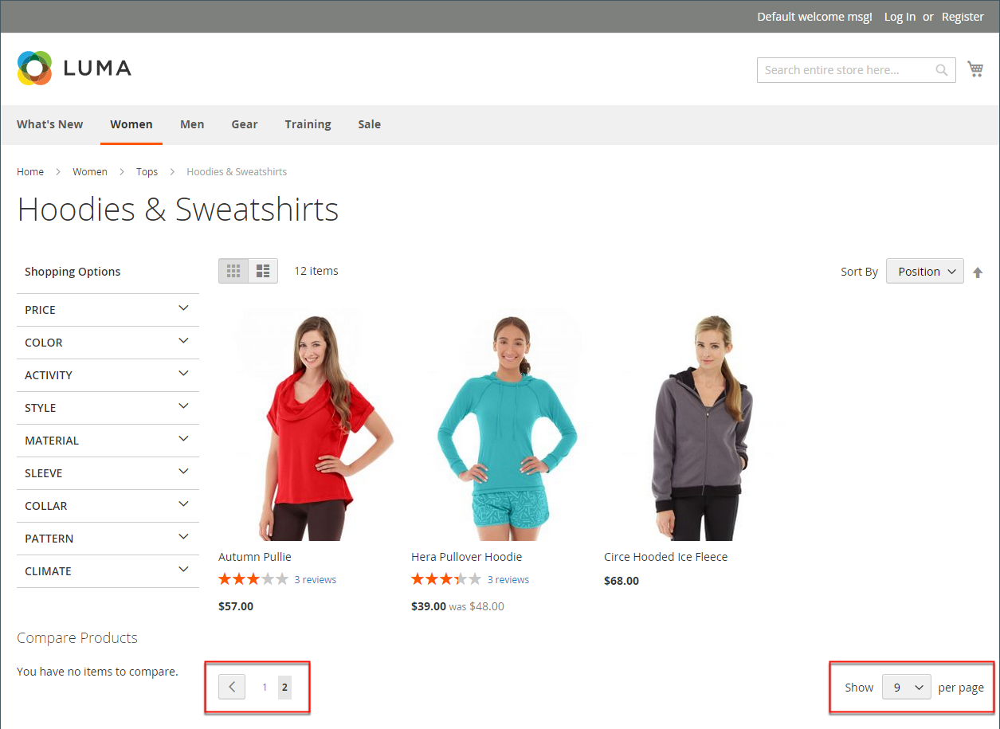
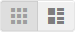
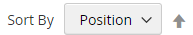
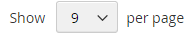
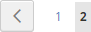
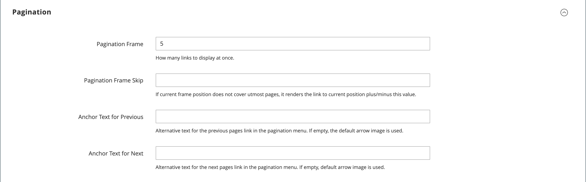

# 製品リスト

商品リストは、デフォルトでリストまたはグリッドとして表示するように設定できます。 また、ページごとに表示される製品の数と、リストの並べ替えに使用される属性を決定することもできます。 製品リストには、製品の並べ替え、リストの形式の変更、属性による並べ替え、あるページから次のページへの移動に使用できる一連のコントロールが含まれています。

>[!NOTE]
>
>カテゴリをproduct属性で並べ替える場合、同じ属性値を持つ製品も昇順で&#x200B;_[!UICONTROL Product ID]_で並べ替えられます。

{width="700" zoomable="yes"}

## 製品リストの設定

1. _管理者_ サイドバーで、**[!UICONTROL Stores]** > _[!UICONTROL Settings]_>**[!UICONTROL Configuration]**に移動します。

1. 左側のパネルで「**[!UICONTROL Catalog]**」を展開し、下の「**[!UICONTROL Catalog]**」を選択します。

1. **[!UICONTROL Storefront]** セクションのを展開します。

   {width="600" zoomable="yes"}

   これらのオプションの詳細なリストについては、_設定リファレンス_&#x200B;の[Storefront](../configuration-reference/catalog/catalog.md#storefront)を参照してください。

   >[!NOTE]
   >
   >商品とその価格を&#x200B;_商品の価格で並べ替えて_&#x200B;正しく表示するには、[消費税設定](../configuration-reference/sales/tax.md)の価格表示の設定が同じ値（`Excluding Tax` **または** `Including Tax`）であることを確認してください。 _[!UICONTROL Calculation Settings]_について、**[!UICONTROL Catalog Prices]**値を確認してください。_[!UICONTROL Price Display Settings]_&#x200B;の場合、**[!UICONTROL Display Product Prices in Catalog]**&#x200B;値を確認します。 これらの値が異なる場合、階層化されたナビゲーションの価格フィルターは、商品を適切にフィルタリングして価格で並べ替えないことがあります。

1. 既定の&#x200B;**[!UICONTROL List Mode]**&#x200B;を次のいずれかに設定します。

   - `Grid Only`
   - `List Only`
   - `Grid (default) / List`
   - `List (default / Grid`

1. **[!UICONTROL Products per Page on Grid Allowed Values]**&#x200B;に、グリッド形式で表示する場合に、ページごとに表示する商品の数を入力します。

   値の選択範囲を入力するには、各数値をコンマで区切ります。

1. **[!UICONTROL Products per Page on Grid Default Value]**&#x200B;の場合、1 ページあたりのグリッドに表示される商品のデフォルト数を入力します。

1. **[!UICONTROL Products per Page on List Allowed Values]**&#x200B;の場合、リスト形式で表示する場合に、ページごとに表示する製品の数を入力します。

   値の選択範囲を入力するには、各数値をコンマで区切ります。

1. **[!UICONTROL Products per page on List Default Value]**&#x200B;の場合、ページごとに、リストに表示される製品のデフォルト数を入力します。

1. **[!UICONTROL Product Listing Sorted by]**&#x200B;を、最初にリストの並べ替えに使用する既定の属性に設定します。

1. 顧客にすべての製品を一覧表示するオプションを提供するには、**[!UICONTROL Allow All Products on Page]**&#x200B;を`Yes`に設定します。

1. 顧客がカタログ リストを閲覧する際にすべてのページ設定を保持する場合は、**[!UICONTROL Remember Category Pagination]**&#x200B;を`Yes`に設定します。

   この設定を有効にすると、買い物客があるカテゴリから別のカテゴリに移動する際に、リストまたはグリッドに表示される商品数が保持されます。 デフォルトでは、このフィールドは`No`に設定されています。これは、より多くのキャッシュストレージを使用し、検索エンジンによるページのインデックス作成方法に影響を与える可能性があるためです。

1. [ フラットカタログ ](catalog-flat.md) （**推奨されません**）を使用する場合は、次の操作を行います。

   - 商品のフラット カテゴリ リストを表示するには、**[!UICONTROL Use Flat Catalog Category]**&#x200B;を`Yes`に設定します。

   - フラットな製品リストを表示するには、**[!UICONTROL Use Flat Catalog Product]**&#x200B;を`Yes`に設定します。

1. カテゴリおよび製品URL内のメディアアセットの動的参照を許可する場合は、**[!UICONTROL Allow Dynamic Media URLs in Products and Categories]**&#x200B;を`Yes`に設定します。

1. 完了したら、**[!UICONTROL Save Config]**&#x200B;をクリックします。

## ページコントロール

| 制御 | 説明 |
|--- |--- |
| [!UICONTROL View As] | 商品をグリッドまたはリスト形式で表示します。 |
| [!UICONTROL Sort By] | リストの並べ替え順序を変更します。 |
| [!UICONTROL Show Per Page] | ページごとに表示される製品数を指定します。 |
| ページネーションのリンク | ナビゲーションリンクを他のページに移動します。 |

{style="table-layout:auto"}

## ページネーション制御

ページネーション設定は、リストの上下に表示され、製品リストのページネーション リンクの形式を制御します。 コントロールに表示されるリンクの数を設定し、次と前のリンクを設定できます。 ページネーションリンクを表示するには、製品リストの設定でページごとに許可されている数よりも多くの製品がリストに含まれている必要があります。

{width="700" zoomable="yes"}

### ストアフロントのページネーション制御

| 制御 | 説明 |
|--- |--- |
|  | [!UICONTROL View As] - リストをグリッドまたはリスト形式で表示します。 |
|  | [!UICONTROL Sort By] - リストの並べ替え順序を変更します。 _[!UICONTROL Used for Sorting in Product Listing]_ストアフロントプロパティにより、リストの並べ替えに使用できる[製品属性](../catalog/product-attributes.md)が決まります。 |
|  | [!UICONTROL Show Per Page] - ページごとに表示される製品数を指定します。 |
|  | ページネーションリンク – 他のページへのナビゲーションリンク。 |

{style="table-layout:auto"}

### ページネーション コントロールの設定

1. _管理者_ サイドバーで、**[!UICONTROL Content]** > _[!UICONTROL Design]_>**[!UICONTROL Configuration]**に移動します。

1. 設定するストアビューを見つけ、**[!UICONTROL Action]**&#x200B;列で「**[!UICONTROL Edit]**」をクリックします。

1. **[!UICONTROL Other Settings]**&#x200B;で、**[!UICONTROL Pagination]** セクションのを展開します。

   {width="600" zoomable="yes"}

   これらの設定について詳しくは、[設定の設計](../content-design/configuration.md)を参照してください。

1. **[!UICONTROL Pagination Frame]**&#x200B;に、ページネーション コントロールに表示するリンクの数を入力します。

1. **[!UICONTROL Pagination Frame Skip]**&#x200B;の場合、ページ分割コントロールに次のリンクのセットを表示する前に、スキップするリンクの数を入力します。

   例えば、ページネーション枠に5つのリンクがあり、次の5つのリンクにジャンプする場合、先にスキップするリンクの数を指定します。 値を4 （`4`）に設定すると、前のセットからの最後のリンクが、次のセットの最初のリンクになります。

1. 「**[!UICONTROL Anchor Text for Previous]**」に、前のリンクに表示するテキストを入力します。

   デフォルトの矢印を使用するには、空白のままにします。

1. **[!UICONTROL Anchor Text for Next]**&#x200B;に、次のリンクに表示するテキストを入力します。 デフォルトの矢印を使用するには、空白のままにします。

1. 完了したら、**[!UICONTROL Save Configuration]**&#x200B;をクリックします。
