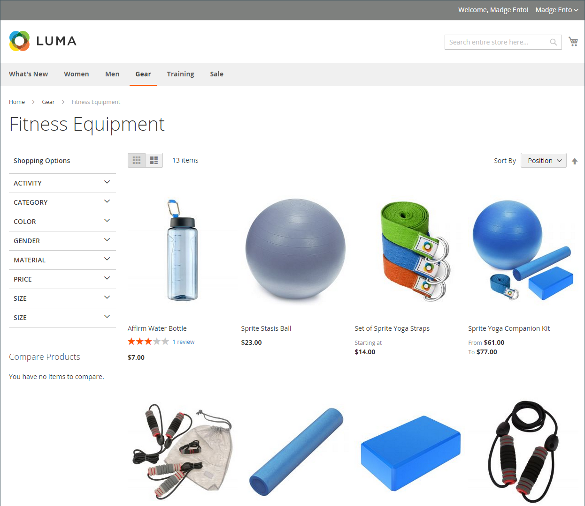

# 製品リスト

製品リストは、デフォルトでリストまたはグリッドとして表示されるように設定できます。 また、1 ページに表示する製品数や、リストの並べ替えに使用する属性を指定することもできます。 製品リストには、製品の並べ替え、リストの形式の変更、属性別の並べ替え、ページ間の移動に使用できる一連のコントロールが含まれています。

>[!NOTE]
>
>カテゴリを製品属性で並べ替える場合、属性値が同じ製品も _[!UICONTROL Product ID]_昇順。

{width="700" zoomable="yes"}

## 製品リストの設定

1. 日 _Admin_ サイドバー、に移動 **[!UICONTROL Stores]** > _[!UICONTROL Settings]_>**[!UICONTROL Configuration]**.

1. 左側のパネルで、を展開します **[!UICONTROL Catalog]** を選択します **[!UICONTROL Catalog]** その下に。

1. を展開  この **[!UICONTROL Storefront]** セクション。

   {width="600" zoomable="yes"}

   これらのオプションの詳細なリストについては、を参照してください [ストアフロント](../configuration-reference/catalog/catalog.md#storefront) が含まれる _設定リファレンス_.

   >[!NOTE]
   >
   >商品とその価格を正しく表示する _製品を価格で並べ替え_&#x200B;で価格の設定が表示されていることを確認してください。 [消費税の構成](../configuration-reference/sales/tax.md) 同じ値（`Excluding Tax` **または** `Including Tax`）に設定します。 の場合 _[!UICONTROL Calculation Settings]_を選択し、**[!UICONTROL Catalog Prices]**の値。 および_[!UICONTROL Price Display Settings]_&#x200B;を選択し、 **[!UICONTROL Display Product Prices in Catalog]** の値。 これらの値が異なる場合、レイヤーナビゲーションの価格フィルターでは、製品を価格別に適切にフィルタリングして並べ替えることができない場合があります。

1. デフォルトを設定 **[!UICONTROL List Mode]** を次のいずれかに変更します。

   - `Grid Only`
   - `List Only`
   - `Grid (default) / List`
   - `List (default / Grid`

1. の場合 **[!UICONTROL Products per Page on Grid Allowed Values]**、グリッド形式で表示した場合に 1 ページに表示する製品の数を入力します。

   選択した値を入力するには、各数値をコンマで区切ります。

1. の場合 **[!UICONTROL Products per Page on Grid Default Value]**、1 ページにつきグリッドに表示するデフォルトの製品数を入力します。

1. の場合 **[!UICONTROL Products per Page on List Allowed Values]**&#x200B;を選択し、リスト形式で表示された場合に 1 ページに表示する製品の数を入力します。

   選択した値を入力するには、各数値をコンマで区切ります。

1. の場合 **[!UICONTROL Products per page on List Default Value]**：ページごとにリストに表示されるデフォルトの製品数を入力します。

1. を設定 **[!UICONTROL Product Listing Sorted by]** を、リストの並べ替えに最初に使用されるデフォルトの属性に設定します。

1. 顧客にすべての製品を一覧表示するオプションを提供するには、次を設定します **[!UICONTROL Allow All Products on Page]** 対象： `Yes`.

1. 顧客がカタログリストを参照しても、すべてのページネーション設定を保持する場合は、次のように設定します **[!UICONTROL Remember Category Pagination]** 対象： `Yes`.

   この設定を有効にすると、買い物客がカテゴリ間を参照しても、リストまたはグリッドに表示される製品数が保持されます。 デフォルトでは、このフィールドはに設定されています。 `No` キャッシュストレージの使用量が増え、検索エンジンによるページのインデックス作成方法に影響を与える可能性があるからです。

1. を使用する場合 [フラット カタログ](catalog-flat.md) （**推奨しない**）、次の手順を実行します。

   - 製品のフラット・カテゴリ・リストを表示するには、次の項目を設定します **[!UICONTROL Use Flat Catalog Category]** 対象： `Yes`.

   - フラットな製品リストを表示するには、次のように設定します **[!UICONTROL Use Flat Catalog Product]** 対象： `Yes`.

1. カテゴリ URL と製品 URL のメディアアセットに対して動的参照を許可する場合は、次のように設定します **[!UICONTROL Allow Dynamic Media URLs in Products and Categories]** 対象： `Yes`.

1. 完了したら、 **[!UICONTROL Save Config]**.

## ページコントロール

| 制御 | 説明 |
|--- |--- |
| [!UICONTROL View As] | 商品をグリッド形式またはリスト形式で表示します。 |
| [!UICONTROL Sort By] | リストの並べ替え順を変更します。 |
| [!UICONTROL Show Per Page] | 1 ページに表示する製品の数を決定します。 |
| ページネーションリンク | ナビゲーションは、他のページにリンクしています。 |

{style="table-layout:auto"}

## ページネーションコントロール

ページネーション設定は、リストの上部および下部に表示され、製品リストのページネーションリンクの形式を制御します。 コントロールに表示されるリンクの数を設定し、[ 次へ ] リンクと [ 前へ ] リンクを構成できます。 ページネーションリンクを表示するには、製品リスト設定で 1 ページに許可されている数よりも多くの製品がリストに含まれている必要があります。

{width="700" zoomable="yes"}

### ストアフロントのページネーションコントロール

| 制御 | 説明 |
|--- |--- |
|  | [!UICONTROL View As] - リストをグリッド形式またはリスト形式で表示します。 |
|  | [!UICONTROL Sort By] - リストの並べ替え順を変更します。 この _[!UICONTROL Used for Sorting in Product Listing]_storefront プロパティにより決定 [製品属性](../catalog/product-attributes.md) リストの並べ替えに使用できます。 |
|  | [!UICONTROL Show Per Page] - ページごとに表示される製品の数を決定します。 |
|  | ページネーションリンク – 他のページへのナビゲーションリンク。 |

{style="table-layout:auto"}

### ページネーションコントロールの設定

1. 日 _Admin_ サイドバー、に移動 **[!UICONTROL Content]** > _[!UICONTROL Design]_>**[!UICONTROL Configuration]**.

1. 設定するストア表示を見つけ、で操作します **[!UICONTROL Action]** 列、クリック **[!UICONTROL Edit]**.

1. 次の下 **[!UICONTROL Other Settings]**、を展開  この **[!UICONTROL Pagination]** セクション。

   {width="600" zoomable="yes"}

   これらの設定の詳細については、を参照してください [デザイン設定](../content-design/configuration.md).

1. の場合 **[!UICONTROL Pagination Frame]**&#x200B;で、ページネーションコントロールに表示するリンクの数を入力します。

1. の場合 **[!UICONTROL Pagination Frame Skip]**&#x200B;で、ページネーションコントロールに次のリンクセットを表示する前にスキップするリンク数を入力します。

   例えば、ページネーションフレームに 5 つのリンクがあり、次の 5 つのリンクにジャンプしたい場合、先にスキップするリンクの数はいくつですか？ 値を 4 に設定した場合（`4`）を選択した場合は、前のセットの最後のリンクが次のセットの最初のリンクになります。

1. の場合 **[!UICONTROL Anchor Text for Previous]**&#x200B;に設定し、前のリンクに表示するテキストを入力します。

   デフォルトの矢印を使用する場合は、空白のままにします。

1. の場合 **[!UICONTROL Anchor Text for Next]**&#x200B;で、次のリンクに表示するテキストを入力します。 デフォルトの矢印を使用する場合は、空白のままにします。

1. 完了したら、 **[!UICONTROL Save Configuration]**.
