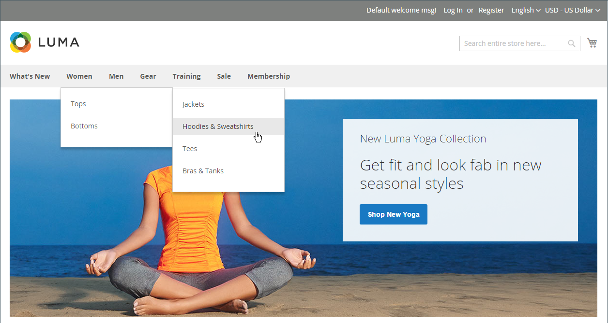

# 上部ナビゲーション

ストアのメインメニューは、ストア内のさまざまな部門へのディレクトリのようなものです。 各オプションは、異なるカテゴリの製品を表します。 上部ナビゲーションの位置と表示方法はテーマによって異なりますが、基本的には同じです。

{width="700" zoomable="yes"}

カタログのカテゴリ構造は、検索エンジンによるサイトのインデックス作成方法に影響を与える可能性があります。 カテゴリを深くネストすればするほど、完全にインデックス化される可能性は低くなります。 一般的に、表示レベルを1から3つ使用するのが最も効果的です。 [&#x200B; ルートカテゴリ &#x200B;](category-root.md)は、最初のレベルとしてカウントされますが、メニューには表示されません。 上部ナビゲーションで使用できるレベルの最大数は、設定によって決まります。 さらに、ストアテーマでサポートされているメニューレベルの数に制限がある場合があります。 例えば、サンプル Luma テーマは、ルートを含む最大5つのレベルをサポートします。

## メニューレベルのカウント

| 項目 | 説明 |
|--- |--- |
| レベル 1 | 最初のレベルはルートカテゴリで、サンプルデータには「デフォルトカテゴリ」という名前が付けられます。 ルートはメニューのコンテナであり、その名前はメニューにオプションとして表示されません。 |
| レベル 2 | デスクトップディスプレイでは、トップナビゲーションはページの上部に表示されるメインメニューです。 モバイルデバイスでは、通常、メインメニューはオプションのフライアウトメニューとして表示されます。 Luma ストアの2番目のレベルのオプションは、_新機能_、_女性_、_男性_、_ギア_、_トレーニング_、および&#x200B;_セール_&#x200B;です。 |
| レベル 3 | 3つ目のレベルは、各メインメニューオプションの下に表示されます。 例えば、_女性_&#x200B;の下では、3番目のレベルのオプションは&#x200B;_トップ_&#x200B;と&#x200B;_ボトム_&#x200B;です。 |
| レベル 4 | 4番目のレベルのオプションは、3番目のレベルのオプションから飛び出すサブカテゴリです。 例えば、_トップス_&#x200B;の下では、4番目のレベルのメニューオプションは&#x200B;_ジャケット_、_パーカーとスウェットシャツ_、_ティー_、および&#x200B;_ブラスとタンク_&#x200B;です。 |

{style="table-layout:auto"}

## 上部ナビゲーションの設定

ストアの上部ナビゲーションにカテゴリを表示するには、次の手順を実行します。

### 手順1：カテゴリの作成

1. _管理者_ サイドバーで、**[!UICONTROL Catalog]** > **[!UICONTROL Categories]**&#x200B;に移動します。

1. 新しいカテゴリをどこで利用できるかを決定するには、**[!UICONTROL Store View]**&#x200B;を設定します。

1. カテゴリーツリーで、新しいカテゴリの親カテゴリを選択します。

   データを持たずに最初から始める場合、リストに2つのカテゴリ（_デフォルトのカテゴリ_）と&#x200B;_例のカテゴリ_）しか含まれていない可能性があります。

1. **[!UICONTROL Add Subcategory]**&#x200B;をクリックします。

1. 基本的な情報を次の設定で入力します。

   - **[!UICONTROL Enable Category]**&#x200B;が`Yes`に設定されました
   - **[!UICONTROL Include in Menu]**&#x200B;が`Yes`に設定されました

1. 表示設定で、**[!UICONTROL Anchor]**&#x200B;を`Yes`に設定します。

1. その他の必要な[&#x200B; カテゴリ設定](category-create.md)をすべて完了します。

1. 完了したら、**[!UICONTROL Save]**&#x200B;をクリックします。

マルチストアのインストールの場合、各[&#x200B; ストア &#x200B;](../stores-purchase/stores.md#add-stores)ごとに、異なるメインメニューを[&#x200B; ルートカテゴリ &#x200B;](category-root.md)として割り当てることができます。

### 手順2：上部ナビゲーションの深度を設定する

1. _管理者_ サイドバーで、**[!UICONTROL Stores]** > _[!UICONTROL Settings]_>**[!UICONTROL Configuration]**&#x200B;に移動します。

1. 左側のパネルで「**[!UICONTROL Catalog]**」を展開し、下の「**[!UICONTROL Catalog]**」を選択します。

1. **[!UICONTROL Category Top Navigation]** セクションを展開します。

   {width="600" zoomable="yes"}

   上部ナビゲーションの深さはグローバルな[設定スコープ &#x200B;](../getting-started/websites-stores-views.md#scope-settings)を持つため、この設定はCommerce インストールのすべてのweb サイト、ストア、ストアビューに適用されます。 _[!UICONTROL Category Top Navigation]_&#x200B;設定セクションは、左上隅の&#x200B;_[!UICONTROL Store View]_&#x200B;が`Default Config`に設定されている場合にのみ使用できます。

   これらのオプションの詳細なリストについては、_設定リファレンス_&#x200B;の[&#x200B; カテゴリトップナビゲーション &#x200B;](../configuration-reference/catalog/catalog.md#layered-navigation)を参照してください。

1. 上部ナビゲーションに表示されるサブカテゴリの数を制限するには、**[!UICONTROL Maximal Depth]**&#x200B;の数を入力します。

   デフォルト値は`0`で、サブカテゴリーレベルの数に制限はありません。

1. 完了したら、**[!UICONTROL Save Config]**&#x200B;をクリックします。
