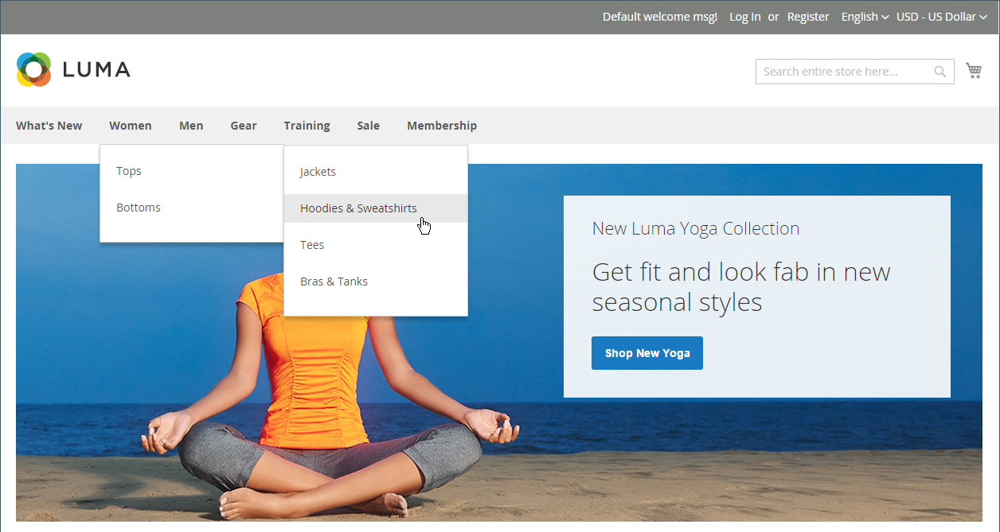

# 上部ナビゲーション

店舗のメインメニューは、店舗内の異なる部門のディレクトリのようなものです。 各オプションは、異なるカテゴリの製品を表します。 トップナビゲーションの位置と表示方法は、テーマによって異なる場合がありますが、動作方法は基本的に同じです。

{width="700" zoomable="yes"}

カタログのカテゴリ構造は、検索エンジンによるサイトのインデックス作成の程度に影響を与える可能性があります。 カテゴリのネストが深いほど、十分にインデックスを作成する可能性が低くなります。 一般に、1～3 つの表示レベルを使用することが最も効果的です。 The [ルートカテゴリ](category-root.md) は最初のレベルとしてカウントしますが、メニューには表示されません。 上部のナビゲーションで使用できる最大レベル数は、設定によって決まります。 また、ストアテーマでサポートされるメニューレベルの数に制限がある場合があります。 例えば、サンプルの Luma テーマは、ルートを含む最大 5 つのレベルをサポートします。

## カウントメニューのレベル

| 項目 | 説明 |
|--- |--- |
| レベル 1 | 1 番目のレベルはルートカテゴリで、サンプルデータでは「Default Category」という名前が付けられています。 ルートはメニューのコンテナで、その名前はメニューのオプションとして表示されません。 |
| レベル 2 | デスクトップディスプレイでは、上部ナビゲーションは、ページの上部に表示されるメインメニューです。 モバイルデバイスでは、メインメニューは通常、オプションのフライアウトメニューとして表示されます。 Luma ストアの第 2 レベルのオプションは次のとおりです _新機能_, _女性_, _メン_, _ギア_, _トレーニング_、および _販売_. |
| レベル 3 | 第 3 レベルは、各メインメニューオプションの下に表示されます。 例えば、次の場所に _女性_、3 番目のレベルのオプションは、 _トップ_ および _ボトムス_. |
| レベル 4 | 第 4 レベルのオプションは、第 3 レベルのオプションから飛び出すサブカテゴリです。 例えば、次の場所に _トップ_&#x200B;の場合、4 番目のレベルのメニューオプションは _ジャケット_, _Hoodies &amp; Sweatshirts_, _Tees_、および _Bras &amp; Tanks_. |

{style="table-layout:auto"}

## 上部ナビゲーションを設定

カテゴリをストアの上部ナビゲーションに表示するには、次の手順を実行します。

### 手順 1：カテゴリの作成

1. 次の日： _管理者_ サイドバー、移動 **[!UICONTROL Catalog]** > **[!UICONTROL Categories]**.

1. を設定します。 **[!UICONTROL Store View]** をクリックして、新しいカテゴリを使用できる場所を決定します。

1. カテゴリツリーで、新しいカテゴリの親カテゴリを選択します。

   データがない状態で最初から始める場合、リストには次の 2 つのカテゴリしか含まれていない可能性があります。 _デフォルトのカテゴリ_( ルートであり、 _カテゴリの例_.

1. クリック **[!UICONTROL Add Subcategory]**.

1. 次の設定で基本情報を入力します。

   - **[!UICONTROL Enable Category]** に設定 `Yes`
   - **[!UICONTROL Include in Menu]** に設定 `Yes`

1. 表示設定内 **[!UICONTROL Anchor]** から `Yes`.

1. その他の必要事項を入力 [カテゴリ設定](category-create.md).

1. 完了したら、「 **[!UICONTROL Save]**.

マルチストアインストールの場合は、別のメインメニューを [ルートカテゴリ](category-root.md) 次の期間 [保存する](../stores-purchase/stores.md#add-stores).

### 手順 2：上部ナビゲーションの深さを設定

1. 次の日： _管理者_ サイドバー、移動 **[!UICONTROL Stores]** > _[!UICONTROL Settings]_>**[!UICONTROL Configuration]**.

1. 左側のパネルで、を展開します。 **[!UICONTROL Catalog]** を選択します。 **[!UICONTROL Catalog]** の下に

1. を展開します。 **[!UICONTROL Category Top Navigation]** 」セクションに入力します。

   {width="600" zoomable="yes"}

   上部ナビゲーションの深さはグローバルなので [設定範囲](../getting-started/websites-stores-views.md#scope-settings)の場合、設定はコマースインストールのすべての Web サイト、ストア、表示の保存に適用されます。 The _[!UICONTROL Category Top Navigation]_設定セクションは、_[!UICONTROL Store View]_ の左上隅の `Default Config`.

   これらのオプションの詳細なリストについては、 [カテゴリ上部ナビゲーション](../configuration-reference/catalog/catalog.md#layered-navigation) （内） _設定リファレンス_.

1. 上部のナビゲーションに表示されるサブカテゴリの数を制限するには、 **[!UICONTROL Maximal Depth]**.

   デフォルト値は `0`：サブカテゴリのレベル数に制限を設けません。

1. 完了したら、「 **[!UICONTROL Save Config]**.
