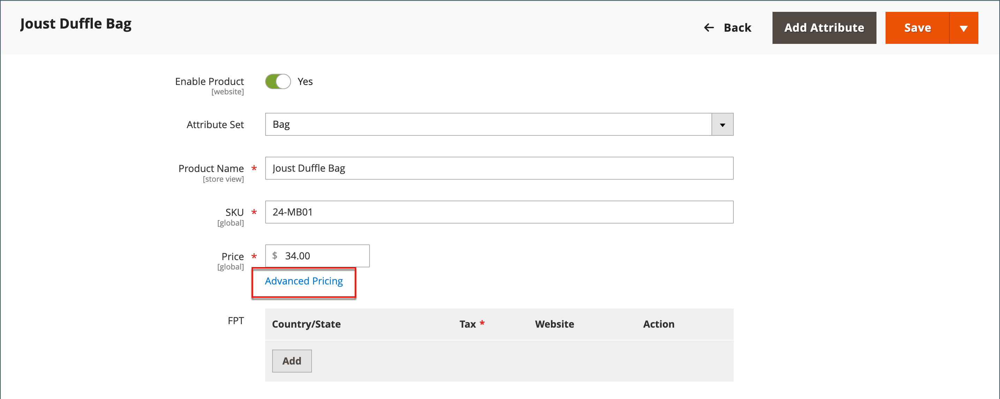

# 高度な価格設定

Adobe CommerceとMagento Open Sourceは、プロモーションや製造元の最小広告価格要件に使用できる様々な価格オプションをサポートしています。 製品価格は、スケジュールに従って変更することも、製品レベルまたは買い物かごに適用される価格ルールに従って変更することもできます。

顧客により多くの費用を割り当て、サイトへのトラフィックを促進し、古い在庫を消去するように促す料金を顧客に提供するために、高度な価格で製品の価格を管理します。

_[!UICONTROL Advanced Pricing]_の設定では、特定の顧客グループまたは共有カタログで利用できる特別な価格に必要な条件を定義します。 シンプルな製品、バーチャル製品、ダウンロード可能な製品、バンドル製品には、高度な価格を適用できます。 他の製品タイプに割引価格を適用するには、[ カタログ価格ルール ](../merchandising-promotions/price-rules-catalog.md) を使用します。 詳しくは、「[ 価格範囲 ](catalog-price-scope.md)」を参照してください。

詳細な価格データは、製品ページと同期されます。 例えば、階層価格数量を更新すると、製品ページの値が更新されます。

 （[Adobe Commerce B2B](./b2b/../introduction.md) でのみ使用可能）共有カタログを使用している場合、高度な価格データが商品ページと共有カタログの両方と同期されます。 例えば、階層価格数量を更新すると、共有カタログおよび製品ページの値が更新されます。 共有カタログに示されているカスタム価格は、顧客グループの価格よりも優先されます。 [2}Adobe Commerce B2B ガイド ](https://experienceleague.adobe.com/docs/commerce-admin/b2b/shared-catalogs/define/catalog-shared-pricing-structure.html) の「カタログの共有価格と構造を設定する _も参照してください。_

{width="600" zoomable="yes"}

## 詳細価格オプションへのアクセス

1. 製品を編集モードで開きます。

1. [**[!UICONTROL Price]**] で、[**[!UICONTROL Advanced Pricing]**] をクリックします。

1. 必要な詳細価格のタイプの指示に従ってください。

   - [グループ価格](product-price-group.md)

   - [特別価格](product-price-special.md)

   - [階層価格](product-price-tier.md)

   - [広告の最低価格](product-price-minimum-advertised.md)

## ページ参照

### [!UICONTROL Special Price]

指定した期間またはスケジュールされたキャンペーン中に割引価格を提供するには、特別価格を入力します。 特別価格が利用できる場合、小売価格は廃止され、特別価格が大きく太字で下に表示されます。

#### [!UICONTROL Special Price From] の日付

{{ce-feature}}

| フィールド | 説明 |
| ---- | ----------- |
| [!UICONTROL From] | 特別価格が利用できる最初の日付を設定します。 日付を入力するか、カレンダーから選択します。 |
| [!UICONTROL To] | 特別価格を利用できる最後の日付を設定します。 日付を入力するか、カレンダーから選択します。 |

{style="table-layout:auto"}

### [!UICONTROL Cost]

品目の実際の原価を入力します。

### [!UICONTROL Customer Group Price]

{width="600" zoomable="yes"}

特定の顧客グループのプロモーションと階層設定の価格を設定します。

| 項目 | 説明 |
| ---- | ----------- |
| [!UICONTROL Website] | グループ価格ルールが適用される web サイトを識別します。 このオプションは、インストールに複数の web サイトがある場合にのみ表示されます。 |
| [!UICONTROL Customer Group] | （必須）割引価格を受け取る資格のある顧客グループを識別します。 グループまたはカタログフィールドの値が変更されると、以前の設定に一致した対応するカスタム価格行が共有カタログから削除されます。  **[!UICONTROL ALL GROUPS]**– すべての顧客グループにルールを適用します。 **[!UICONTROL NOT LOGGED IN]** - アカウントにログインしていないゲストおよび顧客にルールを適用します。 |
| [!UICONTROL Quantity] | 階層価格を受け取るために必要な数量を指定します。 |
| [!UICONTROL Price] | （必須）特定の web サイト内の顧客グループのメンバーに対する固定または割引製品価格を指定します。 オプション： **[!UICONTROL Fixed]**- （デフォルト）割引価格は固定小数値として入力されます。 例えば、割引価格として `9.99` と入力します。 **[!UICONTROL Discount]** – 割引価格は、基本製品価格に対する割合（%）として入力されます。 例えば、10% の割引を受ける場合は `10` と入力します。 |
|  | 現在のルールを削除します。 |
| **[!UICONTROL Add]** | 新しいルールに別の行を挿入します。 |

{style="table-layout:auto"}

### [!UICONTROL Catalog and Tier Price]

特定の共有カタログおよび顧客グループのプロモーションおよび階層価格を設定します。

{{b2b-feature}}

{width="600" zoomable="yes"}

| 項目 | 説明 |
|----|-----------|
| [!UICONTROL Website] | グループ価格ルールが適用される web サイトを識別します。 このオプションは、インストールに複数の web サイトがある場合にのみ表示されます。  **_重要：_**[ カタログの価格範囲_ 設定で _Website](catalog-price-scope.md) を選択します。選択しない場合、設定された詳細価格が**すべて&#x200B;**の Web サイトに表示されます。 |
| [!UICONTROL Group or Catalog] | （必須）割引価格を受け取る資格のある顧客グループまたは共有カタログを識別します。 グループまたはカタログフィールドの値が変更されると、以前の設定に一致した対応するカスタム価格行が共有カタログから削除されます。  **[!UICONTROL ALL GROUPS]**– すべての顧客グループにルールを適用します。 値は共有カタログに適用されず、詳細価格データの変更は共有カタログと同期されません。 **[!UICONTROL NOT LOGGED IN]** - アカウントにログインしていないゲストおよび顧客にルールを適用します。 **[!UICONTROL Shared Catalogs]**– 特定の共有カタログにルールを適用します。 |
| 数量 | 階層価格を受け取るために必要な数量を指定します。 |
| [!UICONTROL Price] | （必須）特定の web サイト内の顧客グループのメンバーに対する固定または割引製品価格を指定します。 オプション： **[!UICONTROL Fixed]**- （デフォルト）割引価格は固定小数値として入力されます。 例えば、割引価格として `9.99` と入力します。 **[!UICONTROL Discount]** – 割引価格は、基本製品価格に対する割合（%）として入力されます。 例えば、10% の割引を受ける場合は `10` と入力します。 |
|  | 現在のルールを削除します。 |
| **[!UICONTROL Add]** | 新しいルールに別の行を挿入します。 |

{style="table-layout:auto"}

### [!UICONTROL Minimum Advertised Price]

商品の最低広告価格（MAP）。

### [!UICONTROL Display Actual Price]

商品の実際の価格が顧客に表示される場所を決定します。

| 項目 | 説明 |
|----|-----------|
| [!UICONTROL Use Config] | 価格表示に現在の構成設定を使用します。 |
| [!UICONTROL On Gesture] | _クリックして価格_ または _何ですか？_ リンク。 |
| [!UICONTROL In Cart] | 買い物かごに実際の製品価格を表示します。 |
| [!UICONTROL Before Order Confirmation] | チェックアウトプロセスの最後、注文が送信される直前の実際の製品価格が表示されます。 |

{style="table-layout:auto"}
