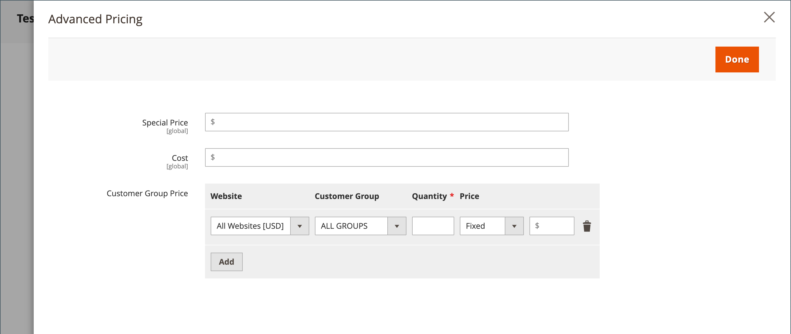

# 詳細な価格設定

Adobe CommerceとMagento Open Sourceは、プロモーションに使用できる様々な価格設定オプションをサポートしています。また、メーカーの最低広告価格要件を満たすことができます。 商品価格の変更は、スケジュール通りに行うことも、商品レベルやショッピングカートで適用される価格規則に従って行うこともできます。

高度な価格設定により商品の価格を管理し、消費者がより多く購入するよう促し、サイトへのトラフィックを増加させ、古い在庫を取り除くより優れた価格を顧客に提供します。

_[!UICONTROL Advanced Pricing]_&#x200B;設定は、特定の顧客グループまたは共有カタログで利用できる特別価格に必要な条件を定義します。 シンプル、バーチャル、ダウンロード可能、バンドルの各製品に適用できます。 他の製品タイプに割引価格を適用するには、[&#x200B; カタログ価格ルール &#x200B;](../merchandising-promotions/price-rules-catalog.md)を使用します。 詳しくは、[価格範囲](catalog-price-scope.md)を参照してください。

高度な価格データを商品ページと同期。 例えば、階層価格数量を更新すると、製品ページの値が更新されます。

 （[Adobe Commerce B2B](./b2b/../introduction.md)でのみ利用可能）共有カタログを使用している場合、高度な価格データは商品ページと共有カタログの両方と同期されます。 例えば、階層価格数量を更新すると、共有カタログおよび製品ページの値が更新されます。 共有カタログに示されているカスタム価格は、顧客グループの価格よりも優先されます。 _Adobe Commerce B2B ガイド_&#x200B;の「[共有カタログの価格と構造を設定](https://experienceleague.adobe.com/docs/commerce-admin/b2b/shared-catalogs/define/catalog-shared-pricing-structure.html)」も参照してください。

{width="600" zoomable="yes"}

## アドバンスド価格オプションをご覧ください

1. 製品を編集モードで開きます。

1. **[!UICONTROL Price]**&#x200B;で、**[!UICONTROL Advanced Pricing]**&#x200B;をクリックします。

1. 必要な高度な価格設定の種類の手順に従います。

   - [グループ価格](product-price-group.md)

   - [特別価格](product-price-special.md)

   - [価格帯](product-price-tier.md)

   - [最低広告価格](product-price-minimum-advertised.md)

## ページ参照

### [!UICONTROL Special Price]

指定した期間またはスケジュールされたキャンペーン中に割引価格を提供するには、特別価格を入力します。 特別価格が利用可能な場合、小売価格は除外され、特別価格は大きな太字のテキストで以下に表示されます。

#### [!UICONTROL Special Price From]日

{{ce-feature}}

| フィールド | 説明 |
| ---- | ----------- |
| [!UICONTROL From] | 特別価格が使用可能な最初の日付を設定します。 日付を入力するか、カレンダーから選択できます。 |
| [!UICONTROL To] | 特別価格が利用可能な最終日付を設定します。 日付を入力するか、カレンダーから選択できます。 |

{style="table-layout:auto"}

### [!UICONTROL Cost]

品目の実際の原価を入力します。

### [!UICONTROL Customer Group Price]

{width="600" zoomable="yes"}

特定の顧客グループに対するプロモーション価格と階層価格を設定します。

| 項目 | 説明 |
| ---- | ----------- |
| [!UICONTROL Website] | グループ価格ルールが適用されるweb サイトを識別します。 このオプションは、インストールに複数のWeb サイトがある場合にのみ表示されます。 |
| [!UICONTROL Customer Group] | （必須）割引価格を受け取る資格を持つ顧客グループを特定します。 グループまたはカタログフィールドの値が変更されると、前の設定に一致する対応するカスタム価格行が共有カタログから削除されます。 **[!UICONTROL ALL GROUPS]**– すべての顧客グループにルールを適用します。 **[!UICONTROL NOT LOGGED IN]** - アカウントにログインしていないルール ゲストと顧客を適用します。 |
| [!UICONTROL Quantity] | 価格帯を受け取るために必要な数量を指定します。 |
| [!UICONTROL Price] | （必須）特定のweb サイト内の顧客グループのメンバーに対する固定価格または割引商品価格を指定します。 オプション： **[!UICONTROL Fixed]**- （デフォルト）割引価格は固定小数点以下桁で入力されます。 例えば、割引価格として「`9.99`」と入力します。 **[!UICONTROL Discount]** – 割引価格は、基本製品価格に対する割合（%）で入力されます。 例えば、10%割引の場合は`10`と入力します。 |
|  | 現在のルールを削除します。 |
| **[!UICONTROL Add]** | 新しいルール用に別の行を挿入します。 |

{style="table-layout:auto"}

### [!UICONTROL Catalog and Tier Price]

特定の共有カタログと顧客グループのプロモーションと階層価格を設定します。

{{b2b-feature}}

{width="600" zoomable="yes"}

| 項目 | 説明 |
|----|-----------|
| [!UICONTROL Website] | グループ価格ルールが適用されるweb サイトを識別します。 このオプションは、インストールに複数のWeb サイトがある場合にのみ表示されます。  **_Important:_**&#x200B;ALでは、[&#x200B; カタログ価格範囲](catalog-price-scope.md)設定で_ Web サイト _を選択します。そうでない場合、設定された詳細価格は&#x200B;**すべての** Web サイトに表示されます。 |
| [!UICONTROL Group or Catalog] | （必須）割引価格を受け取る条件を満たす顧客グループまたは共有カタログを特定します。 グループまたはカタログフィールドの値が変更されると、前の設定に一致する対応するカスタム価格行が共有カタログから削除されます。 **[!UICONTROL ALL GROUPS]**– すべての顧客グループにルールを適用します。 値は共有カタログに適用されず、高度な価格データの変更は共有カタログと同期されません。 **[!UICONTROL NOT LOGGED IN]** - アカウントにログインしていないゲストと顧客のルールを適用します。 **[!UICONTROL Shared Catalogs]**- ルールを特定の共有カタログに適用します。 |
| 量 | 価格帯を受け取るために必要な数量を指定します。 |
| [!UICONTROL Price] | （必須）特定のweb サイト内の顧客グループのメンバーに対する固定価格または割引商品価格を指定します。 オプション： **[!UICONTROL Fixed]**- （デフォルト）割引価格は固定小数点以下桁で入力されます。 例えば、割引価格として「`9.99`」と入力します。 **[!UICONTROL Discount]** – 割引価格は、基本製品価格に対する割合（%）で入力されます。 例えば、10%割引の場合は`10`と入力します。 |
|  | 現在のルールを削除します。 |
| **[!UICONTROL Add]** | 新しいルール用に別の行を挿入します。 |

{style="table-layout:auto"}

### [!UICONTROL Minimum Advertised Price]

製品の最低広告価格（MAP）。

### [!UICONTROL Display Actual Price]

商品の実際の価格を顧客に表示する場所を指定します。

| 項目 | 説明 |
|----|-----------|
| [!UICONTROL Use Config] | 価格表示の現在の設定設定を使用します。 |
| [!UICONTROL On Gesture] | 「_クリック価格_」または「_これは何ですか？_」に応じて、実際の商品価格をポップアップに表示します リンク： |
| [!UICONTROL In Cart] | ショッピングカートに実際の商品価格を表示します。 |
| [!UICONTROL Before Order Confirmation] | 注文が送信される直前に、チェックアウトプロセスの最後に実際の商品価格を表示します。 |

{style="table-layout:auto"}
