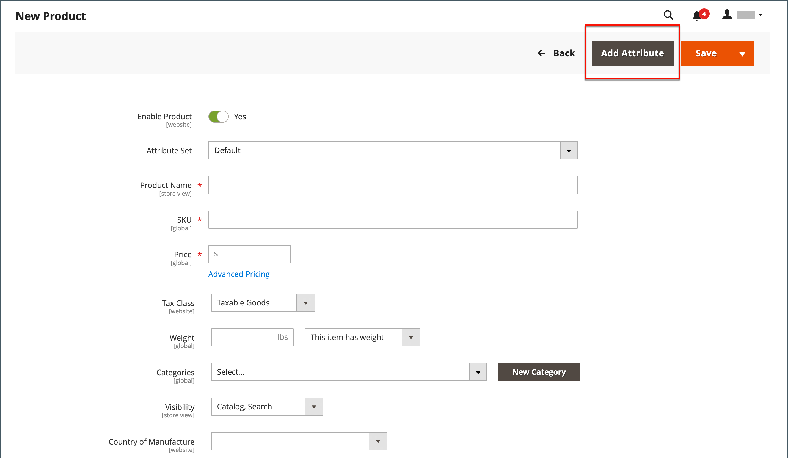
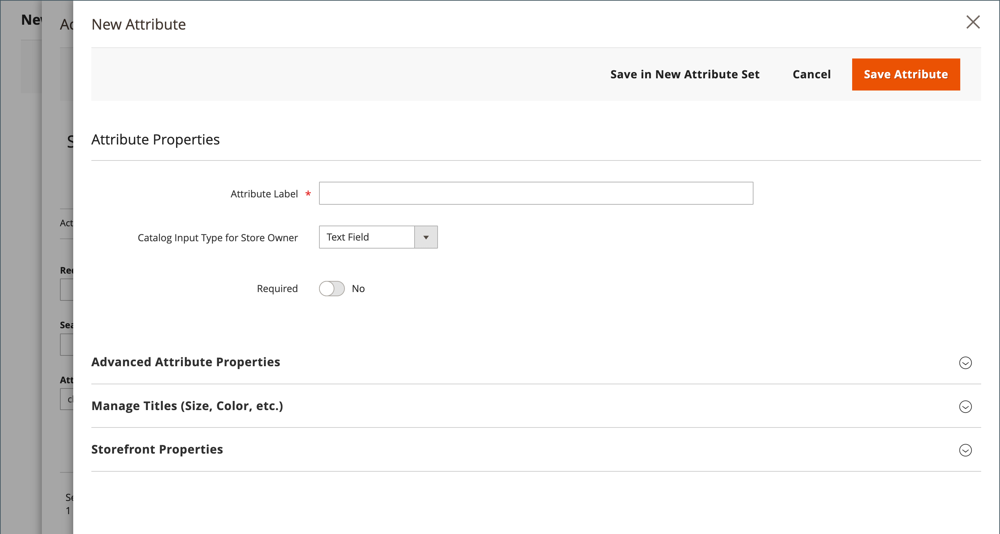
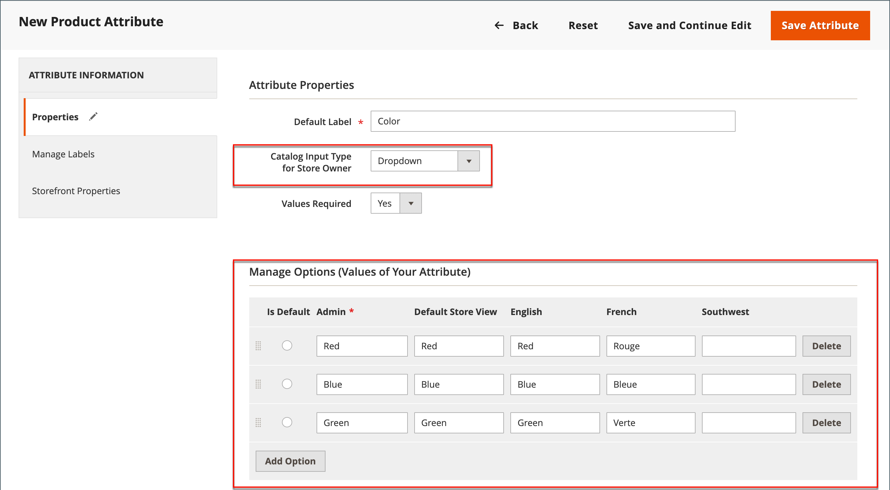
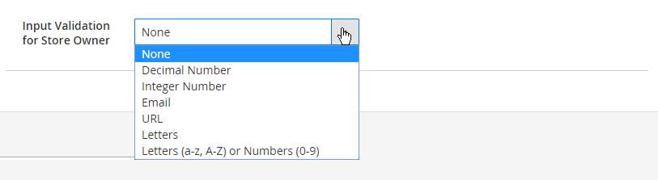
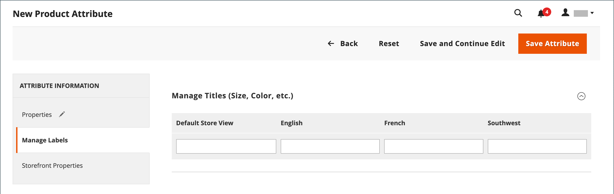

# 製品への属性の追加

属性は主に[&#x200B; ストア &#x200B;](../stores-purchase/stores-menu.md) メニューから管理されますが、製品の作業中に新しい属性&#x200B;_を即座に_&#x200B;追加することもできます。 既存の属性のリストから選択するか、属性を作成できます。 新しい属性が、製品のベースとなる[属性セット &#x200B;](../catalog/attribute-sets.md)に追加されます。

## 手順1：属性の追加

1. 製品を編集モードで開きます。

1. 右上隅の「**[!UICONTROL Add Attribute]**」をクリックします。

   {width="600" zoomable="yes"}

1. 既存の属性を製品に追加するには、[&#x200B; フィルターコントロール &#x200B;](../getting-started/admin-grid-controls.md)を使用してグリッド内の属性を検索し、次の操作を行います。

   - 追加する各属性の最初の列のチェックボックスを選択します。

   - **[!UICONTROL Add Selected]**&#x200B;をクリックします。

   {width="600" zoomable="yes"}

1. 新しい属性を定義するには、**[!UICONTROL Create New Attribute]**&#x200B;をクリックし、手順2の項目を完了します。

## 手順2：基本属性プロパティの説明

{width="600" zoomable="yes"}

1. _[!UICONTROL Attribute Properties]_&#x200B;の下に&#x200B;**[!UICONTROL Attribute Label]**&#x200B;を入力して、属性を識別します。

1. データ入力に使用する&#x200B;**[!UICONTROL Catalog Input Type for Store Owner]**&#x200B;を[入力制御](attributes-input-types.md)の型に設定します。

   属性が[設定可能な製品](product-create-configurable.md)に使用されている場合は、`Dropdown`を選択します。 次に、**[!UICONTROL Required]**&#x200B;を`Yes`に設定します。

1. `Dropdown`と`Multiple Select`の入力タイプの場合は、次の操作を行います。

   - **[!UICONTROL Values]**&#x200B;で、**[!UICONTROL Add Value]**&#x200B;をクリックします。

   - リストに表示する最初の値を入力します。

     管理者には1つの値を入力し、各ストアビューの値の翻訳を入力できます。 ストアビューが1つしかない場合は、Admin値のみを入力でき、ストアフロントにも使用されます。

   - **[!UICONTROL Add Value]**&#x200B;をクリックし、リストに含める各オプションについて、前の手順を繰り返します。

   - オプションをデフォルト値として使用するには、**[!UICONTROL Is Default]**&#x200B;を選択します。

   {width="600" zoomable="yes"}

1. 製品を購入する前に、お客様にオプションの選択を求める場合は、**[!UICONTROL Required]**&#x200B;を`Yes`に設定します。

## 手順3：詳細プロパティの説明（オプション）

{width="600" zoomable="yes"}

1. 小文字でスペースなしで一意の&#x200B;**[!UICONTROL Attribute Code]**&#x200B;を入力してください。

1. **[!UICONTROL Scope]**&#x200B;を設定して、ストア階層内の属性を使用できる場所を示します。

   属性が[設定可能な製品](product-create-configurable.md)に使用されている場合は、`Global`を選択します。

1. この属性がこの製品にのみ適用される場合は、**[!UICONTROL Unique Value]**&#x200B;を`Yes`に設定します。

1. テキストフィールドに入力されたデータの有効性テストを実行するには、フィールドに含める必要があるデータのタイプに&#x200B;**[!UICONTROL Input Validation for Store Owner]**&#x200B;を設定します。

   このフィールドは、選択された値を持つ入力タイプには使用できません。 入力検証は、次のいずれかに使用できます。

   - `Decimal Number`
   - `Integer Number`
   - `Email`
   - `URL`
   - `Letters`
   - `Letters (a-z, A-Z) or Numbers (0-9)`

   {width="500"}

1. 属性を製品グリッドの列として含める場合は、**[!UICONTROL Add to Column Options]**&#x200B;を`Yes`に設定します。

1. この列で&#x200B;_[!UICONTROL Products]_&#x200B;グリッドをフィルタリングする場合は、**[!UICONTROL Use in Filter Options]**&#x200B;を`Yes`に設定します。

## 手順4：フィールドラベルを入力する

1. **[!UICONTROL Manage titles]** セクションのを展開します。

1. フィールドのラベルとして使用する&#x200B;**[!UICONTROL Title]**&#x200B;を入力します。

   ストアが異なる言語で利用可能な場合は、各ビューに翻訳されたタイトルを入力できます。

   {width="600" zoomable="yes"}

   >[!NOTE]
   >
   > この属性をライブサーチでファセットとして使用する場合は、ストア固有のラベルを指定する必要があります。 これを指定しないと、属性名がファセット設定ページに正しく表示されないことがあります。 設定を更新するには、_ライブ検索ガイド_&#x200B;のライブ検索ファセットリスト [&#128279;](https://experienceleague.adobe.com/en/docs/commerce/live-search/live-search-admin/facets/facets-add#step-2-edit-facet-properties-optional)の編集オプションを使用して、手動でラベルを編集します。

## 手順5：ストアフロントのプロパティの記述

1. **[!UICONTROL Storefront Properties]** セクションのを展開します。

   {width="600" zoomable="yes"}

1. 属性を検索で利用できるようにするには、**[!UICONTROL Use in Search]**&#x200B;を`Yes`に設定します。

1. 製品比較に属性を含めるには、**[!UICONTROL Comparable on Storefront]**&#x200B;を`Yes`に設定します。

1. 階層化されたナビゲーションにドロップダウン、複数の選択、または価格属性を含めるには、**[!UICONTROL Use in Search Results Layered Navigation]**&#x200B;を次のいずれかに設定します。

   - `Filterable (with results)` – 階層化されたナビゲーションには、一致する製品が見つかるフィルターのみが含まれます。 リストに表示されているすべての製品に既に適用されている属性値は、使用可能なフィルターとして表示されません。 0個の製品マッチのカウントを持つ属性値も、使用可能なフィルターのリストから省略されます。   フィルターされた製品リストには、フィルターに一致する製品のみが含まれます。 製品リストは、選択したフィルターが表示される内容を変更した場合にのみ更新されます。

   - `Filterable (no results)` – 階層化されたナビゲーションには、使用可能なすべての属性値とその製品数に関するフィルターが含まれ、製品の一致が0の製品も含まれます。 属性値がスウォッチの場合、値はフィルターとして表示されますが、除外されます。

   >[!NOTE]
   >
   >_[!UICONTROL Use in Search]_&#x200B;設定が`No`に設定されている場合、_[!UICONTROL Use in Search Results Layered Navigation]_&#x200B;設定は表示されず、製品属性は[!UICONTROL Use in Layered Navigation]設定値を含む検索では使用されません。

1. 検索結果ページの階層化されたナビゲーションで属性を使用するには、**[!UICONTROL Use in Search Results Layered Navigation]**&#x200B;を`Yes`に設定し、**[!UICONTROL Position]** フィールドに数値を入力します。

   位置番号は、レイヤー化されたナビゲーションブロック内の属性の相対的な位置を示します。

   >[!NOTE]
   >
   >_[!UICONTROL Position]_&#x200B;フィールドは既定でグレー表示になっており、この設定を変更する前に属性を保存する必要があります。

1. 価格ルールで属性を使用するには、**[!UICONTROL Use for Promo Rule Conditions]**&#x200B;を`Yes`に設定します。

1. HTMLを使用してテキストの書式設定を許可するには、**[!UICONTROL Allow HTML Tags on Storefront]**&#x200B;を`Yes`に設定します。

   この設定により、フィールドを編集する際にWYSIWYG エディターを使用できるようになります。

1. 商品ページに属性を含めるには、**[!UICONTROL Visible on Catalog Pages on Storefront]**&#x200B;を`Yes`に設定します。

1. お使いのテーマでサポートされている以下の設定を行ってください：

   - 商品リストに属性を含めるには、**[!UICONTROL Used in Product Listing]**&#x200B;を`Yes`に設定します。

   - 属性を製品リストの並べ替えパラメーターとして使用するには、**[!UICONTROL Used for Sorting in Product Listing]**&#x200B;を`Yes`に設定します。

1. 完了したら、**[!UICONTROL Save Attribute]**&#x200B;をクリックします。
