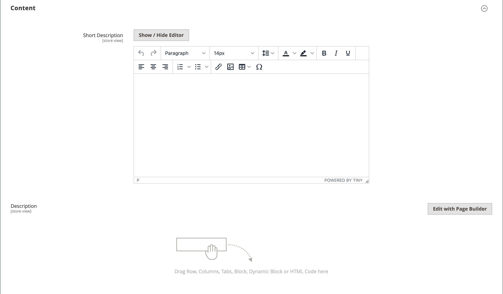

# 製品設定 – [!UICONTROL Content]

「_[!UICONTROL Content]_」セクションは、製品ページに表示されるメイン製品の説明を入力および編集するために使用されます。 短い説明は、ほとんどのRSS フィードで使用でき、[ テーマ ](../content-design/themes.md)に応じて、カタログリストにも表示される場合があります。

>[!NOTE]
>
>カタログの強化により、AIが提案した更新内容を、このセクションの製品名と長い説明に適用できます。 詳しくは、[ カタログの強化](catalog-enrichment.md)を参照してください。

## [!DNL Page Builder]に製品の説明を追加

1. 製品を編集モードで開きます。

1. 下にスクロールして、**[!UICONTROL Content]** セクションのを展開します。

   {width="600" zoomable="yes"}

1. 製品の&#x200B;**[!UICONTROL Short Description]**&#x200B;を入力し、[ エディターツールバー](../content-design/editor.md)を使用して、必要に応じて書式設定します。

1. **[!UICONTROL Description]** ラベルで、**[!UICONTROL Edit with Page Builder]**&#x200B;をクリックします。

1. [[!DNL Page Builder]](../page-builder/introduction.md) コンテンツツールを使用して、既存のテキストを[編集し](../page-builder/text.md)その他のコンテンツを追加します（必要に応じて）。

## [!DNL Page Builder] プレビュー

[!DNL Page Builder]で作成されたコンテンツがある既存の製品の&#x200B;_[!UICONTROL Content]_セクションを展開すると、製品ページに表示されるとおりに&#x200B;**[!UICONTROL Description]**コンテンツのプレビューが表示されます。**[!UICONTROL Edit with Page Builder]**をクリックして、必要な更新を行うことができる[!DNL Page Builder] ワークスペースを開きます。

{width="600" zoomable="yes"}

このコンテンツプレビューは、デフォルトで製品フォームとカテゴリーフォームに対して有効になっています。 プレビューの読み込みに伴いパフォーマンスが低下する場合は、[ コンテンツ管理設定](../configuration-reference/general/content-management.md#advanced-content-tools)でプレビューを無効にできます。

## エディターでの製品説明の追加

ストアで[!DNL Page Builder]が無効になっている場合は、テキストエディターを使用して商品コンテンツを追加します。 テキストボックスにプレーン ASCII文字のみを入力します。 ワードプロセッサーからテキストをペーストする場合は、最初にプレーンな.TXT ファイルとして保存して、目に見えないコントロール文字を削除します。 詳しくは、[ エディターの使用](../content-design/editor.md)を参照してください。

1. 製品を編集モードで開きます。

1. 下にスクロールして、**[!UICONTROL Content]** セクションのを展開します。

   {width="600" zoomable="yes"}

1. 必要に応じて、製品と形式の&#x200B;**[!UICONTROL Short Description]**&#x200B;を入力します。

1. メイン製品&#x200B;**[!UICONTROL Description]**&#x200B;を入力し、エディターツールバーを使用して必要に応じて書式設定します。

   右下隅をドラッグして、テキストボックスの高さを変更できます。
