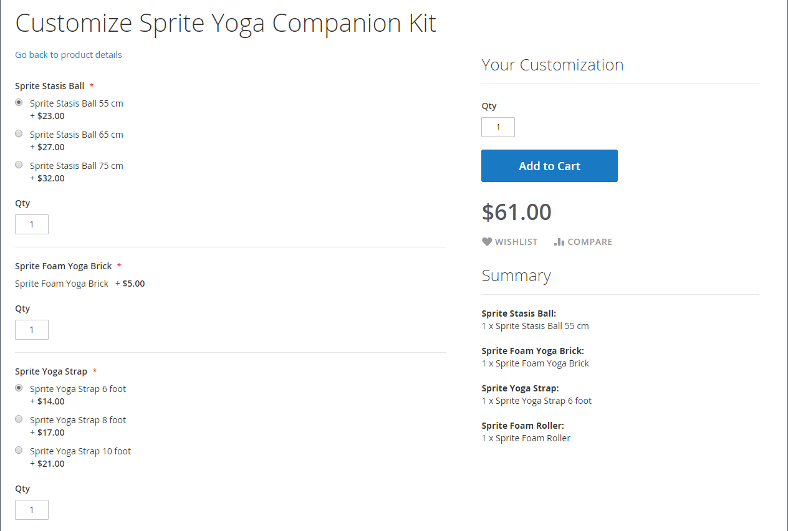

# バンドル製品

束は _独自に構築_、カスタマイズ可能な製品。 バンドル内の各品目は、次の製品タイプのいずれかに基づくことができます。

- [シンプルな製品](product-create-simple.md)
- [仮想製品](product-create-virtual.md)

{width="700" zoomable="yes"}

オプションは、顧客が **[!UICONTROL Customize]** または **[!UICONTROL Add to Cart]**. バンドルに含まれる製品は異なるので、SKU、価格、重み付けは、動的値または固定値に設定できます。

>[!NOTE]
>
>動的な価格を使用するバンドル製品では、最小アドバタイズ価格 (MAP) を使用できません。

>[!NOTE]
>
>親バンドル製品は、常にすべての子製品のアップセル製品として自動的に表示されます。

次の場合 [即時購入](../stores-purchase/checkout-instant-purchase.md) が使用可能な場合は、 _即時購入_ ボタンが _買い物かごに追加_ ボタンを使用します。

{width="600" zoomable="yes"}

以下の手順では、 [製品テンプレート](attribute-sets.md)、必須フィールドおよび基本設定。 各必須フィールドには赤いアスタリスク (`*`) をクリックします。 基本事項を完了したら、必要に応じて、他の製品設定を完了できます。

## 手順 1：製品タイプの選択

1. 次の日： _管理者_ サイドバー、移動 **[!UICONTROL Catalog]** > **[!UICONTROL Products]**.

1. 右上の _[!UICONTROL Add Product]_( {width="25"} ) メニューで、「 」を選択します。**[!UICONTROL Bundle Product]**.

   {width="700" zoomable="yes"}

## 手順 2：属性セットの選択

を選択するには、以下を実行します。 [属性セット](attribute-sets.md) 製品のテンプレートとして使用されるを次のいずれかの操作を行います。

- の場合 **[!UICONTROL Search]**、属性セットの名前を入力します。
- リストで、使用する属性セットを選択します。

フォームが更新され、変更が反映されます。

{width="600" zoomable="yes"}

## 手順 3：必要な設定を完了する

1. 製品を入力 **[!UICONTROL Product Name]**.

1. デフォルトを受け入れる **[!UICONTROL SKU]** 製品名に基づくか、別の値を入力します。

   各バンドル項目に割り当てる SKU のタイプを決定するには、次の手順を実行します。

   - A **[!UICONTROL Dynamic SKU]** は、デフォルトの SKU にサフィックスを追加することで、各バンドル項目に自動的に割り当てることができます。 デフォルトでは、に設定されています。 `Yes`.

   - バンドル項目ごとに一意の SKU を割り当てる場合は、 **[!UICONTROL Dynamic SKU]** から `No`.

   {width="600" zoomable="yes"}

1. バンドルの価格を決定するには、次のいずれかの操作を行います。

   - 価格を顧客が選択したオプションを反映させるには、 **[!UICONTROL Dynamic Price]** から `Yes` そして出て行く **[!UICONTROL Price]** 空白。

   - バンドルに固定価格を請求するには、 **[!UICONTROL Dynamic Price]** から `No` をクリックし、 **[!UICONTROL Price]** バンドルに対して請求する

1. 製品の公開準備がまだできていないので、を設定します。 **[!UICONTROL Enable Product]** から `No`.

1. クリック **[!UICONTROL Save]** 続行します。

   製品を保存すると、 [ストア表示](introduction.md#product-scope) セレクタが左上隅に表示されます。

1. を選択します。 **[!UICONTROL Store View]** 製品を使用できる場所。

   {width="600" zoomable="yes"}

## 手順 4：基本設定の完了

1. バンドルに固定価格が設定されている場合は、 **[!UICONTROL Tax Class]** を次のいずれかに変更します。

   - `None`
   - `Taxable Goods`

   バンドルに動的価格が設定されている場合、税は **_各_** バンドル項目。 バンドルに固定価格が設定されている場合、 **_全体_** バンドル製品。

1. 次の点に注意してください。

   - The **[!UICONTROL Quantity]** の値はバンドル項目ごとに決定されるので、は使用できません。

   - デフォルトでは、 **[!UICONTROL Stock Status]** が `In Stock`.

1. バンドルの重み付けを決定するには、次のいずれかの操作を行います。

   - 顧客が選択したオプションを重み付けに反映させるには、 **[!UICONTROL Dynamic Weight]** 設定 `Yes` そして出て行く **[!UICONTROL Weight]** 空白。

   - バンドルに固定の重み付けを割り当てるには、 **[!UICONTROL Dynamic Weight]** から `No` をクリックし、 **[!UICONTROL Weight]** バンドルの。

   {width="600" zoomable="yes"}

1. 次のリストで製品を特集するには： [新製品](../content-design/widget-new-products-list.md)を選択し、 **[!UICONTROL Set Product as New]** チェックボックス。

1. デフォルトを受け入れる **[!UICONTROL Visibility]** の設定 `Catalog, Search`.

1. 割り当てるには _[!UICONTROL Categories]_を製品に対して、**[!UICONTROL Select…]**」ボックスに移動し、次のいずれかの操作を行います。

   **既存のカテゴリを選択：**

   - 一致が見つかるまで、ボックスに入力します。

   - 割り当てる各カテゴリのチェックボックスをオンにします。

   {width="600" zoomable="yes"}

   **カテゴリの作成：**

   - クリック **[!UICONTROL New Category]**.

   - 次を入力します。 **[!UICONTROL Category Name]** を選択し、 **[!UICONTROL Parent Category]**：メニュー構造内での位置を決定します。

   - クリック **[!UICONTROL Create Category]**.

1. を選択します。 **[!UICONTROL Country of Manufacture]**.

   製品を説明する追加の属性が存在する場合があります。 選択は属性セットを変え、後で完了できます。

## 手順 5：バンドル項目の追加

The _[!UICONTROL Bundle Items]_「 」セクションは、「バンドル」プロダクトタイプにアイテムを追加し、現在の選択項目を編集するために使用します。

{width="600" zoomable="yes"}

1. 下にスクロールして、 _項目をバンドル_ セクションとセット **[!UICONTROL Ship Bundle Items]** を次のいずれかに変更します。

   - `Separately`
   - `Together`

   次を選択した場合、 `Together`、すべてのバンドル項目を同じに割り当てる必要があります [ソース](../inventory-management/sources-manage.md).

1. クリック **[!UICONTROL Add Option]** 次の操作を実行します。

   - を入力します。 **[!UICONTROL Option Title]** フィールドラベルとして使用されます。

   - 設定 **[!UICONTROL Input Type]** を次のいずれかに変更します。

      - `Drop-down`
      - `Radio buttons`
      - `Checkbox`
      - `Multiple Select`

   - フィールドを必須のエントリにするには、 **[!UICONTROL Required]** チェックボックス。

   - クリック **[!UICONTROL Add Products to Option]** をクリックし、このオプションに含める各製品のチェックボックスをオンにします。

     製品が多数ある場合は、リストフィルターとページネーションコントロールを使用して、必要な製品を見つけます。

   - クリック **[!UICONTROL Add Selected Products]**.

     {width="600" zoomable="yes"}

   - 項目が _オプション_ セクションで、 **[!UICONTROL Default]** 選択。

   - Adobe Analytics の _デフォルトの数量_ 列に、顧客が品目を選択したときにバンドルに追加する各品目の数量を入力します。

   - 顧客がバンドル項目の数量を変更できるようにするには、 **[!UICONTROL User Defined]**.

     >[!NOTE]
     >
     >数量は、プリセット値またはユーザー定義値にすることができます。 ただし、 _[!UICONTROL User Defined]_プロパティを checkbox または複数選択入力タイプに設定します。

     デフォルトでは、バンドル項目に含まれるデフォルト数量は、顧客が変更できません。 ただし、顧客はバンドルに含める品目の数量を入力できます。

     たとえば、スプライトステータスボールのデフォルト量 (Default Quantity) がに設定されている場合、 `2` お客様の注文 `4` このバンドルオプションの合計購入ボール数は、 `8`.

     {width="600" zoomable="yes"}

1. バンドルに追加する各項目に対して、上記の手順を繰り返します。

1. バンドルセクションの項目の順序を変更するには、 _移動_ (  ) アイコンを行の先頭に配置し、項目を位置にドラッグします。

   {width="600" zoomable="yes"}

   また、書き出されたバンドル製品のデータで項目の順序を変更し、カタログに再度読み込むこともできます。 詳しくは、 [バンドル製品のインポート](../systems/data-transfer-bundle-products.md).

   ワークスペースの表示を改善するには、最初に各セクションを折りたたんでからドラッグして位置に配置します。

1. バンドルから項目を削除するには、 **[!UICONTROL Delete]** (  ) アイコンをクリックします。

1. 完了したら、「 **[!UICONTROL Save]**.

## 手順 6：製品情報の入力

下にスクロールし、必要に応じて次のセクションの情報を入力します。

- [コンテンツ](product-content.md)
- [画像とビデオ](product-images-and-video.md)
- [検索エンジンの最適化](product-search-engine-optimization.md)
- [関連製品、アップセルおよびクロスセル](related-products-up-sells-cross-sells.md)
- [カスタマイズ可能なオプション](settings-advanced-custom-options.md)
- [Web サイト内の製品](settings-basic-websites.md)
- [デザイン](settings-advanced-design.md)
- [ギフトオプション](product-gift-options.md)

## 手順 7：製品の公開

1. カタログに商品を公開する準備が整ったら、 **[!UICONTROL Enable Product]** から `Yes` (  ) をクリックします。

1. 次のいずれかの操作を行います。

   **メソッド 1:** 保存してプレビュー

   - 右上隅で、 **[!UICONTROL Save]**.

   - ストアで製品を表示するには、 **[!UICONTROL Customer View]** の _管理者_ (  ) メニューを使用します。

     ストアが新しいブラウザータブで開きます。

   {width="600" zoomable="yes"}

   **方法 2:** 保存して閉じる

   次の日： _[!UICONTROL Save]_( {width="25"} ) メニューで、「 」を選択します。**[!UICONTROL Save & Close]**.

## 入力コントロール

| 制御 | 説明 | 例 |
|--- |--- |--- |
| [!UICONTROL Drop-down] | 製品名と価格を含むオプションのドロップダウンリストを表示します。 1 つの項目のみを選択できます。 | {width="200"} |
| [!UICONTROL Radio Buttons] | 各オプションのラジオボタンを表示し、製品名と価格を入力します。 1 つの項目のみを選択できます。 | {width="200"} |
| [!UICONTROL Checkbox] | 各オプションのチェックボックスが表示され、その後に製品名と価格が表示されます。 複数の項目を選択できます。 | {width="200"} |
| [!UICONTROL Multiple Select] | 製品名と価格を含むオプションのリストを表示します。 複数の項目を選択するには、Ctrl キー (PC) または Command キー (Mac) を押しながら各項目をクリックします。 | {width="200"} |

{style="table-layout:auto"}

## フィールドの説明

| フィールド | 説明 |
|--- |--- |
| [!UICONTROL SKU] | 各項目に変数または動的 SKU が割り当てられているか、またはバンドルに固定 SKU が使用されているかを決定します。 オプション： `Fixed` / `Dynamic` |
| [!UICONTROL Weight] | 重み付けを、選択した項目に基づいて計算するか、バンドル全体の固定重みにするかを指定します。 オプション： `Fixed` / `Dynamic` |
| [!UICONTROL Price View] | 製品価格を、最も高価なものから最も高価なもの（価格帯）までの範囲として表示するか、最も高価でないもの（低いもの）を表示するかを決定します。 オプション： `Price Range` / `As Low As` |
| 出荷バンドル品目 | 個々の品目を個別に出荷できるかどうかを指定します。 |

{style="table-layout:auto"}

## 製品在庫ステータスのバンドル

バンドルの製品在庫ステータスは次のとおりです **_自動的に在庫切れに変更されました_** 次のいずれかのシナリオが発生した場合：

- すべてのオプションがオプションで、関連するすべての製品は _在庫切れ_.

- 必要なオプションと、必要なオプションに関連付けられた製品があります。 _在庫切れ_.

バンドルの製品在庫ステータスは次のとおりです **_自動的に在庫切れに変更されません_** 次のいずれかのシナリオが発生した場合：

- すべてのオプションがオプションで、少なくとも 1 つの関連製品が _在庫あり_.

- 一部のオプションが必要で、必要な各オプションに関連する製品が少なくとも 1 つ必要です _在庫あり_.

## 覚えておくべきこと

 お客様が _独自に作る_ バンドル製品。

 バンドル項目は、カスタムオプションを使用しない単純な製品または仮想製品にすることができます。

 価格表示は次のいずれかに設定できます。 `Price Range` または `As Low As`.

 SKU と重み付けは、 `Fixed` または `Dynamic`.

 数量は、プリセット値またはユーザー定義値にすることができます。 ただし、 _[!UICONTROL User Defined]_プロパティを checkbox または複数選択入力タイプに設定します。

 バンドルの品目は、一緒にまたは別々に出荷できます。

 親バンドル製品は、常にすべての子製品のアップセル製品として自動的に表示されます。