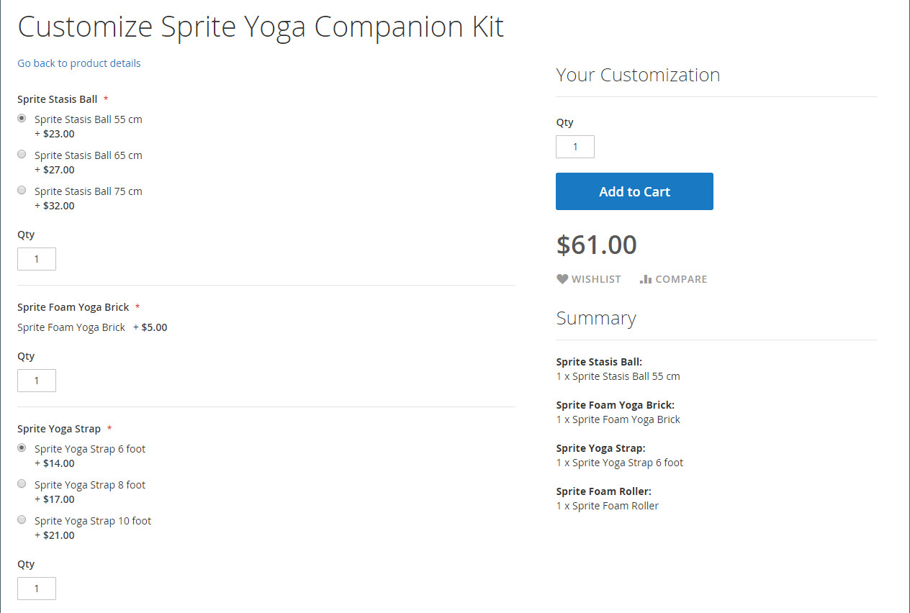
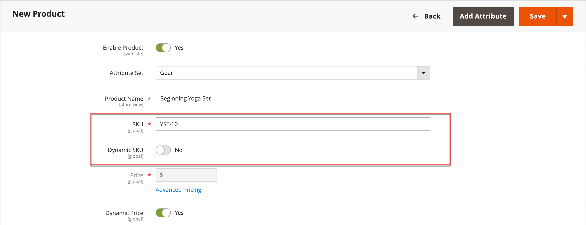
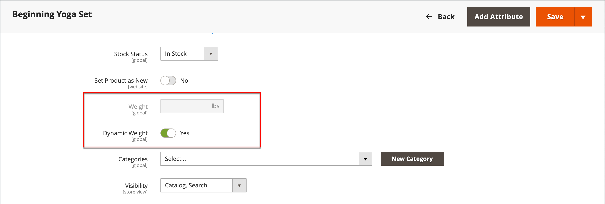
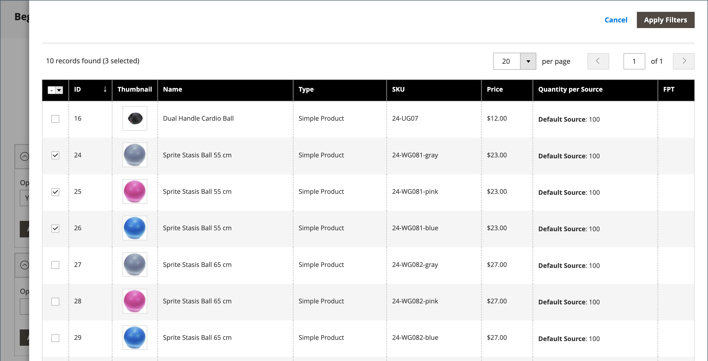
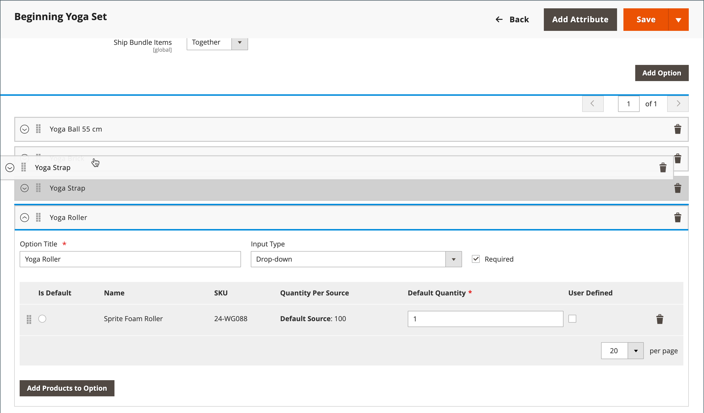
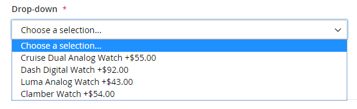
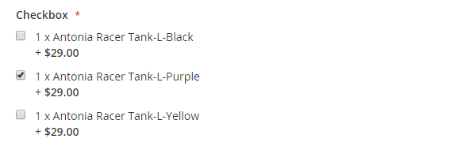
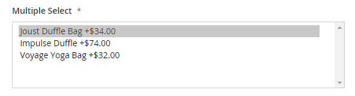

# バンドル製品

バンドルは、_独自の_ カスタマイズ可能な製品をビルドします。 バンドル内の各項目は、次のいずれかの製品タイプに基づいて作成できます。

- [シンプルな製品](product-create-simple.md)
- [バーチャル商品](product-create-virtual.md)

{width="700" zoomable="yes"}

お客様が&#x200B;**[!UICONTROL Customize]**&#x200B;または&#x200B;**[!UICONTROL Add to Cart]**&#x200B;のいずれかをクリックすると、オプションが表示されます。 バンドルに含まれる製品は異なるため、SKU、価格、および重量は動的または固定値に設定できます。

>[!NOTE]
>
>最低広告価格（MAP）は、動的な価格設定を使用するバンドル製品では利用できません。

>[!NOTE]
>
>親バンドル製品は、すべての子製品に対して常にアップセル製品として自動的に表示されます。

[即時購入](../stores-purchase/checkout-instant-purchase.md)が利用可能な場合、バンドル内の各商品の「_買い物かごに追加_」ボタンの下に「_即時購入_」ボタンが表示されます。

{width="600" zoomable="yes"}

次の手順では、[製品テンプレート &#x200B;](attribute-sets.md)、必須フィールド、および基本設定を使用してバンドル製品を作成する手順を説明します。 各必須フィールドには、赤いアスタリスク （`*`）が付いています。 基本的な設定が完了したら、必要に応じて他の製品設定を完了できます。

## 手順1：商品タイプの選択

1. _管理者_ サイドバーで、**[!UICONTROL Catalog]** > **[!UICONTROL Products]**&#x200B;に移動します。

1. _[!UICONTROL Add Product]_（{width="25"}）メニューの右上隅にある「**[!UICONTROL Bundle Product]**」を選択します。

   {width="700" zoomable="yes"}

## 手順2：属性セットの選択

製品のテンプレートとして使用される[属性セット &#x200B;](attribute-sets.md)を選択するには、次のいずれかの操作を行います。

- **[!UICONTROL Search]**&#x200B;に、属性セットの名前を入力します。
- リストで、使用する属性セットを選択します。

フォームが更新され、変更が反映されます。

{width="600" zoomable="yes"}

## 手順3：必要な設定を完了する

1. 製品&#x200B;**[!UICONTROL Product Name]**&#x200B;を入力します。

1. 製品名に基づく既定の&#x200B;**[!UICONTROL SKU]**&#x200B;を受け入れるか、別の値を入力してください。

   各バンドルアイテムに割り当てられるSKUのタイプを決定するには、次の操作を行います。

   - **[!UICONTROL Dynamic SKU]**&#x200B;は、デフォルトのSKUにサフィックスを追加することで、各バンドルアイテムに自動的に割り当てることができます。 デフォルトでは、`Yes`に設定されています。

   - バンドル項目ごとに一意のSKUを割り当てる場合は、**[!UICONTROL Dynamic SKU]**&#x200B;を`No`に設定します。

   {width="600" zoomable="yes"}

1. バンドルの価格を決定するには、次のいずれかの操作を行います。

   - 価格を顧客が選択したオプションを反映させるには、**[!UICONTROL Dynamic Price]**&#x200B;を`Yes`に設定し、**[!UICONTROL Price]**&#x200B;を空白のままにします。 この場合、バンドル製品はカタログから独自の価格を持たず、製品価格はバンドルに含まれる個々の製品の価格から派生します。

   - バンドルの固定価格を請求するには、**[!UICONTROL Dynamic Price]**&#x200B;を`No`に設定し、バンドルに請求する&#x200B;**[!UICONTROL Price]**&#x200B;を入力します。

   >[!NOTE]
   >
   >[!UICONTROL Special Price]と[!UICONTROL Customer Group Price] （階層の価格）は、すべてのバンドル製品タイプの割引率として常に設定されます。

1. 製品はまだ公開する準備ができていないので、**[!UICONTROL Enable Product]**&#x200B;を`No`に設定します。

1. **[!UICONTROL Save]**&#x200B;をクリックして続行します。

   商品を保存すると、左上隅に「[&#x200B; ストアビュー](introduction.md#product-scope)」の選択画面が表示されます。

1. 製品を利用できる&#x200B;**[!UICONTROL Store View]**&#x200B;を選択します。

   {width="600" zoomable="yes"}

## 手順4：基本設定を完了する

1. バンドルに固定価格設定がある場合は、**[!UICONTROL Tax Class]**&#x200B;を次のいずれかに設定します。

   - `None`
   - `Taxable Goods`

   バンドルに動的価格設定がある場合は、バンドル項目&#x200B;**_ごとに_**&#x200B;の税金が決定されます。 バンドルに固定価格が設定されている場合、**_whole_** バンドル製品の税金が決定されます。

1. 次の点に注意してください。

   - **[!UICONTROL Quantity]**&#x200B;は使用できません。値は各バンドル項目に対して決定されます。

   - デフォルトでは、**[!UICONTROL Stock Status]**&#x200B;は`In Stock`に設定されています。

1. バンドルの重みを決定するには、次のいずれかの操作を行います。

   - 顧客が選択したオプションを重み付けに反映させるには、**[!UICONTROL Dynamic Weight]**&#x200B;を`Yes`に設定し、**[!UICONTROL Weight]**&#x200B;を空白のままにします。

   - バンドルに固定重量を割り当てるには、**[!UICONTROL Dynamic Weight]**&#x200B;を`No`に設定し、バンドルの&#x200B;**[!UICONTROL Weight]**&#x200B;を入力します。

   {width="600" zoomable="yes"}

1. [新製品](../content-design/widget-new-products-list.md)のリストに商品を表示するには、**[!UICONTROL Set Product as New]** チェックボックスを選択します。

1. `Catalog, Search`の既定の&#x200B;**[!UICONTROL Visibility]**&#x200B;設定を受け入れます。

1. _[!UICONTROL Categories]_&#x200B;を製品に割り当てるには、**[!UICONTROL Select…]**&#x200B;ボックスをクリックし、次のいずれかの操作を行います。

   **既存のカテゴリを選択：**

   - 一致するものが見つかるまで、ボックスに入力し始めます。

   - 割り当てる各カテゴリのチェックボックスをオンにします。

   {width="600" zoomable="yes"}

   **カテゴリを作成：**

   - **[!UICONTROL New Category]**&#x200B;をクリックします。

   - **[!UICONTROL Category Name]**&#x200B;を入力し、**[!UICONTROL Parent Category]**&#x200B;を選択すると、メニュー構造での位置が決まります。

   - **[!UICONTROL Create Category]**&#x200B;をクリックします。

1. **[!UICONTROL Country of Manufacture]**&#x200B;を選択します。

   商品を表す属性が追加されている場合があります。 選択範囲は属性セットによって異なり、後で完了できます。

## 手順5：バンドルアイテムの追加

「_[!UICONTROL Bundle Items]_」セクションは、バンドル製品タイプに項目を追加し、現在の項目の選択を編集するために使用されます。

{width="600" zoomable="yes"}

1. _バンドルアイテム_ セクションまでスクロールし、**[!UICONTROL Ship Bundle Items]**&#x200B;を次のいずれかに設定します。

   - `Separately`
   - `Together`

   `Together`を選択した場合、すべてのバンドルアイテムに同じ[source](../inventory-management/sources-manage.md)を割り当てる必要があります。

1. **[!UICONTROL Add Option]**&#x200B;をクリックし、次の操作を行います。

   - フィールドラベルとして使用する&#x200B;**[!UICONTROL Option Title]**&#x200B;を入力します。

   - **[!UICONTROL Input Type]**&#x200B;を次のいずれかに設定します：

      - `Drop-down`
      - `Radio buttons`
      - `Checkbox`
      - `Multiple Select`

   - フィールドを必須エントリにするには、**[!UICONTROL Required]** チェックボックスを選択します。

   - **[!UICONTROL Add Products to Option]**&#x200B;をクリックし、このオプションに含める各製品のチェックボックスを選択します。

     製品が多い場合は、リストフィルターとページネーション制御を使用して、必要な製品を見つけます。

   - **[!UICONTROL Add Selected Products]**&#x200B;をクリックします。

     {width="600" zoomable="yes"}

   - 項目が「_オプション_」セクションに表示されたら、**[!UICONTROL Default]**&#x200B;の選択項目として項目を選択します。

   - 「_デフォルト数量_」列に、顧客が品目を選択したときにバンドルに追加する各品目の数量を入力します。

   - 顧客がバンドル項目の数量を変更できるようにするには、**[!UICONTROL User Defined]**&#x200B;を選択します。

     >[!NOTE]
     >
     >数量は、プリセットまたはユーザー定義の値にすることができます。 ただし、チェックボックスまたは複数選択の入力タイプに&#x200B;_[!UICONTROL User Defined]_&#x200B;プロパティを割り当てないでください。

     デフォルトでは、バンドル項目に含まれるデフォルトの数量は、お客様が変更することはできません。 ただし、お客様は、バンドルに含める品目の数量を入力できます。

     例えば、スプライトステータスボールのデフォルト数量が`2`に設定され、顧客がそのバンドルオプションの`4`を注文した場合、購入されたボールの合計数は`8`となります。

     {width="600" zoomable="yes"}

1. バンドルに追加するアイテムごとに、これらの手順を繰り返します。

1. バンドルセクション内のアイテムの順序を変更するには、行の先頭にある&#x200B;_移動_ （）アイコンをクリックし、アイテムを位置にドラッグします。

   {width="600" zoomable="yes"}

   アイテムの順序は、書き出されたバンドル製品のデータで変更してから、カタログに再インポートすることもできます。 詳しくは、[&#x200B; バンドル製品の読み込み](../systems/data-transfer-bundle-products.md)を参照してください。

   ワークスペースをより詳細に表示するには、最初に各セクションを折りたたんでからドラッグします。

1. バンドルからアイテムを削除するには、**[!UICONTROL Delete]** （）アイコンをクリックします。

1. 完了したら、**[!UICONTROL Save]**&#x200B;をクリックします。

## 手順6：製品情報の入力

下にスクロールして、必要に応じて次のセクションの情報を入力します。

- [コンテンツ](product-content.md)
- [画像とビデオ](product-images-and-video.md)
- [検索エンジン最適化](product-search-engine-optimization.md)
- [関連商品、アップセル、クロスセル](related-products-up-sells-cross-sells.md)
- [カスタマイズ可能なオプション](settings-advanced-custom-options.md)
- [Web サイト内の商品](settings-basic-websites.md)
- [デザイン](settings-advanced-design.md)
- [ギフトオプション](product-gift-options.md)

## 手順7：製品の公開

1. 商品をカタログに公開する準備ができたら、**[!UICONTROL Enable Product]**&#x200B;を`Yes`に設定します（に切り替えます）。

1. 次のいずれかの操作を行います。

   **方法1:**&#x200B;保存とプレビュー

   - 右上隅の「**[!UICONTROL Save]**」をクリックします。

   - ストア内の商品を表示するには、_管理者_ （）メニューで&#x200B;**[!UICONTROL Customer View]**&#x200B;を選択します。

     ストアが新しいブラウザータブで開きます。

   {width="600" zoomable="yes"}

   **方法2:**&#x200B;保存して閉じる

   _[!UICONTROL Save]_（{width="25"}）メニューで、**[!UICONTROL Save & Close]**&#x200B;を選択します。

## 入力コントロール

| 制御 | 説明 | 例 |
|--- |--- |--- |
| [!UICONTROL Drop-down] | 商品名と価格を含むオプションのドロップダウンリストを表示します。 選択できる項目は1つだけです。 | {width="200"} |
| [!UICONTROL Radio Buttons] | オプションごとにラジオボタンを表示し、その後に製品名と価格を表示します。 選択できる項目は1つだけです。 | {width="200"} |
| [!UICONTROL Checkbox] | 各オプションのチェックボックスを表示し、その後に製品名と価格を表示します。 複数の項目を選択できます。 | {width="200"} |
| [!UICONTROL Multiple Select] | 商品名と価格を含むオプションのリストを表示します。 複数の項目を選択するには、Ctrl キー（PC）またはCommand キー（Mac）を押しながら、各項目をクリックします。 | {width="200"} |

{style="table-layout:auto"}

## フィールドの説明

| フィールド | 説明 |
|--- |--- |
| [!UICONTROL SKU] | 各項目に変数または動的SKUが割り当てられているか、またはバンドルに固定SKUが使用されているかを指定します。 オプション：`Fixed` / `Dynamic` |
| [!UICONTROL Weight] | 選択した項目に基づいて重みが計算されるか、バンドル全体の固定の重みであるかを指定します。 オプション：`Fixed` / `Dynamic` |
| [!UICONTROL Price View] | 製品価格が、最も安価なものから最も高価なもの（価格帯）まで、または最も安価なもの（低価格）で表示される範囲として表示されるかどうかを決定します。 オプション：`Price Range` / `As Low As` |
| バンドルアイテムの出荷 | 個々のアイテムを別々に発送できるかどうかを指定します。 |

{style="table-layout:auto"}

## バンドル商品の在庫状況

次のいずれかのシナリオが発生すると、バンドル製品の在庫状況が&#x200B;**_自動的に在庫切れ_**&#x200B;に変更されます。

- すべてのオプションはオプションで、関連するすべての製品は&#x200B;_在庫切れ_&#x200B;です。

- 一部のオプションが必要です。必要なオプションに関連付けられている製品は&#x200B;_在庫切れ_&#x200B;です。

以下のいずれかのシナリオが発生した場合、バンドル製品の在庫状況は&#x200B;**_自動的に在庫切れへ変更されません_**:

- すべてのオプションはオプションで、少なくとも1つの関連製品が&#x200B;_Stock_&#x200B;にあります。

- 一部のオプションが必要です。各必須オプションの少なくとも1つの関連製品は&#x200B;_Stock_&#x200B;です。

## 覚えておくべきこと

のお客様は、独自の&#x200B;_バンドル製品を_ ビルドできます。

すべての子製品は、すべてのweb サイト、ストア、およびストア ビューに対して、バンドル製品&#x200B;**_グローバル_**&#x200B;から同時に割り当ておよび割り当て解除されます。

 バンドルアイテムは、カスタムオプションを持たないシンプルな製品または仮想製品にすることができます。

価格表示は、`Price Range`または`As Low As`のいずれかに設定できます。

 SKUと重みは`Fixed`または`Dynamic`のいずれかです。

数量は、プリセットまたはユーザー定義の値にすることができます。 ただし、チェックボックスまたは複数選択の入力タイプに&#x200B;_[!UICONTROL User Defined]_&#x200B;プロパティを割り当てないでください。

 バンドルアイテムは、一緒に配送することも、別々に配送することもできます。

親バンドル製品は、すべての子製品に対して常にアップセル製品として自動的に表示されます。

 [!UICONTROL Special Price]および[!UICONTROL Customer Group Price] （階層の価格）は、すべてのバンドル製品タイプの割引率として常に設定されます。
