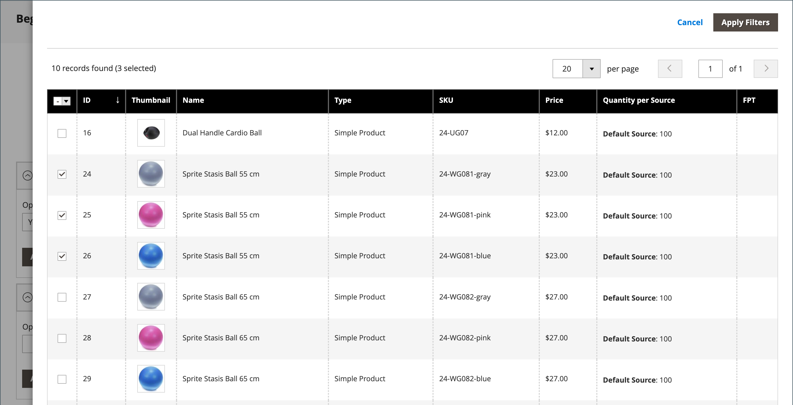
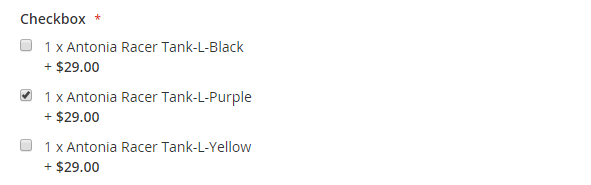

# バンドル製品

バンドルは、カスタマイズ可能な _独自に作成_ 製品です。 バンドル内の各項目は、次のいずれかの製品タイプに基づくことができます。

- [シンプルな製品](product-create-simple.md)
- [バーチャル製品](product-create-virtual.md)

{width="700" zoomable="yes"}

オプションは、顧客が **[!UICONTROL Customize]** または **[!UICONTROL Add to Cart]** をクリックすると表示されます。 バンドルに含まれる製品は様々なので、SKU、価格、重みを動的または固定値に設定できます。

>[!NOTE]
>
>Minimum Advertised Price （MAP）は、動的な価格を使用するバンドル製品では利用できません。

>[!NOTE]
>
>親バンドル製品は、そのすべての子製品のアップセル製品として常に自動的に表示されます。

[&#x200B; 即時購入 &#x200B;](../stores-purchase/checkout-instant-purchase.md) が使用可能な場合、バンドル内の各項目の _買い物かごに追加_ ボタンの下に _即時購入_ ボタンが表示されます。

{width="600" zoomable="yes"}

以下の手順では、[&#x200B; 製品テンプレート &#x200B;](attribute-sets.md)、必須フィールド、基本設定を使用してバンドル製品を作成する手順を説明します。 各必須フィールドには、赤いアスタリスク（`*`）が付いています。 基本を完了したら、必要に応じて他の製品設定を完了できます。

## 手順 1：製品タイプの選択

1. _管理者_ サイドバーで、**[!UICONTROL Catalog]**/**[!UICONTROL Products]** に移動します。

1. [_[!UICONTROL Add Product]_] （メニュー矢印 ![&#x200B; メニューの右上隅にある [**[!UICONTROL Bundle Product]**]](../assets/icon-menu-down-arrow-red.png){width="25"} 選択します。

   {width="700" zoomable="yes"}

## 手順 2：属性セットの選択

製品のテンプレートとして使用される [&#x200B; 属性セット &#x200B;](attribute-sets.md) を選択するには、次のいずれかの操作を行います。

- **[!UICONTROL Search]**：属性セットの名前
- リストで、使用する属性セットを選択します。

フォームが更新され、変更が反映されます。

{width="600" zoomable="yes"}

## 手順 3：必要な設定を完了する

1. 製品 **[!UICONTROL Product Name]** を入力します。

1. 製品名に基づくデフォルト **[!UICONTROL SKU]** を使用するか、別の値を入力します。

   各バンドル項目に割り当てられる SKU のタイプを確認するには、次の手順を実行します。

   - デフォルトの SKU にサフィックスを追加すると、**[!UICONTROL Dynamic SKU]** を各バンドル項目に自動的に割り当てることができます。 デフォルトでは、`Yes` に設定されています。

   - バンドル項目ごとに一意の SKU を割り当てる場合は、「**[!UICONTROL Dynamic SKU]**」を `No` に設定します。

   {width="600" zoomable="yes"}

1. バンドルの価格を確認するには、次のいずれかの操作を行います。

   - 顧客が選択したオプションを価格に反映させるには、「**[!UICONTROL Dynamic Price]**」を「`Yes`」に設定し、空白のままに **[!UICONTROL Price]** ます。 この場合、バンドル製品にはカタログから独自の価格はなく、製品価格はバンドルに含まれる個々の製品の価格から派生します。

   - バンドルの固定価格を請求するには、**[!UICONTROL Dynamic Price]** を `No` に設定し、バンドルに請求する **[!UICONTROL Price]** を入力します。

   >[!NOTE]
   >
   >[!UICONTROL Special Price] と [!UICONTROL Customer Group Price] （Tier Price）は、すべてのバンドル製品タイプの割引率として常に設定されます。

1. 製品はまだ公開する準備ができていないので、**[!UICONTROL Enable Product]** を `No` に設定します。

1. 「**[!UICONTROL Save]**」をクリックして続行します。

   商品を保存すると、左上隅に [&#x200B; ストア表示 &#x200B;](introduction.md#product-scope) 選択が表示されます。

1. 製品を使用できる **[!UICONTROL Store View]** を選択します。

   {width="600" zoomable="yes"}

## 手順 4：基本設定を完了する

1. バンドルに固定価格が設定されている場合は、**[!UICONTROL Tax Class]** を次のいずれかに設定します。

   - `None`
   - `Taxable Goods`

   バンドルに動的価格設定がある場合、税は **_各_** バンドル品目について決定されます。 バンドルに固定価格が設定されている場合、税は **_全体_** バンドル製品に対して決定されます。

1. 次のことに注意してください。

   - 値が各バンドル項目に対して決定されるので、**[!UICONTROL Quantity]** は使用できません。

   - デフォルトでは、**[!UICONTROL Stock Status]** は `In Stock` に設定されています。

1. バンドルの重みを判断するには、次のいずれかの操作を行います。

   - お客様が選択したオプションを重みに反映させるには、「`Yes`」 **[!UICONTROL Dynamic Weight]** 設定し、空白のままに **[!UICONTROL Weight]** ます。

   - 固定ウェイトをバンドルに割り当てるには、**[!UICONTROL Dynamic Weight]** を `No` に設定し、バンドルの **[!UICONTROL Weight]** を入力します。

   {width="600" zoomable="yes"}

1. [&#x200B; 新製品 &#x200B;](../content-design/widget-new-products-list.md) のリストに製品を特集するには、「**[!UICONTROL Set Product as New]**」チェックボックスを選択します。

1. `Catalog, Search` のデフォルトの **[!UICONTROL Visibility]** 設定を受け入れます。

1. 製品に _[!UICONTROL Categories]_&#x200B;を割り当てるには、**[!UICONTROL Select…]**&#x200B;のボックスをクリックし、次のいずれかの操作を行います。

   **既存のカテゴリを選択：**

   - 一致するものが見つかるまで、ボックスに入力を開始します。

   - 割り当てる各カテゴリのチェックボックスを選択します。

   {width="600" zoomable="yes"}

   **カテゴリを作成：**

   - 「**[!UICONTROL New Category]**」をクリックします。

   - **[!UICONTROL Category Name]** を入力し、メニュー構造内の位置を決定する **[!UICONTROL Parent Category]** を選択します。

   - 「**[!UICONTROL Create Category]**」をクリックします。

1. **[!UICONTROL Country of Manufacture]** を選択します。

   製品を説明する追加の属性がある場合があります。 選択によってアトリビュート セットが異なり、後で完成させることができます。

## 手順 5：バンドル項目を追加

「_[!UICONTROL Bundle Items]_」セクションを使用すると、バンドル製品タイプに項目を追加したり、現在選択されている項目を編集したりできます。

{width="600" zoomable="yes"}

1. 「_バンドル項目_」セクションまでスクロールし、次のいず **[!UICONTROL Ship Bundle Items]** かを設定します。

   - `Separately`
   - `Together`

   `Together` を選択した場合、すべてのバンドル項目に同じ [&#x200B; ソース &#x200B;](../inventory-management/sources-manage.md) を割り当てる必要があります。

1. 「**[!UICONTROL Add Option]**」をクリックして、次の操作を実行します。

   - フィールドラベルとして使用する **[!UICONTROL Option Title]** を入力します。

   - **[!UICONTROL Input Type]** を次のいずれかに設定します。

      - `Drop-down`
      - `Radio buttons`
      - `Checkbox`
      - `Multiple Select`

   - フィールドを必須のエントリにするには、「**[!UICONTROL Required]**」チェックボックスをオンにします。

   - 「**[!UICONTROL Add Products to Option]**」をクリックし、このオプションに含める各製品のチェックボックスを選択します。

     製品が多数ある場合は、リストフィルターとページネーションコントロールを使用して、必要な製品を見つけます。

   - 「**[!UICONTROL Add Selected Products]**」をクリックします。

     {width="600" zoomable="yes"}

   - 「_オプション_」セクションに項目が表示されたら、**[!UICONTROL Default]** に選択する項目を選択します。

   - _デフォルトの数量_ 列には、顧客が品目を選択したときにバンドルに追加される各品目の数量を入力します。

   - 顧客がバンドル品目の数量を変更できるようにするには、「**[!UICONTROL User Defined]**」を選択します。

     >[!NOTE]
     >
     >量は、プリセット値またはユーザー定義値にすることができます。 ただし、_[!UICONTROL User Defined]_&#x200B;プロパティをチェックボックスや複数選択の入力タイプに割り当てないでください。

     デフォルトでは、バンドル品目に含まれるデフォルト数量を顧客が変更することはできません。 ただし、顧客は、バンドルに含める品目の数量を入力できます。

     例えば、スプライトステータスボールのデフォルト数量が `2` に設定され、顧客がそのバンドルオプションの `4` を注文した場合、購入したボールの合計数は `8` になります。

     {width="600" zoomable="yes"}

1. バンドルに追加する項目ごとに、これらの手順を繰り返します。

1. バンドルセクション内の項目の順序を変更するには、行の先頭にある _移動_ （）アイコンをクリックし、項目を位置にドラッグします。

   {width="600" zoomable="yes"}

   また、書き出されたバンドル製品のデータで項目の順序を変更し、カタログに再度読み込むこともできます。 詳しくは、[&#x200B; バンドル製品の読み込み &#x200B;](../systems/data-transfer-bundle-products.md) を参照してください。

   ワークスペースを見やすくするには、最初に各セクションを折りたたんでから、適切な位置にドラッグします。

1. バンドルから項目を削除するには、**[!UICONTROL Delete]** の（ごみ箱アイコン  ます。

1. 完了したら、「**[!UICONTROL Save]**」をクリックします。

## 手順 6：製品情報の入力

下にスクロールして、必要に応じて次のセクションの情報を入力します。

- [コンテンツ](product-content.md)
- [画像とビデオ](product-images-and-video.md)
- [検索エンジンの最適化](product-search-engine-optimization.md)
- [関連製品、アップセルおよびクロスセル](related-products-up-sells-cross-sells.md)
- [カスタマイズ可能なオプション](settings-advanced-custom-options.md)
- [Web サイトの製品](settings-basic-websites.md)
- [デザイン](settings-advanced-design.md)
- [ギフトオプション](product-gift-options.md)

## 手順 7：商品のPublish

1. カタログに製品を公開する準備が整ったら、**[!UICONTROL Enable Product]** を `Yes` に設定します（）。

1. 次のいずれかの操作を行います。

   **方法 1:** 保存とプレビュー

   - 右上隅の「**[!UICONTROL Save]**」をクリックします。

   - ストアで製品を表示するには、_管理者_ （） メニューの **[!UICONTROL Customer View]** を選択します。

     ストアが新しいブラウザータブで開きます。

   {width="600" zoomable="yes"}

   **メソッド 2:** 保存して閉じる

   _[!UICONTROL Save]_（メニュー矢印 {width="25"} 「**[!UICONTROL Save & Close]**」を選択します。

## 入力コントロール

| 制御 | 説明 | 例 |
|--- |--- |--- |
| [!UICONTROL Drop-down] | 製品名と価格を含むオプションのドロップダウン リストを表示します。 選択できる項目は 1 つだけです。 | {width="200"} |
| [!UICONTROL Radio Buttons] | 各オプションのラジオボタンを表示し、その後に製品名と価格を表示します。 選択できる項目は 1 つだけです。 | {width="200"} |
| [!UICONTROL Checkbox] | 各オプションのチェックボックスに続いて製品名と価格が表示されます。 複数の項目を選択できます。 | {width="200"} |
| [!UICONTROL Multiple Select] | 製品名と価格を含むオプションのリストを表示します。 複数の項目を選択するには、Ctrl キー（PC）または Command キー（Mac）を押したまま、各項目をクリックします。 | {width="200"} |

{style="table-layout:auto"}

## フィールドの説明

| フィールド | 説明 |
|--- |--- |
| [!UICONTROL SKU] | 各項目に変数 SKU または動的 SKU を割り当てるか、バンドルに固定 SKU を使用するかを決定します。 オプション：`Fixed` / `Dynamic` |
| [!UICONTROL Weight] | 選択した項目に基づいて重みを計算するか、バンドル全体の固定重みにするかを指定します。 オプション：`Fixed` / `Dynamic` |
| [!UICONTROL Price View] | 製品価格を、最も安価な価格から最も高価な価格（価格範囲）または最も安価な価格（安値）として表示する範囲として表示するかどうかを決定します。 オプション：`Price Range` / `As Low As` |
| バンドル品目の出荷 | 個々の品目を個別に出荷できるかどうかを指定します。 |

{style="table-layout:auto"}

## バンドル製品の在庫ステータス

次のいずれかのシナリオが発生すると、バンドル製品の在庫ステータスは **_自動的に在庫切れに変更されます_**

- すべてのオプションはオプションで、関連するすべての製品は _在庫切れ_ です。

- 一部のオプションは必須で、必須オプションに関連付けられている製品は _在庫切れ_ です。

次のいずれかのシナリオが発生した場合、バンドル製品の在庫ステータスは **_自動的に在庫切れに変更されません_**

- すべてのオプションはオプションで、少なくとも 1 つの関連製品は _在庫_ です。

- 一部のオプションは必須で、それぞれの必須オプションに少なくとも 1 つの関連製品が _在庫中_ です。

## 注意事項

 お客様は独自のバンドル製品を _ビルド_ できます。

 すべての子製品は、すべての web サイト、ストア、ストア表示に対して、バンドル製品から **_グローバル_** 割り当ておよび割り当て解除されます。

 バンドル項目は、カスタムオプションを持たないシンプル製品または仮想製品にすることができます。

 価格表示は、`Price Range` または `As Low As` のいずれかに設定できます。

SKU と重みは、`Fixed` または `Dynamic` のいずれかです。

 数量は、プリセット値またはユーザー定義値にすることができます。 ただし、_[!UICONTROL User Defined]_&#x200B;プロパティをチェックボックスや複数選択の入力タイプに割り当てないでください。

 バンドル項目は、一緒に出荷することも、個別に出荷することもできます。

 親バンドル製品は、そのすべての子製品のアップセル製品として常に自動的に表示されます。

 [!UICONTROL Special Price] および [!UICONTROL Customer Group Price] （階層価格）は、すべてのバンドル製品タイプの割引率として常に設定されます。
