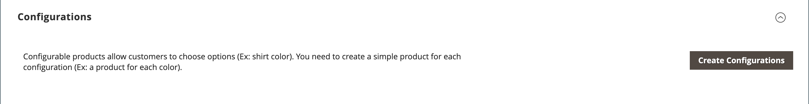
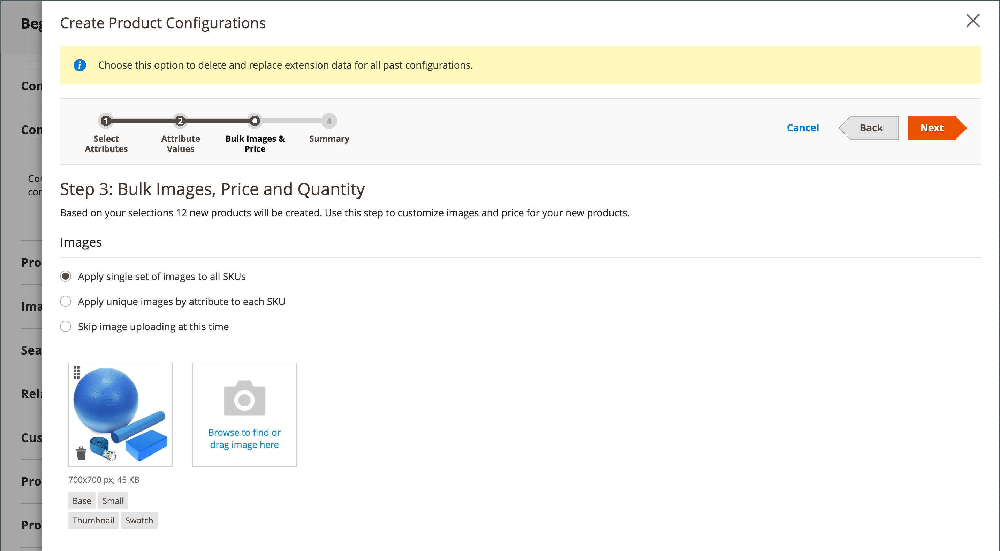

# 設定可能な製品

設定可能な製品は、各バリエーションのドロップダウンリストを持つ単一の製品のように見えます。 リストの各項目は、実際には一意の SKU を持つ個別のシンプルな製品なので、製品バリエーションごとに在庫を追跡できます。 カスタムオプションを備えた単純な製品を使用すれば、同様の効果を得ることができますが、各バリエーションの在庫を追跡する機能はありません。

以下の手順では、[ 製品テンプレート ](attribute-sets.md)、必須フィールド、基本設定を使用して設定可能な製品を作成するプロセスを示します。 各必須フィールドには、赤いアスタリスク（`*`）が付いています。 基本を完了したら、必要に応じて他の製品設定を完了できます。

{width="700" zoomable="yes"}

## パート 1：設定可能なプロダクトの作成

設定可能な製品では、より多くの SKU を使用し、最初は設定に少し時間がかかる場合がありますが、最終的には時間を節約できます。 ビジネスの成長を計画している場合、複数のオプションを持つ製品には、設定可能な製品タイプが適しています。

開始する前に、各製品バリエーションで許可される入力タイプの 1 つに設定される属性を含む [ 属性セット ](attribute-sets.md) を準備します。 例えば、属性セットには、カラーとサイズのドロップダウン属性が含まれる場合があります。

設定可能な製品バリエーションに使用される各属性のプロパティには、次の設定が必要です。

### 製品バリエーション属性の要件

| プロパティ | 設定 |
|--- |--- |
| [!UICONTROL Scope] | `Global` |
| [!UICONTROL Catalog Input Type for Store Owner] | 製品バリエーションに使用される属性の入力タイプは、`Dropdown`、`Visual Swatch`、`Text Swatch` のいずれかである必要があります。 |
| [!UICONTROL Values Required] | `Yes` |
| [!UICONTROL Use for Promo Rule Conditions] | `Yes` |

{style="table-layout:auto"}

### 手順 1：製品タイプの選択

1. _管理者_ サイドバーで、**[!UICONTROL Catalog]**/**[!UICONTROL Products]** に移動します。

1. 右上隅の _[!UICONTROL Add Product]_（メニュー矢印 {width="25"} 「**[!UICONTROL Configurable Product]**」を選択します。

   {width="700" zoomable="yes"}

### 手順 2：属性セットの選択

[ 属性セット ](attribute-sets.md) は、製品で使用されるフィールドの選択を決定します。 次の例で使用する属性セットには、カラーとサイズの属性があります。 属性セットの名前はページの上部に示され、最初は `Default` に設定されます。

1. 製品の属性セットを選択するには、ページ上部のフィールドをクリックし、次のいずれかの操作を行います。

   - **[!UICONTROL Search]**：属性セットの名前を入力します。
   - リストで、使用する属性セットを選択します。

   フォームが更新され、変更が反映されます。

1. 属性セットに別の属性を追加する場合は、「**[!UICONTROL Add Attribute]**」をクリックし、[ 属性の追加 ](product-attributes-add.md) の指示に従います。

   {width="600" zoomable="yes"}

### 手順 3：必要な設定を完了する

1. 製品 **[!UICONTROL Product Name]** を入力します。

1. 製品名に基づくデフォルト **[!UICONTROL SKU]** を受け入れるか、別の名前を入力します。

1. 製品 **[!UICONTROL Price]** を入力します。

1. 製品はまだ公開する準備ができていないので、**[!UICONTROL Enable Product]** を `No` に設定します。

1. 「**[!UICONTROL Save]**」をクリックして続行します。

   商品を保存すると、左上隅に [ ストア表示 ](introduction.md#product-scope) 選択が表示されます。

1. 製品を使用できる **[!UICONTROL Store View]** を選択します。

   {width="600" zoomable="yes"}

### 手順 4：基本設定を完了する

1. **[!UICONTROL Tax Class]** を次のいずれかに設定します。

   - `None`
   - `Taxable Goods`

1. **[!UICONTROL Quantity]** は製品のバリエーションによって決まるので、空白のままにすることができます。

1. **[!UICONTROL Stock Status]** は設定のままにします。

   設定可能な商品の在庫ステータスは、関連する設定ごとに決定されます。 数量を入力せずに製品が保存されたので、**[!UICONTROL Stock Status]** は `Out of Stock` に設定されます。

   >[!NOTE]
   >
   >設定可能な商品の **在庫ステータス** は、**_半手動_** で制御される設定です。 子製品の在庫状況によって部分的に制御されています。 これは、**_在庫ステータスの設定_** の節で説明されている [ 複数条件 ](#configure-the-stock-status) 在庫ステータスの計算の一部です。

1. 製品 **[!UICONTROL Weight]** を入力します。

>[!NOTE]
>
>設定可能な製品には、常に重み付けが必要です。 ドロップダウンリストから「**[!UICONTROL This item has no weight]**」を選択すると、製品を保存した後に自動的に「**[!UICONTROL This item has weight]**」に変更されます。

1. `Catalog, Search` のデフォルトの **[!UICONTROL Visibility]** 設定を受け入れます。

1. [ 新製品 ](../content-design/widget-new-products-list.md) のリストに製品を特集するには、「**[!UICONTROL Set Product as New]**」チェックボックスを選択します。

1. 製品にカテゴリを割り当てるには、**[!UICONTROL Select…]** のボックスをクリックし、次のいずれかの操作を行います。

   **既存のカテゴリを選択**:

   - 一致するものが見つかるまで、ボックスに入力を開始します。

   - 割り当てるカテゴリのチェックボックスを選択します。

   {width="600" zoomable="yes"}

   **カテゴリを作成する**:

   - 「**[!UICONTROL New Category]**」をクリックします。

   - **[!UICONTROL Category Name]** を入力し、メニュー構造内の位置を決定する **[!UICONTROL Parent Category]** を選択します。

   s - 「**[!UICONTROL Create Category]**」をクリックします。

1. **[!UICONTROL Country of Manufacture]** を選択します。

   製品の説明に使用される追加の属性がある場合があります。 選択は属性セットによって異なり、後で完了できます。

### 手順 5：保存して続行

今が作業を節約するのに良い時期です。 右上隅の「**[!UICONTROL Save]**」をクリックします。 次の一連の手順では、製品のバリエーションごとに設定を設定します。

## パート 2：設定の追加

次の例は、3 つの色と 3 つのサイズの設定を追加する方法を示しています。 バリエーションのすべての可能な組み合わせをカバーするために、9 つのシンプルな製品が一意の SKU で作成されます。 デフォルトでは、各バリエーションの製品名と SKU は、属性値と、親の製品名または SKU のいずれかに基づいています。

ページの上部にあるプログレスバーは、プロセスの現在の位置を示し、各ステップをガイドします。

### 手順 1：属性の選択

1. 上から続けて、「_[!UICONTROL Configurations]_」セクションまで下にスクロールし、「**[!UICONTROL Create Configurations]**」をクリックします。

   {width="600" zoomable="yes"}

1. 設定として含める各属性のチェックボックスをオンにします。

   この例では、`color` と `size` が選択されています。

   {width="600" zoomable="yes"}

   リストには、設定可能な製品で使用できる、属性セットのすべての属性が含まれています。

1. 属性を追加する場合は、「**[!UICONTROL Create New Attribute]**」をクリックして以下を実行します。

   - 属性プロパティを入力します。

   - 「**[!UICONTROL Save Attribute]**」をクリックします。

   - 属性のチェックボックスを選択します。

1. 右上隅の「**[!UICONTROL Next]**」をクリックします。

### 手順 2：属性値の入力

1. 属性ごとに、製品に適用する値のチェックボックスをオンにします。

   {width="600" zoomable="yes"}

1. 属性を並べ替えるには、_並べ替え_ （） アイコンを選択して、セクションを新しい位置に移動します。

   この順序によって、製品ページ上のドロップダウンリストの位置が決まります。

1. プログレスバーで、「**[!UICONTROL Next]**」をクリックします。

### 手順 3：画像、価格、数量を設定する

このステップでは、各設定の画像、価格、数量を決定します。 使用可能なオプションはそれぞれに対して同じで、1 つのみ選択できます。 すべての SKU に同じ設定を適用することも、各 SKU に一意の設定を適用することも、今は設定をスキップすることもできます。

適用する設定オプションを選択します。

次のいずれかの方法を使用して **[!UICONTROL images]** を設定します。

**方法 1:** 単一の画像セットをすべての SKU に適用する

1. 「**[!UICONTROL Apply single set of images to all SKUs]**」を選択します。

1. 商品ギャラリーに含める各画像を参照するか、ボックスにドラッグします。

{width="600" zoomable="yes"}

**方法 2:** 各 SKU に一意の画像を適用する

親商品の画像は既にアップロードされているので、このオプションを使用して各カラーの画像をアップロードできます。 アイテムが特定の色で購入されたときに買い物かごに表示される別の画像を追加できます。

1. 「**[!UICONTROL Apply unique images by attribute to each SKU]**」を選択します。

1. 画像で示されている **[!UICONTROL Attribute]** （`color` など）を選択します。

1. 各属性値について、その設定に使用する画像を参照するか、ボックスにドラッグします。

   画像を値ボックスにドラッグすると、他の値のセクションにも表示されます。 画像を削除する場合は、_ごみ箱_ （） アイコンをクリックします。

   {width="600" zoomable="yes"}

次のいずれかの方法を使用して **[!UICONTROL prices]** を設定します。

>[!NOTE]
>
>設定可能な製品には、カタログ内に独自の価格はありません。 設定可能な製品価格は、その [!UICONTROL In Stock] の子製品から派生します。

**方法 1:** すべての SKU に同じ価格を適用する

1. 価格がすべてのバリエーションで同じ場合は、「**[!UICONTROL Apply single price to all SKUs]**」を選択します。

1. **[!UICONTROL Price]** を入力します。

   {width="600" zoomable="yes"}

**方法 2:** SKU ごとに異なる価格を適用する

1. または製品の一部のバリエーションで価格が異なる場合は、「**[!UICONTROL Apply unique prices by attribute to each SKU]**」を選択します。

1. 価格差の基礎となる **[!UICONTROL Attribute]** を選択します。

1. 各属性値の **[!UICONTROL Price]** を入力します。

   この例では、XL サイズの方がコストがかかります。

   {width="600" zoomable="yes"}

次のいずれかの方法を使用して **[!UICONTROL Quantity]** を設定します。

**方法 1:** すべての SKU に同じ数量を適用する

すべての SKU で数量が同じ場合は、「**[!UICONTROL Apply single quantity to each SKU]**」を選択して数量を指定します。

_シングルソースマーチャント_ - **[!UICONTROL Quantity]** を入力します。

_[Inventory managementを使用するマルチSourceマーチャント](../inventory-management/introduction.md)_ - ソースを割り当て、生成されたすべての製品バリアントの数量を追加します。

1. **[!UICONTROL Apply single quantity to each SKU]** オプションを選択します。

1. ソースを追加するには、「**[!UICONTROL Assign Sources]**」をクリックします。

1. 追加するソースを参照または検索します。 製品に追加するソースの横にあるチェックボックスをオンにします。

1. ソースごとの手持在庫金額を入力します。

   {width="600" zoomable="yes"}

**方法 2:** 属性別に異なる数量を適用

_シングルソースマーチャント_ - **[!UICONTROL Quantity]** を入力します。

_[Inventory managementを使用するマルチSourceマーチャント](../inventory-management/introduction.md)_ - ソースを割り当て、生成されたすべての製品バリアントの数量を追加します。

1. SKU ごとに数量が異なる場合は、「**[!UICONTROL Apply unique quantity by attribute to each SKU]**」を選択します。

1. それぞれの **[!UICONTROL Quantity]** を入力します。

   {width="600" zoomable="yes"}

画像、価格、数量の設定が完了したら、右上隅の「**[!UICONTROL Next]**」をクリックします。

### 手順 4：製品設定の生成

製品のリストが表示されるまで待ち、次のいずれかの操作を行います。

- 設定に問題がなければ、「**[!UICONTROL Generate Products]**」をクリックします。

- 修正を行うには、「**[!UICONTROL Back]**」をクリックします。

{width="600" zoomable="yes"}

現在の製品バリエーションは、「_設定_ セクションの下部に表示されます。

{width="600" zoomable="yes"}

### 手順 5：製品画像の追加

1. 下にスクロールして、「_[!UICONTROL Images and Videos]_」セクションの  を展開します。

1. _カメラ_ タイルをクリックし、設定可能な製品に使用するメイン画像を参照します。

詳しくは、[ 画像とビデオ ](product-images-and-video.md) を参照してください。

### 手順 6：製品情報の入力

下にスクロールして、必要に応じて次のセクションの情報を入力します。

- [コンテンツ](product-content.md)

- [関連製品、アップセルおよびクロスセル](related-products-up-sells-cross-sells.md)

- [検索エンジンの最適化](product-search-engine-optimization.md)

- [カスタマイズ可能なオプション](settings-advanced-custom-options.md)

- [Web サイトの製品](settings-basic-websites.md)

- [デザイン](settings-advanced-design.md)

- [ギフトオプション](product-gift-options.md)

### 手順 7：製品を公開する

1. カタログに製品を公開する準備が整ったら、**[!UICONTROL Enable Product]** を `Yes` に設定し、次のいずれかの操作を行います。

   - **方法 1:** 保存とプレビュー

      - 右上隅の「**[!UICONTROL Save]**」をクリックします。

      - ストアで製品を表示するには、_管理者_ （） メニューの **[!UICONTROL Customer View]** を選択します。

     ストアが新しいブラウザータブで開きます。

     {width="600" zoomable="yes"}

   - **メソッド 2:** 保存して閉じる

     _[!UICONTROL Save]_（メニュー矢印 {width="25"} 「**[!UICONTROL Save & Close]**」を選択します。

### 手順 8：買い物かごのサムネールの設定

バリエーションごとに異なる画像がある場合、買い物かごのサムネールに正しい画像を使用するように設定できます。

1. _管理者_ サイドバーで、**[!UICONTROL Stores]**/_[!UICONTROL Settings]_/**[!UICONTROL Configuration]**に移動します。

1. 左側のパネルで「**[!UICONTROL Sales]**」を展開し、その下の「**[!UICONTROL Checkout]**」を選択します。

1. 「」を展開し、「_[!UICONTROL Shopping Cart]_」セクションを展開します。

1. **[!UICONTROL Configurable Product Image]** を `Product Thumbnail Itself` に設定します。

1. 完了したら、「**[!UICONTROL Save Config]**」をクリックします。

   {width="600" zoomable="yes"}

## 在庫ステータスの設定

設定可能な製品のストックステータスは、単純な製品のストックステータスとは異なります。単純な製品のストックステータスは、製品の可用性を直接表します。 設定可能なプロダクトの場合、ストックステータスは **_複数基準_** ストックステータス計算の一部になります。

### 概要

在庫ステータス関係の主な原則は次のとおりです。

- 設定可能なプロダクトの **[!UICONTROL Stock Status]** を `Out of Stock` として変更して「**[!UICONTROL Save]**」をクリックすると、その子プロダクトのストックステータスによって **_制御されません_**。 管理者およびストアフロントでは、常に `Out of Stock` のように表示されます。

- 設定可能な商品の **[!UICONTROL Stock Status]** を「`In Stock`」に設定して「**[!UICONTROL Save]**」をクリックすると、子商品の在庫ステータスによって **_部分的にのみ制御_** されます。このステータスは、管理およびストアフロントに反映されます。

### 詳細な説明

設定可能なプロダクトの _在庫ステータス_ は、その子プロダクトの在庫ステータスによって、および以下の **_複数基準_** 在庫ステータスの計算に従って、部分的に制御されます。

#### デフォルトのソース/在庫のみ：

- 設定可能な製品の在庫ステータスが **_手動_** 管理者ユーザー、ファイルの読み込み、または API 呼び出しによって `Out of Stock` に設定されている場合、管理者ユーザー、ファイルの読み込み、または API 呼び出しによって _**手動**_ に変更されるまで _**`In stock` 管理者_** と **_ストアフロント `Out of Stock` の両方で**_ に設定されたままになります。 子製品の在庫状況で制御することはできません。

- 管理者ユーザー、ファイルの読み込み、API 呼び出しによって設定可能な製品の在庫ステータスが **_手動で_**`In Stock` に設定されている場合、その在庫ステータスは、**_管理者_** と **_ストアフロント_** の両方で、子製品の在庫ステータスによって **_自動的に_** 制御されます。

>[!NOTE]
>
>カスタムの在庫およびソースは、[Inventory management](../inventory-management/sources-stocks.md) 拡張機能の一部です。このツールは、在庫およびソースの管理にのみ使用することを強くお勧めします。 デフォルトの source 関数と stock 関数は、`CatalogInventory` モジュールの一部です。このモジュールは非推奨（廃止予定）になりました。

#### 1 つ以上のカスタムソース/在庫を使用：

- 設定可能な製品の在庫ステータスの値が **_手動_** 管理者ユーザー、ファイルの読み込み、または API 呼び出しによって `Out of Stock` に設定されている場合、管理者ユーザー、ファイルの読み込み、または API 呼び出しによって _**手動**_ に変更されるまで _**管理者_** と **_ストアフロント**_ の両方で `In Stock` に `Out of Stock` 定されたままになります。 子製品の在庫状態によって制御される **_することはできません_**。

- 設定可能な製品の在庫ステータスの値が **_手動で_**`In Stock` に設定されている場合、管理者ユーザー、ファイルの読み込み、または API 呼び出しによって、その在庫ステータスは **_自動的に_**、**_ストアフロント_** 上の子製品の在庫ステータスによってのみ制御されます。

- 設定可能な製品の在庫ステータスの値が **_手動_** 管理者ユーザー、ファイルの読み込みまたは API 呼び出しによって `In Stock` に設定されている場合、管理者ユーザー、ファイルの読み込みまたは API 呼び出しによって _**手動**_`Out of Stock` に変更されるまで、**_管理者_** で `In Stock` のまま保持されます。 子製品の在庫状態によって制御される **_することはできません_**。

## 注意事項

- 設定可能な製品を使用すると、買い物客は、ドロップダウン、複数選択、ビジュアルスウォッチ、テキストスウォッチの入力タイプからオプションを選択できます。 各オプションは個別のシンプルな製品です。

- 設定可能な商品の [ 在庫ステータス ](../inventory-management/sources-stocks.md) は、半手動で制御される設定です。 これは、単純な製品の在庫ステータスとは異なります。単純な製品の在庫ステータスは、製品の可用性を直接表します。 設定可能なプロダクトの場合、ストックステータスは複数基準のストックステータス計算の一部になります。

- 設定可能な子製品は、単純な製品でも仮想製品でも構いません **カスタムオプションはありません**。 カスタムの子製品をバーチャルにするには、それぞれの **[!UICONTROL Weight]** 設定に `Тhis item has no weight` を選択する必要があります。

- すべての子製品は、すべての web サイト、ストア、ストア表示に対して、設定可能な製品から **_グローバルに_** 割り当ておよび割り当て解除されます。

- 設定可能な製品には、カタログ内に独自の価格はありません。 設定可能な製品価格は、その [!UICONTROL In Stock] の子製品から派生します。

- 製品バリエーションに使用する属性にはグローバルスコープが必要で、顧客が値を選択する必要があります。 製品バリエーション属性は、設定可能な製品のテンプレートとして使用される属性セットに含める必要があります。

- 設定可能な商品のテンプレートとして使用される属性セットには、各商品バリエーションに必要な値を含む属性が含まれている必要があります。

- 買い物かご内のサムネール画像は、設定可能な商品レコードまたは商品バリエーションから画像を表示するように設定できます。

- [ スウォッチ属性 ](swatches.md#create-swatches-for-products) は、管理者の属性編集ページで **[!UICONTROL Update Product Preview Image]** オプションの値を `No` に設定することで、スウォッチが選択されたときに対応するシンプルな製品画像を表示しないように設定できます。

- テーマは、ユーザーが製品設定を切り替える際の画像ギャラリーの動作を制御します。 _空白_ テーマのデフォルト動作は、設定可能な親の製品画像を、選択した製品バリエーションで上書きすることです。 Luma テーマの場合、デフォルトの動作では、選択した製品バリエーション画像を親の設定可能な製品画像の前に追加します。
