# コンフィグ商品

設定可能な商品は、色やサイズなどのバリエーションのドロップダウンオプションを含む単一の商品として表示されます。 各バリエーションは、独自のSKUを持つ個別のシンプルな商品であり、カスタムオプションを備えたシンプルな商品とは異なり、個々の在庫を追跡することができます。

**複数のオプション （色、サイズ、素材など）を持つ**&#x200B;製品に最適 各バリエーションの在庫を追跡する必要があります。 初期設定には時間がかかりますが、スケーラビリティは向上します。

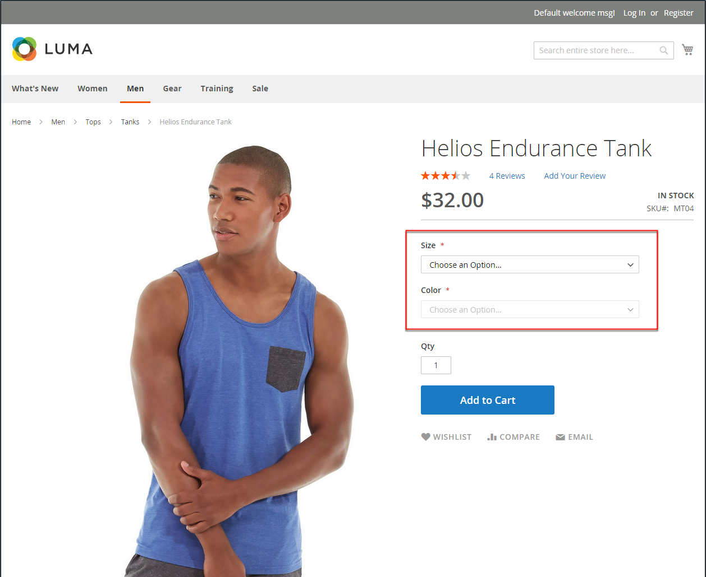{width="700" zoomable="yes"}

## 始める前に

### 前提条件チェックリスト

設定可能な製品を作成する前に、次のことを確認してください。

1. **属性セット** - バリエーション属性（色やサイズなど）を含む属性セット
1. **バリエーション属性が作成されました** – 以下の設定で設定された属性
1. **製品画像** - （オプションですが推奨）親製品と各バリエーションの画像

### 属性要件

製品バリエーションに使用する各属性には、次の設定が必要です。

| プロパティ | 必須の設定 |
|--- |--- |
| [!UICONTROL Scope] | `Global` |
| [!UICONTROL Catalog Input Type for Store Owner] | `Dropdown`、`Visual Swatch`または`Text Swatch` |
| [!UICONTROL Values Required] | `Yes` |

{style="table-layout:auto"}

属性の作成手順については、[製品属性](product-attributes.md)を参照してください。

## フェーズ 1：プロダクト基盤の構築

### 手順1：商品タイプの選択

1. _管理者_ サイドバーで、**[!UICONTROL Catalog]** > **[!UICONTROL Products]**&#x200B;に移動します。

1. 右上隅の&#x200B;_[!UICONTROL Add Product]_（{width="25"}）メニューで、**[!UICONTROL Configurable Product]**&#x200B;を選択します。

   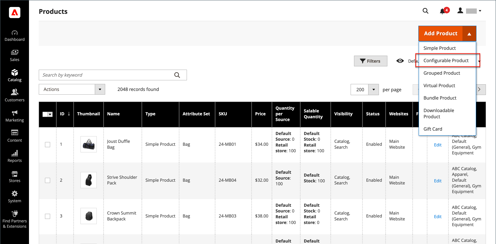{width="700" zoomable="yes"}

### 手順2：属性セットの選択

[属性セット &#x200B;](attribute-sets.md)は、製品フォームに表示されるフィールドと、バリエーションに使用できる属性を決定します。

1. ページの上部にある属性セットフィールドをクリックし、次のいずれかの操作を行います。

   - **[!UICONTROL Search]**&#x200B;に、属性セットの名前を入力します。
   - リストで、使用する属性セットを選択します。

   フォームが更新され、選択した属性セットが反映されます。

1. 属性セットに別の属性を追加する必要がある場合は、**[!UICONTROL Add Attribute]**&#x200B;をクリックし、[属性の追加](product-attributes-add.md)の手順に従います。

   {width="600" zoomable="yes"}

### 手順3：基本情報の入力

1. 製品&#x200B;**[!UICONTROL Product Name]**&#x200B;を入力します。

1. 製品名に基づいてデフォルトの&#x200B;**[!UICONTROL SKU]**&#x200B;を受け入れるか、別の値を入力してください。

1. 製品&#x200B;**[!UICONTROL Price]**&#x200B;を入力します。

   >[!NOTE]
   >
   >この価格は、子商品価格によって上書きされます。 お客様に表示される実際の価格は、[!UICONTROL In Stock]個の子商品に基づいています。

1. 製品はまだ公開する準備ができていないので、**[!UICONTROL Enable Product]**&#x200B;を`No`に設定します。

1. **[!UICONTROL Save]**&#x200B;をクリックして続行します。

   商品を保存すると、左上隅に「[&#x200B; ストアビュー](introduction.md#product-scope)」の選択画面が表示されます。

1. 製品を利用できる&#x200B;**[!UICONTROL Store View]**&#x200B;を選択します。

   {width="600" zoomable="yes"}

### 手順4：基本設定の完了

1. **[!UICONTROL Tax Class]**&#x200B;を次のいずれかに設定します：

   - `None`
   - `Taxable Goods`

1. **[!UICONTROL Quantity]**&#x200B;を空白のままにします。 数量は、製品のバリエーションによって決まります。

1. **[!UICONTROL Stock Status]**&#x200B;を設定のままにします。

   設定可能な製品の在庫状況は、関連するバリエーションによって決まります。 商品は数量なしで保存されたため、**[!UICONTROL Stock Status]**&#x200B;は`Out of Stock`に設定されています。

   >[!NOTE]
   >
   >設定可能な製品の&#x200B;**在庫状況**&#x200B;は、**_半手動_**&#x200B;で制御される設定であり、一部は子製品の在庫状況に基づいています。 これは、**_複数の基準_**&#x200B;の在庫状況の計算の一部です。 詳しくは、[在庫状況の設定](#configure-stock-status)を参照してください。

1. 製品&#x200B;**[!UICONTROL Weight]**&#x200B;を入力します。

   >[!NOTE]
   >
   >コンフィグ可能な商品には、常に重みが必要です。 ドロップダウンから「**[!UICONTROL This item has no weight]**」を選択すると、製品を保存すると、自動的に「**[!UICONTROL This item has weight]**」に変更されます。

1. `Catalog, Search`の既定の&#x200B;**[!UICONTROL Visibility]**&#x200B;設定を受け入れます。

1. [新製品](../content-design/widget-new-products-list.md)のリストに商品を表示するには、**[!UICONTROL Set Product as New]** チェックボックスを選択します。

1. 製品にカテゴリを割り当てるには、**[!UICONTROL Select…]** ボックスをクリックし、次のいずれかの操作を行います。

   **既存のカテゴリを選択：**

   - ボックスに入力し始めて、一致する項目を見つけます。

   - 割り当てる各カテゴリのチェックボックスをオンにします。

   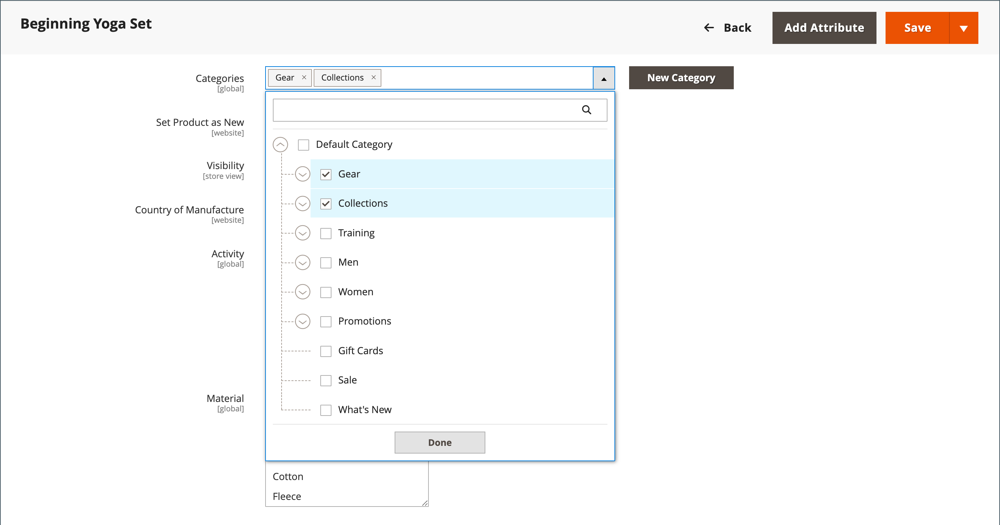{width="600" zoomable="yes"}

   **新しいカテゴリを作成：**

   - **[!UICONTROL New Category]**&#x200B;をクリックします。

   - **[!UICONTROL Category Name]**&#x200B;を入力し、**[!UICONTROL Parent Category]**&#x200B;を選択して、メニュー構造での位置を決定します。

   - **[!UICONTROL Create Category]**&#x200B;をクリックします。

1. **[!UICONTROL Country of Manufacture]**&#x200B;を選択します。

   属性セットによっては、追加の属性が表示される場合があります。 後で完了できます。

### 手順5：保存して続行

これはあなたの仕事を節約するのに良い時期です。 右上隅の&#x200B;**[!UICONTROL Save]**&#x200B;をクリックします。 次の段階では、各バリエーションの設定を行います。

## フェーズ 2：製品バリエーションの追加

次の手順では、複数のバリエーションの設定を追加する方法を示します。 ページ上部のプログレスバーには、プロセスの現在の位置が表示されます。

**例：** 3色と3 サイズのシャツの場合、9つのシンプルな商品と独自のSKU （組み合わせごとに1つ）を作成します。 デフォルトでは、各バリエーションの製品名とSKUは、属性値と親の製品名またはSKUに基づいています。

### ステップ 6：バリエーション属性の選択

1. _[!UICONTROL Configurations]_&#x200B;セクションまでスクロールして、**[!UICONTROL Create Configurations]**&#x200B;をクリックします。

   {width="600" zoomable="yes"}

1. バリエーションとして含める各属性のチェックボックスを選択します。

   この例では、`color`と`size`が選択されています。

   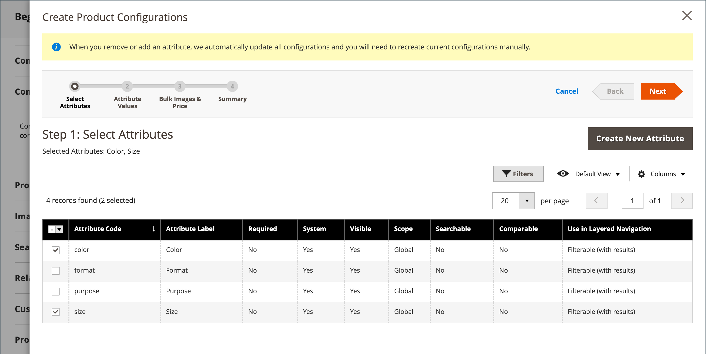{width="600" zoomable="yes"}

   リストには、設定可能な製品で使用できる属性セットのすべての属性が含まれます。

1. 属性を追加する必要がある場合は、**[!UICONTROL Create New Attribute]**&#x200B;をクリックし、次の操作を行います。

   - 属性のプロパティを設定します。

   - **[!UICONTROL Save Attribute]**&#x200B;をクリックします。

   - 属性のチェックボックスをオンにします。

1. 右上隅の&#x200B;**[!UICONTROL Next]**&#x200B;をクリックします。

### 手順7：属性値の選択

1. 各属性について、製品に適用される値のチェックボックスを選択します。

   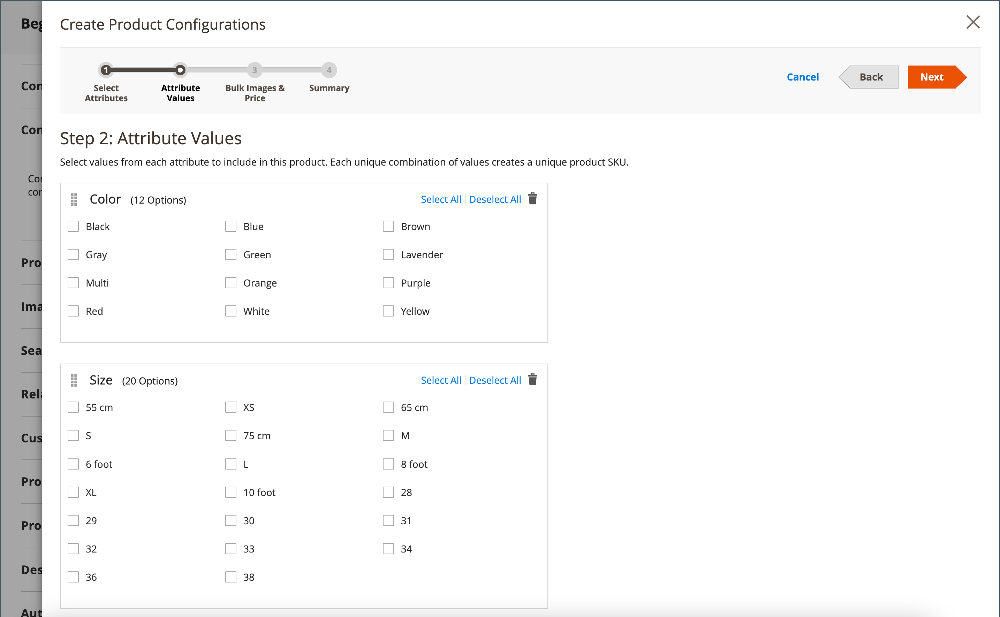{width="600" zoomable="yes"}

1. 属性を並べ替えるには、_並べ替え_ （）アイコンをクリックし、セクションを新しい位置に移動します。

   この順序によって、製品ページ上のドロップダウンリストの位置が決まります。

1. 進行状況バーで、**[!UICONTROL Next]**&#x200B;をクリックします。

### 手順8：画像、価格、在庫の設定

このステップでは、各設定の画像、価格、数量を決定します。 使用可能なオプションはそれぞれで同じです。 すべてのSKUに同じ設定を適用したり、各SKUに一意の設定を適用したり、今は設定をスキップしたりできます。

#### 画像の設定

適用される設定オプションを選択します。

**オプション 1：すべてのSKUに1つの画像セットを適用**

1. **[!UICONTROL Apply single set of images to all SKUs]**&#x200B;を選択します。

1. 製品ギャラリーに含める各画像を参照するか、画像をボックスにドラッグします。

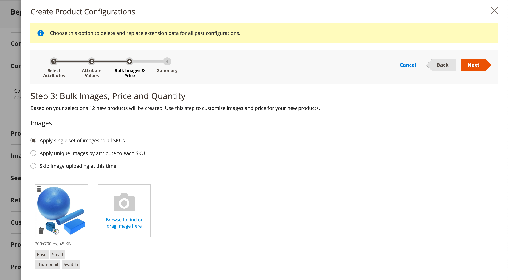{width="600" zoomable="yes"}

**オプション 2：各SKUに一意の画像を適用**

親製品画像は既にアップロードされているので、このオプションを使用して各バリエーションの画像をアップロードします。 顧客が特定のバリエーションを購入したときに、ショッピングカートに表示されるさまざまな画像を追加できます。

1. **[!UICONTROL Apply unique images by attribute to each SKU]**&#x200B;を選択します。

1. 画像が示す&#x200B;**[!UICONTROL Attribute]** （例：`color`）を選択します。

1. 属性値ごとに、その設定に使用する画像を参照するか、ボックスにドラッグします。

   画像を値ボックスにドラッグすると、他の値のセクションにも表示されます。 画像を削除するには、_ごみ箱_ （）アイコンをクリックします。

   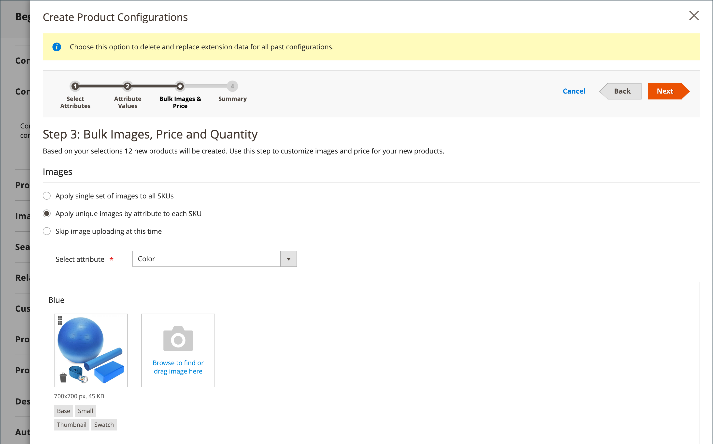{width="600" zoomable="yes"}

#### 価格の設定

>[!NOTE]
>
>設定可能な製品には、カタログ内に独自の価格はありません。 設定可能な製品価格は、[!UICONTROL In Stock]個の子製品から得られます。

適用される設定オプションを選択します。

**オプション 1：すべてのSKUに同じ価格を適用**

1. すべてのバリエーションの価格が同じ場合は、**[!UICONTROL Apply single price to all SKUs]**&#x200B;を選択します。

1. **[!UICONTROL Price]**&#x200B;を入力します。

   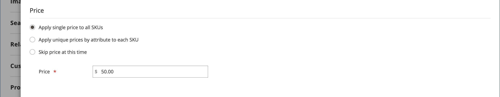{width="600" zoomable="yes"}

**オプション 2:SKUごとに異なる価格を適用**

1. 各製品または一部のバリエーションで価格が異なる場合は、**[!UICONTROL Apply unique prices by attribute to each SKU]**&#x200B;を選択します。

1. 価格差の基となる&#x200B;**[!UICONTROL Attribute]**&#x200B;を選択します。

1. 属性値ごとに&#x200B;**[!UICONTROL Price]**&#x200B;を入力します。

   この例では、XL サイズの方がコストがかかります。

   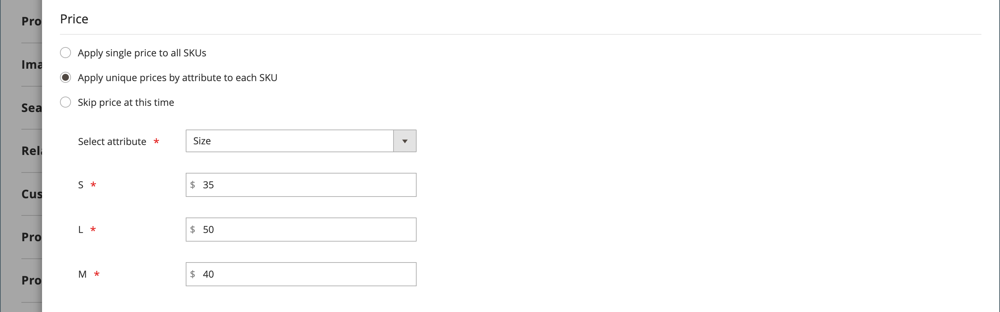{width="600" zoomable="yes"}

#### 在庫の設定

適用される設定オプションを選択します。

**オプション 1：すべてのSKUに同じ数量を適用**

すべてのSKUで数量が同じ場合は、**[!UICONTROL Apply single quantity to each SKU]**&#x200B;を選択して数量を指定します。

_Single Source マーチャント :_

**[!UICONTROL Quantity]**&#x200B;を入力します。

[Inventory management &#x200B;](../inventory-management/introduction.md):_を使用している_Multi Source マーチャント

生成したすべての製品バリエーションに対してソースを割り当て、数量を追加します。

1. 「**[!UICONTROL Apply single quantity to each SKU]**」オプションを選択します。

1. ソースを追加するには、**[!UICONTROL Assign Sources]**&#x200B;をクリックします。

1. 追加するソースを参照または検索します。 製品のソースの横にあるチェックボックスを選択します。

1. ソースごとに手持在庫金額を入力します。

   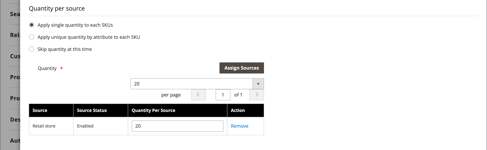{width="600" zoomable="yes"}

**オプション 2：属性ごとに異なる数量を適用**

_Single Source マーチャント :_

属性値ごとに&#x200B;**[!UICONTROL Quantity]**&#x200B;を入力します。

[Inventory management &#x200B;](../inventory-management/introduction.md):_を使用している_Multi Source マーチャント

生成したすべての製品バリエーションに対してソースを割り当て、数量を追加します。

1. **[!UICONTROL Apply unique quantity by attribute to each SKU]**&#x200B;を選択します。

1. 各バリエーションの&#x200B;**[!UICONTROL Quantity]**&#x200B;を入力します。

   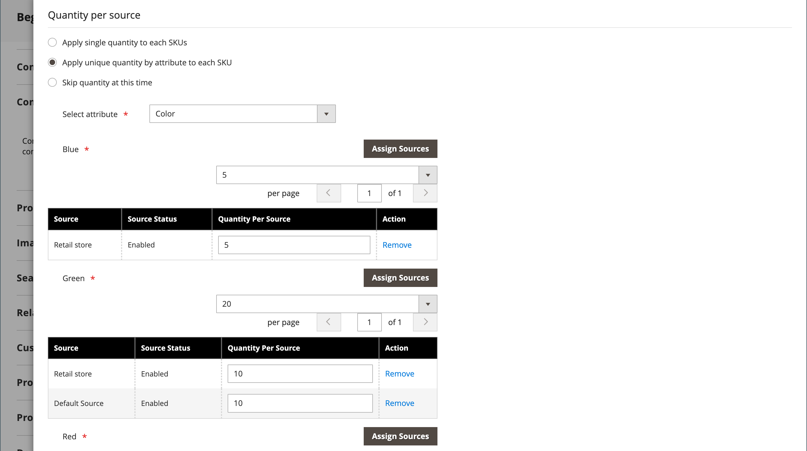{width="600" zoomable="yes"}

画像、価格、数量の設定が完了したら、右上隅の「**[!UICONTROL Next]**」をクリックします。

### 手順9：製品設定の生成

製品のリストが表示されるまで少し待って、次のいずれかの操作を行います。

- 設定に問題がなければ、**[!UICONTROL Generate Products]**&#x200B;をクリックします。

- 修正するには、**[!UICONTROL Back]**&#x200B;をクリックします。

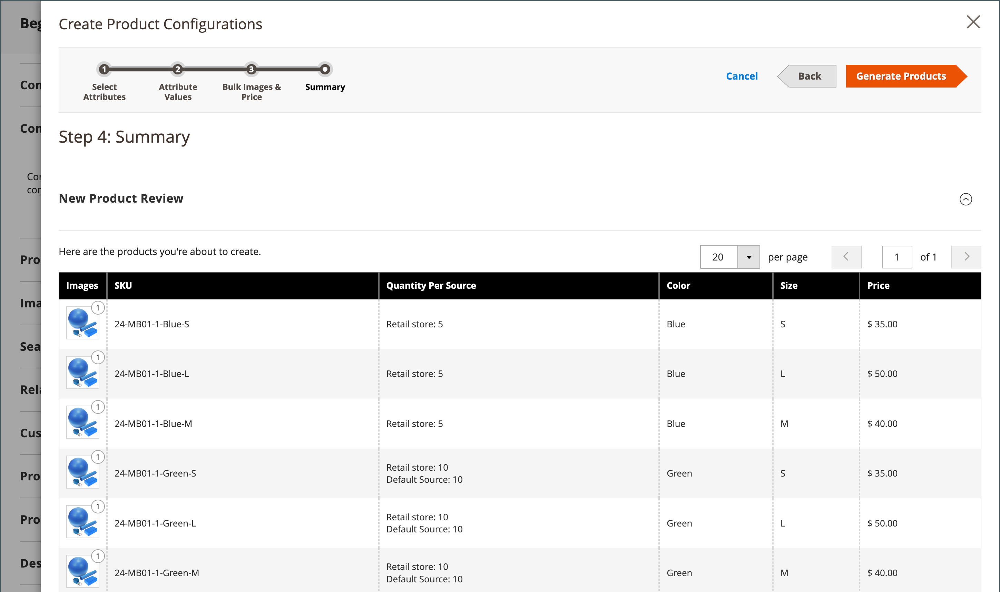{width="600" zoomable="yes"}

現在の製品バリエーションは、_設定_ セクションの下部に表示されます。

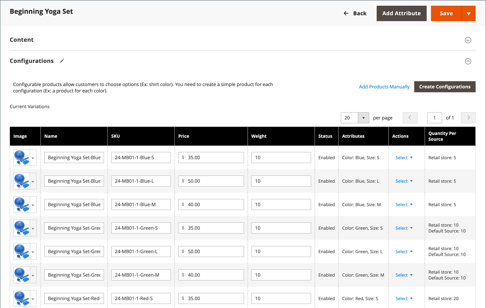{width="600" zoomable="yes"}

### ステップ 10：商品画像の追加

1. 下にスクロールして、_[!UICONTROL Images and Videos]_&#x200B;セクションのを展開します。

1. _カメラ_ タイルをクリックし、設定可能な製品に使用するメイン画像を参照します。

詳しくは、[画像とビデオ &#x200B;](product-images-and-video.md)を参照してください。

### 手順11：製品情報の完了

下にスクロールして、必要に応じて次のセクションの情報を入力します。

- [コンテンツ](product-content.md)

- [関連商品、アップセル、クロスセル](related-products-up-sells-cross-sells.md)

- [検索エンジン最適化](product-search-engine-optimization.md)

- [カスタマイズ可能なオプション](settings-advanced-custom-options.md)

- [Web サイト内の商品](settings-basic-websites.md)

- [デザイン](settings-advanced-design.md)

- [ギフトオプション](product-gift-options.md)

## フェーズ 3：製品の公開

### 手順12：製品の公開

1. 商品をカタログに公開する準備ができたら、**[!UICONTROL Enable Product]**&#x200B;を`Yes`に設定します。

1. 次のいずれかの操作を行います。

   **方法1：保存してプレビュー**

   - 右上隅の「**[!UICONTROL Save]**」をクリックします。

   - ストア内の商品を表示するには、_管理者_ （）メニューで&#x200B;**[!UICONTROL Customer View]**&#x200B;を選択します。

   ストアが新しいブラウザータブで開きます。

   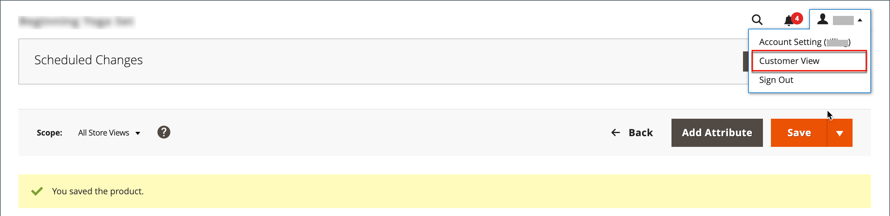{width="600" zoomable="yes"}

   **方法2：保存して閉じる**

   _[!UICONTROL Save]_（{width="25"}）メニューで、**[!UICONTROL Save & Close]**&#x200B;を選択します。

## 在庫状況の設定

設定可能な商品の在庫状況は、単純な商品の在庫状況とは異なります。 設定可能な商品の場合、在庫状況は&#x200B;**_複数基準_**&#x200B;の計算の一部です。

### 在庫状況の仕組み

在庫状況の行動の主な原則：

| ステータスをに設定 | 結果 | 子ども製品の管理？ |
|---|---|---|
| `Out of Stock` （手動） | 管理者とストアフロントに常に`Out of Stock`が表示される | いいえ – 手動で`In Stock`に変更するまで残ります |
| `In Stock` （手動） | ステータスは、子製品に基づいて動的です | 部分 – 以下の詳細を参照してください |

{style="table-layout:auto"}

### 「In Stock」に設定した場合

設定可能な製品在庫ステータスを手動で`In Stock`に設定すると、在庫設定に応じて異なる動作が行われます。

**既定のソース/在庫のみ：**

- **管理者とストアフロント：** Stock ステータスは、子製品の空き状況を自動的に反映します

**少なくとも1つのカスタムソース/在庫を持つ：**

- **Storefront:** Stock ステータスは、子製品の空き状況を自動的に反映します
- **管理者：**&#x200B;は、手動で変更されるまで`In Stock`のままです（子製品で管理されません）

>[!NOTE]
>
>カスタム在庫とソースは、[Inventory management](../inventory-management/sources-stocks.md)拡張機能の一部です。 このツールは、在庫とソースの管理にのみ使用することを強くお勧めします。 デフォルトのソース関数とストック関数は、`CatalogInventory` モジュールの一部であり、現在は非推奨です。

### 手動在庫状況の変更

（管理者ユーザーのアクション、ファイルの読み込み、またはAPI呼び出しを介して）在庫状況を`Out of Stock`に手動で設定した場合、手動で`In Stock`に戻るまで、管理者とストアフロントの両方で`Out of Stock`のままになります。 子商品の在庫状況の影響を受けません。

## システム設定（オプション）

### カートのサムネールにバリエーション画像を表示する

バリエーションごとに異なる画像がある場合は、ショッピングカートのサムネールに適した画像を表示するようにシステムを設定できます。

1. _管理者_ サイドバーで、**[!UICONTROL Stores]** > _[!UICONTROL Settings]_>**[!UICONTROL Configuration]**&#x200B;に移動します。

1. 左側のパネルで、**[!UICONTROL Sales]**&#x200B;を展開し、**[!UICONTROL Checkout]**&#x200B;を選択します。

1. _[!UICONTROL Shopping Cart]_&#x200B;セクションのを展開します。

1. **[!UICONTROL Configurable Product Image]**&#x200B;を`Product Thumbnail Itself`に設定します。

1. **[!UICONTROL Save Config]**&#x200B;をクリックします。

   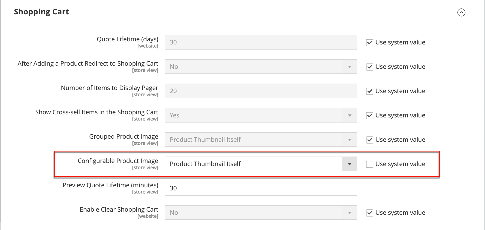{width="600" zoomable="yes"}

## 重要な考慮事項

- **バリエーションの種類：**&#x200B;買い物客は、ドロップダウン、複数選択、視覚的スウォッチ、テキストスウォッチの入力タイプからオプションを選択できます。 各オプションは個別のシンプルな製品です。

- **在庫追跡：** カスタムオプションを備えたシンプルな商品とは異なり、設定可能な商品では、各バリエーションの在庫を個別に追跡できます。

- **子製品タイプ：**&#x200B;子製品は、カスタムオプション **を使用せずに、シンプルまたはバーチャル製品**&#x200B;にすることができます。 子製品を仮想にするには、各子の&#x200B;**[!UICONTROL Weight]**&#x200B;設定で`Тhis item has no weight`を選択します。

- **グローバル割り当て：**&#x200B;すべてのweb サイト、ストア、ストアビューを同時に表示すると、設定可能な製品&#x200B;**グローバル**&#x200B;から子製品が割り当てられ、割り当て解除されます。

- **価格：**&#x200B;設定可能な製品には、カタログ内に独自の価格がありません。 表示された価格は[!UICONTROL In Stock]個の子商品に基づいています。

- **属性：** バリエーション属性にはグローバルスコープが必要であり、値を選択するには顧客が必要です。 属性は、設定可能な製品に使用される属性セットに含める必要があります。

- **買い物かごのサムネール：**&#x200B;買い物かごのサムネールには、設定可能な製品レコードまたは製品バリエーションの画像を表示できます。 上記の[&#x200B; システム構成](#system-configuration-optional)を参照してください。

- **スウォッチの動作：** [&#x200B; スウォッチ属性](swatches.md#create-swatches-for-products)は、属性編集ページで&#x200B;**[!UICONTROL Update Product Preview Image]**&#x200B;から`No`に設定することで、スウォッチが選択されたときに、対応する単純な製品画像を表示しないように設定できます。

- **画像ギャラリーの動作：** テーマは、ユーザーが製品設定を切り替える際の画像ギャラリーの動作を制御します。 _Blank_ テーマのデフォルトの動作は、選択したバリエーションで親の設定可能な製品画像を上書きします。 Luma テーマの場合、デフォルトの動作は、選択したバリエーション画像を親の設定可能な製品画像に追加することです。
