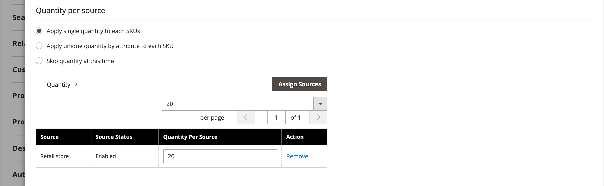
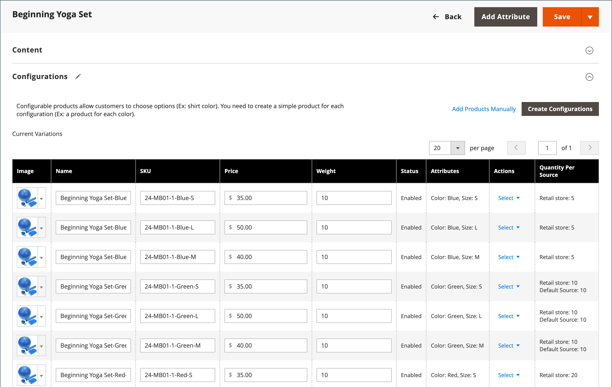

# 設定可能な製品

設定可能な製品は、各バリエーションのドロップダウンリストを持つ単一の製品のように見えます。 リストの各項目は、実際には一意の SKU を持つ個別のシンプルな製品なので、製品バリエーションごとに在庫を追跡できます。 カスタムオプションを備えた単純な製品を使用すれば、同様の効果を得ることができますが、各バリエーションの在庫を追跡する機能はありません。

以下の手順は、を使用して設定可能な製品を作成するプロセスの例です。 [製品テンプレート](attribute-sets.md)、必須フィールド、基本設定です。 各必須フィールドには、赤いアスタリスク（`*`）に設定します。 基本を完了したら、必要に応じて他の製品設定を完了できます。

{width="700" zoomable="yes"}

## パート 1：設定可能なプロダクトの作成

設定可能な製品では、より多くの SKU を使用し、最初は設定に少し時間がかかる場合がありますが、最終的には時間を節約できます。 ビジネスの成長を計画している場合、複数のオプションを持つ製品には、設定可能な製品タイプが適しています。

開始する前に、以下を準備します [属性セット](attribute-sets.md) これには、各製品バリエーションに許可される入力タイプの 1 つに設定される属性が含まれます。 例えば、属性セットには、カラーとサイズのドロップダウン属性が含まれる場合があります。

設定可能な製品バリエーションに使用される各属性のプロパティには、次の設定が必要です。

### 製品バリエーション属性の要件

| プロパティ | 設定 |
|--- |--- |
| [!UICONTROL Scope] | `Global` |
| [!UICONTROL Catalog Input Type for Store Owner] | 製品バリエーションに使用する属性の入力タイプは、次のいずれかにする必要があります。 `Dropdown`, `Visual Swatch`、または `Text Swatch`. |
| [!UICONTROL Values Required] | `Yes` |

{style="table-layout:auto"}

### 手順 1：製品タイプの選択

1. 日 _Admin_ サイドバー、に移動  **[!UICONTROL Catalog]** > **[!UICONTROL Products]**.

1. 日 _[!UICONTROL Add Product]_（ {width="25"} ）メニューを選択し、**[!UICONTROL Configurable Product]**.

   {width="700" zoomable="yes"}

### 手順 2：属性セットの選択

この [属性セット](attribute-sets.md) 製品で使用されるフィールドの選択を決定します。 次の例で使用する属性セットには、カラーとサイズの属性があります。 属性セットの名前はページの上部に示され、最初はに設定されます。 `Default`.

1. 製品の属性セットを選択するには、ページ上部のフィールドをクリックし、次のいずれかの操作を行います。

   - の場合 **[!UICONTROL Search]**&#x200B;属性セットの名前を入力します。
   - リストで、使用する属性セットを選択します。

   フォームが更新され、変更が反映されます。

1. 属性セットに別の属性を追加する場合は、 **[!UICONTROL Add Attribute]** の指示に従います。 [属性の追加](product-attributes-add.md).

   {width="600" zoomable="yes"}

### 手順 3：必要な設定を完了する

1. 製品を入力 **[!UICONTROL Product Name]**.

1. デフォルトを使用 **[!UICONTROL SKU]** これは製品名に基づくか、別の名前を入力します。

1. 製品を入力 **[!UICONTROL Price]**.

1. 製品の公開準備がまだ整っていないので、を設定します **[!UICONTROL Enable Product]** 対象： `No`.

1. click **[!UICONTROL Save]** そして続けて。

   商品を保存すると、 [ストア表示](introduction.md#product-scope) 選択が左上隅に表示されます。

1. を選択します。 **[!UICONTROL Store View]** 製品の入手先。

   {width="600" zoomable="yes"}

### 手順 4：基本設定を完了する

1. を設定 **[!UICONTROL Tax Class]** を次のいずれかに変更します。

   - `None`
   - `Taxable Goods`

1. この **[!UICONTROL Quantity]** 製品のバリエーションによって決定されるので、空白のままにすることができます。

1. を残す **[!UICONTROL Stock Status]** を設定します。

   設定可能な商品の在庫ステータスは、関連する設定ごとに決定されます。 数量を入力せずに製品が保存されたので、 **[!UICONTROL Stock Status]** はに設定されています。 `Out of Stock`.

   >[!NOTE]
   >
   >この **在庫ステータス** 設定可能な商品のは **_半手動で_** 制御された設定。 子製品の在庫状況によって部分的に制御されています。 これは、 **_マルチ基準_** 在庫ステータスの計算。詳しくは、で説明します [在庫ステータスの設定](#configure-the-stock-status) セクション。

1. 製品を入力 **[!UICONTROL Weight]**.

>[!NOTE]
>
>設定可能な製品には、常に重み付けが必要です。 を選択する場合 **[!UICONTROL This item has no weight]** ドロップダウンリストから、自動的にに変更されます。 **[!UICONTROL This item has weight]** 商品を保存した後。

1. デフォルトを使用 **[!UICONTROL Visibility]** の設定 `Catalog, Search`.

1. 製品をリストに表示するには [新製品](../content-design/widget-new-products-list.md)を選択し、 **[!UICONTROL Set Product as New]** チェックボックス。

1. 製品にカテゴリを割り当てるには、 **[!UICONTROL Select…]** 次のいずれかの操作を行います。

   **既存のカテゴリを選択**:

   - 一致するものが見つかるまで、ボックスに入力を開始します。

   - 割り当てるカテゴリのチェックボックスを選択します。

   {width="600" zoomable="yes"}

   **カテゴリの作成**:

   - クリック **[!UICONTROL New Category]**.

   - を入力 **[!UICONTROL Category Name]** を選択し、 **[!UICONTROL Parent Category]**：メニュー構造内の位置を指定します。

   s- クリック **[!UICONTROL Create Category]**.

1. を選択します。 **[!UICONTROL Country of Manufacture]**.

   製品の説明に使用される追加の属性がある場合があります。 選択は属性セットによって異なり、後で完了できます。

### 手順 5：保存して続行

今が作業を節約するのに良い時期です。 右上隅のをクリックします。 **[!UICONTROL Save]**. 次の一連の手順では、製品のバリエーションごとに設定を設定します。

## パート 2：設定の追加

次の例は、3 つの色と 3 つのサイズの設定を追加する方法を示しています。 バリエーションのすべての可能な組み合わせをカバーするために、9 つのシンプルな製品が一意の SKU で作成されます。 デフォルトでは、各バリエーションの製品名と SKU は、属性値と、親の製品名または SKU のいずれかに基づいています。

ページの上部にあるプログレスバーは、プロセスの現在の位置を示し、各ステップをガイドします。

### 手順 1：属性の選択

1. 上から続けて、下にスクロールして _[!UICONTROL Configurations]_セクションでクリック&#x200B;**[!UICONTROL Create Configurations]**.

   {width="600" zoomable="yes"}

1. 設定として含める各属性のチェックボックスをオンにします。

   この例では、 `color` および `size` が選択されました。

   {width="600" zoomable="yes"}

   リストには、設定可能な製品で使用できる、属性セットのすべての属性が含まれています。

1. 属性を追加する場合は、 **[!UICONTROL Create New Attribute]** 次の手順を実行します。

   - 属性プロパティを入力します。

   - クリック **[!UICONTROL Save Attribute]**.

   - 属性のチェックボックスを選択します。

1. 右上隅のをクリックします。 **[!UICONTROL Next]**.

### 手順 2：属性値の入力

1. 属性ごとに、製品に適用する値のチェックボックスをオンにします。

   {width="600" zoomable="yes"}

1. 属性を並べ替えるには、 _並べ替え_ （  ） アイコンをクリックし、セクションを新しい位置に移動します。

   この順序によって、製品ページ上のドロップダウンリストの位置が決まります。

1. プログレスバーで、 **[!UICONTROL Next]**.

### 手順 3：画像、価格、数量を設定する

このステップでは、各設定の画像、価格、数量を決定します。 使用可能なオプションはそれぞれに対して同じで、1 つのみ選択できます。 すべての SKU に同じ設定を適用することも、各 SKU に一意の設定を適用することも、今は設定をスキップすることもできます。

適用する設定オプションを選択します。

以下のいずれかの方法を使用して、 **[!UICONTROL images]**:

**メソッド 1:** 単一の画像セットをすべての SKU に適用

1. を選択 **[!UICONTROL Apply single set of images to all SKUs]**.

1. 商品ギャラリーに含める各画像を参照するか、ボックスにドラッグします。

{width="600" zoomable="yes"}

**メソッド 2:** SKU ごとに一意の画像を適用

親商品の画像は既にアップロードされているので、このオプションを使用して各カラーの画像をアップロードできます。 アイテムが特定の色で購入されたときに買い物かごに表示される別の画像を追加できます。

1. を選択 **[!UICONTROL Apply unique images by attribute to each SKU]**.

1. 「」を選択します **[!UICONTROL Attribute]** 画像で示されている内容（例：） `color`.

1. 各属性値について、その設定に使用する画像を参照するか、ボックスにドラッグします。

   画像を値ボックスにドラッグすると、他の値のセクションにも表示されます。 画像を削除する場合は、 _ごみ箱_ （） アイコンをクリックします。

   {width="600" zoomable="yes"}

以下のいずれかの方法を使用して、 **[!UICONTROL prices]**:

>[!NOTE]
>
>設定可能な製品には、カタログ内に独自の価格はありません。 設定可能な製品価格は、次の要素から派生します [!UICONTROL In Stock] 子製品。

**メソッド 1:** すべての SKU に同じ価格を適用

1. すべてのバリエーションの価格が同じ場合は、 **[!UICONTROL Apply single price to all SKUs]**.

1. を入力 **[!UICONTROL Price]**.

   {width="600" zoomable="yes"}

**メソッド 2:** SKU ごとに異なる価格を適用

1. 製品ごとまたは一部のバリエーションで価格が異なる場合は、 **[!UICONTROL Apply unique prices by attribute to each SKU]**.

1. 「」を選択します **[!UICONTROL Attribute]** それが価格差の基礎です。

1. を入力 **[!UICONTROL Price]** （属性値ごとに）。

   この例では、XL サイズの方がコストがかかります。

   {width="600" zoomable="yes"}

以下のいずれかの方法を使用して、 **[!UICONTROL Quantity]**:

**メソッド 1:** すべての SKU に同じ数量を適用

すべての SKU の数量が同じ場合は、 **[!UICONTROL Apply single quantity to each SKU]** 数量を指定します。

_単一ソースのマーチャント_  – を入力します **[!UICONTROL Quantity]**.

_を使用したマルチソースマーチャント [Inventory management](../inventory-management/introduction.md)_  – 生成されたすべての製品バリアントのソースを割り当てて数量を追加します。

1. 「」を選択します **[!UICONTROL Apply single quantity to each SKU]** オプション。

1. ソースを追加するには、 **[!UICONTROL Assign Sources]**.

1. 追加するソースを参照または検索します。 製品に追加するソースの横にあるチェックボックスをオンにします。

1. ソースごとの手持在庫金額を入力します。

   {width="600" zoomable="yes"}

**メソッド 2:** 属性別に異なる数量を適用

_単一ソースのマーチャント_  – を入力します **[!UICONTROL Quantity]**.

_を使用したマルチソースマーチャント [Inventory management](../inventory-management/introduction.md)_  – 生成されたすべての製品バリアントのソースを割り当てて数量を追加します。

1. SKU ごとに数量が異なる場合は、 **[!UICONTROL Apply unique quantity by attribute to each SKU]**.

1. を入力 **[!UICONTROL Quantity]** それぞれについて。

   {width="600" zoomable="yes"}

画像、価格、数量の設定が完了したら、 **[!UICONTROL Next]** 右上隅

### 手順 4：製品設定の生成

製品のリストが表示されるまで待ち、次のいずれかの操作を行います。

- 設定に問題がなければ、 **[!UICONTROL Generate Products]**.

- 修正するには、をクリックします **[!UICONTROL Back]**.

{width="600" zoomable="yes"}

現在の製品バリエーションは、の下部に表示されます _設定_ セクション。

{width="600" zoomable="yes"}

### 手順 5：製品画像の追加

1. 下にスクロールして展開  この _[!UICONTROL Images and Videos]_セクション。

1. 「」をクリックします _カメラ_ 設定可能な製品に使用するメイン画像をタイルで参照します。

詳しくは、を参照してください [画像とビデオ](product-images-and-video.md).

### 手順 6：製品情報の入力

下にスクロールして、必要に応じて次のセクションの情報を入力します。

- [コンテンツ](product-content.md)

- [関連製品、アップセルおよびクロスセル](related-products-up-sells-cross-sells.md)

- [検索エンジンの最適化](product-search-engine-optimization.md)

- [カスタマイズ可能なオプション](settings-advanced-custom-options.md)

- [Web サイトの製品](settings-basic-websites.md)

- [デザイン](settings-advanced-design.md)

- [ギフトオプション](product-gift-options.md)

### 手順 7：製品を公開する

1. カタログに製品を公開する準備が整ったら、次のように設定します **[!UICONTROL Enable Product]** 対象： `Yes` 次のいずれかの操作を行います。

   - **メソッド 1:** 保存とプレビュー

      - 右上隅のをクリックします。 **[!UICONTROL Save]**.

      - ストアで商品を表示するには、次を選択します **[!UICONTROL Customer View]** 日 _Admin_ （  ） メニューを使用できます。

     ストアが新しいブラウザータブで開きます。

     {width="600" zoomable="yes"}

   - **メソッド 2:** 保存して閉じる

     日 _[!UICONTROL Save]_（ {width="25"} ） メニュー、を選択&#x200B;**[!UICONTROL Save & Close]**.

### 手順 8：買い物かごのサムネールの設定

バリエーションごとに異なる画像がある場合、買い物かごのサムネールに正しい画像を使用するように設定できます。

1. 日 _Admin_ サイドバー、に移動 **[!UICONTROL Stores]** > _[!UICONTROL Settings]_>**[!UICONTROL Configuration]**.

1. 左側のパネルで、を展開します **[!UICONTROL Sales]** を選択します **[!UICONTROL Checkout]** その下に。

1. を展開  この _[!UICONTROL Shopping Cart]_セクション。

1. を設定 **[!UICONTROL Configurable Product Image]** 対象： `Product Thumbnail Itself`.

1. 完了したら、 **[!UICONTROL Save Config]**.

   {width="600" zoomable="yes"}

## 在庫ステータスの設定

設定可能な製品のストックステータスは、単純な製品のストックステータスとは異なります。単純な製品のストックステータスは、製品の可用性を直接表します。 設定可能な製品の場合、在庫ステータスはレポートの一部になります **_マルチ基準_** 在庫ステータスの計算。

### 概要

在庫ステータス関係の主な原則は次のとおりです。

- を変更したとき **[!UICONTROL Stock Status]** 設定可能な製品の `Out of Stock` をクリックして、 **[!UICONTROL Save]**。です **_制御されない_** 子製品の在庫ステータスによって異なります。 常に、と表示されます。 `Out of Stock` 管理ページとストアフロントの両方で使用できます。

- を設定した場合 **[!UICONTROL Stock Status]** 設定可能な製品の `In Stock` をクリックして、 **[!UICONTROL Save]**。です **_部分的にのみ制御される_** 管理およびストアフロントに反映される、子製品の在庫ステータスによって。

### 詳細な説明

この _在庫ステータス_ 設定可能なプロダクトの一部は、その子製品の在庫ステータスによって、次のように制御されます **_マルチ基準_** 在庫ステータスの計算：

#### デフォルトのソース/在庫のみ：

- 設定可能な製品の在庫ステータスがの場合 **_手動_** をに設定 `Out of Stock` 管理者ユーザー、ファイルの読み込みまたは API 呼び出しでは、名前のままです `Out of Stock` 両方で **_Admin_** および **_ストアフロント_** それが来るまで  **_手動_** がに変更されました `In stock` 管理者ユーザー、ファイルの読み込みまたは API 呼び出し。 子製品の在庫状況で制御することはできません。

- 設定可能な製品の在庫ステータスがの場合 **_手動_** をに設定 `In Stock` 管理者ユーザー、ファイル読み込み、API 呼び出しによるストックステータスは、です。 **_自動_** 両方の商品の子商品の在庫ステータスによって制御されます **_Admin_** および **_ストアフロント_**.

>[!NOTE]
>
>カスタム在庫およびソースは、 [Inventory management](../inventory-management/sources-stocks.md) 拡張機能を使用します。このツールは、在庫とソースの管理にのみ使用することを強くお勧めします。 デフォルトのソース関数と Stock 関数は、 `CatalogInventory` モジュール （現在は非推奨）。

#### 1 つ以上のカスタムソース/在庫を使用：

- 設定可能な製品の在庫ステータス値がの場合 **_手動_** をに設定 `Out of Stock` 管理者ユーザー、ファイルの読み込みまたは API 呼び出しでは、名前のままです `Out of Stock` 両方で **_Admin_** および **_ストアフロント_** それが来るまで **_手動_** がに変更されました `In Stock` 管理者ユーザー、ファイルの読み込みまたは API 呼び出し。 0.43188884 **_できません_** 子製品の在庫状況によって制御される。

- 設定可能な製品の在庫ステータス値がの場合 **_手動_** をに設定 `In Stock` 管理者ユーザー、ファイル読み込み、API 呼び出しによるストックステータスは、です。 **_自動_** ～における子製品の在庫状況によって管理される **_ストアフロント_** のみ。

- 設定可能な製品の在庫ステータス値がの場合 **_手動_** をに設定 `In Stock` 管理者ユーザー、ファイルの読み込みまたは API 呼び出しでは、名前のままです `In Stock` が含まれる **_Admin_** それが来るまで **_手動_** がに変更されました `Out of Stock` 管理者ユーザー、ファイルの読み込みまたは API 呼び出し。 0.43188884 **_できません_** 子製品の在庫状況によって制御される。

## 注意事項

- 設定可能な製品を使用すると、買い物客は、ドロップダウン、複数選択、ビジュアルスウォッチ、テキストスウォッチの入力タイプからオプションを選択できます。 各オプションは個別のシンプルな製品です。

- [在庫ステータス](../inventory-management/sources-stocks.md) 設定可能な製品の場合は、半手動で制御する設定です。 これは、単純な製品の在庫ステータスとは異なります。単純な製品の在庫ステータスは、製品の可用性を直接表します。 設定可能なプロダクトの場合、ストックステータスは複数基準のストックステータス計算の一部になります。

- 設定可能な子製品は、単純な製品でも仮想製品でもかまいません **カスタムオプションなし**. カスタムの子製品をバーチャルにするには、以下を選択する必要があります： `Тhis item has no weight` の場合 **[!UICONTROL Weight]** それぞれのを設定します。

- 設定可能な製品には、カタログ内に独自の価格はありません。 設定可能な製品価格は、次の要素から派生します [!UICONTROL In Stock] 子製品。

- 製品バリエーションに使用する属性にはグローバルスコープが必要で、顧客が値を選択する必要があります。 製品バリエーション属性は、設定可能な製品のテンプレートとして使用される属性セットに含める必要があります。

- 設定可能な商品のテンプレートとして使用される属性セットには、各商品バリエーションに必要な値を含む属性が含まれている必要があります。

- 買い物かご内のサムネール画像は、設定可能な商品レコードまたは商品バリエーションから画像を表示するように設定できます。

- [スウォッチ属性](swatches.md#create-swatches-for-products) は、スウォッチを設定して選択した場合、対応するシンプルな製品画像を表示しないように設定できます。 **[!UICONTROL Update Product Preview Image]** オプションの値： `No` 管理者の属性編集ページで。

- テーマは、ユーザーが製品設定を切り替える際の画像ギャラリーの動作を制御します。 のデフォルトの動作 _空白_ テーマは、設定可能な親の製品画像を、選択した製品バリエーションで上書きすることです。 Luma テーマの場合、デフォルトの動作では、選択した製品バリエーション画像を親の設定可能な製品画像の前に追加します。
