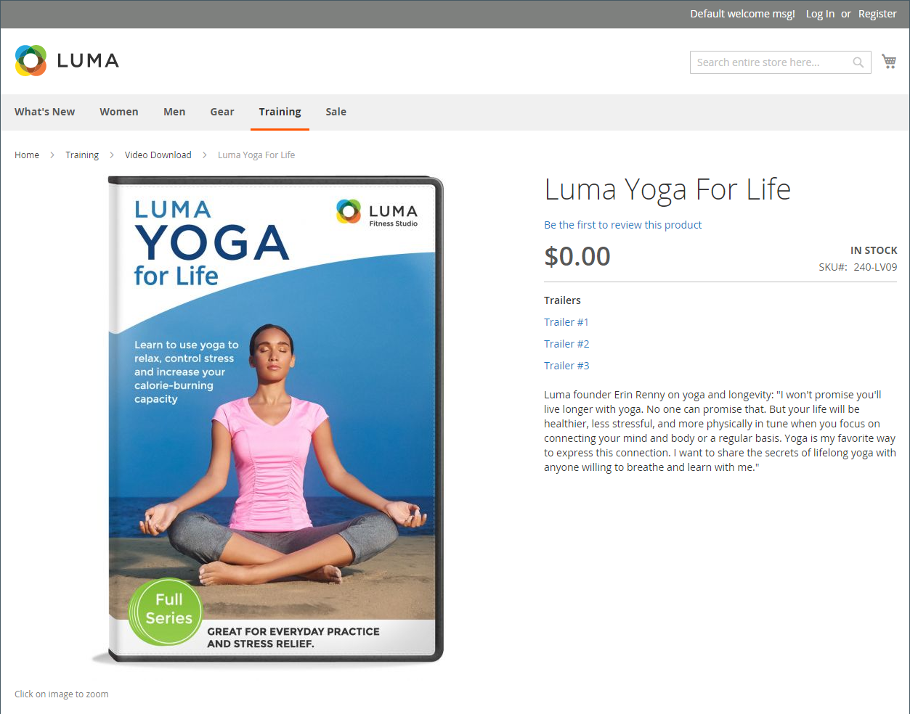
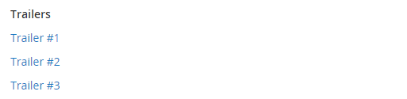
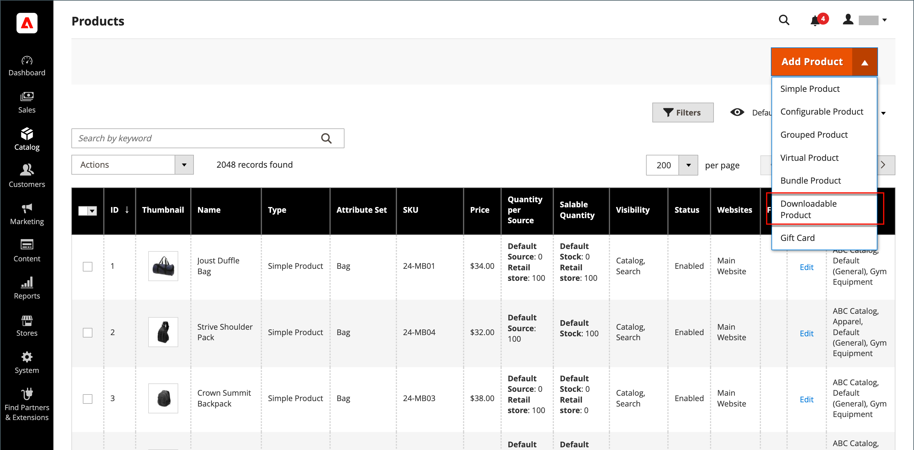
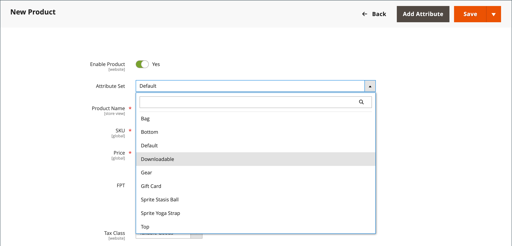
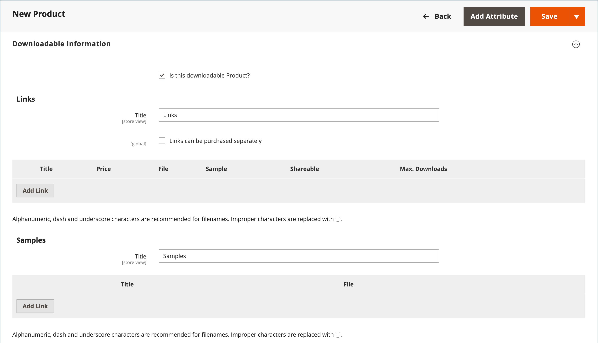
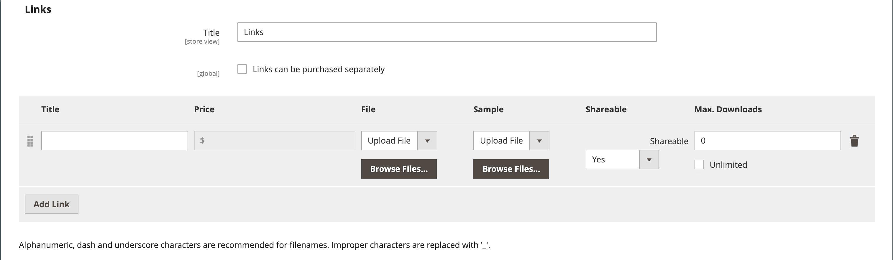
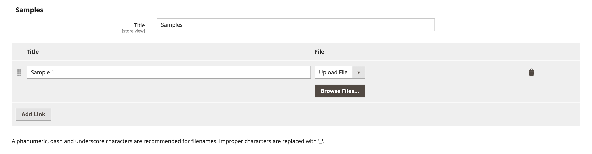
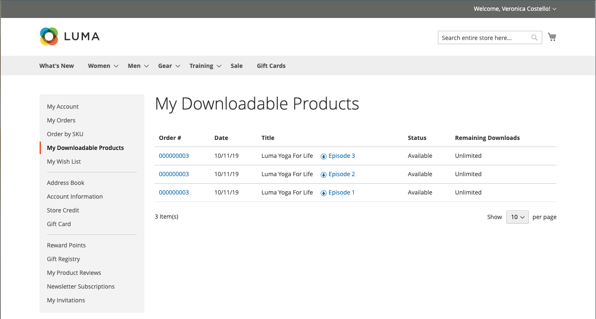

# ダウンロード可能な製品

ダウンロード可能な製品は、電子ブック、音楽、ビデオ、ソフトウェアアプリケーション、アップデートなど、ファイルとして配信できるあらゆる製品です。 アルバムを販売し、各曲を個別に販売できます。 ダウンロード可能な製品を使用して、製品カタログの電子版を配信することもできます。

ダウンロードは購入後まで利用できないため、ブックの抜粋、オーディオファイルのクリップ、ビデオの予告編などのサンプルを提供できます。 サンプルは、顧客が製品を購入する前に試すことができるものです。 ダウンロード可能なファイルは、サーバーにアップロードするか、別のサーバーからアップロードできます。

{width="700" zoomable="yes"}

ダウンロード可能な製品は、お客様がアカウントにログインしてリンクを受け取るように設定するか、電子メールで送信して他のユーザーと共有するように設定できます。 ダウンロードが使用可能になる前の注文のステータス、デフォルト値、その他の配信オプションは、設定で設定されます。 ダウンロード可能なカタログの追加を計画する際には、次の点に注意してください。

- ダウンロード可能な製品は、サーバーにアップロードするか、インターネット上の別のサーバーからリンクできます。

- 顧客が製品をダウンロードできる回数を決定できます。

- ダウンロード可能な製品を購入するお客様は、チェックアウトを行う前にログインする必要があります。

- ダウンロード可能な製品の配送は、注文が`Pending`または`Invoiced`の状態である場合に行うことができます。

- ダウンロード可能な商品は出荷されないため、カートにダウンロード可能な商品のみが含まれている場合、チェックアウトの&#x200B;_配送_&#x200B;手順はスキップされます。

## ダウンロードオプションの設定

ダウンロード可能な構成設定は、ダウンロード可能な製品のデフォルト値と配信オプションを決定し、ゲストがダウンロードを購入できるかどうかを指定します。

1. _管理者_ サイドバーで、**[!UICONTROL Stores]** > _[!UICONTROL Settings]_>**[!UICONTROL Configuration]**に移動します。

1. 左側のパネルで「**[!UICONTROL Catalog]**」を展開し、下の「**[!UICONTROL Catalog]**」を選択します。

1. _[!UICONTROL Downloadable Product Options]_セクションのを展開します。

   {width="700" zoomable="yes"}

   これらの設定オプションの詳細なリストについては、_設定リファレンス_&#x200B;の「[_ダウンロード可能な製品オプション_](../configuration-reference/catalog/catalog.md#downloadable-product-options)」を参照してください。

1. ダウンロードが利用可能になったときの注文プロセスのステータスを判断するには、**[!UICONTROL Order Item Status to Enable Downloads]**&#x200B;を次のいずれかに設定します。

   - `Pending`
   - `Invoiced`

1. 1人の顧客が実行できるダウンロード数にデフォルトの制限を設定するには、**[!UICONTROL Default Maximum Number of Downloads]**&#x200B;の数を入力します。

1. **[!UICONTROL Shareable]**&#x200B;を次のいずれかに設定します：

   - `Yes` – お客様がダウンロードリンクを他のユーザーに電子メールで送信できるようにします。
   - `No` – 顧客がダウンロードリンクにアクセスするためにアカウントにログインすることを要求することで、顧客がダウンロードリンクを他のユーザーと共有することを禁止します。

1. **[!UICONTROL Default Sample Title]**&#x200B;に、サンプルの選択範囲の上に表示する見出しを入力します。

   {width="400"}

1. **[!UICONTROL Default Link Title]**&#x200B;に、ダウンロードリンクに使用するデフォルトのテキストを入力します。

1. ダウンロードリンクを新しいブラウザーウィンドウで開くには、**[!UICONTROL Opens Links in New Window]**&#x200B;を`Yes`に設定します。

   この設定は、ストアのブラウザーウィンドウを開いたままにするために使用されます。

1. ダウンロード可能なコンテンツの配信方法を判断するには、**[!UICONTROL Use Content Disposition]**&#x200B;を次のいずれかに設定します。

   - `Attachment` - ダウンロードリンクを添付ファイルとして電子メールで配信します。
   - `Inline` - ダウンロードリンクをweb ページ上のリンクとして配信します。

1. ダウンロードを購入する前に、購入者に顧客アカウントへの登録とログインを求める場合は、**[!UICONTROL Disable Guest Checkout if Cart Contains Downloadable Items]**&#x200B;を`Yes`に設定します。

1. 完了したら、**[!UICONTROL Save Config]**&#x200B;をクリックします。

## ダウンロード可能な製品を作成する

次の手順では、[製品テンプレート ](attribute-sets.md)、必須フィールド、および基本設定を使用してダウンロード可能な製品を作成するプロセスを示します。 各必須フィールドには、赤いアスタリスク （`*`）が付いています。 基本的な設定が完了したら、必要に応じて他の製品設定を完了できます。

>[!NOTE]
>
>ダウンロード可能なファイル名には、文字と数字を含めることができます。 ダッシュまたはアンダースコア文字を使用して、単語の間のスペースを表すことができます。 ファイル名の無効な文字は、アンダースコアに置き換えられます。

### 手順1：商品タイプの選択

1. _管理者_ サイドバーで、**[!UICONTROL Catalog]** > **[!UICONTROL Products]**&#x200B;に移動します。

1. 右上隅の&#x200B;_[!UICONTROL Add Product]_（{width="25"}）メニューで、`Downloadable Product`を選択します。

   {width="700" zoomable="yes"}

### 手順2：属性セットの選択

サンプルデータには、_Downloadable_&#x200B;という[属性セット ](attribute-sets.md)が含まれており、ダウンロード可能な製品の特殊フィールドが含まれています。 製品を保存する前に、既存のテンプレートを使用するか、別のテンプレートを作成できます。

製品のテンプレートとして使用される属性セットを選択するには、次のいずれかの操作を行います。

- **[!UICONTROL Search]**&#x200B;に、属性セットの名前を入力します。

- リストで、`Downloadable`属性セットを選択します。

フォームが更新され、変更が反映されます。

{width="600" zoomable="yes"}

### 手順3：必要な設定を完了する

1. **[!UICONTROL Product Name]**&#x200B;を入力します。

1. 製品名に基づく既定の&#x200B;**[!UICONTROL SKU]**&#x200B;を受け入れるか、別の名前を入力してください。

1. 製品&#x200B;**[!UICONTROL Price]**&#x200B;を入力します。

1. 製品はまだ公開する準備ができていないので、**[!UICONTROL Enable Product]**&#x200B;を`No`に設定します。

1. **[!UICONTROL Save]**&#x200B;をクリックして続行します。

   商品を保存すると、左上隅に「[ ストアビュー](introduction.md#product-scope)」の選択画面が表示されます。

1. 製品を利用できる&#x200B;**[!UICONTROL Store View]**&#x200B;を選択します。

   {width="600" zoomable="yes"}

### 手順4：基本設定を完了する

1. **[!UICONTROL Tax Class]**&#x200B;を次のいずれかに設定します：

   - `None`
   - `Taxable Goods`

1. 在庫のある商品の&#x200B;**[!UICONTROL Quantity]**&#x200B;を入力します。

   次の点に注意してください。

   - デフォルトでは、**[!UICONTROL Stock Status]**&#x200B;は`Out of Stock`に設定されています。

   - ダウンロード可能な製品は出荷されていないため、**[!UICONTROL Weight]** フィールドは使用されません。 この機能を有効にすると、[ シンプル製品](product-create-simple.md)になり、_このダウンロード可能な製品ですか？_ タブは使用できません。

   >[!NOTE]
   >
   >[Inventory management](../inventory-management/introduction.md)を有効にすると、シングル Sourceの販売者がこのセクションで数量を設定します。 複数のSource加盟店が「ソース」セクションにソースと数量を追加します。 次の「_ソースと数量の割り当て（Inventory management）_」セクションを参照してください。

1. `Catalog, Search`の既定の&#x200B;**[!UICONTROL Visibility]**&#x200B;設定を受け入れます。

1. 新製品の[ リスト ](../content-design/widget-new-products-list.md)に商品を表示するには、**[!UICONTROL Set Product as New]** チェックボックスを選択します。

1. _[!UICONTROL Categories]_を製品に割り当てるには、**[!UICONTROL Select…]**ボックスをクリックし、次のいずれかの操作を行います。

   **既存のカテゴリを選択**:

   - 一致するものが見つかるまで、ボックスに入力し始めます。

   - 割り当てる各カテゴリのチェックボックスをオンにします。

   **カテゴリを作成**:

   - **[!UICONTROL New Category]**&#x200B;をクリックします。

   - **[!UICONTROL Category Name]**&#x200B;を入力し、**[!UICONTROL Parent Category]**&#x200B;を選択します。これにより、[ メニュー構造](category-root.md)での位置が決まります。

   - **[!UICONTROL Create Category]**&#x200B;をクリックします。

1. **[!UICONTROL Format]**&#x200B;を次のいずれかに設定します：

   - `Download`
   - `DVD`

   必要に応じて、[属性](attribute-product-create.md)を編集して、さらに値を追加できます。

   商品を表す属性が追加されている場合があります。 選択範囲は属性セットによって異なり、後で完了できます。

#### ソースと数量の割り当て（[!DNL Inventory Management]）

{{$include /help/_includes/inventory-assign-sources.md}}

### 手順5：ダウンロード可能な情報を完了する

下にスクロールして、_[!UICONTROL Downloadable Information]_セクションのを展開し、**[!UICONTROL Is this downloadable product?]**チェックボックスを選択します。

有効にすると、_[!UICONTROL Downloadable Information]_セクションには2つの部分があります。 最初の部分は各ダウンロードリンクについて説明し、2番目の部分は各サンプルファイルについて説明します。 これらのオプションの多くに対するデフォルト値は、[設定](#configure-the-download-options)で設定できます。

{width="600" zoomable="yes"}

#### リンクを完了

1. 「_[!UICONTROL Links]_」セクションに、ダウンロードリンクの見出しとして使用する&#x200B;**[!UICONTROL Title]**を入力します。

1. 該当する場合は、**[!UICONTROL Links can be purchased separately]** チェックボックスを選択します。

1. **[!UICONTROL Add Link]**&#x200B;をクリックし、次の操作を行います。

   - ダウンロードの&#x200B;**[!UICONTROL Title]**&#x200B;と&#x200B;**[!UICONTROL Price]**&#x200B;を入力します。

   - **[!UICONTROL File]**&#x200B;と&#x200B;**[!UICONTROL Sample]** ファイルの両方で、ダウンロード用に次のいずれかの配布方法を選択します。

      - `Upload File` – 配布ファイルをサーバーにアップロードするには、この方法を選択します。 ファイルを参照し、アップロードするファイルを選択します。
      - `URL` - URLから配布ファイルにアクセスするには、この方法を選択します。 ダウンロードファイルの完全なURLを入力します。

   >[!NOTE]
   >
   >外部リソースへのリンクをダウンロード可能な製品として使用することはできません。 有効なリンクドメインは、`env.php` ファイルでプログラムによって事前に定義されています（_設定ガイド_&#x200B;の[env.php reference](https://experienceleague.adobe.com/docs/commerce-operations/configuration-guide/files/config-reference-envphp.html)を参照）。

   - **[!UICONTROL Shareable]**&#x200B;を次のいずれかに設定します：

      - `No` - ダウンロードリンクにアクセスするには、お客様がアカウントにログインする必要があります。

      - `Yes` – 顧客が他のユーザーと共有できるリンクを電子メールで送信します。

      - `Use Config` - [ ダウンロード可能な製品オプション ](../configuration-reference/catalog/catalog.md)設定で指定されたメソッドを使用します。

   - 次のいずれかの操作を行います。

      - 顧客ごとのダウンロード数を制限するには、**[!UICONTROL Max. Downloads]**&#x200B;の最大数を入力してください。
      - 無制限のダウンロードを許可するには、**[!UICONTROL Unlimited]** チェックボックスを選択します。

   {width="600" zoomable="yes"}

1. 別のリンクを追加するには、**[!UICONTROL Add Link]**&#x200B;をクリックして、これらの手順を繰り返します。

#### サンプルを完成させる

1. _[!UICONTROL Samples]_セクションで、サンプルの見出しとして使用する&#x200B;**[!UICONTROL Title]**を入力します。

1. 各サンプルの情報を完了するには、**[!UICONTROL Add Link]**&#x200B;をクリックします。

   {width="600" zoomable="yes"}

1. リンクの詳細を次のように入力します。

   - 個々のサンプルの&#x200B;**[!UICONTROL Title]**&#x200B;を入力します。

   - 次のいずれかの配布方法を選択します。

      - `Upload File` – 配布ファイルをサーバーにアップロードするには、この方法を選択します。 ファイルを参照し、アップロードするファイルを選択します。
      - `URL` - URLから配布ファイルにアクセスするには、この方法を選択します。 ダウンロードファイルの完全なURLを入力します。

   - 別のサンプルを追加するには、**[!UICONTROL Add Link]**&#x200B;をクリックして、これらの手順を繰り返します。

   - サンプルの順序を変更するには、_Change Order_ （）アイコンをクリックし、サンプルを新しい位置にドラッグします。

### 手順6：製品情報の入力

下にスクロールして、必要に応じて次のセクションの情報を入力します。

- [コンテンツ](product-content.md)
- [画像とビデオ](product-images-and-video.md)
- [検索エンジン最適化](product-search-engine-optimization.md)
- [関連商品、アップセル、クロスセル](related-products-up-sells-cross-sells.md)
- [カスタマイズ可能なオプション](settings-advanced-custom-options.md)
- [Web サイト内の商品](settings-basic-websites.md)
- [デザイン](settings-advanced-design.md)
- [ギフトオプション](product-gift-options.md)

### 手順7：製品の公開

商品をカタログに公開する準備ができたら、**[!UICONTROL Enable Product]**&#x200B;を`Yes`に設定し、次のいずれかの操作を行います。

**方法1:**&#x200B;保存とプレビュー

- 右上隅の「**[!UICONTROL Save]**」をクリックします。

- ストア内の商品を表示するには、_管理者_ （）メニューで&#x200B;**[!UICONTROL Customer View]**&#x200B;を選択します。

  ストアが新しいブラウザータブで開きます。

  {width="600" zoomable="yes"}

**方法2:**&#x200B;保存して閉じる

_[!UICONTROL Save]_（{width="25"}）メニューで、**[!UICONTROL Save & Close]**を選択します。

## ストアフロント体験

顧客アカウントダッシュボードでは、_[!UICONTROL My Downloadable Products]_ページはダウンロード可能な製品の各注文にリンクしています。 ダウンロードは、注文が完了すると、お客様のアカウントから入手できるようになります。

{width="700" zoomable="yes"}

次の表は、_My Downloadable Products_&#x200B;の値を示しています。

| 列 | 説明 |
|--- |--- |
| [!UICONTROL Order#] | ダウンロード可能な製品が購入された[注文](../stores-purchase/orders.md)。 注文の詳細へのリンクを提供します。 |
| [!UICONTROL Date] | 注文作成日： |
| [!UICONTROL Title] | 注文と共に購入されたダウンロード可能な製品の名前。 ダウンロード可能な製品へのリンクを提供します。 |
| [!UICONTROL Status] | 注文処理ステータス： |
| [!UICONTROL Remaining Downloads] | ダウンロードされた製品の利用可能なダウンロード数。 |

_**アカウントダッシュボードから製品ファイルをダウンロードするには**_

1. 顧客はアカウント ダッシュボードで&#x200B;**[!UICONTROL My Downloadable Products]**&#x200B;を選択します。

1. リスト内の順序を検索し、タイトルの後にあるリンクをクリックします。

1. ダウンロードウィンドウの右下隅にある「_ダウンロード_」アイコンをクリックします。

1. ダウンロード先のファイルを探し、目的の場所にファイルを保存します。

<!-- Last updated from includes: 2023-05-19 17:14:58 -->
