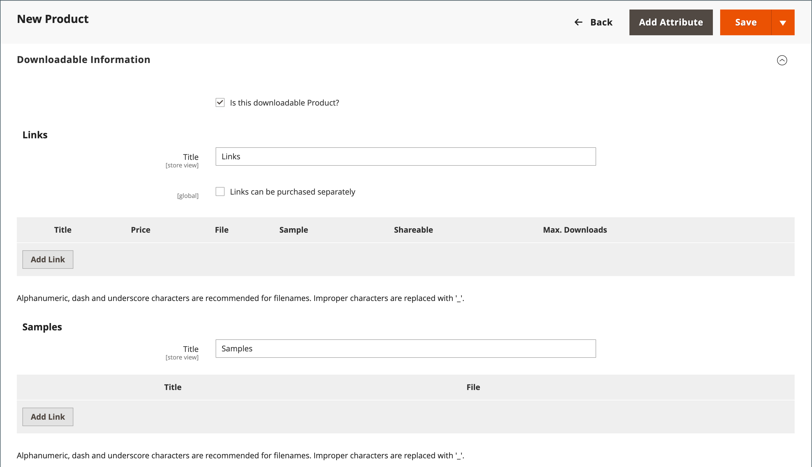
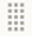

# ダウンロード可能な製品

ダウンロード可能な製品とは、電子書籍、音楽、ビデオ、ソフトウェアアプリケーション、アップデートなど、ファイルとして提供できるすべての製品です。 あなたは販売のためにアルバムを提供し、各曲を個別に販売することができます。 ダウンロード可能な製品を使用して、製品カタログの電子バージョンを配信することもできます。

ダウンロードは購入後まで利用できないので、書籍からの抜粋、オーディオファイルからのクリップ、ビデオからのトレーラーなどのサンプルを提供できます。 サンプルとは、お客様が商品を購入する前に試すことができるものです。 ダウンロード可能にしたファイルは、サーバーにアップロードすることも、別のサーバーからアップロードすることもできます。

{width="700" zoomable="yes"}

ダウンロード可能な製品は、顧客がアカウントにログインしてリンクを受け取るか、メールで送信して他の人と共有するように設定できます。 設定では、ダウンロードが使用可能になる前の注文のステータス、デフォルト値、その他の配信オプションが設定されます。 ダウンロード可能なカタログの追加を計画する際は、次の点に注意してください。

- ダウンロード可能な製品は、サーバーにアップロードすることも、インターネット上の別のサーバーからにリンクすることもできます。

- 顧客が製品をダウンロードできる回数を指定できます。

- ダウンロード可能な製品を購入したお客様は、チェックアウト前にログインする必要が生じる場合があります。

- ダウンロード可能な製品の配信は、注文が `Pending` または `Invoiced` ステータスの場合に行うことができます。

- ダウンロード可能な商品は配送されないので、カートにダウンロード可能な商品のみが含まれている場合、チェックアウトの _配送_ ステップはスキップされます。

## ダウンロードオプションの設定

ダウンロード可能な構成設定は、ダウンロード可能な製品のデフォルト値と配信オプションを決定し、ゲストがダウンロードを購入できるかどうかを指定します。

1. _管理者_ サイドバーで、**[!UICONTROL Stores]**/_[!UICONTROL Settings]_/**[!UICONTROL Configuration]**&#x200B;に移動します。

1. 左側のパネルで「**[!UICONTROL Catalog]**」を展開し、その下の「**[!UICONTROL Catalog]**」を選択します。

1. 「」を展開し、「_[!UICONTROL Downloadable Product Options]_」セクションを展開します。

   {width="700" zoomable="yes"}

   これらの設定オプションの詳細なリストについては、[_設定リファレンス_](../configuration-reference/catalog/catalog.md#downloadable-product-options) の _ダウンロード可能な製品オプション_ を参照してください。

1. ダウンロードが使用可能になったときの注文プロセスのステータスを確認するには、**[!UICONTROL Order Item Status to Enable Downloads]** を次のいずれかに設定します。

   - `Pending`
   - `Invoiced`

1. 1 人の顧客が実行できるダウンロード数のデフォルトの制限を設定するには、**[!UICONTROL Default Maximum Number of Downloads]** の数を入力します。

1. **[!UICONTROL Shareable]** を次のいずれかに設定します。

   - `Yes` – 顧客がダウンロードリンクを他のユーザーにメールで送信できます。
   - `No` – 顧客がダウンロードリンクにアクセスするためにアカウントにログインする必要があるので、顧客がダウンロードリンクを他のユーザーと共有できないようにします。

1. **[!UICONTROL Default Sample Title]**：選択したサンプルの上に表示する見出しを入力します。

   {width="400"}

1. **[!UICONTROL Default Link Title]**：ダウンロードリンクに使用するデフォルトのテキストを入力します。

1. ダウンロードリンクを新しいブラウザーウィンドウで開く場合は、**[!UICONTROL Opens Links in New Window]** を `Yes` に設定します。

   この設定は、ストアへのブラウザーウィンドウを開いたままにするために使用されます。

1. ダウンロード可能なコンテンツの配信方法を決定するには、**[!UICONTROL Use Content Disposition]** を次のいずれかに設定します。

   - `Attachment` - ダウンロードリンクをメールで添付ファイルとして配信します。
   - `Inline` - ダウンロードリンクを Web ページ上のリンクとして配信します。

1. 購入者が顧客アカウントに登録し、ダウンロードを購入する前にログインする必要がある場合は、**[!UICONTROL Disable Guest Checkout if Cart Contains Downloadable Items]** を `Yes` に設定します。

1. 完了したら、「**[!UICONTROL Save Config]**」をクリックします。

## ダウンロード可能な製品を作成

次の手順では、[ 製品テンプレート ](attribute-sets.md)、必須フィールド、基本設定を使用してダウンロード可能な製品を作成するプロセスを示します。 各必須フィールドには、赤いアスタリスク（`*`）が付いています。 基本を完了したら、必要に応じて他の製品設定を完了できます。

>[!NOTE]
>
>ダウンロード可能なファイル名には、文字および数字を含めることができます。 ダッシュまたはアンダースコア文字を使用して、単語間のスペースを表すことができます。 ファイル名に無効な文字がある場合は、アンダースコアに置き換えられます。

### 手順 1：製品タイプの選択

1. _管理者_ サイドバーで、**[!UICONTROL Catalog]**/**[!UICONTROL Products]** に移動します。

1. 右上隅の _[!UICONTROL Add Product]_（メニュー矢印 {width="25"} 「`Downloadable Product`」を選択します。

   {width="700" zoomable="yes"}

### 手順 2：属性セットの選択

サンプルデータには、ダウンロード可能な製品の特別なフィールドを持つ _ダウンロード可能_ と呼ばれる [ 属性セット ](attribute-sets.md) が含まれています。 製品を保存する前に、既存のテンプレートを使用することも、別のテンプレートを作成することもできます。

製品のテンプレートとして使用する属性セットを選択するには、次のいずれかの操作を行います。

- **[!UICONTROL Search]**：属性セットの名前を入力します。

- リストで、`Downloadable` 属性セットを選択します。

フォームが更新され、変更が反映されます。

{width="600" zoomable="yes"}

### 手順 3：必要な設定を完了する

1. **[!UICONTROL Product Name]** を入力します。

1. 製品名に基づくデフォルト **[!UICONTROL SKU]** を受け入れるか、別の名前を入力します。

1. 製品 **[!UICONTROL Price]** を入力します。

1. 製品はまだ公開する準備ができていないので、**[!UICONTROL Enable Product]** を `No` に設定します。

1. 「**[!UICONTROL Save]**」をクリックして続行します。

   商品を保存すると、左上隅に [ ストア表示 ](introduction.md#product-scope) 選択が表示されます。

1. 製品を使用できる **[!UICONTROL Store View]** を選択します。

   {width="600" zoomable="yes"}

### 手順 4：基本設定を完了する

1. **[!UICONTROL Tax Class]** を次のいずれかに設定します。

   - `None`
   - `Taxable Goods`

1. 在庫がある商品の **[!UICONTROL Quantity]** を入力します。

   次のことに注意してください。

   - デフォルトでは、**[!UICONTROL Stock Status]** は `Out of Stock` に設定されています。

   - ダウンロード可能な製品は出荷されないので、**[!UICONTROL Weight]** フィールドは使用されません。 この機能を有効にすると、[Simple product](product-create-simple.md) および _Is this downloadable product?_ タブは使用できません。

   >[!NOTE]
   >
   >[Inventory management](../inventory-management/introduction.md) を有効にした場合、単一のSource マーチャントがこのセクションで数量を設定します。 マルチSourceのマーチャントは、「ソース」セクションでソースと数量を追加します。 次の _ソースと数量の割り当て（Inventory management）_ 節を参照してください。

1. `Catalog, Search` のデフォルトの **[!UICONTROL Visibility]** 設定を受け入れます。

1. [ 新製品のリスト ](../content-design/widget-new-products-list.md) に製品を特集するには、「**[!UICONTROL Set Product as New]**」チェックボックスを選択します。

1. 製品に _[!UICONTROL Categories]_&#x200B;を割り当てるには、**[!UICONTROL Select…]**&#x200B;のボックスをクリックし、次のいずれかの操作を行います。

   **既存のカテゴリを選択**:

   - 一致するものが見つかるまで、ボックスに入力を開始します。

   - 割り当てる各カテゴリのチェックボックスを選択します。

   **カテゴリを作成する**:

   - 「**[!UICONTROL New Category]**」をクリックします。

   - **[!UICONTROL Category Name]** を入力して **[!UICONTROL Parent Category]** を選択します。これにより、[menu 構造 ](category-root.md) 内の位置が決まります。

   - 「**[!UICONTROL Create Category]**」をクリックします。

1. **[!UICONTROL Format]** を次のいずれかに設定します。

   - `Download`
   - `DVD`

   必要に応じて、[ 属性 ](attribute-product-create.md) を編集して、値をさらに追加できます。

   製品を説明する追加の属性がある場合があります。 選択は属性セットによって異なり、後で完了できます。

#### ソースと数量の割り当て（[!DNL Inventory Management]）

{{$include /help/_includes/inventory-assign-sources.md}}

### 手順 5：ダウンロード可能な情報の入力

下にスクロールして、「展開セレクター ![ 「_[!UICONTROL Downloadable Information]_」セクション ](../assets/icon-display-expand.png) 展開し、「**[!UICONTROL Is this downloadable product?]**」チェックボックスを選択します。

有効にすると、_[!UICONTROL Downloadable Information]_&#x200B;セクションは 2 つの部分で構成されます。 最初のパートでは各ダウンロードリンクについて説明し、2 番目のパートでは各サンプルファイルについて説明します。 これらのオプションの多くは、デフォルト値を [configuration](#configure-the-download-options) で設定できます。

{width="600" zoomable="yes"}

#### リンクを完成させる

1. 「_[!UICONTROL Links]_」セクションで、ダウンロードリンクの見出しとして使用する&#x200B;**[!UICONTROL Title]**&#x200B;を入力します。

1. 該当する場合は、「**[!UICONTROL Links can be purchased separately]**」チェックボックスを選択します。

1. 「**[!UICONTROL Add Link]**」をクリックして、次の操作を実行します。

   - ダウンロードの **[!UICONTROL Title]** と **[!UICONTROL Price]** を入力します。

   - **[!UICONTROL File]** ファイルと **[!UICONTROL Sample]** ファイルの両方について、ダウンロードの配布方法として次のいずれかを選択します。

      - `Upload File` – 配布ファイルをサーバーにアップロードする場合は、この方法を選択します。 ファイルを参照し、アップロードするファイルを選択します。
      - `URL` – 配布ファイルに URL からアクセスする場合は、この方法を選択します。 ダウンロードファイルの完全な URL を入力します。

   >[!NOTE]
   >
   >外部リソースへのリンクは、ダウンロード可能な製品として使用することはできません。 有効なリンクドメインは、`env.php` ファイル内でプログラムによって事前に定義されています（「設定ガイド [&#128279;](https://experienceleague.adobe.com/docs/commerce-operations/configuration-guide/files/config-reference-envphp.html) の env.php リファレンス _を参照_）。

   - **[!UICONTROL Shareable]** を次のいずれかに設定します。

      - `No` – 顧客がダウンロードリンクにアクセスするには、アカウントにログインする必要があります。

      - `Yes` - リンクをメールで送信します。顧客はこのメールを他のユーザーと共有できます。

      - `Use Config` - [ ダウンロード可能な製品オプション ](../configuration-reference/catalog/catalog.md) 設定で指定された方法を使用します。

   - 次のいずれかの操作を行います。

      - 顧客ごとのダウンロードを制限するには、**[!UICONTROL Max. Downloads]** の最大数を入力します。
      - 無制限にダウンロードできるようにするには、「**[!UICONTROL Unlimited]**」チェックボックスをオンにします。

   {width="600" zoomable="yes"}

1. 別のリンクを追加するには、「**[!UICONTROL Add Link]**」をクリックして上記の手順を繰り返します。

#### サンプルを完成させる

1. 「_[!UICONTROL Samples]_」セクションで、サンプルの見出しとして使用する&#x200B;**[!UICONTROL Title]**&#x200B;を入力します。

1. 各サンプルの情報を入力するには、「**[!UICONTROL Add Link]**」をクリックします。

   {width="600" zoomable="yes"}

1. リンクの詳細を次のように入力します。

   - 個々のサンプルの **[!UICONTROL Title]** を入力します。

   - 次のいずれかの配布方法を選択します。

      - `Upload File` – 配布ファイルをサーバーにアップロードする場合は、この方法を選択します。 ファイルを参照し、アップロードするファイルを選択します。
      - `URL` – 配布ファイルに URL からアクセスする場合は、この方法を選択します。 ダウンロードファイルの完全な URL を入力します。

   - 別のサンプルを追加するには、「**[!UICONTROL Add Link]**」をクリックして上記の手順を繰り返します。

   - サンプルの順序を変更するには、_Change Order_ （） アイコンを選択し、サンプルを新しい位置にドラッグします。

### 手順 6：製品情報の入力

下にスクロールして、必要に応じて次のセクションの情報を入力します。

- [コンテンツ](product-content.md)
- [画像とビデオ](product-images-and-video.md)
- [検索エンジンの最適化](product-search-engine-optimization.md)
- [関連製品、アップセルおよびクロスセル](related-products-up-sells-cross-sells.md)
- [カスタマイズ可能なオプション](settings-advanced-custom-options.md)
- [Web サイトの製品](settings-basic-websites.md)
- [デザイン](settings-advanced-design.md)
- [ギフトオプション](product-gift-options.md)

### 手順 7：商品のPublish

カタログに製品を公開する準備が整ったら、**[!UICONTROL Enable Product]** を `Yes` に設定し、次のいずれかの操作を行います。

**方法 1:** 保存とプレビュー

- 右上隅の「**[!UICONTROL Save]**」をクリックします。

- ストアで製品を表示するには、_管理者_ （） メニューの **[!UICONTROL Customer View]** を選択します。

  ストアが新しいブラウザータブで開きます。

  {width="600" zoomable="yes"}

**方法 2:** 保存して閉じる

_[!UICONTROL Save]_（メニュー矢印 {width="25"} 「**[!UICONTROL Save & Close]**」を選択します。

## ストアフロントの経験

顧客アカウントダッシュボードでは、_[!UICONTROL My Downloadable Products]_&#x200B;ページはダウンロード可能な製品の各注文にリンクされています。 ダウンロードは、注文が完了すると、顧客のアカウントから利用できるようになります。

{width="700" zoomable="yes"}

次の表に、_My Downloadable Products_ の値を示します。

| 列 | 説明 |
|--- |--- |
| [!UICONTROL Order#] | ダウンロード可能な製品が購入された [ 注文 ](../stores-purchase/orders.md)。 注文詳細へのリンクを提供します。 |
| [!UICONTROL Date] | オーダー作成日。 |
| [!UICONTROL Title] | 注文と共に購入されたダウンロード可能な製品の名前。 ダウンロード可能な製品へのリンクを提供します。 |
| [!UICONTROL Status] | 注文処理ステータス。 |
| [!UICONTROL Remaining Downloads] | ダウンロードされた製品の使用可能なダウンロードの数。 |

_&#x200B;**アカウントダッシュボードから製品ファイルをダウンロードするには**&#x200B;_

1. アカウントダッシュボードで、顧客は **[!UICONTROL My Downloadable Products]** を選択します。

1. リスト内の順序を検索し、タイトルの後のリンクをクリックします。

1. ダウンロードウィンドウの右下隅にある「_ダウンロード_」アイコンをクリックします。

1. ダウンロードした場所でファイルを検索し、目的の場所にファイルを保存します。
