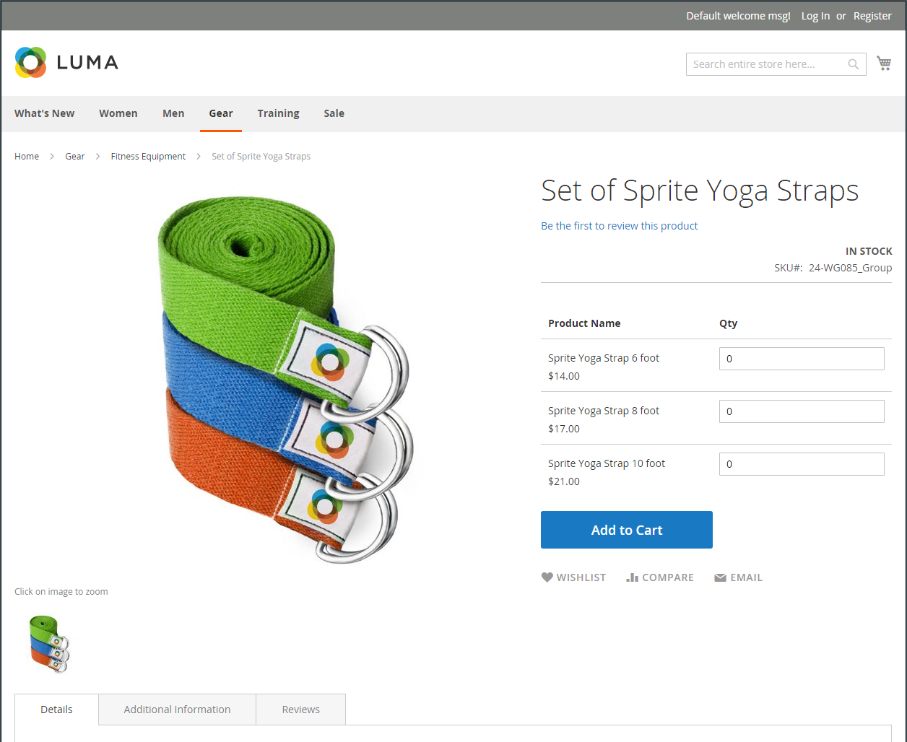
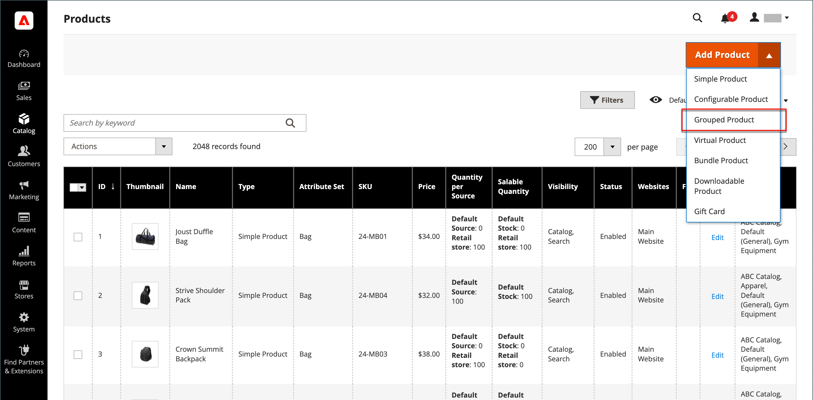
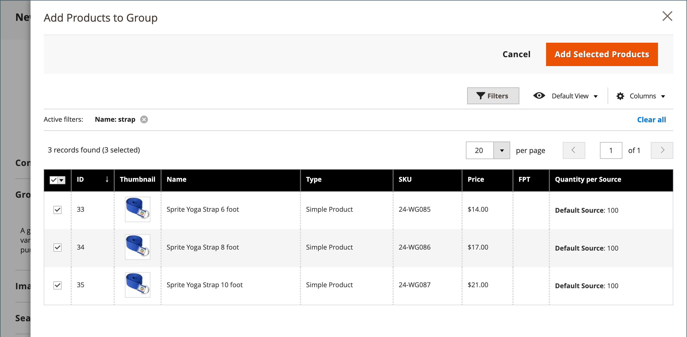
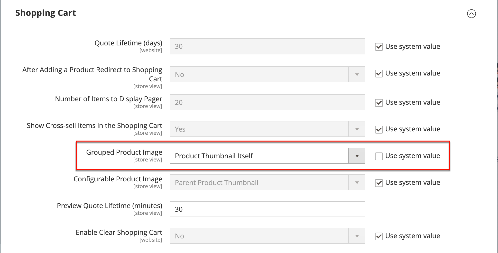

# グループ化された製品

グループ化された製品は、グループとして表示されるシンプルなスタンドアロン製品で構成されます。 単一の商品のバリエーションを提供したり、季節やテーマごとにグループ化したりすることができます。 グループ化された商品を提示することで、顧客が追加商品を購入する動機を生み出すことができます。 グループ化された商品は、商品のバリエーションを提供し、すべてのバリエーションを同じページに掲載する容易な方法を提供します。

たとえば、オープンストックのフラットウェアを販売し、フォーマルな場所で使用されるあらゆる種類の調理器具をリストアップすることができます。 複数のサラダフォーク、フィッシュフォーク、ディナーフォーク、ディナーナイフ、フィッシュナイフ、バターナイフ、スープスプーン、デザートスプーンを注文する場合もあります。 他の顧客は、シンプルなフォーク、ナイフ、スプーンを注文するかもしれません。 顧客は、好きなだけ各商品を注文できます。

グループとして表示されますが、グループ内の各製品は別個のアイテムとして購入されます。 ショッピングカートには、各商品と購入数量が別々の行項目として表示されます。

次の手順では、[製品テンプレート &#x200B;](attribute-sets.md)、必須フィールド、および基本設定を使用してグループ化された製品を作成するプロセスを示します。 各必須フィールドには、赤いアスタリスク （`*`）が付いています。 基本的な設定が完了したら、必要に応じて他の製品設定を完了できます。

{width="700" zoomable="yes"}

## 手順1：商品タイプの選択

1. _管理者_ サイドバーで、**[!UICONTROL Catalog]** > **[!UICONTROL Products]**&#x200B;に移動します。

1. 右上隅の&#x200B;_[!UICONTROL Add Product]_（{width="25"}）メニューで、**[!UICONTROL Grouped Product]**&#x200B;を選択します。

   {width="700" zoomable="yes"}

## 手順2：属性セットの選択

製品のテンプレートとして使用される[属性セット &#x200B;](attribute-sets.md)を選択するには、次のいずれかの操作を行います。

- 検索するには、**[!UICONTROL Attribute Set]**&#x200B;の名前を入力します。
- リストで、使用する属性セットを選択します。

フォームが更新され、変更が反映されます。

{width="600" zoomable="yes"}

必要な属性が存在しない場合は、製品の作成時に新しい属性を追加できます。

- 右上隅の「**[!UICONTROL Add Attribute]**」をクリックします。
- 新しい属性を定義します（[製品への属性の追加](product-attributes-add.md)を参照）。

  {width="600" zoomable="yes"}

既存の属性を製品に追加するには、[&#x200B; フィルターコントロール &#x200B;](../getting-started/admin-grid-controls.md)を使用してグリッド内の属性を検索し、次の操作を行います。

- 追加する各属性の最初の列のチェックボックスを選択します。
- **[!UICONTROL Add Selected]**&#x200B;をクリックします。

## 手順3：必要な設定を完了する

1. **[!UICONTROL Product Name]**&#x200B;を入力します。

1. 製品名に基づく既定の&#x200B;**[!UICONTROL SKU]**&#x200B;を受け入れるか、別の名前を入力してください。

   値はグループを構成する個々の製品から派生しているため、**[!UICONTROL Quantity]** フィールドは使用できません。

   グループ化された商品には、カタログ内に独自の価格がありません。 グループ化された製品価格は、グループに含まれる個々の製品の価格から派生します。

1. 製品はまだ公開する準備ができていないので、**[!UICONTROL Enable Product]**&#x200B;を`No`に設定します（を切り替えます）。

1. **[!UICONTROL Save]**&#x200B;をクリックして続行します。

   商品を保存すると、ページの上部に商品名が表示され、左上隅に[&#x200B; ストアビュー](introduction.md#product-scope)の選択画面が表示されます。

1. 製品を利用できる&#x200B;**[!UICONTROL Store View]**&#x200B;を選択します。

   {width="600" zoomable="yes"}

## 手順4：基本設定を完了する

1. `In Stock`の&#x200B;**[!UICONTROL Stock Status]**&#x200B;設定を受け入れます。

1. **[!UICONTROL Categories]**&#x200B;を製品に割り当てるには、**[!UICONTROL Select…]** ボックスをクリックし、次のいずれかの操作を行います。

   **既存のカテゴリを選択：**

   - 一致するものが見つかるまで、ボックスに入力し始めます。

   - 割り当てるカテゴリのチェックボックスをオンにします。

   **カテゴリを作成：**

   - **[!UICONTROL New Category]**&#x200B;をクリックします。

   - **[!UICONTROL Category Name]**&#x200B;を入力し、**[!UICONTROL Parent Category]**&#x200B;を選択すると、メニュー構造での位置が決まります。

   - **[!UICONTROL Create Category]**&#x200B;をクリックします。

1. `Catalog, Search`の&#x200B;**[!UICONTROL Visibility]**&#x200B;設定を受け入れます。

1. 新製品[&#128279;](../content-design/widget-new-products-list.md)の リストに商品を表示するには、カレンダーで&#x200B;**[!UICONTROL Set Product as New]** **[!UICONTROL from]**&#x200B;日と&#x200B;**[!UICONTROL to]**&#x200B;日を選択します。

1. **[!UICONTROL Country of Manufacture]**&#x200B;を選択します。

   商品を表す個々の属性が追加されている場合があります。 選択範囲は属性セットによって異なり、後で完了できます。

## 手順5：製品をグループに追加する

1. **[!UICONTROL Grouped Products]** セクションまでスクロールして、**[!UICONTROL Add Products to Group]**&#x200B;をクリックします。

   {width="600" zoomable="yes"}

1. 必要に応じて、[&#x200B; フィルター](../getting-started/admin-grid-controls.md)を使用して、グループに含める製品を見つけます。

1. リストで、グループに含める各項目のチェックボックスを選択します。

   >[!NOTE]
   >
   >子製品をグループ化できるのは、シンプルな製品、ダウンロード可能な製品、および設定可能なオプションを持たない仮想製品のみです。 その他の製品タイプは選択リストに表示されません。

   {width="600" zoomable="yes"}

1. 製品グループに追加するには、**[!UICONTROL Add Selected Products]**&#x200B;をクリックします。

   選択した製品が&#x200B;_[!UICONTROL Grouped Products]_&#x200B;セクションに表示されます。

   [Inventory management](../inventory-management/sources-stocks.md)の複数のSource マーチャントの場合、グリッドには、割り当てられたソースと在庫の在庫量ごとに&#x200B;**[!UICONTROL Quantity per Source]**&#x200B;列が含まれます。

   {width="600" zoomable="yes"}

1. いずれかの項目の&#x200B;**[!UICONTROL Default Quantity]**&#x200B;を入力してください。

1. 商品の順序を変更するには、最初の列の&#x200B;_変更依頼_ アイコン（）をクリックし、商品をリストの新しい位置にドラッグします。

1. グループから製品を削除するには、**[!UICONTROL Remove]**&#x200B;をクリックします。

## 手順5：製品情報の入力

必要に応じて、次の節の情報を入力します。

- [コンテンツ](product-content.md)
- [画像とビデオ](product-images-and-video.md)
- [検索エンジン最適化](product-search-engine-optimization.md)
- [関連商品、アップセル、クロスセル](related-products-up-sells-cross-sells.md)
- [カスタマイズ可能なオプション](settings-advanced-custom-options.md)
- [Web サイト内の商品](settings-basic-websites.md)
- [デザイン](settings-advanced-design.md)
- [ギフトオプション](product-gift-options.md)

## 手順6：製品の公開

1. 商品をカタログに公開する準備ができたら、**[!UICONTROL Enable Product]**&#x200B;を`Yes`に設定します。

1. 次のいずれかの操作を行います。

   **方法1:**&#x200B;保存とプレビュー

   - 右上隅の「**[!UICONTROL Save]**」をクリックします。

   - ストア内の商品を表示するには、_管理者_ （）メニューで&#x200B;**[!UICONTROL Customer View]**&#x200B;を選択します。

     ストアが新しいブラウザータブで開きます。

     {width="700" zoomable="yes"}

   **方法2:**&#x200B;保存して閉じる

   - _[!UICONTROL Save]_（{width="25"}）メニューで、**[!UICONTROL Save & Close]**&#x200B;を選択します。

## 手順7：買い物かごのサムネールを設定する（オプション）

グループ内の製品ごとに異なる画像がある場合は、ショッピングカートのサムネールに正しい画像を使用するように設定できます。

1. _管理者_ サイドバーで、**[!UICONTROL Stores]** > _[!UICONTROL Settings]_>**[!UICONTROL Configuration]**&#x200B;に移動します。

1. 左側のパネルで、**[!UICONTROL Sales]**&#x200B;を展開し、**[!UICONTROL Checkout]**&#x200B;を選択します。

1. **[!UICONTROL Shopping Cart]**&#x200B;のを展開します。

   これらの設定オプションの詳細なリストについては、_設定リファレンス_&#x200B;の[買い物かご](../configuration-reference/sales/checkout.md#shopping-cart)を参照してください。

1. **[!UICONTROL Grouped Product Image]**&#x200B;を`Product Thumbnail Itself`に設定します。

   {width="600" zoomable="yes"}

   必要に応じて、**[!UICONTROL Use system value]** チェックボックスの選択を解除して、このオプションを設定します。

1. **[!UICONTROL Save Config]**&#x200B;をクリックします。

## 覚えておくべきこと

- グループ化された製品は、基本的に単純な関連製品の集まりです。

- すべての子製品は、すべてのweb サイト、ストア、およびストアビューに対して、グループ化された製品&#x200B;**_グローバル_**&#x200B;から同時に割り当てられ、割り当て解除されます。

- グループ化された子製品は、シンプルな製品、ダウンロード可能な製品、または仮想の製品&#x200B;**[!UICONTROL without custom options]**&#x200B;です。

- 購入した各商品は、グループの一部ではなく、ショッピングカートに個別に表示されます。

- グループ化された商品には、カタログ内に独自の価格がありません。 グループ化された製品価格は、グループに含まれる個々の製品の価格から派生します。

- ショッピングカート内のサムネイル画像は、グループ化された親製品または関連製品の画像を表示するように設定できます。
