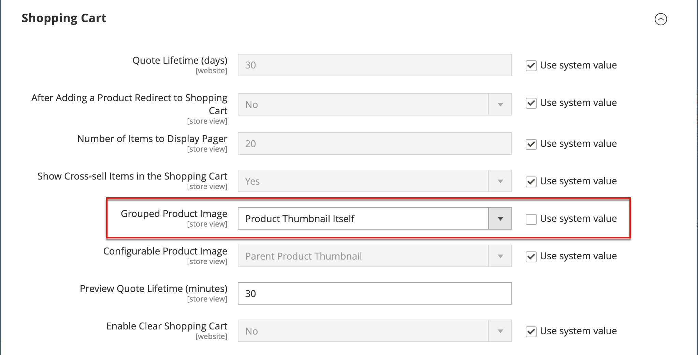

# グループ化された製品

グループ化された製品は、グループとして表示される単純なスタンドアロン製品で構成されます。 単一の製品のバリエーションを提供したり、季節やテーマ別にグループ化したりできます。 グループ化された製品を提示することで、顧客が追加商品を購入するインセンティブを作成できます。 グループ化された製品を使用すると、製品のバリエーションを簡単に提供し、それらをすべて同じページにリスト化できます。

例えば、オープンストックのフラットウェアを販売し、正式な場所の設定で使用されるすべてのタイプの器具をリストすることができます。 サラダ用フォーク、フィッシュフォーク、ディナーフォーク、ディナーナイフ、フィッシュナイフ、バターナイフ、スープスプーン、デザートスプーンを複数注文する人もいます。 他の顧客は、単純なフォーク、ナイフ、スプーンを注文するかもしれません。 お客様は、各商品を好きなだけ注文できます。

グループとして表示されますが、グループ内の各製品は個別のアイテムとして購入されます。 買い物かごでは、各品目と購入数量が別々の明細品目として表示されます。

[ 製品テンプレート ](attribute-sets.md)、必須フィールドおよび基本設定を使用してグループ化された製品を作成するプロセスを以下の手順に示します。 各必須フィールドには、赤いアスタリスク（`*`）が付いています。 基本を完了したら、必要に応じて他の製品設定を完了できます。

{width="700" zoomable="yes"}

## 手順 1：製品タイプの選択

1. _管理者_ サイドバーで、**[!UICONTROL Catalog]**/**[!UICONTROL Products]** に移動します。

1. 右上隅の _[!UICONTROL Add Product]_（メニュー矢印 {width="25"} 「**[!UICONTROL Grouped Product]**」を選択します。

   {width="700" zoomable="yes"}

## 手順 2：属性セットの選択

製品のテンプレートとして使用される [ 属性セット ](attribute-sets.md) を選択するには、次のいずれかの操作を行います。

- 検索するには、**[!UICONTROL Attribute Set]** の名前を入力します。
- リストで、使用する属性セットを選択します。

フォームが更新され、変更が反映されます。

{width="600" zoomable="yes"}

必要な属性が存在しない場合は、製品の作成時に新しい属性を追加できます。

- 右上隅の「**[!UICONTROL Add Attribute]**」をクリックします。
- 新しい属性を定義します（[ 製品への属性の追加 ](product-attributes-add.md) を参照）。

  {width="600" zoomable="yes"}

製品に既存の属性を追加するには、[ フィルターコントロール ](../getting-started/admin-grid-controls.md) を使用してグリッド内の属性を検索し、次の手順を実行します。

- 追加する各属性の最初の列のチェックボックスを選択します。
- 「**[!UICONTROL Add Selected]**」をクリックします。

## 手順 3：必要な設定を完了する

1. **[!UICONTROL Product Name]** を入力します。

1. 製品名に基づくデフォルト **[!UICONTROL SKU]** を受け入れるか、別の名前を入力します。

   値はグループを構成する個々の製品から派生するので、「**[!UICONTROL Quantity]**」フィールドは使用できないことに注意してください。

   グループ化された製品には、カタログ内に独自の価格はありません。 グループ化された製品価格は、グループに含まれる個々の製品の価格から派生します。

1. 製品はまだ公開する準備が整っていないので、**[!UICONTROL Enable Product]** を `No` に設定します（）。

1. 「**[!UICONTROL Save]**」をクリックして続行します。

   製品を保存すると、製品名がページの上部に表示され、「[ ストア表示 ](introduction.md#product-scope)」選択が左上隅に表示されます。

1. 製品を使用できる **[!UICONTROL Store View]** を選択します。

   {width="600" zoomable="yes"}

## 手順 4：基本設定を完了する

1. `In Stock` の **[!UICONTROL Stock Status]** 設定を受け入れます。

1. 製品に **[!UICONTROL Categories]** を割り当てるには、**[!UICONTROL Select…]** のボックスをクリックし、次のいずれかの操作を行います。

   **既存のカテゴリを選択：**

   - 一致するものが見つかるまで、ボックスに入力を開始します。

   - 割り当てるカテゴリのチェックボックスを選択します。

   **カテゴリを作成：**

   - 「**[!UICONTROL New Category]**」をクリックします。

   - **[!UICONTROL Category Name]** を入力し、メニュー構造内の位置を決定する **[!UICONTROL Parent Category]** を選択します。

   - 「**[!UICONTROL Create Category]**」をクリックします。

1. `Catalog, Search` の **[!UICONTROL Visibility]** 設定を受け入れます。

1. [ 新製品のリスト ](../content-design/widget-new-products-list.md) に製品を表示するには、カレンダーで **[!UICONTROL Set Product as New]** の **[!UICONTROL from]** と **[!UICONTROL to]** の日付を選択します。

1. **[!UICONTROL Country of Manufacture]** を選択します。

   製品を説明する追加の個人属性が存在する場合があります。 選択によってアトリビュート セットが異なり、後で完成させることができます。

## 手順 5：グループへの製品の追加

1. 「**[!UICONTROL Grouped Products]**」セクションまでスクロールし、「**[!UICONTROL Add Products to Group]**」をクリックします。

   {width="600" zoomable="yes"}

1. 必要に応じて、[ フィルター ](../getting-started/admin-grid-controls.md) を使用して、グループに含める製品を見つけます。

1. リストで、グループに含める各項目のチェックボックスを選択します。

   >[!NOTE]
   >
   >設定可能なオプションのないシンプル、ダウンロード可能および仮想製品のみを、子製品としてグループ化できます。 その他の製品タイプは、選択リストには表示されません。

   {width="600" zoomable="yes"}

1. 製品グループに追加するには、「**[!UICONTROL Add Selected Products]**」をクリックします。

   選択した製品が「_[!UICONTROL Grouped Products]_」セクションに表示されます。

   [Inventory management](../inventory-management/sources-stocks.md) を使用するマルチSourceマーチャントの場合、グリッドには、ソースと在庫の量が割り当てられたそれぞれの **[!UICONTROL Quantity per Source]** 列が含まれます。

   {width="600" zoomable="yes"}

1. 任意の項目の **[!UICONTROL Default Quantity]** を入力します。

1. 商品の順序を変更するには、最初の列の _順序を変更_ アイコン（）を選択し、商品をリストの新しい位置にドラッグします。

1. グループから製品を削除するには、「削 **[!UICONTROL Remove]**」をクリックします。

## 手順 5：製品情報の入力

必要に応じて、以下の節の情報を入力します。

- [コンテンツ](product-content.md)
- [画像とビデオ](product-images-and-video.md)
- [検索エンジンの最適化](product-search-engine-optimization.md)
- [関連製品、アップセルおよびクロスセル](related-products-up-sells-cross-sells.md)
- [カスタマイズ可能なオプション](settings-advanced-custom-options.md)
- [Web サイトの製品](settings-basic-websites.md)
- [デザイン](settings-advanced-design.md)
- [ギフトオプション](product-gift-options.md)

## 手順 6：商品のPublish

1. カタログに製品を公開する準備が整ったら、**[!UICONTROL Enable Product]** を `Yes` に設定します。

1. 次のいずれかの操作を行います。

   **方法 1:** 保存とプレビュー

   - 右上隅の「**[!UICONTROL Save]**」をクリックします。

   - ストアで製品を表示するには、_管理者_ （） メニューの **[!UICONTROL Customer View]** を選択します。

     ストアが新しいブラウザータブで開きます。

     {width="700" zoomable="yes"}

   **方法 2:** 保存して閉じる

   - _[!UICONTROL Save]_（メニュー矢印 {width="25"} 「**[!UICONTROL Save & Close]**」を選択します。

## 手順 7：買い物かごのサムネールの設定（オプション）

グループ内の製品ごとに異なる画像がある場合、買い物かごのサムネールに正しい画像を使用するように設定できます。

1. _管理者_ サイドバーで、**[!UICONTROL Stores]**/_[!UICONTROL Settings]_/**[!UICONTROL Configuration]**に移動します。

1. 左側のパネルで「**[!UICONTROL Sales]**」を展開し、「**[!UICONTROL Checkout]**」を選択します。

1. **[!UICONTROL Shopping Cart]** の  を展開します。

   これらの設定オプションの詳細なリストについては、[ 設定リファレンス ](../configuration-reference/sales/checkout.md#shopping-cart) の _買い物かご_ を参照してください。

1. **[!UICONTROL Grouped Product Image]** を `Product Thumbnail Itself` に設定します。

   {width="600" zoomable="yes"}

   必要に応じて、「**[!UICONTROL Use system value]**」チェックボックスの選択を解除し、このオプションを設定します。

1. 「**[!UICONTROL Save Config]**」をクリックします。

## 注意事項

- グループ化された製品は、基本的に単純な関連製品のコレクションです。

- グループ化された子製品は、シンプル、ダウンロード可能または仮想製品 **[!UICONTROL without custom options]** です。

- 購入した各項目は、グループの一部としてではなく、買い物かごに個別に表示されます。

- グループ化された製品には、カタログ内に独自の価格はありません。 グループ化された製品価格は、グループに含まれる個々の製品の価格から派生します。

- 買い物かご内のサムネール画像は、グループ化された親商品または関連する商品から画像を表示するように設定できます。
