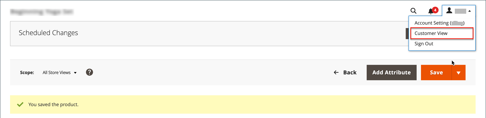

# グループ化された製品

グループ化された製品は、グループとして表示される単純なスタンドアロン製品で構成されます。 単一の製品のバリエーションを提供したり、季節やテーマ別にグループ化したりできます。 グループ化された製品を提示することで、顧客が追加商品を購入するインセンティブを作成できます。 グループ化された製品を使用すると、製品のバリエーションを簡単に提供し、それらをすべて同じページにリスト化できます。

例えば、オープンストックのフラットウェアを販売し、正式な場所の設定で使用されるすべてのタイプの器具をリストすることができます。 サラダ用フォーク、フィッシュフォーク、ディナーフォーク、ディナーナイフ、フィッシュナイフ、バターナイフ、スープスプーン、デザートスプーンを複数注文する人もいます。 他の顧客は、単純なフォーク、ナイフ、スプーンを注文するかもしれません。 お客様は、各商品を好きなだけ注文できます。

グループとして表示されますが、グループ内の各製品は個別のアイテムとして購入されます。 買い物かごでは、各品目と購入数量が別々の明細品目として表示されます。

以下の手順は、を使用してグループ化された製品を作成するプロセスを示しています。 [製品テンプレート](attribute-sets.md)、必須フィールド、基本設定です。 各必須フィールドには、赤いアスタリスク（`*`）に設定します。 基本を完了したら、必要に応じて他の製品設定を完了できます。

{width="700" zoomable="yes"}

## 手順 1：製品タイプの選択

1. 日 _Admin_ サイドバー、に移動 **[!UICONTROL Catalog]** > **[!UICONTROL Products]**.

1. 日 _[!UICONTROL Add Product]_（ {width="25"} ）メニューを選択し、**[!UICONTROL Grouped Product]**.

   {width="700" zoomable="yes"}

## 手順 2：属性セットの選択

を選択します [属性セット](attribute-sets.md) このテンプレートを使用して、次のいずれかの操作を行います。

- 検索するには、検索する **[!UICONTROL Attribute Set]**.
- リストで、使用する属性セットを選択します。

フォームが更新され、変更が反映されます。

{width="600" zoomable="yes"}

必要な属性が存在しない場合は、製品の作成時に新しい属性を追加できます。

- 右上隅のをクリックします。 **[!UICONTROL Add Attribute]**.
- 新しい属性を定義します（ [製品への属性の追加](product-attributes-add.md)）に設定します。

  {width="600" zoomable="yes"}

既存の属性を製品に追加するには、 [フィルターコントロール](../getting-started/admin-grid-controls.md) グリッド内で属性を検索するには、次の手順を実行します。

- 追加する各属性の最初の列のチェックボックスを選択します。
- クリック **[!UICONTROL Add Selected]**.

## 手順 3：必要な設定を完了する

1. を入力 **[!UICONTROL Product Name]**.

1. デフォルトを使用 **[!UICONTROL SKU]** これは製品名に基づくか、別の名前を入力します。

   に注意してください **[!UICONTROL Quantity]** 値がグループを構成する個々の製品から派生しているため、フィールドは使用できません。

   グループ化された製品には、カタログ内に独自の価格はありません。 グループ化された製品価格は、グループに含まれる個々の製品の価格から派生します。

1. 製品の公開準備がまだ整っていないので、を設定します **[!UICONTROL Enable Product]** 対象： `No` （  ）に設定します。

1. クリック **[!UICONTROL Save]** そして続けて。

   製品を保存すると、製品名がページの上部に表示され、 [ストア表示](introduction.md#product-scope) 選択が左上隅に表示されます。

1. を選択します。 **[!UICONTROL Store View]** 製品の入手先。

   {width="600" zoomable="yes"}

## 手順 4：基本設定を完了する

1. を承認 **[!UICONTROL Stock Status]** の設定 `In Stock`.

1. 割り当てる **[!UICONTROL Categories]** 製品に移動するには、 **[!UICONTROL Select…]** 次のいずれかの操作を行います。

   **既存のカテゴリを選択：**

   - 一致するものが見つかるまで、ボックスに入力を開始します。

   - 割り当てるカテゴリのチェックボックスを選択します。

   **カテゴリを作成します。**

   - クリック **[!UICONTROL New Category]**.

   - を入力 **[!UICONTROL Category Name]** を選択し、 **[!UICONTROL Parent Category]**：メニュー構造内の位置を指定します。

   - クリック **[!UICONTROL Create Category]**.

1. を承認 **[!UICONTROL Visibility]** 設定 `Catalog, Search`.

1. で製品を使用するには [新製品のリスト](../content-design/widget-new-products-list.md)、を選択します **[!UICONTROL Set Product as New]** **[!UICONTROL from]** および **[!UICONTROL to]** カレンダーに日付を表示します。

1. を選択します。 **[!UICONTROL Country of Manufacture]**.

   製品を説明する追加の個人属性が存在する場合があります。 選択によってアトリビュート セットが異なり、後で完成させることができます。

## 手順 5：グループへの製品の追加

1. にスクロール ダウンします。 **[!UICONTROL Grouped Products]** セクションでクリック **[!UICONTROL Add Products to Group]**.

   {width="600" zoomable="yes"}

1. 必要に応じて、を使用します [フィルター](../getting-started/admin-grid-controls.md) グループに含める商品を検索します。

1. リストで、グループに含める各項目のチェックボックスを選択します。

   >[!NOTE]
   >
   >設定可能なオプションのないシンプル、ダウンロード可能および仮想製品のみを、子製品としてグループ化できます。 その他の製品タイプは、選択リストには表示されません。

   {width="600" zoomable="yes"}

1. 製品グループに追加するには、 **[!UICONTROL Add Selected Products]**.

   選択した製品がに表示されます。 _[!UICONTROL Grouped Products]_セクション。

   マルチソースマーチャントの場合： [Inventory management](../inventory-management/sources-stocks.md)、グリッドにはが含まれます **[!UICONTROL Quantity per Source]** 割り当てられたソースと在庫の各在庫金額を示す列。

   {width="600" zoomable="yes"}

1. を入力 **[!UICONTROL Default Quantity]** 任意の項目。

1. 商品の順序を変更するには、 _変更依頼_ アイコン （  ）を選択し、製品をリストの新しい位置にドラッグします。

1. グループから製品を削除するには、 **[!UICONTROL Remove]**.

## 手順 5：製品情報の入力

必要に応じて、以下の節の情報を入力します。

- [コンテンツ](product-content.md)
- [画像とビデオ](product-images-and-video.md)
- [検索エンジンの最適化](product-search-engine-optimization.md)
- [関連製品、アップセルおよびクロスセル](related-products-up-sells-cross-sells.md)
- [カスタマイズ可能なオプション](settings-advanced-custom-options.md)
- [Web サイトの製品](settings-basic-websites.md)
- [デザイン](settings-advanced-design.md)
- [ギフトオプション](product-gift-options.md)

## 手順 6：製品を公開する

1. カタログに製品を公開する準備が整ったら、次のように設定します **[!UICONTROL Enable Product]** 対象： `Yes`.

1. 次のいずれかの操作を行います。

   **メソッド 1:** 保存とプレビュー

   - 右上隅のをクリックします。 **[!UICONTROL Save]**.

   - ストアで商品を表示するには、次を選択します **[!UICONTROL Customer View]** 日 _Admin_ （  ） メニューを使用できます。

     ストアが新しいブラウザータブで開きます。

     {width="700" zoomable="yes"}

   **メソッド 2:** 保存して閉じる

   - 日 _[!UICONTROL Save]_（ {width="25"} ） メニュー、を選択&#x200B;**[!UICONTROL Save & Close]**.

## 手順 7：買い物かごのサムネールの設定（オプション）

グループ内の製品ごとに異なる画像がある場合、買い物かごのサムネールに正しい画像を使用するように設定できます。

1. 日 _Admin_ サイドバー、に移動 **[!UICONTROL Stores]** > _[!UICONTROL Settings]_>**[!UICONTROL Configuration]**.

1. 左側のパネルで、を展開します **[!UICONTROL Sales]** を選択します **[!UICONTROL Checkout]**.

1. を展開  この **[!UICONTROL Shopping Cart]**.

   これらの設定オプションの詳細なリストについては、を参照してください [ショッピングカート](../configuration-reference/sales/checkout.md#shopping-cart) が含まれる _設定リファレンス_.

1. を設定 **[!UICONTROL Grouped Product Image]** 対象： `Product Thumbnail Itself`.

   {width="600" zoomable="yes"}

   必要に応じて、 **[!UICONTROL Use system value]** このオプションを設定するチェックボックス。

1. クリック **[!UICONTROL Save Config]**.

## 注意事項

- グループ化された製品は、基本的に単純な関連製品のコレクションです。

- グループ化された子製品は、シンプル、ダウンロード可能または仮想製品にすることができます **[!UICONTROL without custom options]**.

- 購入した各項目は、グループの一部としてではなく、買い物かごに個別に表示されます。

- グループ化された製品には、カタログ内に独自の価格はありません。 グループ化された製品価格は、グループに含まれる個々の製品の価格から派生します。

- 買い物かご内のサムネール画像は、グループ化された親商品または関連する商品から画像を表示するように設定できます。
