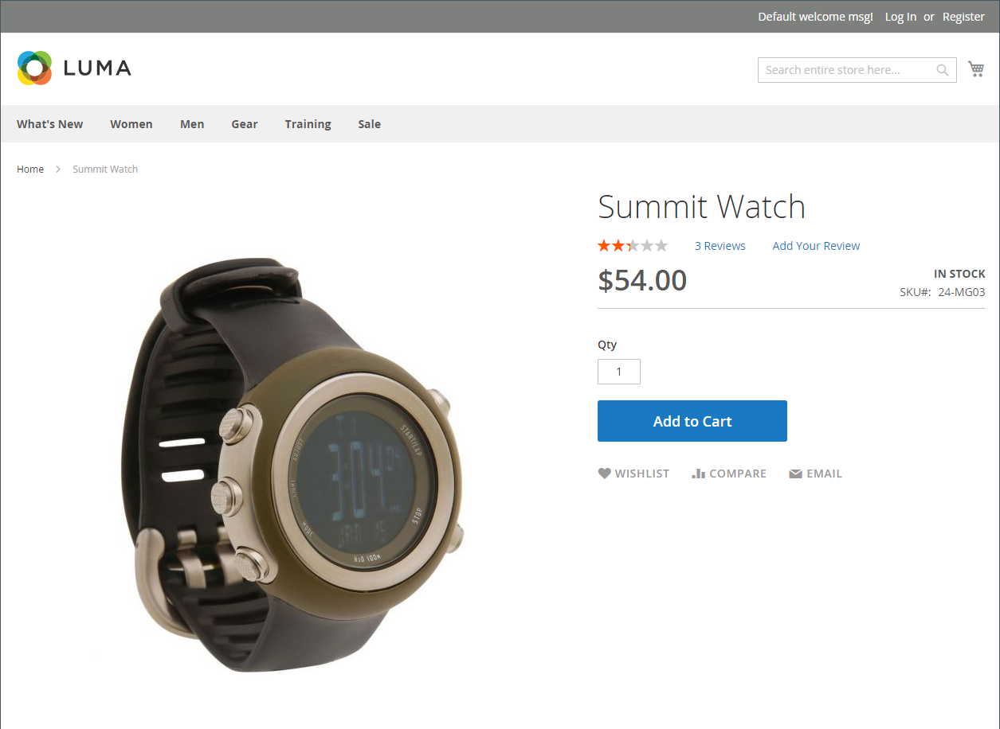
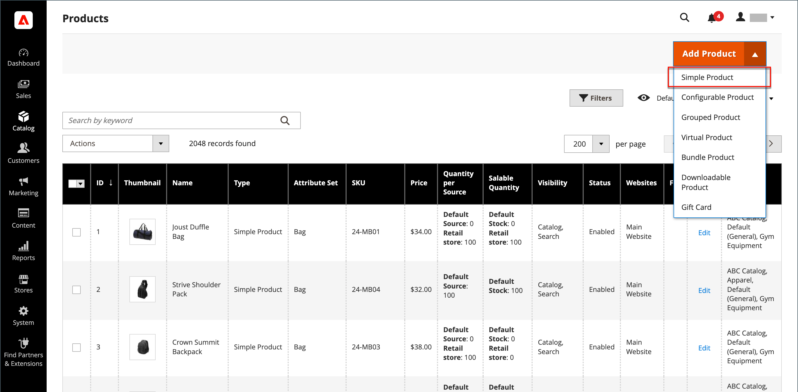

# 簡易商品

商品タイプの力を活用する鍵のひとつは、シンプルなスタンドアロン商品の使い方を学ぶことです。 シンプルな商品は、個別に販売することも、グループ化された商品、設定可能な商品、バンドル商品の一部として販売することもできます。 カスタムオプションを含むシンプルな製品は、_複合製品_&#x200B;と呼ばれることもあります。

次の手順では、[製品テンプレート ](attribute-sets.md)、必須フィールド、および基本設定を使用してシンプルな製品を作成するプロセスを示します。 各必須フィールドには、赤いアスタリスク （`*`）が付いています。 基本的な設定が完了したら、必要に応じて他の製品設定を完了できます。

{width="700" zoomable="yes"}

## 手順1：商品タイプの選択

1. _管理者_ サイドバーで、**[!UICONTROL Catalog]** > **[!UICONTROL Products]**&#x200B;に移動します。

1. 右上の&#x200B;_[!UICONTROL Add Product]_（{width="25"}）メニューで、**[!UICONTROL Simple Product]**を選択します。

   {width="700" zoomable="yes"}

## 手順2：属性セットの選択

製品のテンプレートとして使用される[属性セット ](attribute-sets.md)を選択するには：

- **[!UICONTROL Attribute Set]** フィールドをクリックし、属性セットの名前の全部または一部を入力します。

- 表示されるリストで、使用する属性セットを選択します。

フォームが更新され、変更が反映されます。

{width="600" zoomable="yes"}

## 手順3：必要な設定を完了する

1. **[!UICONTROL Product Name]**&#x200B;を入力します。

1. 製品名に基づく既定の&#x200B;**[!UICONTROL SKU]**&#x200B;を受け入れるか、別の名前を入力してください。

1. 製品&#x200B;**[!UICONTROL Price]**&#x200B;を入力します。

1. 製品はまだ公開する準備ができていないので、**[!UICONTROL Enable Product]** オプションを`No`に設定します。

1. **[!UICONTROL Save]**&#x200B;をクリックして続行します。

   商品を保存すると、左上隅に「[ ストアビュー](introduction.md#product-scope)」の選択画面が表示されます。

1. 製品を利用できる&#x200B;**[!UICONTROL Store View]**&#x200B;を選択します。

   {width="600" zoomable="yes"}

## 手順4：基本設定を完了する

1. **[!UICONTROL Tax Class]**&#x200B;を次のいずれかに設定します：

   - `None`
   - `Taxable Goods`
   - `Refund Adjustments`
   - `Gift Options`
   - `Order Gift Wrapping`
   - `Item Gift Wrapping`
   - `Printed Gift Card`
   - `Reward Points`
   - `VAT Reduced`
   - `VAT Standard`

1. 在庫のある商品の&#x200B;**[!UICONTROL Quantity]**&#x200B;を入力します。

   デフォルトでは、**[!UICONTROL Stock Status]**&#x200B;は`In Stock`に設定されています。

   >[!NOTE]
   >
   >[Inventory management](../inventory-management/introduction.md)を有効にすると、シングル Sourceの販売者がこのセクションで数量を設定します。 複数のSource加盟店が「ソース」セクションにソースと数量を追加します。 次の「_ソースと数量の割り当て（Inventory management）_」セクションを参照してください。

1. 製品の&#x200B;**[!UICONTROL Weight]**&#x200B;を入力します。

1. `Catalog, Search`の既定の&#x200B;**[!UICONTROL Visibility]**&#x200B;設定を受け入れます。

1. _[!UICONTROL Categories]_を製品に割り当てるには、**[!UICONTROL Select…]**ボックスをクリックし、次のいずれかの操作を行います。

   **既存のカテゴリを選択**:

   - 一致するものが見つかるまで、ボックスに入力し始めます。

   - 割り当てる各カテゴリのチェックボックスをオンにします。

   **カテゴリを作成**:

   - **[!UICONTROL New Category]**&#x200B;をクリックします。

   - **[!UICONTROL Category Name]**&#x200B;を入力し、**[!UICONTROL Parent Category]**&#x200B;を選択すると、メニュー構造での位置が決まります。

   - **[!UICONTROL Create Category]**&#x200B;をクリックします。

1. [新製品](../content-design/widget-new-products-list.md)のリストに商品を表示するには、**[!UICONTROL Set Product as New]** チェックボックスを選択します。

1. **[!UICONTROL Country of Manufacture]**&#x200B;を選択します。

商品を表す個々の属性が追加されている場合があります。 選択範囲は属性セットによって異なり、後で完了できます。

### ソースと数量の割り当て（[!DNL Inventory Management]）

{{$include /help/_includes/inventory-assign-sources.md}}

## 手順5：製品情報の入力

下にスクロールして、必要に応じて次のセクションの情報を入力します。

- [コンテンツ](product-content.md)
- [画像とビデオ](product-images-and-video.md)
- [関連商品、アップセル、クロスセル](related-products-up-sells-cross-sells.md)
- [検索エンジン最適化](product-search-engine-optimization.md)
- [カスタマイズ可能なオプション](settings-advanced-custom-options.md)
- [Web サイト内の商品](settings-basic-websites.md)
- [デザイン](settings-advanced-design.md)
- [ギフトオプション](product-gift-options.md)

## 手順6：製品の公開

1. 商品をカタログに公開する準備ができたら、**[!UICONTROL Enable Product]** スイッチを`Yes`に設定します。

1. 次のいずれかの操作を行います。

   - **方法1:**&#x200B;保存とプレビュー

      - 右上隅の「**[!UICONTROL Save]**」をクリックします。

      - ストア内の商品を表示するには、_管理者_ （）メニューで&#x200B;**[!UICONTROL Customer View]**&#x200B;を選択します。

     ストアが新しいブラウザータブで開きます。

     {width="600" zoomable="yes"}

   - **方法2:**&#x200B;保存して閉じる

     _[!UICONTROL Save]_（{width="25"}）メニューで、**[!UICONTROL Save & Close]**を選択します。

## 覚えておくべきこと

- シンプルな商品は、設定可能、バンドル、グループ化された商品タイプに含めることができます。

- シンプルな製品設定は、特定の製品の設定可能な製品設定を上書きします。

- シンプルな商品には、さまざまなタイプの入力に対応するカスタムオプションを用意できます。これにより、単一のSKUから多くの商品バリエーションを販売できます。

<!-- Last updated from includes: 2023-05-19 17:14:58 -->
