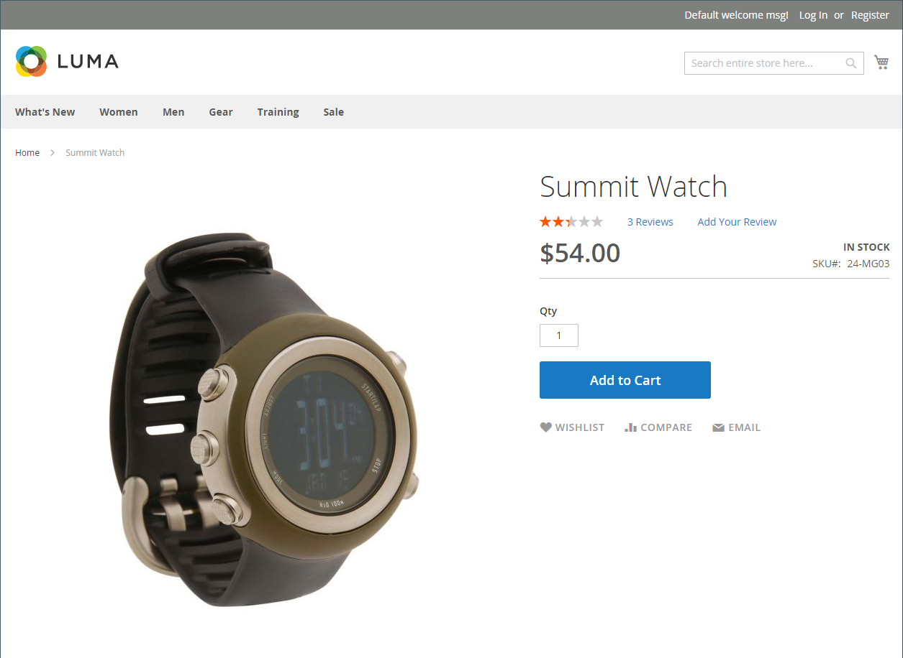

# シンプル製品

製品タイプの力を活用するための鍵の 1 つは、シンプルなスタンドアロン製品を使用するタイミングを学ぶことです。 シンプルな製品は、個別に販売することも、グループ化された製品、設定可能な製品、バンドル製品の一部として販売することもできます。 カスタムオプションを持つ単純な製品は、_複合製品_ と呼ばれることもあります。

次の手順では、[ 製品テンプレート ](attribute-sets.md)、必須フィールド、基本設定を使用してシンプルな製品を作成するプロセスを示しています。 各必須フィールドには、赤いアスタリスク（`*`）が付いています。 基本を完了したら、必要に応じて他の製品設定を完了できます。

{width="700" zoomable="yes"}

## 手順 1：製品タイプの選択

1. _管理者_ サイドバーで、**[!UICONTROL Catalog]**/**[!UICONTROL Products]** に移動します。

1. 右上の _[!UICONTROL Add Product]_（メニュー矢印 {width="25"} 「」を選択&#x200B;**[!UICONTROL Simple Product]**&#x200B;ます。

   {width="700" zoomable="yes"}

## 手順 2：属性セットの選択

製品のテンプレートとして使用する [ 属性セット ](attribute-sets.md) を選択するには：

- 「**[!UICONTROL Attribute Set]**」フィールドをクリックし、属性セット名の全部または一部を入力します。

- 表示されたリストで、使用する属性セットを選択します。

フォームが更新され、変更が反映されます。

{width="600" zoomable="yes"}

## 手順 3：必要な設定を完了する

1. **[!UICONTROL Product Name]** を入力します。

1. 製品名に基づくデフォルト **[!UICONTROL SKU]** を受け入れるか、別の名前を入力します。

1. 製品 **[!UICONTROL Price]** を入力します。

1. 製品はまだ公開する準備ができていないので、「**[!UICONTROL Enable Product]**」オプションを `No` に設定します。

1. 「**[!UICONTROL Save]**」をクリックして続行します。

   商品を保存すると、左上隅に [ ストア表示 ](introduction.md#product-scope) 選択が表示されます。

1. 製品を使用できる **[!UICONTROL Store View]** を選択します。

   {width="600" zoomable="yes"}

## 手順 4：基本設定を完了する

1. **[!UICONTROL Tax Class]** を次のいずれかに設定します。

   - `None`
   - `Taxable Goods`
   - `Refund Adjustments`
   - `Gift Options`
   - `Order Gift Wrapping`
   - `Item Gift Wrapping`
   - `Printed Gift Card`
   - `Reward Points`
   - `VAT Reduced`
   - `VAT Standard`

1. 在庫がある商品の **[!UICONTROL Quantity]** を入力します。

   デフォルトでは、**[!UICONTROL Stock Status]** は `In Stock` に設定されています。

   >[!NOTE]
   >
   >[Inventory management](../inventory-management/introduction.md) を有効にした場合、単一のSource マーチャントがこのセクションで数量を設定します。 マルチSourceのマーチャントは、「ソース」セクションでソースと数量を追加します。 次の _ソースと数量の割り当て（Inventory management）_ 節を参照してください。

1. 商品の **[!UICONTROL Weight]** を入力します。

1. `Catalog, Search` のデフォルトの **[!UICONTROL Visibility]** 設定を受け入れます。

1. 製品に _[!UICONTROL Categories]_&#x200B;を割り当てるには、**[!UICONTROL Select…]**&#x200B;のボックスをクリックし、次のいずれかの操作を行います。

   **既存のカテゴリを選択**:

   - 一致するものが見つかるまで、ボックスに入力を開始します。

   - 割り当てる各カテゴリのチェックボックスを選択します。

   **カテゴリを作成する**:

   - 「**[!UICONTROL New Category]**」をクリックします。

   - **[!UICONTROL Category Name]** を入力し、メニュー構造内の位置を決定する **[!UICONTROL Parent Category]** を選択します。

   - 「**[!UICONTROL Create Category]**」をクリックします。

1. [ 新製品 ](../content-design/widget-new-products-list.md) のリストに製品を特集するには、「**[!UICONTROL Set Product as New]**」チェックボックスを選択します。

1. **[!UICONTROL Country of Manufacture]** を選択します。

製品を説明する追加の個人属性が存在する場合があります。 選択は属性セットによって異なり、後で完了できます。

### ソースと数量の割り当て（[!DNL Inventory Management]）

{{$include /help/_includes/inventory-assign-sources.md}}

## 手順 5：製品情報の入力

下にスクロールして、必要に応じて次のセクションの情報を入力します。

- [コンテンツ](product-content.md)
- [画像とビデオ](product-images-and-video.md)
- [関連製品、アップセルおよびクロスセル](related-products-up-sells-cross-sells.md)
- [検索エンジンの最適化](product-search-engine-optimization.md)
- [カスタマイズ可能なオプション](settings-advanced-custom-options.md)
- [Web サイトの製品](settings-basic-websites.md)
- [デザイン](settings-advanced-design.md)
- [ギフトオプション](product-gift-options.md)

## 手順 6：商品のPublish

1. カタログに製品を公開する準備が整ったら、「**[!UICONTROL Enable Product]**」スイッチを `Yes` に設定します。

1. 次のいずれかの操作を行います。

   - **方法 1:** 保存とプレビュー

      - 右上隅の「**[!UICONTROL Save]**」をクリックします。

      - ストアで製品を表示するには、_管理者_ （）メニューで **[!UICONTROL Customer View]** を選択します。

     ストアが新しいブラウザータブで開きます。

     {width="600" zoomable="yes"}

   - **方法 2:** 保存して閉じる

     _[!UICONTROL Save]_（メニュー矢印 {width="25"} 「**[!UICONTROL Save & Close]**」を選択します。

## 注意事項

- シンプルな製品は、設定可能な製品、バンドル製品、グループ化された製品タイプに含めることができます。

- シンプルな製品設定は、特定の製品の設定可能な製品設定を上書きします。

- シンプルな製品には、様々なタイプの入力を含むカスタムオプションを含めることができ、単一の SKU から多くの製品バリエーションを販売できます。
