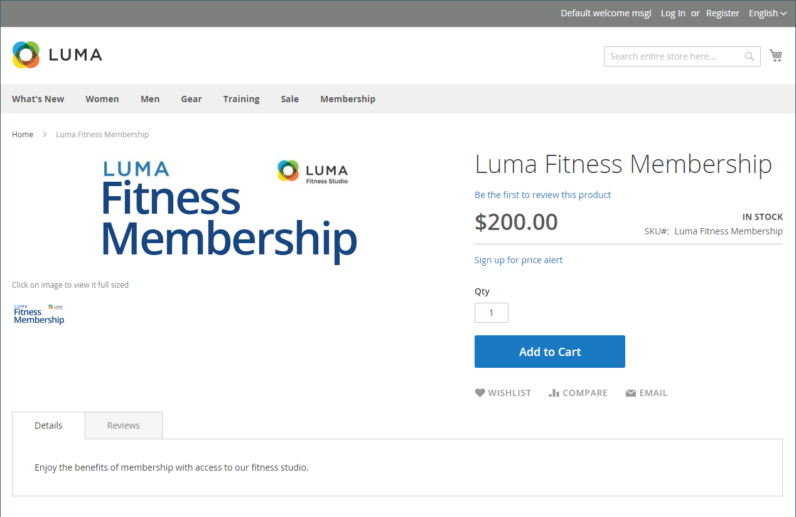
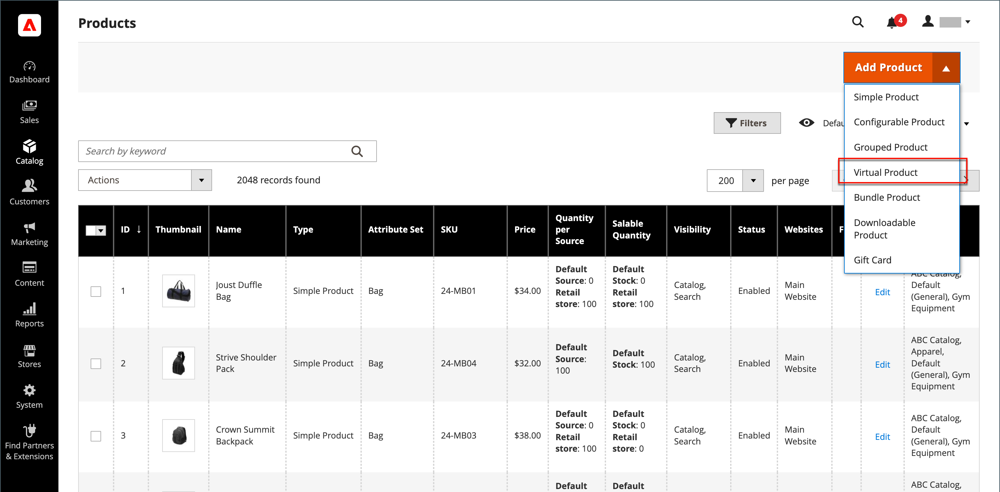

# バーチャル商品

バーチャル商品（デジタル商品）とは、メンバーシップ、サービス、保証、サブスクリプション、書籍、音楽、動画、その他の商品のデジタルダウンロードなど、無形の商品を表します。 バーチャル製品は個別に販売することも、製品タイプ [ グループ化された製品](product-create-grouped.md)、[構成可能な製品](product-create-configurable.md)、または[ バンドル製品](product-create-bundle.md)の一部として含めることもできます。

_[!UICONTROL Weight]_フィールドがない場合を除いて、仮想製品と単純な製品を作成するプロセスは同じです。 次の手順では、[製品テンプレート ](attribute-sets.md)、必須フィールド、および基本設定を使用してバーチャル製品を作成するプロセスを示します。 基本的な設定が完了したら、必要に応じて他の製品設定を完了できます。

>[!NOTE]
>
>PayPal Express Checkoutを通じたデジタル商品の販売に対するサポートを廃止しました。 [PayPal Payments Standard](../stores-purchase/paypal-payments-standard.md)またはその他のPayPal支払いゲートウェイを使用して、仮想商品を含む注文を処理することをお勧めします。

{width="700" zoomable="yes"}

## 手順1：商品タイプの選択

1. _管理者_ サイドバーで、**[!UICONTROL Catalog]** > **[!UICONTROL Products]**&#x200B;に移動します。

1. 右上隅の&#x200B;_[!UICONTROL Add Product]_（{width="25"}）メニューで、**[!UICONTROL Virtual Product]**を選択します。

   {width="700" zoomable="yes"}

## 手順2：属性セットの選択

製品のテンプレートとして使用される[属性セット ](attribute-sets.md)を選択するには、次のいずれかの操作を行います。

- **[!UICONTROL Attribute Set]** フィールドをクリックし、属性セットの名前の全部または一部を入力します。

- 表示されるリストで、使用する属性セットを選択します。

フォームが更新され、変更が反映されます。

{width="600" zoomable="yes"}

## 手順3：必要な設定を完了する

1. **[!UICONTROL Product Name]**&#x200B;を入力します。

1. 製品名に基づく既定の&#x200B;**[!UICONTROL SKU]**&#x200B;を受け入れるか、別の名前を入力してください。

1. 製品&#x200B;**[!UICONTROL Price]**&#x200B;を入力します。

1. 製品はまだ公開する準備ができていないので、**[!UICONTROL Enable Product]**&#x200B;を`No`に設定します。

1. **[!UICONTROL Save]**&#x200B;をクリックして続行します。

   商品を保存すると、左上隅に「[ ストアビュー](introduction.md#product-scope)」の選択画面が表示されます。

1. 製品を利用できる&#x200B;**[!UICONTROL Store View]**&#x200B;を選択します。

   {width="600" zoomable="yes"}

## 手順4：基本設定を完了する

1. **[!UICONTROL Tax Class]**&#x200B;を次のいずれかに設定します：

   - `None`
   - `Taxable Goods`

1. 在庫のある商品の&#x200B;**[!UICONTROL Quantity]**&#x200B;を入力し、次の操作を行います。

   - `In Stock`の既定の&#x200B;**[!UICONTROL Stock Status]**&#x200B;設定を受け入れます。

     バーチャル製品は出荷されていないため、**[!UICONTROL Weight]** フィールドは使用されません。

   - `Catalog, Search`の既定の&#x200B;**[!UICONTROL Visibility]**&#x200B;設定を受け入れます。

   >[!NOTE]
   >
   >[Inventory management](../inventory-management/introduction.md)を有効にした場合、このセクションで数量を設定するのは、シングルソースマーチャントです。 マルチソースマーチャントは、「ソース」セクションにソースと数量を追加します。 次の「_ソースと数量の割り当て（Inventory management）_」セクションを参照してください。

1. **[!UICONTROL Categories]**&#x200B;を製品に割り当てるには、**[!UICONTROL Select…]** ボックスをクリックし、次のいずれかの操作を行います。

   **既存のカテゴリを選択**:

   - 一致するものが見つかるまで、ボックスに入力し始めます。

   - 割り当てるカテゴリのチェックボックスをオンにします。

   **カテゴリを作成**:

   - **[!UICONTROL New Category]**&#x200B;をクリックします。

   - **[!UICONTROL Category Name]**&#x200B;を入力し、**[!UICONTROL Parent Category]**&#x200B;を選択すると、メニュー構造での位置が決まります。

   - **[!UICONTROL Create Category]**&#x200B;をクリックします。

   商品を表す個々の属性が追加されている場合があります。 選択範囲は属性セットによって異なり、後で完了できます。

### ソースと数量の割り当て（[!DNL Inventory Management]）

{{$include /help/_includes/inventory-assign-sources.md}}

## 手順5：製品情報の入力

必要に応じて、次の節の情報を入力します。

- [コンテンツ](product-content.md)
- [画像とビデオ](product-images-and-video.md)
- [検索エンジン最適化](product-search-engine-optimization.md)
- [関連商品、アップセル、クロスセル](related-products-up-sells-cross-sells.md)
- [カスタマイズ可能なオプション](settings-advanced-custom-options.md)
- [Web サイト内の商品](settings-basic-websites.md)
- [デザイン](settings-advanced-design.md)
- [ギフトオプション](product-gift-options.md)

>[!NOTE]
>
>_[!UICONTROL Is this downloadable product?]_オプションはデフォルトで無効になっています。 この機能を仮想製品に対して有効にすると、製品は[ ダウンロード可能](product-create-downloadable.md#downloadable-product)になります。

## 手順6：製品の公開

1. 商品をカタログに公開する準備ができたら、**[!UICONTROL Enable Product]**&#x200B;を`Yes`に設定します。

1. 次のいずれかの操作を行います。

   - **方法1:**&#x200B;保存とプレビュー

      - 右上隅にある「**[!UICONTROL Save]**」をクリックします。

      - ストア内の商品を表示するには、_管理者_ （）メニューで&#x200B;**[!UICONTROL Customer View]**&#x200B;を選択します。

     ストアが新しいブラウザータブで開きます。

     {width="600" zoomable="yes"}

   - **方法2:**&#x200B;保存して閉じる

     _[!UICONTROL Save]_（{width="25"}）メニューで、**[!UICONTROL Save & Close]**を選択します。

## 覚えておくべきこと

- バーチャル製品は、サービス、サブスクリプション、保証などの有形以外の製品に使用されます。

- バーチャル商品はシンプルな商品に似ていますが、重量はありません。

- チェックアウト時に配送オプションは表示されません。ただし、カートに有形商品がある場合を除きます。

<!-- Last updated from includes: 2023-05-19 17:14:58 -->
